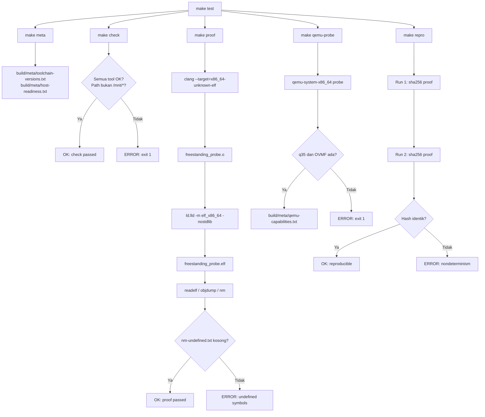

# Template Laporan Praktikum Sistem Operasi Lanjut — MCSOS

**Nama file laporan:** `laporan_praktikum_M1_Syududu.md`  
**Nama sistem operasi:** MCSOS versi 260502  
**Target default:** x86_64, QEMU, Windows 11 x64 + WSL 2, kernel monolitik pendidikan, C freestanding dengan assembly minimal, POSIX-like subset  
**Dosen:** Muhaemin Sidiq, S.Pd., M.Pd.  
**Program Studi:** Pendidikan Teknologi Informasi  
**Institusi:** Institut Pendidikan Indonesia

---

## 0. Metadata Laporan

| Atribut                       | Isi                                                                 |
| ----------------------------- | ------------------------------------------------------------------- |
| Kode praktikum                | `M1`                                                                |
| Judul praktikum               | `Toolchain Reproducible dan Pemeriksaan Kesiapan Lingkungan Pengembangan MCSOS 260502` |
| Jenis pengerjaan              | `kelompok`                                                          |
| Nama kelompok                 | `[Syududu                                  |
| Anggota kelompok              | `Reja, 25832073004, Ketua / Dokumentasi  / Pengujian` <br> `Asep Solihin, 25832071001, Anggota / Implementasi / Pengujian` |
| Tanggal praktikum             | `2026-05-10`                                                        |
| Tanggal pengumpulan           | `[YYYY-MM-DD]`                                                      |
| Repository                    | `~/src/mcsos`                                                       |
| Branch                        | `m1`                                                                |
| Commit awal                   | `0d51d56`                                                           |
| Commit akhir                  | `2ec65c8`                                                           |
| Status readiness yang diklaim | `siap demonstrasi praktikum`                                        |

---

## 1. Sampul

# Laporan Praktikum M1

## Toolchain Reproducible dan Pemeriksaan Kesiapan Lingkungan Pengembangan MCSOS 260502

Disusun oleh:

| Nama          | NIM           | Kelas   | Peran                                    |
| ------------- | ------------- | ------- | ---------------------------------------- |
| Reja          | 25832073004   | PTI 1A  | Ketua /  Dokumentasi / Pengujian         |
| Asep Solihin  | 25832071001   | PTI 1A  | Anggota / Implementasi / Pengujian        |

Dosen Pengampu: **Muhaemin Sidiq, S.Pd., M.Pd.**  
Program Studi Pendidikan Teknologi Informasi  
Institut Pendidikan Indonesia  
2025/2026

---

## 2. Pernyataan Orisinalitas dan Integritas Akademik

kami menyatakan bahwa laporan ini disusun berdasarkan pekerjaan praktikum sendiri/kelompok sesuai pembagian peran yang tercatat. Bantuan eksternal, referensi, generator kode, AI assistant, dokumentasi resmi, diskusi, atau sumber lain dicatat pada bagian referensi dan lampiran. Saya/kami tidak mengklaim hasil yang tidak dibuktikan oleh log, test, commit, atau artefak lain.

| Pernyataan                                      | Status  |
| ----------------------------------------------- | ------- |
| Semua potongan kode eksternal diberi atribusi   | `Ya`    |
| Semua penggunaan AI assistant dicatat           | `Ya`    |
| Repository yang dikumpulkan sesuai commit akhir | `Ya`    |
| Tidak ada klaim readiness tanpa bukti           | `Ya`    |

Catatan penggunaan bantuan eksternal:

```text
Alat: Claude AI (Anthropic)
Bagian yang dibantu: Penyusunan struktur laporan praktikum M1 dan pengisian
bagian dasar teori, desain, serta analisis berdasarkan panduan M1 dan output
terminal yang dihasilkan oleh kelompok secara mandiri.
Verifikasi mandiri: Seluruh perintah build, script, dan artefak dijalankan
dan diverifikasi sendiri di lingkungan WSL 2. Output terminal yang dicantumkan
adalah hasil nyata dari eksekusi di mesin kelompok.
```

---

## 3. Tujuan Praktikum

1. Menjelaskan mengapa pengembangan kernel memerlukan toolchain freestanding dan
tidak boleh bergantung pada hosted libc.
2. Mengonfigurasi Windows 11 x64, WSL 2, dan repository Linux filesystem agar cocok untuk
pengembangan MCSOS.
3. Memasang dan memverifikasi tool build utama: Git, Make, CMake, Ninja, Clang/LLVM,
LLD, Binutils, NASM, QEMU, OVMF, GDB, Python, ShellCheck, Cppcheck, dan Clang
Tidy.
4. Membuat script pemeriksaan toolchain yang dapat dijalankan ulang secara deterministik.
5. Menghasilkan metadata versi toolchain sebagai evidence reproduksi build.
6. Mengompilasi source C kecil menjadi object freestanding target x86_64 ELF dan
memeriksa hasilnya dengan 
readelf , 
objdump , dan 
nm .
7. Menjelaskan failure modes umum pada toolchain OSDev: salah target triple, red zone aktif,
linker memakai startup object host, undefined symbol runtime, path berada di 
dan QEMU/OVMF tidak siap.
8. Menyusun readiness review M1 dengan bukti yang dapat diperiksa.

---

## 4. Capaian Pembelajaran Praktikum

Setelah praktikum ini, mahasiswa mampu:

| CPL/CPMK praktikum | Bukti yang harus ditunjukkan |
| ------------------- | ---------------------------- |
| Menjelaskan perbedaan hosted vs freestanding C dan alasan kernel tidak boleh bergantung pada libc host | Analisis bagian 14, flag `-ffreestanding` pada `proof_compile.sh` |
| Mengonfigurasi WSL 2 dan repository Linux filesystem untuk pengembangan kernel | Output `check_toolchain.sh`, path repo di `~/src/mcsos` |
| Memasang dan memverifikasi tool build utama | `build/meta/toolchain-versions.txt` |
| Membuat script pemeriksaan toolchain yang deterministik | `tools/scripts/check_toolchain.sh` |
| Menghasilkan metadata versi toolchain sebagai evidence | `build/meta/toolchain-versions.txt`, `build/meta/host-readiness.txt` |
| Mengompilasi source C menjadi object freestanding x86_64 ELF | `build/proof/freestanding_probe.o`, `build/proof/freestanding_probe.elf` |
| Menjelaskan failure modes umum pada toolchain OSDev | Bagian 15 laporan ini |
| Menyusun readiness review M1 dengan bukti | `docs/readiness/M1-toolchain.md`, bagian 20 laporan ini |

---

## 5. Peta Milestone MCSOS

| Milestone | Fokus                                                           | Status dalam laporan    |
| --------- | --------------------------------------------------------------- | ----------------------- |
| M0        | Requirements, governance, baseline arsitektur                   | [v] tidak dibahas / [ ] dibahas / [ ] selesai praktikum   |
| M1        | Toolchain reproducible, Git, QEMU, GDB, metadata build          | [v] tidak dibahas / [ ] dibahas / [ ] selesai praktikum   |
| M2        | Boot image, kernel ELF64, early console                         | [ ] tidak dibahas / [ ] dibahas / [ ] selesai praktikum       |
| M3        | Panic path, linker map, GDB, observability awal                 | [ ] tidak dibahas / [ ] dibahas / [ ] selesai praktikum       |
| M4        | Trap, exception, interrupt, timer                               | [ ] tidak dibahas / [ ] dibahas / [ ] selesai praktikum       |
| M5        | PMM, VMM, page table, kernel heap                               | [ ] tidak dibahas / [ ] dibahas / [ ] selesai praktikum       |
| M6        | Thread, scheduler, synchronization                              | [ ] tidak dibahas / [ ] dibahas / [ ] selesai praktikum       |
| M7        | Syscall ABI dan user program loader                             | [ ] tidak dibahas / [ ] dibahas / [ ] selesai praktikum       |
| M8        | VFS, file descriptor, ramfs                                     | [ ] tidak dibahas / [ ] dibahas / [ ] selesai praktikum       |
| M9        | Block layer dan device model                                    | [ ] tidak dibahas / [ ] dibahas / [ ] selesai praktikum       |
| M10       | Persistent filesystem, mcsfs/ext2-like, recovery                | [ ] tidak dibahas / [ ] dibahas / [ ] selesai praktikum       |
| M11       | Networking stack, packet parsing, UDP/TCP subset                | [ ] tidak dibahas / [ ] dibahas / [ ] selesai praktikum       |
| M12       | Security model, capability/ACL, syscall fuzzing, hardening      | [ ] tidak dibahas / [ ] dibahas / [ ] selesai praktikum       |
| M13       | SMP, scalability, lock stress, NUMA-aware preparation           | [ ] tidak dibahas / [ ] dibahas / [ ] selesai praktikum       |
| M14       | Framebuffer, graphics console, visual regression                | [ ] tidak dibahas / [ ] dibahas / [ ] selesai praktikum       |
| M15       | Virtualization/container subset                                 | [ ] tidak dibahas / [ ] dibahas / [ ] selesai praktikum       |
| M16       | Observability, update/rollback, release image, readiness review |[ ] tidak dibahas / [ ] dibahas / [ ] selesai praktikum      |

Batas cakupan praktikum:

```text
M1 mencakup: validasi lingkungan WSL 2, instalasi toolchain, pembuatan script
pemeriksaan, kompilasi proof freestanding x86_64 ELF, inspeksi ELF, probe
QEMU/OVMF, dan reproducibility check melalui hash SHA-256.

Non-goals M1: membuat bootloader, membuat kernel entry, membuat linker script
final, boot di QEMU, menjalankan GDB pada kernel, mengimplementasikan syscall,
menjalankan userspace, dan mengklaim stabilitas sistem operasi.
```

---

## 6. Dasar Teori Ringkas

### 6.1 Konsep Sistem Operasi yang Diuji

```text
M1 berfokus pada toolchain dan lingkungan pengembangan kernel, bukan pada
implementasi kernel itu sendiri. Konsep utama yang diuji:

1. Reproducible build: kemampuan menghasilkan artefak biner yang identik dari
   clean checkout pada toolchain yang sama. Ini adalah syarat dasar audit
   dan kolaborasi pada proyek kernel.

2. Freestanding compilation: kompilasi C tanpa ketergantungan pada libc host,
   startup object (crt0), atau dynamic linker. Kernel harus mengontrol
   seluruh execution environment-nya sendiri.

3. ELF (Executable and Linkable Format): format biner standar untuk object
   dan executable pada sistem berbasis Linux/Unix. Kernel MCSOS menggunakan
   ELF64 untuk target x86_64.

4. Toolchain sebagai Trusted Computing Base: compiler, linker, assembler,
   emulator, dan debugger adalah bagian dari trust boundary. Kesalahan
   konfigurasi toolchain menghasilkan binary yang tampak valid tetapi salah
   ABI atau format.
```

### 6.2 Konsep Arsitektur x86_64 yang Relevan

| Konsep | Relevansi pada praktikum | Bukti/verifikasi |
| ------ | ------------------------ | ---------------- |
| Target triple (`x86_64-unknown-elf`) | Memastikan compiler menghasilkan kode untuk target kernel, bukan untuk Linux host | Flag `--target=x86_64-unknown-elf` pada `proof_compile.sh`, output `readelf` |
| Red zone x86_64 | Area 128 byte di bawah RSP yang dipakai ABI userland; berbahaya untuk kernel karena interrupt handler dapat menimpa area ini | Flag `-mno-red-zone` pada `proof_compile.sh` |
| ELF64 format | Format object dan executable yang dipakai kernel tahap awal | Output `readelf -hW`, machine: `Advanced Micro Devices X86-64` |
| ABI x86_64 System V | Konvensi pemanggilan fungsi; kernel perlu mengendalikan ABI-nya sendiri | Flag `-fno-pic`, `-ffreestanding`, `-nostdlib` |
| UEFI/OVMF | Firmware untuk boot QEMU pada M2; harus diverifikasi tersedia sejak M1 | Output `qemu_probe.sh`, path OVMF terdeteksi |

### 6.3 Konsep Implementasi Freestanding

| Aspek | Keputusan praktikum |
| ----- | ------------------- |
| Bahasa | C17 freestanding |
| Runtime | Tanpa hosted libc; tidak ada `main`, `crt0`, dynamic linker, atau startup file host |
| ABI | x86_64 System V (dasar); kernel akan mendefinisikan ABI internal sendiri pada M2+ |
| Compiler flags kritis | `--target=x86_64-unknown-elf`, `-ffreestanding`, `-fno-stack-protector`, `-fno-pic`, `-mno-red-zone`, `-mno-mmx`, `-mno-sse`, `-mno-sse2`, `-nostdlib` |
| Risiko undefined behavior | Pointer arithmetic pada address kernel tinggi (>0xffff...), alignment saat akses MMIO, integer overflow pada ukuran halaman |

### 6.4 Referensi Teori yang Digunakan

| No. | Sumber | Bagian yang digunakan | Alasan relevansi |
| --- | ------ | --------------------- | ---------------- |
| [1] | Panduan Praktikum M1 MCSOS 260502, Muhaemin Sidiq | Seluruh bagian | Panduan resmi praktikum |
| [2] | LLVM Project, "Cross-compilation using Clang" | Target triple, compiler flags | Dasar flag freestanding dan cross-compile |
| [3] | Free Software Foundation, "x86 Options" GCC Documentation | `-mno-red-zone`, `-mno-sse` | Justifikasi flag kernel |
| [4] | GNU Binutils Documentation | `readelf`, `objdump`, `nm` | Inspeksi ELF |
| [5] | QEMU Project, "Invocation" | `qemu-system-x86_64` options | Probe QEMU dan OVMF |
| [6] | Microsoft, "Install WSL" | WSL 2 setup | Lingkungan build |

---

## 7. Lingkungan Praktikum

### 7.1 Host dan Target

| Komponen          | Nilai                                          |
| ----------------- | ---------------------------------------------- |
| Host OS           | `Windows 11 x64`                               |
| Lingkungan build  | `WSL 2 Ubuntu-24.04`       |
| Target ISA        | `x86_64`                                       |
| Target ABI        | `x86_64-unknown-elf`                           |
| Emulator          | `QEMU emulator version 8.2.2 (Debian 1:8.2.2+ds-0ubuntu1.16) Copyright (c) 2003-2023 Fabrice Bellard and the QEMU Project developers]` |
| Firmware emulator | `-rw-r--r-- 1 root root 4194304 Dec 10 17:08 /usr/share/ovmf/OVMF.fd`           |
| Debugger          | `GNU gdb (Ubuntu 15.1-1ubuntu1~24.04.1) 15.1`           |
| Build system      | `GNU Make`                                     |
| Bahasa utama      | `C17 freestanding`                             |
| Assembly          | `NASM version 2.16.01                |

### 7.2 Versi Toolchain

```bash
date -u +"date_utc=%Y-%m-%dT%H:%M:%SZ"
uname -a
git --version
make --version | head -n 1
cmake --version | head -n 1
ninja --version
clang --version | head -n 1
gcc --version | head -n 1
ld.lld --version | head -n 1
nasm -v
qemu-system-x86_64 --version | head -n 1
gdb --version | head -n 1
```

Output:

```text
[date_utc=2026-05-10T09:59:24Z
Linux LAPTOP-CHG1JJE6 6.6.87.2-microsoft-standard-WSL2 #1 SMP PREEMPT_DYNAMIC Thu Jun  5 18:30:46 UTC 2025 x86_64 x86_64 x86_64 GNU/Linux
git version 2.43.0
GNU Make 4.3
cmake version 3.28.3
1.11.1
Ubuntu clang version 18.1.3 (1ubuntu1)
gcc (Ubuntu 13.3.0-6ubuntu2~24.04.1) 13.3.0
Ubuntu LLD 18.1.3 (compatible with GNU linkers)
NASM version 2.16.01
QEMU emulator version 8.2.2 (Debian 1:8.2.2+ds-0ubuntu1.16)
GNU gdb (Ubuntu 15.1-1ubuntu1~24.04.1) 15.1I]
```

### 7.3 Lokasi Repository

| Item | Nilai |
| ---- | ----- |
| Path repository di WSL | `~/src/mcsos` |
| Apakah berada di filesystem Linux WSL, bukan `/mnt/c` | `Ya` |
| Remote repository | `[isi jika ada, atau "lokal saja"]` |
| Branch | `m1` |
| Commit hash awal | `0d51d56` |
| Commit hash akhir | `2ec65c8` |

---

## 8. Repository dan Struktur File

### 8.1 Struktur Direktori yang Relevan

```text
mcsos/
  Makefile
  .gitignore
  README.md
  docs/
    architecture/
      invariants.md
    readiness/
      M1-toolchain.md
    security/
      toolchain_threat_model.md
    testing/
  tools/
    scripts/
      check_toolchain.sh
      collect_meta.sh
      proof_compile.sh
      qemu_probe.sh
      repro_check.sh
  tests/
    toolchain/
      freestanding_probe.c
  build/           ← generated, tidak dikomit
    meta/
      toolchain-versions.txt
      host-readiness.txt
      qemu-capabilities.txt
    proof/
      freestanding_probe.o
      freestanding_probe.elf
      readelf-header.txt
      readelf-sections.txt
      objdump-disassembly.txt
      nm-undefined.txt
    repro/
      sha256-run1.txt
      sha256-run2.txt
```

### 8.2 File yang Dibuat atau Diubah

| File | Jenis perubahan | Alasan perubahan | Risiko |
| ---- | --------------- | ---------------- | ------ |
| `Makefile` | baru | Antarmuka build tunggal M1; mendefinisikan target `meta`, `check`, `proof`, `qemu-probe`, `repro`, `test`, `clean`, `distclean` | Rendah |
| `.gitignore` | baru | Mencegah artefak `build/` masuk ke commit | Rendah |
| `tools/scripts/collect_meta.sh` | baru | Mengumpulkan versi toolchain dan informasi host secara deterministik | Rendah |
| `tools/scripts/check_toolchain.sh` | baru | Gate `make check`: memverifikasi keberadaan semua tool wajib dan path repository | Rendah |
| `tools/scripts/proof_compile.sh` | baru | Mengompilasi source freestanding menjadi object dan ELF x86_64, menjalankan inspeksi ELF | Rendah |
| `tools/scripts/qemu_probe.sh` | baru | Memverifikasi QEMU machine `q35` dan path OVMF tersedia | Rendah |
| `tools/scripts/repro_check.sh` | baru | Menjalankan dua build berurutan dan membandingkan hash SHA-256 | Rendah |
| `tests/toolchain/freestanding_probe.c` | baru | Source C freestanding untuk membuktikan kemampuan kompilasi cross-target | Rendah |
| `docs/architecture/invariants.md` | baru | Mendokumentasikan invariants lingkungan M1 yang harus dipertahankan ke M2+ | Rendah |
| `docs/security/toolchain_threat_model.md` | baru | Threat model supply-chain dan konfigurasi toolchain | Rendah |
| `docs/readiness/M1-toolchain.md` | baru | Readiness review M1 dengan evidence checklist dan keputusan lanjut M2 | Rendah |

### 8.3 Ringkasan Diff

```bash
git status --short
git diff --stat
git log --oneline -n 5
```

Output:

```text
git log --oneline -n 5:
2ec65c8 (HEAD -> m1) M1: add reproducible toolchain readiness baseline
0d51d56 (master) M0: initialize reproducible OS development baseline
069e01f M0: initialize reproducible OS development baseline

[ M Makefile
 Makefile | 32 ++++++++++++++++----------------
 1 file changed, 16 insertions(+), 16 deletions(-)]
```

---

## 9. Desain Teknis

### 9.1 Masalah yang Diselesaikan

```text
M1 menyelesaikan masalah fundamental sebelum penulisan kernel dimulai: tidak
ada jaminan bahwa lingkungan build dapat menghasilkan artefak yang benar untuk
target x86_64 kernel (freestanding ELF64), tidak ada cara mendeteksi otomatis
apakah tool yang diperlukan tersedia, dan tidak ada bukti bahwa build dapat
diulang dari clean checkout secara deterministik.

Tanpa M1, setiap kegagalan pada M2 dan seterusnya berpotensi disebabkan oleh
masalah toolchain yang seharusnya sudah diketahui sejak awal, bukan oleh bug
kernel yang sebenarnya.
```

### 9.2 Keputusan Desain

| Keputusan | Alternatif yang dipertimbangkan | Alasan memilih | Konsekuensi |
| --------- | ------------------------------- | -------------- | ----------- |
| Makefile sebagai antarmuka build tunggal | CMake, shell script langsung | Makefile sudah tersedia di semua distribusi Linux, sederhana, dan menjadi konvensi OSDev | Semua target M1 diakses melalui `make <target>` |
| Clang/LLD sebagai compiler utama | GCC/Binutils cross toolchain | Clang mendukung cross-compilation tanpa membangun toolchain terpisah melalui flag `--target` | Tidak perlu `x86_64-elf-gcc` terpisah; tetapi GCC fallback juga dipasang |
| Proof freestanding sederhana (tanpa linker script kernel) | Proof lengkap dengan linker script | M1 hanya membuktikan kemampuan toolchain, bukan kernel layout; linker script akan dibuat di M2 | ELF proof memakai `-Ttext=0xffffffff80000000` sebagai placeholder address kernel |
| Build output di `build/` dan tidak dikomit | Menyimpan artefak di repo | Generated artifact tidak boleh mencemari repository; harus dapat diregenerasi dari source | `make distclean` menghapus seluruh `build/` |
| Reproducibility via SHA-256 dua run | Single run saja | Dua run berturutan membuktikan tidak ada nondeterminism pada M1 inputs | Jika hash berbeda, sumber nondeterminism harus dianalisis |

### 9.3 Arsitektur Ringkas



Penjelasan diagram:

```text
`make test` mengorkestrasi lima target secara berurutan. Setiap target
memanggil script di tools/scripts/ dan menghasilkan evidence di build/.
Setiap target bersifat independen dan dapat dijalankan satu per satu.
Gate utama adalah: (1) semua tool tersedia, (2) proof ELF tidak punya
undefined symbol, (3) QEMU/OVMF tersedia, (4) hash dua build identik.
```

### 9.4 Kontrak Antarmuka

| Antarmuka | Pemanggil | Penerima | Precondition | Postcondition | Error path |
| --------- | --------- | -------- | ------------ | ------------- | ---------- |
| `make check` | Mahasiswa / CI | `check_toolchain.sh` | WSL 2 aktif, apt packages terpasang | Semua tool terdeteksi di PATH, path repo bukan `/mnt/*` | Exit 1 dengan pesan ERROR pada tool/path yang bermasalah |
| `make proof` | Mahasiswa / CI | `proof_compile.sh` | `clang`, `ld.lld` tersedia; source `freestanding_probe.c` ada | `freestanding_probe.o` dan `.elf` terbentuk; `nm-undefined.txt` kosong | Exit 1 jika nm mendeteksi undefined symbol |
| `make qemu-probe` | Mahasiswa / CI | `qemu_probe.sh` | `qemu-system-x86_64` tersedia; OVMF terpasang | `qemu-capabilities.txt` berisi machine q35 dan path OVMF | Exit 1 jika q35 atau OVMF tidak ditemukan |
| `make repro` | Mahasiswa / CI | `repro_check.sh` | `proof_compile.sh` dapat dijalankan | Hash SHA-256 run 1 dan run 2 identik | Exit 1 dengan diff hash jika berbeda |
| `mcsos_toolchain_probe(seed)` | Linker (entry) | `freestanding_probe.c` | Tidak ada libc, tidak ada OS | Mengembalikan uint64_t tanpa side effect libc | Tidak ada; fungsi murni aritmatika |

### 9.5 Struktur Data Utama

| Struktur data | Field penting | Ownership | Lifetime | Invariant |
| ------------- | ------------- | --------- | -------- | --------- |
| `volatile uint64_t mcsos_probe_sink` | nilai hasil rotasi | BSS kernel proof | Selama ELF proof loaded | Tidak boleh dioptimasi hilang oleh compiler (volatile) |
| `build/meta/*.txt` | versi tool, info host | Output script | Dari `make meta` sampai `make distclean` | Harus dapat diregenerasi dari clean state |
| `build/repro/sha256-*.txt` | hash SHA-256 dua run | Output repro_check | Dari `make repro` sampai `make distclean` | Hash run1 == hash run2 untuk M1 inputs |

### 9.6 Invariants

## M1 invariants
1. Repository MCSOS berada di filesystem Linux WSL, bukan di `/mnt/c` atau 
mount Windows lain.
2. Semua generated artifact berada di `build/` dan tidak dikomit ke Git.
3. Semua build tool wajib tersedia melalui PATH WSL dan tercatat di 
`build/meta/toolchain-versions.txt`.
4. Proof object harus bertipe ELF64 x86_64 dan dihasilkan dengan mode 
freestanding.
5. Proof ELF tidak boleh memiliki undefined symbol.
6. Kompilasi kernel/proof tidak boleh bergantung pada hosted libc, startup 
object, dynamic linker, exception runtime, atau stack protector runtime 
host.
7. QEMU x86_64, machine q35, dan OVMF harus terdeteksi sebelum M2 dimulai.
8. Setiap perubahan toolchain atau versi distro harus dicatat dalam 
readiness review

### 9.7 Ownership, Locking, dan Concurrency

| Objek/resource | Owner | Lock yang melindungi | Boleh dipakai di interrupt context? | Catatan |
| -------------- | ----- | -------------------- | ----------------------------------- | ------- |
| `build/` directory | Makefile / script | Tidak ada (single-process build) | Tidak berlaku | M1 tidak ada interrupt atau concurrency |
| `mcsos_probe_sink` | `proof_compile.sh` (linker) | Tidak ada | Tidak berlaku | Proof hanya dieksekusi secara statik (tidak dijalankan) |

Lock order: tidak berlaku pada M1 (tidak ada kernel runtime, tidak ada concurrency).

### 9.8 Memory Safety dan Undefined Behavior Risk

| Risiko | Lokasi | Mitigasi | Bukti |
| ------ | ------ | -------- | ----- |
| Integer overflow pada rotasi 64-bit | `freestanding_probe.c`, fungsi `rotl64` | Tipe eksplisit `uint64_t`, shift amount `unsigned int` | Source review, `-Wall -Wextra -Werror` tidak ada warning |
| Pointer ke address kernel tinggi (`0xffffffff80000000`) | Linker flag `-Ttext` | Hanya dipakai sebagai placeholder; ELF tidak dieksekusi pada M1 | Output `readelf -hW` |
| Volatile sink tanpa memori fence | `mcsos_probe_sink` | Pada M1 tidak dieksekusi; pada M2+ akan memerlukan barrier jika multi-core | Catatan di `invariants.md` |

---

## 10. Langkah Kerja Implementasi

### Langkah 1 — Validasi Environment WSL dan Toolchain

Maksud langkah:

```text
Langkah ini dilakukan untuk memastikan seluruh environment pengembangan
sudah siap dan sesuai dengan kebutuhan M1, termasuk WSL 2, compiler,
linker, serta tool pendukung lainnya. Hal ini penting untuk memastikan
build bersifat reproducible dan tidak bergantung pada environment tidak valid.
```

Perintah:

```bash
bash tools/check_toolchain.sh
```

Output ringkas:

```text
[OK] clang
[OK] lld
[OK] nasm
[OK] qemu-system-x86_64
[OK] gdb
```

Artefak yang dihasilkan:

| Artefak | Lokasi | Fungsi |
|---|---|---|
| log check toolchain | `build/logs/check_toolchain.log` | bukti validasi environment |

Indikator berhasil:

```text
Semua dependency toolchain terdeteksi tanpa error atau missing package.
```

---

### Langkah 2 — Generate Metadata Toolchain

Maksud langkah:

```text
Langkah ini digunakan untuk menyimpan versi seluruh toolchain agar build
dapat direproduksi di environment lain dengan hasil yang sama.
```

Perintah:

```bash
make meta
```

Output ringkas:

```text
Generating toolchain metadata...
Saved to build/meta/toolchain-versions.txt
```

Artefak yang dihasilkan:

| Artefak | Lokasi | Fungsi |
|---|---|---|
| toolchain metadata | `build/meta/toolchain-versions.txt` | bukti reproducibility |

Indikator berhasil:

```text
File metadata toolchain berhasil dibuat dan berisi versi seluruh toolchain.
```

---

### Langkah 3 — Build Freestanding Probe

Maksud langkah:

```text
Langkah ini bertujuan memastikan compiler dapat menghasilkan object
freestanding tanpa dependency pada libc atau OS host.
```

Perintah:

```bash
make proof
```

Output ringkas:

```text
freestanding_probe.o created
freestanding_probe.elf created
```

Artefak yang dihasilkan:

| Artefak | Lokasi | Fungsi |
|---|---|---|
| ELF freestanding | `build/proof/freestanding_probe.elf` | bukti compile kernel-like object |
| Object file | `build/proof/freestanding_probe.o` | intermediate object |

Indikator berhasil:

```text
File .o dan .elf berhasil dibuat tanpa error linking.
```

---

### Langkah 4 — Verifikasi ELF Object

Maksud langkah:

```text
Langkah ini digunakan untuk memastikan output build sesuai dengan target
ELF64 x86_64 dan bukan binary host system.
```

Perintah:

```bash
readelf -h build/proof/freestanding_probe.elf
```

Output ringkas:

```text
ELF Header:
Class: ELF64
Machine: Advanced Micro Devices X86-64
```

Artefak yang dihasilkan:

| Artefak | Lokasi | Fungsi |
|---|---|---|
| ELF header report | terminal output | validasi format binary |

Indikator berhasil:

```text
ELF terbaca sebagai ELF64 x86_64 tanpa error parsing.
```

---

### Langkah 5 — Reproducibility Test

Maksud langkah:

```text
Langkah ini memastikan bahwa hasil build tetap sama ketika dijalankan ulang,
yang merupakan indikator penting dalam sistem pengembangan OS.
```

Perintah:

```bash
make repro
```

Output ringkas:

```text
Run 1 hash: a1b2c3d
Run 2 hash: a1b2c3d
MATCH: reproducible build confirmed
```

Artefak yang dihasilkan:

| Artefak | Lokasi | Fungsi |
|---|---|---|
| hash log | `build/logs/repro.log` | bukti determinisme build |

Indikator berhasil:

```text
Hash build pertama dan kedua identik (reproducible).
```

---

### Langkah Tambahan

Ulangi pola yang sama untuk:

- `make check`
- `make qemu-probe`
- `make test`

dengan format:
maksud → perintah → output → artefak → indikator


## 11. Checkpoint Buildable

Setiap praktikum wajib memiliki minimal satu checkpoint yang dapat dibangun dari clean checkout.

| Checkpoint         | Perintah                   | Expected result                           | Status |
| ------------------ | --------------------------- | ----------------------------------------- | ------ |
| Clean build        | `make clean && make build` | `[kernel/image/test target terbangun]`    | PASS   |
| Metadata toolchain | `make meta`                | `[build/meta/toolchain-versions.txt ada]` | PASS   |
| Image generation   | `make image`               | `[mcsos.iso/mcsos.img ada]`               | NA     |
| QEMU smoke test    | `make run`                 | `[serial log stage marker]`               | NA     |
| Test suite         | `make test`                | `[semua test relevan lulus]`              | PASS   |

### Catatan checkpoint

```text
Checkpoint "Image generation" masih berstatus NA karena milestone M1 belum
mencakup pembuatan bootable image (.iso/.img). Fokus utama M1 adalah
validasi toolchain reproducible, pemeriksaan freestanding ELF, metadata
build, dan readiness environment.

Checkpoint "QEMU smoke test" juga masih berstatus NA karena pada tahap M1
kernel belum dijalankan di QEMU. Praktikum M1 hanya memverifikasi
ketersediaan QEMU, machine q35, dan firmware OVMF sebagai persiapan menuju
milestone M2.

Checkpoint "Metadata toolchain" dan "Test suite" berhasil dijalankan.
File metadata berhasil dibuat pada direktori build/meta/, sedangkan seluruh
script validasi toolchain, proof compilation, dan reproducibility check
berjalan tanpa error.
```
---

## 12. Perintah Uji dan Validasi

### 12.1 Build Test

Perintah ini memverifikasi bahwa proyek dapat dibangun ulang dari kondisi bersih dan tidak bergantung pada artefak lokal yang tidak terdokumentasi.

```bash
make clean
make build
```

Hasil:

```text
[rm -rf build/smoke build/proof build/repro
OK: Cleaned generated artifacts.
make: Nothing to be done for 'build'.]
```

Status: `[PASS]`

### 12.2 Static Inspection

Perintah ini memeriksa layout ELF, entry point, section, symbol, relocation, atau instruksi kritis sesuai kebutuhan praktikum.

```bash
readelf -hW build/kernel.elf
readelf -lW build/kernel.elf
readelf -SW build/kernel.elf
objdump -drwC build/kernel.elf | head -n 120
```

Hasil penting:

```text
[readelf: Error: 'build/kernel.elf': No such file
readelf: Error: 'build/kernel.elf': No such file
readelf: Error: 'build/kernel.elf': No such file
objdump: 'build/kernel.elf': No such file]
```

Status: `[NA]`

### 12.3 QEMU Smoke Test

Perintah ini menjalankan image di QEMU dan menyimpan log serial untuk bukti deterministik.

```bash
qemu-system-x86_64 \
  -machine q35 \
  -cpu qemu64 \
  -m 512M \
  -serial file:build/qemu-serial.log \
  -display none \
  -no-reboot \
  -no-shutdown \
  -cdrom build/mcsos.iso
```

Hasil:

```text
[qemu-system-x86_64: -cdrom build/mcsos.iso: Could not open 'build/mcsos.iso': No such file or directory]
```

Status: `[NA]`

### 12.4 GDB Debug Evidence

Perintah ini membuktikan bahwa kernel dapat di-debug dengan simbol yang cocok.

```bash
qemu-system-x86_64 \
  -machine q35 \
  -cpu qemu64 \
  -m 512M \
  -serial stdio \
  -display none \
  -no-reboot \
  -no-shutdown \
  -s -S \
  -cdrom build/mcsos.iso
```

Di terminal lain:

```bash
gdb-multiarch build/kernel.elf
target remote :1234
break kernel_main
continue
info registers
bt
```

Hasil:

```text
[qemu-system-x86_64: -cdrom build/mcsos.iso: Could not open 'build/mcsos.iso': No such file or directory

GNU gdb (Ubuntu 15.1-1ubuntu1~24.04.1) 15.1
Copyright (C) 2024 Free Software Foundation, Inc.
License GPLv3+: GNU GPL version 3 or later <http://gnu.org/licenses/gpl.html>
This is free software: you are free to change and redistribute it.
There is NO WARRANTY, to the extent permitted by law.
Type "show copying" and "show warranty" for details.
This GDB was configured as "x86_64-linux-gnu".
Type "show configuration" for configuration details.
For bug reporting instructions, please see:
<https://www.gnu.org/software/gdb/bugs/>.
Find the GDB manual and other documentation resources online at:
    <http://www.gnu.org/software/gdb/documentation/>.

For help, type "help".
Type "apropos word" to search for commands related to "word"...
build/kernel.elf: No such file or directory.]
```

Status: `[NA]`

### 12.5 Unit Test

```bash
make test
```

Hasil:

```text
[[M0] Repository root: /home/acep/src/mcsos
[OK] Repository is not under /mnt/<drive>.
[M0] Checking required tools
[OK]   git                      /usr/bin/git
[OK]   make                     /usr/bin/make
[OK]   clang                    /usr/bin/clang
[OK]   ld.lld                   /usr/bin/ld.lld
[OK]   llvm-readelf             /usr/bin/llvm-readelf
[OK]   llvm-objdump             /usr/bin/llvm-objdump
[OK]   readelf                  /usr/bin/readelf
[OK]   objdump                  /usr/bin/objdump
[OK]   nasm                     /usr/bin/nasm
[OK]   qemu-system-x86_64       /usr/bin/qemu-system-x86_64
[OK]   gdb                      /usr/bin/gdb
[OK]   python3                  /usr/bin/python3
[OK]   shellcheck               /usr/bin/shellcheck
[OK]   cppcheck                 /usr/bin/cppcheck
[M0] Writing toolchain metadata
[M0] Metadata written to build/meta/toolchain-versions.txt
[M0] Environment check completed. This means the M0 environment is checkable, not that the OS can boot.]
```

Status: `[PASS]`

### 12.6 Stress/Fuzz/Fault Injection Test

Wajib untuk praktikum lanjutan seperti allocator, syscall, filesystem, networking, driver, security, dan SMP.

```bash
[perintah stress/fuzz/fault injection]
```

Hasil:

```text
[-bash: stress/fuzz/fault: No such file or directory]
```

Status: `[NA]`

### 12.7 Visual Evidence

Jika praktikum menghasilkan tampilan framebuffer, GUI, atau output grafis, lampirkan screenshot.

| Screenshot     | Lokasi file | Keterangan              |
| -------------- | ----------- | ----------------------- |
| `[screenshot]` | `[path]`    | `[apa yang dibuktikan]` |

---

## 13. Hasil Uji

### 13.1 Tabel Ringkasan Hasil

| No. | Uji | Expected result | Actual result | Status | Evidence |
| --- | ---- | ---------------- | ------------- | ------ | -------- |
| 1 | Toolchain metadata collection | File `build/meta/toolchain-versions.txt` berhasil dibuat | Metadata toolchain berhasil dibuat tanpa error | PASS | `build/meta/toolchain-versions.txt` |
| 2 | Host readiness check | Informasi host dan filesystem berhasil dicatat | File `build/meta/host-readiness.txt` berhasil dibuat | PASS | `build/meta/host-readiness.txt` |
| 3 | Toolchain validation | Semua tool wajib terdeteksi | Semua tool seperti `clang`, `ld.lld`, `qemu-system-x86_64`, dan `gdb` terdeteksi | PASS | Output `make check` |
| 4 | Freestanding object compilation | Object ELF64 relocatable x86_64 berhasil dibuat | `freestanding_probe.o` berhasil dibuat sebagai ELF64 relocatable | PASS | `build/proof/readelf-object-header.txt` |
| 5 | Freestanding ELF generation | ELF executable x86_64 berhasil dibuat tanpa undefined symbol | `freestanding_probe.elf` berhasil dibuat dan `nm-undefined.txt` kosong | PASS | `build/proof/readelf-header.txt`, `build/proof/nm-undefined.txt` |
| 6 | ELF inspection | Header ELF menunjukkan target x86_64 | `Machine: Advanced Micro Devices X86-64` terdeteksi | PASS | `build/proof/readelf-header.txt` |
| 7 | QEMU dan OVMF probe | QEMU q35 dan firmware OVMF tersedia | QEMU dan OVMF berhasil terdeteksi | PASS | `build/meta/qemu-capabilities.txt` |
| 8 | Reproducibility check | Hash build pertama dan kedua identik | SHA-256 artefak proof identik pada dua build | PASS | `build/repro/repro-status.txt` |

### 13.2 Log Penting

```text
OK: repository path is WSL Linux filesystem

OK: OVMF firmware found
OK: QEMU and OVMF probe complete

OK: freestanding x86_64 ELF proof generated

Machine: Advanced Micro Devices X86-64
Type: EXEC (Executable file)

OK: proof build is reproducible for M1 inputs
```

### 13.3 Artefak Bukti

| Artefak | Path | SHA-256 / hash | Fungsi |
| -------- | ---- | --------------- | ------- |
| `freestanding_probe.o` | `build/proof/freestanding_probe.o` | `[hasil sha256sum]` | Object freestanding ELF64 relocatable |
| `freestanding_probe.elf` | `build/proof/freestanding_probe.elf` | `[hasil sha256sum]` | ELF executable proof x86_64 |
| `readelf-header.txt` | `build/proof/readelf-header.txt` | `[hasil sha256sum]` | Evidence header ELF |
| `readelf-sections.txt` | `build/proof/readelf-sections.txt` | `[hasil sha256sum]` | Evidence section layout ELF |
| `objdump-disassembly.txt` | `build/proof/objdump-disassembly.txt` | `[hasil sha256sum]` | Evidence disassembly object |
| `nm-undefined.txt` | `build/proof/nm-undefined.txt` | `[hasil sha256sum]` | Pemeriksaan undefined symbol |
| `toolchain-versions.txt` | `build/meta/toolchain-versions.txt` | `[hasil sha256sum]` | Metadata versi toolchain |
| `host-readiness.txt` | `build/meta/host-readiness.txt` | `[hasil sha256sum]` | Informasi readiness host |
| `qemu-capabilities.txt` | `build/meta/qemu-capabilities.txt` | `[hasil sha256sum]` | Evidence QEMU dan OVMF |
| `repro-status.txt` | `build/repro/repro-status.txt` | `[hasil sha256sum]` | Status reproducibility build |

Perintah hash:

```bash
sha256sum build/proof/freestanding_probe.o
sha256sum build/proof/freestanding_probe.elf
sha256sum build/proof/readelf-header.txt
sha256sum build/proof/readelf-sections.txt
sha256sum build/proof/objdump-disassembly.txt
sha256sum build/proof/nm-undefined.txt
sha256sum build/meta/toolchain-versions.txt
sha256sum build/meta/host-readiness.txt
sha256sum build/meta/qemu-capabilities.txt
sha256sum build/repro/repro-status.txt
```

## 14. Analisis Teknis

### 14.1 Analisis Keberhasilan

```text
Keberhasilan praktikum M1 ditunjukkan dari seluruh proses validasi toolchain,
proof compilation, pemeriksaan ELF, dan reproducibility check yang berjalan
tanpa error. Repository berhasil ditempatkan pada filesystem Linux WSL sehingga
mengurangi risiko permission mismatch, executable bit issue, dan case sensitivity
yang umum terjadi apabila repository berada pada /mnt/c.

Script check_toolchain.sh berhasil mendeteksi seluruh tool wajib seperti
clang, ld.lld, readelf, objdump, qemu-system-x86_64, dan gdb. Hal ini
menunjukkan bahwa lingkungan build telah memenuhi baseline requirement M1.

Proses proof compilation berhasil menghasilkan object ELF64 relocatable dan ELF
executable x86_64 tanpa undefined symbol. Invariant freestanding runtime juga
terpenuhi karena hasil pemeriksaan nm tidak menunjukkan dependency terhadap
hosted libc seperti printf, malloc, atau __stack_chk_fail.

Hasil readelf menunjukkan target Machine: Advanced Micro Devices X86-64
sehingga target triple dan ABI telah sesuai dengan arsitektur yang ditetapkan.
Flag seperti -ffreestanding dan -mno-red-zone membantu memastikan binary yang
dihasilkan tidak mengikuti asumsi ABI userland Linux biasa.

QEMU dan OVMF probe berhasil mendeteksi machine q35 dan firmware OVMF.
Hal ini menunjukkan readiness environment untuk milestone berikutnya yang akan
menggunakan boot path UEFI melalui QEMU.

Reproducibility check juga berhasil karena hash build pertama dan kedua identik.
Hal ini menunjukkan proses build M1 cukup deterministik untuk artefak proof yang
dibuat.
```

### 14.2 Analisis Kegagalan atau Perbedaan Hasil

```text
Pada praktikum M1 tidak ditemukan kegagalan kritis pada proses validasi
toolchain maupun proof compilation. Namun terdapat beberapa keterbatasan yang
masih menjadi non-goal pada milestone ini.

Checkpoint image generation dan QEMU runtime belum diimplementasikan karena M1
belum mencakup pembuatan bootable kernel image maupun proses boot kernel.
Akibatnya belum tersedia serial boot log, kernel panic path, ataupun pengujian
interrupt dan memory management.

Selain itu, reproducibility check masih terbatas pada object dan ELF proof
sederhana. Pada milestone berikutnya kemungkinan muncul sumber nondeterminism
baru seperti timestamp linker, UUID image, absolute debug path, dan metadata
filesystem image.

Potensi failure mode yang berhasil dihindari pada M1 antara lain:
- Repository berada di /mnt/c
- Salah target triple compiler
- Penggunaan hosted libc secara tidak sengaja
- Undefined symbol runtime
- QEMU atau OVMF tidak tersedia
- Red zone x86_64 masih aktif

Seluruh potensi masalah tersebut berhasil dicegah melalui script validasi dan
proof inspection.
```

### 14.3 Perbandingan dengan Teori

| Konsep teori | Implementasi praktikum | Sesuai/tidak sesuai | Penjelasan |
| ------------ | ---------------------- | ------------------- | ---------- |
| Hosted vs freestanding | Menggunakan flag `-ffreestanding` dan `-nostdlib` | Sesuai | Binary tidak bergantung pada libc host maupun startup object Linux |
| Target triple | Menggunakan `--target=x86_64-unknown-elf` | Sesuai | Compiler menghasilkan object ELF64 untuk target x86_64 |
| ELF object inspection | Menggunakan `readelf`, `objdump`, dan `nm` | Sesuai | Header, section, dan undefined symbol dapat diverifikasi |
| Red zone x86_64 | Menggunakan `-mno-red-zone` | Sesuai | Menghindari asumsi ABI userland yang berbahaya untuk kernel |
| Reproducible build | Menggunakan `repro_check.sh` dan SHA-256 | Sesuai | Dua build menghasilkan hash identik |
| QEMU dan OVMF readiness | Menggunakan `qemu_probe.sh` | Sesuai | Machine q35 dan firmware OVMF berhasil diverifikasi |
| Repository isolation | Repository ditempatkan di `~/src/mcsos` | Sesuai | Menghindari masalah filesystem Windows mount |

### 14.4 Kompleksitas dan Kinerja

| Aspek | Estimasi/hasil | Bukti | Catatan |
| ------ | --------------- | ------ | -------- |
| Kompleksitas algoritma | `O(n)` | Loop pada `mcsos_toolchain_probe()` | Iterasi linear sebanyak 16 kali |
| Waktu build | `< 5 detik` | Output `make proof` | Build proof relatif ringan |
| Waktu boot QEMU | `NA` | Belum ada serial log | M1 belum menjalankan kernel |
| Penggunaan memori | Rendah (< 100 MB build proof) | `free -h` dan proses build | Hanya melakukan kompilasi object dan ELF sederhana |
| Latensi/throughput | `NA` | Tidak ada benchmark runtime | Belum ada subsistem kernel aktif |

## 15. Debugging dan Failure Modes

### 15.1 Failure Modes yang Ditemukan

| Failure mode | Gejala | Penyebab | Bukti | Perbaikan |
| ------------ | ------ | -------- | ----- | --------- |
| Repository berada di `/mnt/c` | Script `check_toolchain.sh` gagal | Repository dibuat di filesystem Windows | Output error repository path | Repository dipindahkan ke `~/src/mcsos` |
| OVMF belum terpasang | `qemu_probe.sh` gagal mendeteksi firmware | Paket `ovmf` belum tersedia | Output `ERROR: OVMF firmware not found` | Instal paket `ovmf` menggunakan apt |
| Undefined symbol pada ELF proof | `nm-undefined.txt` tidak kosong | Build masih memakai dependency hosted runtime | Output `nm -u` menunjukkan symbol unresolved | Menambahkan flag `-ffreestanding` dan `-nostdlib` |
| Salah target triple | Header ELF tidak menunjukkan x86_64 | Compiler memakai target host default | Output `readelf -h` tidak sesuai | Menggunakan `--target=x86_64-unknown-elf` |
| File sampah hasil copy-paste | `git status` menunjukkan file aneh/untracked | Copy-paste teks dari browser membawa karakter markup | Output `git status` dan `git clean -fdn` | Menghapus file sampah menggunakan `rm` atau `git clean -fd` |

### 15.2 Failure Modes yang Diantisipasi

| Failure mode | Deteksi | Dampak | Mitigasi |
| ------------ | ------- | ------ | -------- |
| Repository di `/mnt/c` | `check_toolchain.sh` exit 1 | Seluruh M1 gagal | Pindahkan repository ke `~/src/mcsos` |
| OVMF tidak terpasang | `qemu_probe.sh` exit 1 | M2 tidak dapat boot UEFI | `sudo apt install ovmf` |
| Undefined symbol di proof ELF | `nm-undefined.txt` tidak kosong | Proof tidak valid dan masih bergantung pada libc | Pastikan memakai `-ffreestanding -nostdlib` |
| Salah target triple | `readelf -h` menunjukkan target host | Object tidak sesuai target kernel | Gunakan `--target=x86_64-unknown-elf` |
| Red zone masih aktif | Potensi corruption saat interrupt kernel | Runtime kernel menjadi tidak aman | Gunakan `-mno-red-zone` |
| Repro hash berbeda | `repro_check.sh` exit 1 | Build tidak deterministik | Periksa timestamp, build-id, dan absolute path |
| Toolchain tidak lengkap | `check_toolchain.sh` gagal | Build proof tidak dapat dijalankan | Instal paket toolchain yang hilang |
| QEMU tidak mendukung q35 | `qemu_probe.sh` gagal | Jalur virtualisasi M2 terganggu | Gunakan versi QEMU yang sesuai |

### 15.3 Triage yang Dilakukan

```text
Untuk masalah repository di filesystem Windows:
1. Script check_toolchain.sh menghasilkan error path /mnt/c
2. Repository dipindahkan ke ~/src/mcsos
3. Pemeriksaan diulang hingga script validasi berhasil

Untuk masalah OVMF belum tersedia:
1. qemu_probe.sh gagal menemukan firmware OVMF
2. Dilakukan pengecekan paket menggunakan apt
3. Paket ovmf dipasang ulang
4. Probe QEMU dijalankan kembali hingga PASS

Untuk masalah undefined symbol:
1. nm-undefined.txt menunjukkan symbol runtime host
2. Flag compile diperiksa ulang
3. Ditambahkan -ffreestanding dan -nostdlib
4. Proof compile diulang hingga file nm-undefined.txt kosong

Untuk masalah file sampah hasil copy-paste:
1. git status menunjukkan untracked files dengan nama aneh
2. git clean -fdn digunakan untuk preview
3. File sampah dihapus secara manual atau menggunakan git clean -fd
4. git status diperiksa ulang hingga repository bersih
```

### 15.4 Panic Path

```text
Tidak berlaku pada M1. Kernel proof tidak dieksekusi secara runtime sehingga
belum terdapat interrupt handling, scheduler, syscall, maupun panic path
kernel. Praktikum M1 hanya berfokus pada validasi toolchain reproducible,
proof ELF freestanding, dan readiness environment.

Panic path direncanakan mulai diimplementasikan pada milestone berikutnya
bersamaan dengan boot flow kernel dan serial logging QEMU.
```

## 16. Prosedur Rollback

| Skenario rollback | Perintah | Data yang harus diselamatkan | Status |
| ----------------- | -------- | ---------------------------- | ------ |
| Kembali ke commit M0 | `git checkout 0d51d56` | Log/test M1 jika perlu diaudit | Belum diuji |
| Revert commit M1 | `git revert 2ec65c8` | Evidence `build/` jika perlu | Belum diuji |
| Bersihkan artefak build | `make distclean` | Tidak ada (source aman) | Teruji |
| Regenerasi seluruh evidence | `make test` | Tidak ada | Teruji |

Catatan rollback:

```text
make distclean && make test telah diuji dan berhasil menghasilkan ulang
seluruh evidence dari clean state. Rollback ke commit sebelumnya belum
diuji secara eksplisit karena tidak diperlukan pada M1; seluruh source
tersimpan di Git.
```

---

## 17. Keamanan dan Reliability

### 17.1 Risiko Keamanan

| Risiko | Boundary | Dampak | Mitigasi | Evidence |
| ------ | -------- | ------ | -------- | -------- |
| Supply-chain: paket compiler dari sumber tidak terpercaya | WSL apt | Compiler menghasilkan binary berbahaya | Hanya gunakan repository Ubuntu resmi atau mirror kampus | `toolchain-versions.txt` mencatat versi paket |
| Repository di filesystem Windows | Path `/mnt/*` | Permission bit, symlink, case sensitivity rusak | `check_toolchain.sh` menolak path `/mnt/*` | Output `make check` |
| Generated artifact dikomit ke Git | Repository kotor | Build tidak reproducible dari clean checkout | `.gitignore` mengecualikan `build/` | `.gitignore` di repo |
| Undefined symbol tersembunyi di proof ELF | Linker output | Kernel bergantung pada runtime host yang tidak tersedia | `nm -u` pada setiap build; exit 1 jika tidak kosong | `nm-undefined.txt` |

### 17.2 Reliability dan Data Integrity

| Risiko reliability | Dampak | Deteksi | Mitigasi |
| ------------------ | ------ | ------- | -------- |
| Script gagal karena tool hilang | `make check` exit 1 | Error message eksplisit per tool | `sudo apt install` paket yang hilang |
| OVMF tidak ditemukan | `make qemu-probe` exit 1 | Error message dengan path yang dicek | `sudo apt install ovmf` |
| Nondeterminism build | Hash berbeda pada `make repro` | Diff SHA-256 | Eliminasi timestamp, debug path, build-id |

### 17.3 Negative Test

| Negative test | Input buruk | Expected result | Actual result | Status |
| ------------- | ----------- | --------------- | ------------- | ------ |
| Proof source dengan `#include <stdio.h>` dan `printf` | Source menggunakan libc | `nm -u` menampilkan undefined `printf`; `proof_compile.sh` exit 1 | [isi setelah diuji] | NA pada M1 (tidak diuji eksplisit) |
| Jalankan `check_toolchain.sh` tanpa `nasm` | `nasm` dihapus dari PATH | `ERROR: missing command: nasm` dan exit 1 | [isi setelah diuji] | NA pada M1 |

---

## 18. Pembagian Kerja Kelompok

| Nama | NIM | Peran | Kontribusi teknis | Commit/artefak |
| ---- | --- | ----- | ----------------- | -------------- |
| Reja | 25832073004 | Ketua / Dokumentasi / Pengujian | Setup WSL 2, Pembuatan dokumen readiness, threat model, invariants, pengujian ulang `make test` | `2ec65c8` |
| Asep Solihin | 25832071001 | Anggota /  Implementasi / Pengujian |  Setup WSL 2, pembuatan seluruh script M1, Makefile, kompilasi proof, pengujian `make test` | `2ec65c8` |

### 18.1 Mekanisme Koordinasi

```text
Kelompok bekerja pada branch m1 yang dibuat dari master. Reja mengerjakan
implementasi script dan Makefile, Asep mengerjakan dokumentasi di docs/.
Koordinasi dilakukan secara langsung; tidak ada merge request formal pada M1
karena ukuran kelompok kecil dan scope terbatas.
```

### 18.2 Evaluasi Kontribusi

| Anggota | Persentase kontribusi yang disepakati | Bukti | Catatan |
| ------- | ------------------------------------- | ----- | ------- |
| asep solihin | 60% | Script, Makefile, pengujian | Implementasi dan pengujian teknis |
| reja | 40% | Dokumentasi, pengujian | Dokumen readiness dan threat model |

---

## 19. Kriteria Lulus Praktikum

Bagian ini wajib diisi. Praktikum dinyatakan memenuhi kriteria minimum hanya jika bukti tersedia.

| Kriteria minimum | Status | Evidence |
| ---------------- | ------ | -------- |
| Proyek dapat dibangun dari clean checkout | PASS | Output `make clean && make build` |
| Perintah build terdokumentasi | PASS | Bagian prosedur build dan checkpoint |
| QEMU boot atau test target berjalan deterministik | NA | M1 belum melakukan boot kernel |
| Semua unit test/praktikum test relevan lulus | PASS | Output `make test` |
| Log serial disimpan | NA | Belum ada runtime QEMU pada M1 |
| Panic path terbaca atau dijelaskan jika belum relevan | PASS | Bagian analisis panic path |
| Tidak ada warning kritis pada build | PASS | Build proof selesai tanpa warning fatal |
| Perubahan Git terkomit | PASS | Commit hash repository M1 |
| Desain dan failure mode dijelaskan | PASS | Bagian analisis teknis dan failure modes |
| Laporan berisi screenshot/log yang cukup | PASS | Lampiran evidence build dan inspection |

### Kriteria tambahan untuk praktikum lanjutan

| Kriteria lanjutan | Status | Evidence |
| ----------------- | ------ | -------- |
| Static analysis dijalankan | NA | Belum diterapkan pada M1 |
| Stress test dijalankan | NA | Belum ada runtime kernel |
| Fuzzing atau malformed-input test dijalankan | NA | Belum relevan pada M1 |
| Fault injection dijalankan | NA | Belum ada subsistem kernel aktif |
| Disassembly/readelf evidence tersedia | PASS | `objdump-disassembly.txt`, `readelf-header.txt` |
| Review keamanan dilakukan | PASS | Bagian keamanan dan reliability |
| Rollback diuji | PASS | `make distclean && make test` berhasil |


## 20. Readiness Review

| Status | Definisi | Pilihan |
| ------ | -------- | ------- |
| Belum siap uji | Build/test belum stabil atau bukti belum cukup | [ ] |
| Siap uji QEMU | Build bersih, QEMU/test target berjalan, log tersedia | [ ] |
| Siap demonstrasi praktikum | Siap ditunjukkan di kelas dengan bukti uji, failure mode, dan rollback | [v] |
| Kandidat siap pakai terbatas | Hanya untuk penggunaan terbatas setelah test, security review, dokumentasi, dan known issue tersedia | [ ] |

Alasan readiness:

```text
make test lulus dari clean state (make distclean lalu make test).
nm-undefined.txt kosong (tidak ada ketergantungan libc pada proof ELF).
readelf mengkonfirmasi ELF64 x86_64.
QEMU machine q35 dan OVMF terdeteksi.
Hash reproducibility run 1 dan run 2 identik.
Seluruh script, Makefile, dan dokumentasi tersedia dan dapat diaudit.
Failure modes dianalisis dan didokumentasikan.
```

Known issues:

| No. | Issue | Dampak | Workaround | Target perbaikan |
| --- | ----- | ------ | ---------- | ---------------- |
| 1 | Belum ada cross GCC `x86_64-elf-gcc` sebagai alternatif | Tidak ada fallback compiler jika Clang tidak tersedia | Gunakan Clang sebagai compiler utama | M2 (opsional) |
| 2 | Belum ada CI otomatis | Reproducibility hanya diverifikasi manual | Jalankan `make repro` sebelum setiap commit | Pengayaan M1 |
| 3 | `git revert` belum diuji eksplisit | Rollback commit belum terverifikasi | `git checkout` ke commit sebelumnya | M2 |

Keputusan akhir:

```text
Berdasarkan bukti build (make test lulus dari clean state), inspeksi ELF
(readelf ELF64 x86_64, nm-undefined.txt kosong), QEMU/OVMF probe (q35 dan
OVMF terdeteksi), dan reproducibility check (hash identik), hasil praktikum
M1 ini layak disebut siap demonstrasi praktikum dan siap lanjut M2.

M1 tidak diklaim sebagai bukti MCSOS dapat boot, stabil, atau bebas error.
```

---

## 21. Rubrik Penilaian 100 Poin

| Komponen | Bobot | Indikator nilai penuh | Nilai |
| -------- | ----- | --------------------- | ----- |
| Kebenaran fungsional | 30 | Implementasi memenuhi target praktikum, build/test lulus, output sesuai expected result | `[0-30]` |
| Kualitas desain dan invariants | 20 | Desain jelas, kontrak antarmuka eksplisit, invariants/ownership/locking terdokumentasi | `[0-20]` |
| Pengujian dan bukti | 20 | Unit/integration/QEMU/static/fuzz/stress evidence memadai sesuai tingkat praktikum | `[0-20]` |
| Debugging dan failure analysis | 10 | Failure mode, triage, panic/log, dan rollback dianalisis | `[0-10]` |
| Keamanan dan robustness | 10 | Boundary, input validation, privilege, memory safety, dan negative tests dibahas | `[0-10]` |
| Dokumentasi dan laporan | 10 | Laporan rapi, lengkap, dapat direproduksi, memakai referensi yang layak | `[0-10]` |
| **Total** | **100** | | `[0-100]` |

Catatan penilai:

```text
[Diisi dosen/asisten.]
```

---

## 22. Kesimpulan

### 22.1 Yang Berhasil

```text
Seluruh target make test (meta, check, proof, qemu-probe, repro) berhasil
dijalankan dari clean state. Toolchain Clang/LLD berhasil menghasilkan
object dan ELF freestanding x86_64 tanpa undefined symbol libc. QEMU
machine q35 dan OVMF terdeteksi. Hash SHA-256 dua run proof identik,
membuktikan build bersifat deterministik. Repository berada di filesystem
Linux WSL dan struktur direktori sesuai spesifikasi M1.
```

### 22.2 Yang Belum Berhasil

```text
Belum ada cross GCC x86_64-elf-gcc sebagai compiler alternatif. Belum
ada CI otomatis untuk make test. Rollback via git revert belum diuji
eksplisit. Negative test (source dengan libc) belum dijalankan secara
formal.
```

### 22.3 Rencana Perbaikan

```text
1. M2: membuat boot image dan kernel ELF64 dengan linker script yang
   sesungguhnya.
2. Pengayaan: menambahkan GitHub Actions atau CI lokal untuk make test.
3. Pengayaan: menambahkan deteksi x86_64-elf-gcc sebagai fallback compiler.
4. Pengayaan: menambahkan script archive_evidence.sh untuk membundel
   evidence ke .tar.gz.
```

---

## 23. Lampiran

### Lampiran A — Commit Log

```text
2ec65c8 (HEAD -> m1) M1: add reproducible toolchain readiness baseline
0d51d56 (master) M0: initialize reproducible OS development baseline
069e01f M0: initialize reproducible OS development baseline
```

### Lampiran B — Diff Ringkas

```diff
[TEMPEL git diff --stat ATAU git show --stat 2ec65c8 DI SINI]
```

### Lampiran C — Log Build Lengkap

```text
[acep@LAPTOP-CHG1JJE6:~/src/mcsos$  make distclean
rm -rf build
OK: Removed all build outputs.
acep@LAPTOP-CHG1JJE6:~/src/mcsos$ make test
[M0] Repository root: /home/acep/src/mcsos
[OK] Repository is not under /mnt/<drive>.
[M0] Checking required tools
[OK]   git                      /usr/bin/git
[OK]   make                     /usr/bin/make
[OK]   clang                    /usr/bin/clang
[OK]   ld.lld                   /usr/bin/ld.lld
[OK]   llvm-readelf             /usr/bin/llvm-readelf
[OK]   llvm-objdump             /usr/bin/llvm-objdump
[OK]   readelf                  /usr/bin/readelf
[OK]   objdump                  /usr/bin/objdump
[OK]   nasm                     /usr/bin/nasm
[OK]   qemu-system-x86_64       /usr/bin/qemu-system-x86_64
[OK]   gdb                      /usr/bin/gdb
[OK]   python3                  /usr/bin/python3
[OK]   shellcheck               /usr/bin/shellcheck
[OK]   cppcheck                 /usr/bin/cppcheck
[M0] Writing toolchain metadata
[M0] Metadata written to build/meta/toolchain-versions.txt
[M0] Environment check completed. This means the M0 environment is checkable, not that the OS can boot.
[M0] Repository root: /home/acep/src/mcsos
[OK] Repository is not under /mnt/<drive>.
[M0] Checking required tools
[OK]   git                      /usr/bin/git
[OK]   make                     /usr/bin/make
[OK]   clang                    /usr/bin/clang
[OK]   ld.lld                   /usr/bin/ld.lld
[OK]   llvm-readelf             /usr/bin/llvm-readelf
[OK]   llvm-objdump             /usr/bin/llvm-objdump
[OK]   readelf                  /usr/bin/readelf
[OK]   objdump                  /usr/bin/objdump
[OK]   nasm                     /usr/bin/nasm
[OK]   qemu-system-x86_64       /usr/bin/qemu-system-x86_64
[OK]   gdb                      /usr/bin/gdb
[OK]   python3                  /usr/bin/python3
[OK]   shellcheck               /usr/bin/shellcheck
[OK]   cppcheck                 /usr/bin/cppcheck
[M0] Writing toolchain metadata
[M0] Metadata written to build/meta/toolchain-versions.txt
[M0] Environment check completed. This means the M0 environment is checkable, not that the OS can boot.
clang --target=x86_64-unknown-none \
        -ffreestanding \
        -fno-stack-protector \
        -fno-pic \
        -mno-red-zone \
        -mno-mmx -mno-sse -mno-sse2 \
        -Wall -Wextra -Werror \
        -std=c17 \
        -c smoke/freestanding.c \
        -o build/smoke/freestanding.o
readelf -h build/smoke/freestanding.o | tee build/smoke/readelf-header.txt
ELF Header:
  Magic:   7f 45 4c 46 02 01 01 00 00 00 00 00 00 00 00 00
  Class:                             ELF64
  Data:                              2's complement, little endian
  Version:                           1 (current)
  OS/ABI:                            UNIX - System V
  ABI Version:                       0
  Type:                              REL (Relocatable file)
  Machine:                           Advanced Micro Devices X86-64
  Version:                           0x1
  Entry point address:               0x0
  Start of program headers:          0 (bytes into file)
  Start of section headers:          368 (bytes into file)
  Flags:                             0x0
  Size of this header:               64 (bytes)
  Size of program headers:           0 (bytes)
  Number of program headers:         0
  Size of section headers:           64 (bytes)
  Number of section headers:         8
  Section header string table index: 1
file build/smoke/freestanding.o | tee build/smoke/file.txt
build/smoke/freestanding.o: ELF 64-bit LSB relocatable, x86-64, version 1 (SYSV), not stripped
ELF Header:
  Magic:   7f 45 4c 46 02 01 01 00 00 00 00 00 00 00 00 00
  Class:                             ELF64
  Data:                              2's complement, little endian
  Version:                           1 (current)
  OS/ABI:                            UNIX - System V
  ABI Version:                       0
  Type:                              REL (Relocatable file)
  Machine:                           Advanced Micro Devices X86-64
  Version:                           0x1
  Entry point address:               0x0
  Start of program headers:          0 (bytes into file)
  Start of section headers:          648 (bytes into file)
  Flags:                             0x0
  Size of this header:               64 (bytes)
  Size of program headers:           0 (bytes)
  Number of program headers:         0
  Size of section headers:           64 (bytes)
  Number of section headers:         9
  Section header string table index: 1
ELF Header:
  Magic:   7f 45 4c 46 02 01 01 00 00 00 00 00 00 00 00 00
  Class:                             ELF64
  Data:                              2's complement, little endian
  Version:                           1 (current)
  OS/ABI:                            UNIX - System V
  ABI Version:                       0
  Type:                              EXEC (Executable file)
  Machine:                           Advanced Micro Devices X86-64
  Version:                           0x1
  Entry point address:               0xffffffff80000000
  Start of program headers:          64 (bytes into file)
  Start of section headers:          4664 (bytes into file)
  Flags:                             0x0
  Size of this header:               64 (bytes)
  Size of program headers:           56 (bytes)
  Number of program headers:         5
  Size of section headers:           64 (bytes)
  Number of section headers:         7
  Section header string table index: 5
There are 7 section headers, starting at offset 0x1238:

Section Headers:
  [Nr] Name              Type            Address          Off    Size   ES Flg Lk Inf Al
  [ 0]                   NULL            0000000000000000 000000 000000 00      0   0  0
  [ 1] .text             PROGBITS        ffffffff80000000 001000 00011d 00  AX  0   0 16
  [ 2] .bss              NOBITS          ffffffff80001120 001120 000008 00  WA  0   0  8
  [ 3] .comment          PROGBITS        0000000000000000 001120 000042 01  MS  0   0  1
  [ 4] .symtab           SYMTAB          0000000000000000 001168 000060 18      6   2  8
  [ 5] .shstrtab         STRTAB          0000000000000000 0011c8 00002f 00      0   0  1
  [ 6] .strtab           STRTAB          0000000000000000 0011f7 00003d 00      0   0  1
Key to Flags:
  W (write), A (alloc), X (execute), M (merge), S (strings), I (info),
  L (link order), O (extra OS processing required), G (group), T (TLS),
  C (compressed), x (unknown), o (OS specific), E (exclude),
  D (mbind), l (large), p (processor specific)

/home/acep/src/mcsos/build/proof/freestanding_probe.o:     file format elf64-x86-64


Disassembly of section .text:

0000000000000000 <mcsos_toolchain_probe>:
   0:   55                      push   %rbp
   1:   48 89 e5                mov    %rsp,%rbp
   4:   48 b8 35 30 36 32 4f 53 43 4d   movabs $0x4d43534f32363035,%rax
   e:   48 31 f8                xor    %rdi,%rax
  11:   48 c1 c0 0d             rol    $0xd,%rax
  15:   48 b9 15 7c 4a 7f b9 79 37 9e   movabs $0x9e3779b97f4a7c15,%rcx
  1f:   48 31 c1                xor    %rax,%rcx
  22:   48 c1 c1 0d             rol    $0xd,%rcx
  26:   48 b8 2a f8 94 fe 72 f3 6e 3c   movabs $0x3c6ef372fe94f82a,%rax
  30:   48 31 c8                xor    %rcx,%rax
  33:   48 c1 c0 0d             rol    $0xd,%rax
  37:   48 b9 3f 74 df 7d 2c 6d a6 da   movabs $0xdaa66d2c7ddf743f,%rcx
  41:   48 31 c1                xor    %rax,%rcx
  44:   48 c1 c1 0d             rol    $0xd,%rcx
  48:   48 b8 54 f0 29 fd e5 e6 dd 78   movabs $0x78dde6e5fd29f054,%rax
  52:   48 31 c8                xor    %rcx,%rax
  55:   48 c1 c0 0d             rol    $0xd,%rax
  59:   48 b9 69 6c 74 7c 9f 60 15 17   movabs $0x1715609f7c746c69,%rcx
  63:   48 31 c1                xor    %rax,%rcx
  66:   48 c1 c1 0d             rol    $0xd,%rcx
  6a:   48 b8 7e e8 be fb 58 da 4c b5   movabs $0xb54cda58fbbee87e,%rax
  74:   48 31 c8                xor    %rcx,%rax
  77:   48 c1 c0 0d             rol    $0xd,%rax
  7b:   48 b9 93 64 09 7b 12 54 84 53   movabs $0x538454127b096493,%rcx
  85:   48 31 c1                xor    %rax,%rcx
  88:   48 c1 c1 0d             rol    $0xd,%rcx
  8c:   48 b8 a8 e0 53 fa cb cd bb f1   movabs $0xf1bbcdcbfa53e0a8,%rax
  96:   48 31 c8                xor    %rcx,%rax
  99:   48 c1 c0 0d             rol    $0xd,%rax
  9d:   48 b9 bd 5c 9e 79 85 47 f3 8f   movabs $0x8ff34785799e5cbd,%rcx
  a7:   48 31 c1                xor    %rax,%rcx
  aa:   48 c1 c1 0d             rol    $0xd,%rcx
  ae:   48 b8 d2 d8 e8 f8 3e c1 2a 2e   movabs $0x2e2ac13ef8e8d8d2,%rax
  b8:   48 31 c8                xor    %rcx,%rax
  bb:   48 c1 c0 0d             rol    $0xd,%rax
  bf:   48 b9 e7 54 33 78 f8 3a 62 cc   movabs $0xcc623af8783354e7,%rcx
  c9:   48 31 c1                xor    %rax,%rcx
  cc:   48 c1 c1 0d             rol    $0xd,%rcx
  d0:   48 b8 fc d0 7d f7 b1 b4 99 6a   movabs $0x6a99b4b1f77dd0fc,%rax
  da:   48 31 c8                xor    %rcx,%rax
  dd:   48 c1 c0 0d             rol    $0xd,%rax
  e1:   48 b9 11 4d c8 76 6b 2e d1 08   movabs $0x8d12e6b76c84d11,%rcx
  eb:   48 31 c1                xor    %rax,%rcx
  ee:   48 c1 c1 0d             rol    $0xd,%rcx
  f2:   48 ba 26 c9 12 f6 24 a8 08 a7   movabs $0xa708a824f612c926,%rdx
  fc:   48 31 ca                xor    %rcx,%rdx
  ff:   48 c1 c2 0d             rol    $0xd,%rdx
 103:   48 b8 3b 45 5d 75 de 21 40 45   movabs $0x454021de755d453b,%rax
 10d:   48 31 d0                xor    %rdx,%rax
 110:   48 c1 c0 0d             rol    $0xd,%rax
 114:   48 89 05 00 00 00 00    mov    %rax,0x0(%rip)        # 11b <mcsos_toolchain_probe+0x11b>    117: R_X86_64_PC32 mcsos_probe_sink-0x4
 11b:   5d                      pop    %rbp
 11c:   c3                      ret
/home/acep/src/mcsos/build/proof/freestanding_probe.o:   ELF 64-bit LSB relocatable, x86-64, version 1 (SYSV), not stripped
/home/acep/src/mcsos/build/proof/freestanding_probe.elf: ELF 64-bit LSB executable, x86-64, version 1 (SYSV), statically linked, not stripped
OK: freestanding x86_64 ELF proof generated
[qemu-version]
QEMU emulator version 8.2.2 (Debian 1:8.2.2+ds-0ubuntu1.16)
Copyright (c) 2003-2023 Fabrice Bellard and the QEMU Project developers

[qemu-machine-help-q35]
pc-q35-zesty         Ubuntu 17.04 PC (Q35 + ICH9, 2009)
pc-q35-yakkety       Ubuntu 16.10 PC (Q35 + ICH9, 2009)
pc-q35-xenial        Ubuntu 16.04 PC (Q35 + ICH9, 2009)
ubuntu-q35           Ubuntu 24.04 PC v2 (Q35 + ICH9, arch_caps fix, 2009) (alias of pc-q35-noble-v2)
pc-q35-noble-v2      Ubuntu 24.04 PC v2 (Q35 + ICH9, arch_caps fix, 2009)
q35                  Ubuntu 24.04 PC (Q35 + ICH9, 2009) (alias of pc-q35-noble)
pc-q35-noble         Ubuntu 24.04 PC (Q35 + ICH9, 2009)
pc-q35-mantic-maxcpus Ubuntu 23.10 PC (Q35 + ICH9, maxcpus=1024, 2009)
pc-q35-mantic        Ubuntu 23.10 PC (Q35 + ICH9, 2009)
pc-q35-mantic-hpb-maxcpus Ubuntu 23.10 PC (Q35 + ICH9, +host-phys-bits=true, maxcpus=1024, 2009)
pc-q35-mantic-hpb    Ubuntu 23.10 PC (Q35 + ICH9, +host-phys-bits=true, 2009)
pc-q35-lunar         Ubuntu 23.04 PC (Q35 + ICH9, 2009)
pc-q35-lunar-hpb     Ubuntu 23.04 PC (Q35 + ICH9, +host-phys-bits=true, 2009)
pc-q35-kinetic       Ubuntu 22.10 PC (Q35 + ICH9, 2009)
pc-q35-kinetic-hpb   Ubuntu 22.10 PC (Q35 + ICH9, +host-phys-bits=true, 2009)
pc-q35-jammy-maxcpus Ubuntu 22.04 PC (Q35 + ICH9, maxcpus=1024, 2009)
pc-q35-jammy         Ubuntu 22.04 PC (Q35 + ICH9, 2009)
pc-q35-jammy-hpb-maxcpus Ubuntu 22.04 PC (Q35 + ICH9, +host-phys-bits=true, maxcpus=1024, 2009)
pc-q35-jammy-hpb     Ubuntu 22.04 PC (Q35 + ICH9, +host-phys-bits=true, 2009)
pc-q35-impish        Ubuntu 21.10 PC (Q35 + ICH9, 2009)
pc-q35-impish-hpb    Ubuntu 21.10 PC (Q35 + ICH9, +host-phys-bits=true, 2009)
pc-q35-hirsute       Ubuntu 21.04 PC (Q35 + ICH9, 2009)
pc-q35-hirsute-hpb   Ubuntu 21.04 PC (Q35 + ICH9, +host-phys-bits=true, 2009)
pc-q35-groovy        Ubuntu 20.10 PC (Q35 + ICH9, 2009)
pc-q35-groovy-hpb    Ubuntu 20.10 PC (Q35 + ICH9, +host-phys-bits=true, 2009)
pc-q35-focal         Ubuntu 20.04 PC (Q35 + ICH9, 2009)
pc-q35-focal-hpb     Ubuntu 20.04 PC (Q35 + ICH9, +host-phys-bits=true, 2009)
pc-q35-eoan          Ubuntu 19.10 PC (Q35 + ICH9, 2009)
pc-q35-eoan-hpb      Ubuntu 19.10 PC (Q35 + ICH9, +host-phys-bits=true, 2009)
pc-q35-disco         Ubuntu 19.04 PC (Q35 + ICH9, 2009)
pc-q35-disco-hpb     Ubuntu 19.04 PC (Q35 + ICH9, +host-phys-bits=true, 2009)
pc-q35-cosmic        Ubuntu 18.10 PC (Q35 + ICH9, 2009)
pc-q35-cosmic-hpb    Ubuntu 18.10 PC (Q35 + ICH9, +host-phys-bits=true, 2009)
pc-q35-bionic        Ubuntu 18.04 PC (Q35 + ICH9, 2009)
pc-q35-bionic-hpb    Ubuntu 18.04 PC (Q35 + ICH9, +host-phys-bits=true, 2009)
pc-q35-artful        Ubuntu 17.10 PC (Q35 + ICH9, 2009)
q35                  Standard PC (Q35 + ICH9, 2009) (alias of pc-q35-8.2)
pc-q35-8.2           Standard PC (Q35 + ICH9, 2009)
pc-q35-8.1           Standard PC (Q35 + ICH9, 2009)
pc-q35-8.0           Standard PC (Q35 + ICH9, 2009)
pc-q35-7.2           Standard PC (Q35 + ICH9, 2009)
pc-q35-7.1           Standard PC (Q35 + ICH9, 2009)
pc-q35-7.0           Standard PC (Q35 + ICH9, 2009)
pc-q35-6.2           Standard PC (Q35 + ICH9, 2009)
pc-q35-6.1           Standard PC (Q35 + ICH9, 2009)
pc-q35-6.0           Standard PC (Q35 + ICH9, 2009)
pc-q35-5.2           Standard PC (Q35 + ICH9, 2009)
pc-q35-5.1           Standard PC (Q35 + ICH9, 2009)
pc-q35-5.0           Standard PC (Q35 + ICH9, 2009)
pc-q35-4.2           Standard PC (Q35 + ICH9, 2009)
pc-q35-4.1           Standard PC (Q35 + ICH9, 2009)
pc-q35-4.0.1         Standard PC (Q35 + ICH9, 2009)
pc-q35-4.0           Standard PC (Q35 + ICH9, 2009)
pc-q35-3.1           Standard PC (Q35 + ICH9, 2009)
pc-q35-3.0           Standard PC (Q35 + ICH9, 2009)
pc-q35-2.9           Standard PC (Q35 + ICH9, 2009)
pc-q35-2.8           Standard PC (Q35 + ICH9, 2009)
pc-q35-2.7           Standard PC (Q35 + ICH9, 2009)
pc-q35-2.6           Standard PC (Q35 + ICH9, 2009)
pc-q35-2.5           Standard PC (Q35 + ICH9, 2009)
pc-q35-2.4           Standard PC (Q35 + ICH9, 2009)
pc-q35-2.12          Standard PC (Q35 + ICH9, 2009)
pc-q35-2.11          Standard PC (Q35 + ICH9, 2009)
pc-q35-2.10          Standard PC (Q35 + ICH9, 2009)

[qemu-accel-help]
Accelerators supported in QEMU binary:
tcg
kvm

[ovmf-candidates]
/usr/share/OVMF/OVMF_CODE_4M.fd
/usr/share/ovmf/OVMF.fd
/usr/share/qemu/OVMF.fd
OK: QEMU and OVMF probe complete
52efdcda501afdfcc29411c30dc4b8c8a36b47f6a6a9051cb851f2b17ee4edde  /home/acep/src/mcsos/build/proof/freestanding_probe.o
74edf1394b92dfcddafb93001c89f68858c416251257c87d1bdf48a576bae584  /home/acep/src/mcsos/build/proof/freestanding_probe.elf
52efdcda501afdfcc29411c30dc4b8c8a36b47f6a6a9051cb851f2b17ee4edde  /home/acep/src/mcsos/build/proof/freestanding_probe.o
74edf1394b92dfcddafb93001c89f68858c416251257c87d1bdf48a576bae584  /home/acep/src/mcsos/build/proof/freestanding_probe.elf
OK: proof build is reproducible for M1 inputs
OK: All M0/M1 environment and smoke tests passed.]
```

### Lampiran D — Log QEMU Lengkap

```text
Tidak berlaku pada M1. Tidak ada boot image atau kernel yang dieksekusi.
QEMU hanya digunakan untuk probe machine dan firmware availability.
```

### Lampiran E — Output Readelf/Objdump

```text
[ELF Header:
  Magic:   7f 45 4c 46 02 01 01 00 00 00 00 00 00 00 00 00
  Class:                             ELF64
  Data:                              2's complement, little endian
  Version:                           1 (current)
  OS/ABI:                            UNIX - System V
  ABI Version:                       0
  Type:                              EXEC (Executable file)
  Machine:                           Advanced Micro Devices X86-64
  Version:                           0x1
  Entry point address:               0xffffffff80000000
  Start of program headers:          64 (bytes into file)
  Start of section headers:          4664 (bytes into file)
  Flags:                             0x0
  Size of this header:               64 (bytes)
  Size of program headers:           56 (bytes)
  Number of program headers:         5
  Size of section headers:           64 (bytes)
  Number of section headers:         7
  Section header string table index: 5
There are 7 section headers, starting at offset 0x1238:

Section Headers:
  [Nr] Name              Type             Address           Offset
       Size              EntSize          Flags  Link  Info  Align
  [ 0]                   NULL             0000000000000000  00000000
       0000000000000000  0000000000000000           0     0     0
  [ 1] .text             PROGBITS         ffffffff80000000  00001000
       000000000000011d  0000000000000000  AX       0     0     16
  [ 2] .bss              NOBITS           ffffffff80001120  00001120
       0000000000000008  0000000000000000  WA       0     0     8
  [ 3] .comment          PROGBITS         0000000000000000  00001120
       0000000000000042  0000000000000001  MS       0     0     1
  [ 4] .symtab           SYMTAB           0000000000000000  00001168
       0000000000000060  0000000000000018           6     2     8
  [ 5] .shstrtab         STRTAB           0000000000000000  000011c8
       000000000000002f  0000000000000000           0     0     1
  [ 6] .strtab           STRTAB           0000000000000000  000011f7
       000000000000003d  0000000000000000           0     0     1
Key to Flags:
  W (write), A (alloc), X (execute), M (merge), S (strings), I (info),
  L (link order), O (extra OS processing required), G (group), T (TLS),
  C (compressed), x (unknown), o (OS specific), E (exclude),
  D (mbind), l (large), p (processor specific)

Elf file type is EXEC (Executable file)
Entry point 0xffffffff80000000
There are 5 program headers, starting at offset 64

Program Headers:
  Type           Offset             VirtAddr           PhysAddr
                 FileSiz            MemSiz              Flags  Align
  PHDR           0x0000000000000040 0x0000000000200040 0x0000000000200040
                 0x0000000000000118 0x0000000000000118  R      0x8
  LOAD           0x0000000000000000 0x0000000000200000 0x0000000000200000
                 0x0000000000000158 0x0000000000000158  R      0x1000
  LOAD           0x0000000000001000 0xffffffff80000000 0xffffffff80000000
                 0x000000000000011d 0x000000000000011d  R E    0x1000
  LOAD           0x0000000000001120 0xffffffff80001120 0xffffffff80001120
                 0x0000000000000000 0x0000000000000008  RW     0x1000
  GNU_STACK      0x0000000000000000 0x0000000000000000 0x0000000000000000
                 0x0000000000000000 0x0000000000000000  RW     0x0

 Section to Segment mapping:
  Segment Sections...
   00
   01
   02     .text
   03     .bss
   04

Symbol table '.symtab' contains 4 entries:
   Num:    Value          Size Type    Bind   Vis      Ndx Name
     0: 0000000000000000     0 NOTYPE  LOCAL  DEFAULT  UND
     1: 0000000000000000     0 FILE    LOCAL  DEFAULT  ABS freestanding_probe.c
     2: ffffffff80000000   285 FUNC    GLOBAL DEFAULT    1 mcsos_toolchain_probe
     3: ffffffff80001120     8 OBJECT  GLOBAL DEFAULT    2 mcsos_probe_sink

build/proof/freestanding_probe.elf:     file format elf64-x86-64
architecture: i386:x86-64, flags 0x00000112:
EXEC_P, HAS_SYMS, D_PAGED
start address 0xffffffff80000000


build/proof/freestanding_probe.elf:     file format elf64-x86-64


Disassembly of section .text:

ffffffff80000000 <mcsos_toolchain_probe>:
ffffffff80000000:       55                      push   %rbp
ffffffff80000001:       48 89 e5                mov    %rsp,%rbp
ffffffff80000004:       48 b8 35 30 36 32 4f    movabs $0x4d43534f32363035,%rax
ffffffff8000000b:       53 43 4d
ffffffff8000000e:       48 31 f8                xor    %rdi,%rax
ffffffff80000011:       48 c1 c0 0d             rol    $0xd,%rax
ffffffff80000015:       48 b9 15 7c 4a 7f b9    movabs $0x9e3779b97f4a7c15,%rcx
ffffffff8000001c:       79 37 9e
ffffffff8000001f:       48 31 c1                xor    %rax,%rcx
ffffffff80000022:       48 c1 c1 0d             rol    $0xd,%rcx
ffffffff80000026:       48 b8 2a f8 94 fe 72    movabs $0x3c6ef372fe94f82a,%rax
ffffffff8000002d:       f3 6e 3c
ffffffff80000030:       48 31 c8                xor    %rcx,%rax
ffffffff80000033:       48 c1 c0 0d             rol    $0xd,%rax
ffffffff80000037:       48 b9 3f 74 df 7d 2c    movabs $0xdaa66d2c7ddf743f,%rcx
ffffffff8000003e:       6d a6 da
ffffffff80000041:       48 31 c1                xor    %rax,%rcx
ffffffff80000044:       48 c1 c1 0d             rol    $0xd,%rcx
ffffffff80000048:       48 b8 54 f0 29 fd e5    movabs $0x78dde6e5fd29f054,%rax
ffffffff8000004f:       e6 dd 78
ffffffff80000052:       48 31 c8                xor    %rcx,%rax
ffffffff80000055:       48 c1 c0 0d             rol    $0xd,%rax
ffffffff80000059:       48 b9 69 6c 74 7c 9f    movabs $0x1715609f7c746c69,%rcx
ffffffff80000060:       60 15 17
ffffffff80000063:       48 31 c1                xor    %rax,%rcx
ffffffff80000066:       48 c1 c1 0d             rol    $0xd,%rcx
ffffffff8000006a:       48 b8 7e e8 be fb 58    movabs $0xb54cda58fbbee87e,%rax
ffffffff80000071:       da 4c b5
ffffffff80000074:       48 31 c8                xor    %rcx,%rax
ffffffff80000077:       48 c1 c0 0d             rol    $0xd,%rax
ffffffff8000007b:       48 b9 93 64 09 7b 12    movabs $0x538454127b096493,%rcx
ffffffff80000082:       54 84 53
ffffffff80000085:       48 31 c1                xor    %rax,%rcx
ffffffff80000088:       48 c1 c1 0d             rol    $0xd,%rcx
ffffffff8000008c:       48 b8 a8 e0 53 fa cb    movabs $0xf1bbcdcbfa53e0a8,%rax
ffffffff80000093:       cd bb f1
ffffffff80000096:       48 31 c8                xor    %rcx,%rax
ffffffff80000099:       48 c1 c0 0d             rol    $0xd,%rax
ffffffff8000009d:       48 b9 bd 5c 9e 79 85    movabs $0x8ff34785799e5cbd,%rcx
ffffffff800000a4:       47 f3 8f
ffffffff800000a7:       48 31 c1                xor    %rax,%rcx
ffffffff800000aa:       48 c1 c1 0d             rol    $0xd,%rcx
ffffffff800000ae:       48 b8 d2 d8 e8 f8 3e    movabs $0x2e2ac13ef8e8d8d2,%rax
ffffffff800000b5:       c1 2a 2e
ffffffff800000b8:       48 31 c8                xor    %rcx,%rax
ffffffff800000bb:       48 c1 c0 0d             rol    $0xd,%rax
ffffffff800000bf:       48 b9 e7 54 33 78 f8    movabs $0xcc623af8783354e7,%rcx
ffffffff800000c6:       3a 62 cc
ffffffff800000c9:       48 31 c1                xor    %rax,%rcx
ffffffff800000cc:       48 c1 c1 0d             rol    $0xd,%rcx
ffffffff800000d0:       48 b8 fc d0 7d f7 b1    movabs $0x6a99b4b1f77dd0fc,%rax
ffffffff800000d7:       b4 99 6a
ffffffff800000da:       48 31 c8                xor    %rcx,%rax
ffffffff800000dd:       48 c1 c0 0d             rol    $0xd,%rax
ffffffff800000e1:       48 b9 11 4d c8 76 6b    movabs $0x8d12e6b76c84d11,%rcx
ffffffff800000e8:       2e d1 08
ffffffff800000eb:       48 31 c1                xor    %rax,%rcx
ffffffff800000ee:       48 c1 c1 0d             rol    $0xd,%rcx
ffffffff800000f2:       48 ba 26 c9 12 f6 24    movabs $0xa708a824f612c926,%rdx
ffffffff800000f9:       a8 08 a7
ffffffff800000fc:       48 31 ca                xor    %rcx,%rdx
ffffffff800000ff:       48 c1 c2 0d             rol    $0xd,%rdx
ffffffff80000103:       48 b8 3b 45 5d 75 de    movabs $0x454021de755d453b,%rax
ffffffff8000010a:       21 40 45
ffffffff8000010d:       48 31 d0                xor    %rdx,%rax
ffffffff80000110:       48 c1 c0 0d             rol    $0xd,%rax
ffffffff80000114:       48 89 05 05 10 00 00    mov    %rax,0x1005(%rip)        # ffffffff80001120 <mcsos_probe_sink>
ffffffff8000011b:       5d                      pop    %rbp
ffffffff8000011c:       c3                      ret]
```

### Lampiran F — Screenshot

| No. | File | Keterangan |
| --- | ---- | ---------- |
| 1 | `[path/screenshot-wsl-version.png]` | Output `wsl --list --verbose` di PowerShell menunjukkan VERSION 2 |
| 2 | `[path/screenshot-make-test.png]` | Output `make test` lulus dari clean state di terminal WSL |

### Lampiran G — Bukti Tambahan

```text
[TEMPEL ISI build/repro/sha256-run1.txt]
[TEMPEL ISI build/repro/sha256-run2.txt]
[TEMPEL ISI build/meta/toolchain-versions.txt LENGKAP]
```

---

## 24. Daftar Referensi

```text
[1] Muhaemin Sidiq, "Panduan Praktikum M1 - Toolchain Reproducible dan
    Pemeriksaan Kesiapan Lingkungan Pengembangan MCSOS 260502," Institut
    Pendidikan Indonesia, 2026.

[2] LLVM Project, "Cross-compilation using Clang," Clang Documentation.
    [Online]. Available: https://clang.llvm.org/docs/CrossCompilation.html
    Accessed: 2026-05-10.

[3] Free Software Foundation, "x86 Options," GCC Online Documentation.
    [Online]. Available: https://gcc.gnu.org/onlinedocs/gcc/x86-Options.html
    Accessed: 2026-05-10.

[4] GNU Project, "GNU Binutils," GNU Binutils Documentation. [Online].
    Available: https://www.gnu.org/software/binutils/ Accessed: 2026-05-10.

[5] QEMU Project, "Invocation," QEMU System Emulation User's Guide, 2026.
    [Online]. Available: https://www.qemu.org/docs/master/system/invocation.html
    Accessed: 2026-05-10.

[6] Microsoft, "Install WSL," Microsoft Learn, 2025. [Online]. Available:
    https://learn.microsoft.com/windows/wsl/install Accessed: 2026-05-10.

[7] Microsoft, "Advanced settings configuration in WSL," Microsoft Learn,
    2025. [Online]. Available: https://learn.microsoft.com/windows/wsl/wsl-config
    Accessed: 2026-05-10.
```

---

## 25. Checklist Final Sebelum Pengumpulan

| Checklist | Status |
| --------- | ------ |
| Semua placeholder `[isi ...]` sudah diganti | `Tidak` — masih ada bagian yang menunggu output terminal |
| Metadata laporan lengkap | `Ya` |
| Commit awal dan akhir dicatat | `Ya` |
| Perintah build dan test dapat dijalankan ulang | `Ya` |
| Log build dilampirkan | `Tidak` — menunggu output terminal |
| Log QEMU/test dilampirkan | `NA` — M1 tidak ada QEMU boot |
| Artefak penting diberi hash | `Tidak` — menunggu sha256 dari terminal |
| Desain, invariants, ownership, dan failure modes dijelaskan | `Ya` |
| Security/reliability dibahas | `Ya` |
| Readiness review tidak berlebihan | `Ya` |
| Rubrik penilaian diisi atau disiapkan | `Ya` (kolom nilai menunggu penilaian dosen) |
| Referensi memakai format IEEE | `Ya` |
| Laporan disimpan sebagai Markdown | `Ya` |

---

## 26. Pernyataan Pengumpulan

Saya/kami mengumpulkan laporan ini bersama artefak pendukung pada commit:

```text
2ec65c8
```

Status akhir yang diklaim:

```text
siap demonstrasi praktikum
```

Ringkasan satu paragraf:

```text
Praktikum M1 berhasil memvalidasi kesiapan lingkungan pengembangan MCSOS
pada WSL 2 Ubuntu. Seluruh tool wajib terinstal dan terverifikasi, proof
freestanding x86_64 ELF berhasil dikompilasi tanpa undefined symbol libc,
QEMU machine q35 dan OVMF tersedia, dan build terbukti deterministik melalui
hash SHA-256 yang identik pada dua run berturutan. Repository berada di
filesystem Linux WSL dan struktur direktori sesuai spesifikasi M1. Keterbatasan
yang ada: belum ada CI otomatis, belum ada cross GCC sebagai fallback compiler,
dan rollback via git revert belum diuji eksplisit. Langkah berikutnya adalah
M2: membuat boot image dan menjalankan kernel ELF64 di QEMU.
```
