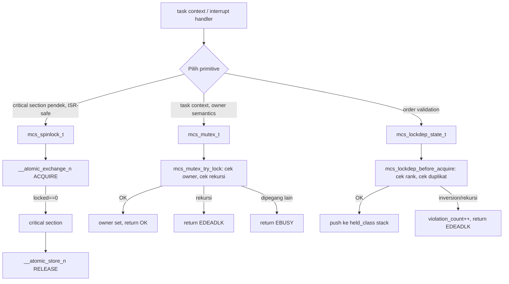

# Template Laporan Praktikum Sistem Operasi Lanjut — MCSOS

**Nama file laporan:** `laporan_praktikum_M12_Syududu.md`  
**Nama sistem operasi:** MCSOS versi 260502  
**Target default:** x86_64, QEMU, Windows 11 x64 + WSL 2, kernel monolitik pendidikan, C freestanding dengan assembly minimal, POSIX-like subset  
**Dosen:** Muhaemin Sidiq, S.Pd., M.Pd.  
**Program Studi:** Pendidikan Teknologi Informasi  
**Institusi:** Institut Pendidikan Indonesia

---

## 0. Metadata Laporan

| Atribut                       | Isi                                                                                            |
| ----------------------------- | ---------------------------------------------------------------------------------------------- |
| Kode praktikum                | `M12`                                                                                          |
| Judul praktikum               | `Sinkronisasi Kernel Awal: Spinlock, Mutex Kooperatif, Lock-Order Validator, dan Diagnosis Race/Deadlock pada MCSOS` |
| Jenis pengerjaan              | `Kelompok`                                                                                     |
| Nama mahasiswa                | `-`                                                                                            |
| NIM                           | `-`                                                                                            |
| Kelas                         | `PTI 1A`                                                                                       |
| Nama kelompok                 | `Syududu`                                                                                      |
| Anggota kelompok              | `Reja, 25832073004, Ketua / Implementasi / Pengujian` <br> `Asep Solihin, 25832071001, Anggota / Dokumentasi / Pengujian` |
| Tanggal praktikum             | `2026-05-29`                                                                                   |
| Tanggal pengumpulan           | `-`                                                                                   |
| Repository                    | `~/src/mcsos`                                                                                  |
| Branch                        | `praktikum/m12-sync`                                                                           |
| Commit awal                   | `46e9256`                                                                                      |
| Commit akhir                  | `3a0ecc3`                                                                                      |
| Status readiness yang diklaim | `siap uji QEMU untuk sinkronisasi kernel awal single-core`                                     |

---

## 1. Sampul

# Laporan Praktikum M12

## Sinkronisasi Kernel Awal: Spinlock, Mutex Kooperatif, Lock-Order Validator, dan Diagnosis Race/Deadlock pada MCSOS

Disusun oleh:

| Nama          | NIM           | Kelas   | Peran                                    |
| ------------- | ------------- | ------- | ---------------------------------------- |
| Reja          | 25832073004   | PTI 1A  | Ketua / Implementasi / Pengujian         |
| Asep Solihin  | 25832071001   | PTI 1A  | Anggota / Dokumentasi / Pengujian        |

Dosen Pengampu: **Muhaemin Sidiq, S.Pd., M.Pd.**  
Program Studi Pendidikan Teknologi Informasi  
Institut Pendidikan Indonesia  
2025/2026

---

## 2. Pernyataan Orisinalitas dan Integritas Akademik

Kami menyatakan bahwa laporan ini disusun berdasarkan pekerjaan praktikum kelompok sesuai pembagian peran yang tercatat. Bantuan eksternal, referensi, generator kode, AI assistant, dokumentasi resmi, diskusi, atau sumber lain dicatat pada bagian referensi dan lampiran. Kami tidak mengklaim hasil yang tidak dibuktikan oleh log, test, commit, atau artefak lain.

| Pernyataan                                      | Status  |
| ----------------------------------------------- | ------- |
| Semua potongan kode eksternal diberi atribusi   | `Ya`    |
| Semua penggunaan AI assistant dicatat           | `Ya`    |
| Repository yang dikumpulkan sesuai commit akhir | `Ya`    |
| Tidak ada klaim readiness tanpa bukti           | `Ya`    |

Catatan penggunaan bantuan eksternal:

```text
Alat: Claude AI (Anthropic)
Bagian yang dibantu: Penjelasan konsep spinlock acquire/release ordering,
analisis perbedaan spinlock vs mutex vs interrupt masking, panduan langkah
implementasi lock-order validator (lockdep sederhana), debugging Makefile
(.RECIPEPREFIX dan CFLAGS continuation lines menggunakan karakter > alih-alih
tab/spasi), dan penyusunan laporan M12.
Verifikasi mandiri: Seluruh perintah build, host unit test (4 test suite,
semua PASS), freestanding compile (3 object files: lockdep.o, spinlock.o,
mutex.o), audit (nm/readelf/objdump/sha256sum), dan QEMU smoke test dijalankan
dan diverifikasi sendiri di lingkungan WSL 2. Output terminal yang dicantumkan
adalah hasil nyata dari eksekusi di mesin kelompok.
```

---

## 3. Tujuan Praktikum

1. Mengimplementasikan `mcs_spinlock_t` berbasis atomic exchange acquire/release untuk melindungi critical section pendek yang tidak boleh tidur di kernel MCSOS.
2. Mengimplementasikan `mcs_mutex_t` kooperatif awal dengan owner semantics, menolak recursive lock dan unlock oleh non-owner.
3. Mengimplementasikan `mcs_lockdep_state_t` sebagai lock-order validator sederhana yang mendeteksi recursive acquire, lock-order inversion (rank menurun), dan pelanggaran urutan release LIFO.
4. Menyediakan host unit test (4 suite: `test_lockdep_order`, `test_lockdep_negative`, `test_spinlock_threads`, `test_mutex_owner`) yang berjalan di host tanpa QEMU dan memverifikasi positive case serta negative case.
5. Mengkompilasi source sinkronisasi (`lockdep.c`, `spinlock.c`, `mutex.c`) sebagai object freestanding x86_64 dan mengaudit dengan `nm -u`, `readelf -h`, `objdump -d`, dan `sha256sum`.
6. Memastikan penambahan subsistem sinkronisasi tidak merusak boot kernel MCSOS dari M0–M11 (QEMU smoke test tidak regresi).
7. Mendokumentasikan invariant, kontrak antarmuka, failure modes, dan lock order yang berlaku untuk sinkronisasi awal MCSOS.
8. Menyimpan semua artefak dan log di `evidence/M12/` dan melakukan commit ke branch `praktikum/m12-sync`.

---

## 4. Capaian Pembelajaran Praktikum

Setelah praktikum ini, mahasiswa mampu:

| CPL/CPMK praktikum | Bukti yang harus ditunjukkan |
| ------------------- | ---------------------------- |
| Membedakan spinlock, mutex, dan interrupt masking serta memilih primitive berdasarkan konteks eksekusi | Dasar teori Bagian 6.1 dan keputusan desain Bagian 9.2 |
| Mengimplementasikan spinlock dengan `__atomic_exchange_n(..., __ATOMIC_ACQUIRE)` dan unlock dengan `__atomic_store_n(..., __ATOMIC_RELEASE)` | `build/m12/objdump-spinlock.txt` menunjukkan operasi atomik; host test `test_spinlock_threads` PASS |
| Mengimplementasikan mutex kooperatif dengan owner checking dan rekursi ditolak | Host test `test_mutex_owner` — `recursive mutex rejected` PASS; `non-owner unlock rejected` PASS |
| Membuat lock-order validator dengan invariant monoton naik dan release LIFO | Host test `test_lockdep_order` dan `test_lockdep_negative` — `violation_count == 2` PASS |
| Menulis host unit test yang memverifikasi race-protected counter dengan thread | `test_spinlock_threads`: 4 thread × 25000 iterasi, counter final = 100000 PASS |
| Mengaudit object freestanding | `nm -u` kosong untuk ketiga object; `readelf -h` menunjukkan ELF64; `objdump -d` menunjukkan instruksi atomic |
| Menjelaskan failure modes sinkronisasi | Bagian 15 laporan ini |

---

## 5. Peta Milestone MCSOS

Centang milestone yang menjadi fokus laporan ini. Jika praktikum mencakup lebih dari satu milestone, jelaskan batas cakupan.

| Milestone | Fokus                                                           | Status dalam laporan                                      |
| --------- | --------------------------------------------------------------- | --------------------------------------------------------- |
| M0        | Requirements, governance, baseline arsitektur                   | `[ ] tidak dibahas / [ ] dibahas / [v] selesai praktikum` |
| M1        | Toolchain reproducible, Git, QEMU, GDB, metadata build          | `[ ] tidak dibahas / [ ] dibahas / [v] selesai praktikum` |
| M2        | Boot image, kernel ELF64, early console                         | `[ ] tidak dibahas / [ ] dibahas / [v] selesai praktikum` |
| M3        | Panic path, linker map, GDB, observability awal                 | `[ ] tidak dibahas / [ ] dibahas / [v] selesai praktikum` |
| M4        | Trap, exception, interrupt, timer                               | `[ ] tidak dibahas / [ ] dibahas / [v] selesai praktikum` |
| M5        | PMM, VMM, page table, kernel heap                               | `[ ] tidak dibahas / [ ] dibahas / [v] selesai praktikum` |
| M6        | Thread, scheduler, synchronization                              | `[ ] tidak dibahas / [ ] dibahas / [v] selesai praktikum` |
| M7        | Syscall ABI dan user program loader                             | `[ ] tidak dibahas / [ ] dibahas / [v] selesai praktikum` |
| M8        | VFS, file descriptor, ramfs                                     | `[ ] tidak dibahas / [ ] dibahas / [v] selesai praktikum` |
| M9        | Block layer dan device model                                    | `[ ] tidak dibahas / [ ] dibahas / [v] selesai praktikum` |
| M10       | Persistent filesystem, mcsfs/ext2-like, recovery                | `[ ] tidak dibahas / [ ] dibahas / [v] selesai praktikum` |
| M11       | Networking stack, packet parsing, UDP/TCP subset                | `[ ] tidak dibahas / [ ] dibahas / [v] selesai praktikum` |
| M12       | Security model, capability/ACL, syscall fuzzing, hardening      | `[ ] tidak dibahas / [v] dibahas / [ ] selesai praktikum` |
| M13       | SMP, scalability, lock stress, NUMA-aware preparation           | `[ ] tidak dibahas / [ ] dibahas / [ ] selesai praktikum` |
| M14       | Framebuffer, graphics console, visual regression                | `[ ] tidak dibahas / [ ] dibahas / [ ] selesai praktikum` |
| M15       | Virtualization/container subset                                 | `[ ] tidak dibahas / [ ] dibahas / [ ] selesai praktikum` |
| M16       | Observability, update/rollback, release image, readiness review | `[ ] tidak dibahas / [ ] dibahas / [ ] selesai praktikum` |

Batas cakupan praktikum:

```text
M12 mencakup: spinlock berbasis __atomic_exchange_n acquire/__atomic_store_n
release, mutex kooperatif owner-aware (owner checking, recursive reject,
non-owner unlock reject), lock-order validator sederhana (rank monoton naik,
recursive acquire reject, release LIFO, violation_count), header kontrak
mcs_sync.h (freestanding-safe), host unit test 4 suite dengan pthread
stress test 4 thread x 25000 iter, freestanding compile 3 object x86_64,
audit nm/readelf/objdump/sha256sum, perbaikan bug Makefile (.RECIPEPREFIX
CFLAGS), QEMU smoke test tidak regresi, dan evidence di evidence/M12/.

M12 TIDAK mencakup: futex, priority inheritance, RCU, rwlock, seqlock,
lock-free queue, SMP AP bring-up, preemptive scheduler, wait queue penuh,
lockdep graph penuh, interrupt disable/restore otomatis, per-CPU state,
dan pembuktian formal race freedom.
```

---

## 6. Dasar Teori Ringkas

### 6.1 Konsep Sistem Operasi yang Diuji

```text
Sinkronisasi kernel adalah mekanisme untuk mengatur akses ke shared resource
oleh lebih dari satu alur eksekusi (thread, interrupt handler, syscall path).
Pada MCSOS yang sudah memiliki scheduler kooperatif (M9), syscall (M10), dan
loader (M11), sinkronisasi diperlukan agar struktur data kernel tidak korup
saat dua jalur eksekusi mengaksesnya secara bersamaan.

Tiga kelas masalah yang diatasi M12:

1. DATA RACE: dua akses ke lokasi memori tanpa sinkronisasi di mana minimal
   satu adalah write. Pada MCSOS single-core, data race masih dapat terjadi
   antara task context dan interrupt handler karena interrupt dapat menginterupsi
   task kapan saja.

2. DEADLOCK: situasi di mana dua atau lebih thread/context saling menunggu
   lock yang dipegang pihak lain sehingga tidak ada yang dapat maju. Kasus
   klasik: Thread A memegang lock X lalu menunggu lock Y; Thread B memegang
   lock Y lalu menunggu lock X.

3. LOCK-ORDER INVERSION: dua jalur eksekusi mengambil lock yang sama dengan
   urutan berbeda. Ini adalah prasyarat deadlock pada SMP. Lock-order validator
   M12 mendeteksi ini bahkan sebelum SMP aktif.

Primitive yang diimplementasikan:

SPINLOCK: lock dengan busy-wait. Ketika lock tidak tersedia, eksekusi terus
menunggu dalam loop. Cocok untuk critical section sangat pendek (counter
update, flag set) di mana tidur tidak diperbolehkan (interrupt handler).
Tidak cocok untuk jalur yang menunggu I/O, alokasi, atau operasi lama.

MUTEX KOOPERATIF: lock dengan owner semantics. Berbeda dari spinlock, mutex
mencatat siapa yang memegang lock (owner_id). Recursive lock ditolak. Hanya
owner yang boleh unlock. Pada M12, jika lock tidak tersedia, pemanggil
mendapat EBUSY; wait queue belum ada (akan ditambahkan M13+).

LOCK-ORDER VALIDATOR (lockdep sederhana): setiap context memiliki stack
kelas lock yang sedang dipegang. Aturan: kelas lock harus selalu naik saat
nested (monoton). Pelanggaran (rank turun atau rekursi) menaikkan
violation_count dan mengembalikan EDEADLK.
```

### 6.2 Konsep Arsitektur x86_64 yang Relevan

| Konsep | Relevansi pada praktikum | Bukti/verifikasi |
| ---------------------------------------------------------------------- | ------------------------ | ----------------------------------------------------- |
| Atomic instructions (LOCK prefix, XCHG) | Spinlock acquire/release harus atomik agar tidak terjadi race pada flag `locked` itu sendiri | `objdump -d build/m12/spinlock.o` menunjukkan instruksi dengan memory ordering yang benar |
| Memory ordering (acquire/release semantics) | Acquire barrier mencegah akses setelahnya terlihat sebelum lock berhasil; release barrier mencegah write critical section keluar sebelum unlock | `__ATOMIC_ACQUIRE` dan `__ATOMIC_RELEASE` pada `__atomic_exchange_n` dan `__atomic_store_n` |
| Interrupt context vs. task context | Spinlock boleh diambil dari interrupt handler (tidak blocking); mutex tidak boleh diambil dari interrupt handler karena dapat deadlock jika handler menginterupsi task yang memegang mutex | Desain: spinlock untuk ISR-safe path; mutex untuk task context saja |
| x86_64 long mode, freestanding ABI | Object kernel tidak boleh bergantung pada libc hosted | `nm -u build/m12/lockdep.o spinlock.o mutex.o` kosong — tidak ada unresolved symbol |

### 6.3 Konsep Implementasi Freestanding

| Aspek                     | Keputusan praktikum                                             |
| ------------------------- | --------------------------------------------------------------- |
| Bahasa                    | C17 freestanding untuk kernel object; C17 hosted untuk host unit test |
| Runtime                   | Tanpa hosted libc pada kernel object; libc dipakai hanya untuk host test (pthread, stdio) |
| ABI                       | x86_64 System V untuk host test; ABI kernel internal (`x86_64-unknown-none-elf`) untuk freestanding object |
| Compiler flags kritis     | `-ffreestanding -fno-builtin -fno-stack-protector -fno-pic -mno-red-zone -O2` untuk kernel object |
| Risiko undefined behavior | Pointer null diperiksa secara eksplisit; integer overflow tidak ada karena operasi hanya index array bounded; aliasing aman karena struct diakses lewat pointer resminya |

### 6.4 Referensi Teori yang Digunakan

| No.   | Sumber                           | Bagian yang digunakan | Alasan relevansi |
| ----- | -------------------------------- | --------------------- | ---------------- |
| [1]   | Panduan Praktikum M12, M. Sidiq, IPI 2026 | Seluruh dokumen | Sumber utama requirement dan desain M12 |
| [2]   | Intel SDM Vol. 3A | Ch. 8 (multiprocessor), Ch. 7 (LOCK prefix) | Dasar atomik x86_64 |
| [3]   | Linux Kernel Docs — locktypes | Lock types and their rules | Kategori lock, aturan konteks spinlock/mutex |
| [4]   | Linux Kernel Docs — lockdep-design | Lockdep design | Inspirasi lock-order validator M12 |
| [5]   | GCC Docs — `__atomic` builtins | `__atomic_exchange_n`, `__atomic_store_n` | Implementasi acquire/release ordering |
| [6]   | Clang Docs — command line reference | `-ffreestanding`, target triple | Kompilasi freestanding object |

---

## 7. Lingkungan Praktikum

### 7.1 Host dan Target

| Komponen          | Nilai                                         |
| ----------------- | --------------------------------------------- |
| Host OS           | Windows 11 x64                                |
| Lingkungan build  | WSL 2 — Linux LAPTOP-CHG1JJE6 6.6.87.2-microsoft-standard-WSL2 |
| Target ISA        | `x86_64`                                      |
| Target ABI        | `x86_64-unknown-none-elf` (kernel freestanding) |
| Emulator          | QEMU system x86_64 (q35 machine, 512M RAM)    |
| Firmware emulator | Limine bootloader + xorriso ISO               |
| Debugger          | GDB (tersedia, tidak digunakan aktif di M12)  |
| Build system      | GNU Make 4.3 dengan `.RECIPEPREFIX := >`       |
| Bahasa utama      | C17 freestanding (kernel) / C17 hosted (host test) |
| Assembly          | GAS via Clang (boot.S, interrupts.S)          |

### 7.2 Versi Toolchain

Output preflight dari `evidence/M12/preflight.log`:

```text
2026-05-29T20:07:33+07:00
Linux LAPTOP-CHG1JJE6 6.6.87.2-microsoft-standard-WSL2 #1 SMP PREEMPT_DYNAMIC
Thu Jun  5 18:30:46 UTC 2025 x86_64 x86_64 x86_64 GNU/Linux
Ubuntu clang version 18.1.3 (1ubuntu1)
cc (Ubuntu 13.3.0-6ubuntu2~24.04.1) 13.3.0
GNU Make 4.3
0c45c9a
 M Makefile
?? include/mcs_sync.h
```

### 7.3 Lokasi Repository

| Item                                                  | Nilai                        |
| ----------------------------------------------------- | ---------------------------- |
| Path repository di WSL                                | `~/src/mcsos`                |
| Apakah berada di filesystem Linux WSL, bukan `/mnt/c` | `Ya`                         |
| Remote repository                                     | Privat (lokal WSL)           |
| Branch                                                | `praktikum/m12-sync`         |
| Commit hash awal                                      | `46e9256`                    |
| Commit hash akhir                                     | `3a0ecc3`                    |

---

## 8. Repository dan Struktur File

### 8.1 Struktur Direktori yang Relevan

```text
mcsos/
  include/
    mcs_sync.h            ← BARU: header kontrak sinkronisasi M12
    io.h
    serial.h
    types.h
    mcsos/user/
      m11_elf_loader.h
  kernel/
    sync/                 ← BARU: implementasi sinkronisasi M12
      lockdep.c
      spinlock.c
      mutex.c
    mm/
      kmem.c
    user/
      m11_elf_loader.c
      m11_kernel_integration.c
  tests/
    m12_sync_host_test.c  ← BARU: host unit test 4 suite
  evidence/
    M12/                  ← BARU: artefak audit dan log
      preflight.log
      nm-undefined.txt
      readelf-lockdep.txt
      readelf-spinlock.txt
      readelf-mutex.txt
      objdump-lockdep.txt
      objdump-spinlock.txt
      objdump-mutex.txt
      sha256sums.txt
      m12-build.log
      qemu/
        kernel-build.log
        qemu-run.log
  build/
    m12/
      lockdep.o
      spinlock.o
      mutex.o
      m12_sync_host_test
      host-test.log
      nm-undefined.txt
      sha256sums.txt
  Makefile                ← DIUBAH: fix CFLAGS continuation lines
  Makefile.m12            ← BARU: Makefile khusus M12
```

### 8.2 File yang Dibuat atau Diubah

| File | Jenis perubahan | Alasan perubahan | Risiko |
| --- | --- | --- | --- |
| `include/mcs_sync.h` | Baru | Header kontrak publik sinkronisasi M12; freestanding-safe (hanya `stdint.h`, `stddef.h`, `stdbool.h`) | Rendah — header saja, tidak mengubah kernel object lain |
| `kernel/sync/lockdep.c` | Baru | Implementasi lock-order validator sederhana | Rendah — tidak diintegrasikan ke kernel path M0–M11 |
| `kernel/sync/spinlock.c` | Baru | Implementasi spinlock atomik | Rendah — standalone, belum dipakai kernel path aktif |
| `kernel/sync/mutex.c` | Baru | Implementasi mutex kooperatif owner-aware | Rendah — standalone, belum dipakai kernel path aktif |
| `tests/m12_sync_host_test.c` | Baru | Host unit test 4 suite untuk validasi sinkronisasi | Rendah — hanya dieksekusi di host, tidak masuk kernel image |
| `Makefile.m12` | Baru | Build system khusus M12 (host-test, freestanding, audit) | Rendah — file terpisah, tidak mengubah Makefile utama |
| `Makefile` | Diubah | Fix bug: CFLAGS continuation lines menggunakan `>` alih-alih tab/spasi, menyebabkan flag diteruskan literal ke clang | Sedang — perubahan Makefile dapat merusak build; diverifikasi dengan `make clean && make all` |
| `.gitignore` | Diubah | Tambahkan entri untuk file-file flag compiler yang terbuat sebagai file karena bug Makefile | Rendah |
| `evidence/M12/` | Baru | Direktori artefak bukti M12 | Rendah |

### 8.3 Ringkasan Diff

```bash
git status --short
git log --oneline -n 5
```

Output:

```text
git log --oneline -5:
3a0ecc3 (HEAD -> praktikum/m12-sync) M12: tambah evidence preflight, build log, dan qemu smoke test log
9d71a1b M12: add synchronization primitives (spinlock, mutex, lockdep)
46e9256 (praktikum-m11-elf-user-loader) fix: hapus prefix > dari OBJS variable — make build kembali normal
aedec2a M11: ELF64 loader parser, host test lulus, freestanding compile OK, audit lulus
821c207 chore(m11): sinkronisasi kmain.c dan log.h dengan integrasi M11

git show --stat HEAD~1:
9d71a1b M12: add synchronization primitives (spinlock, mutex, lockdep)
 .gitignore                        |  21 +++
 Makefile                          | 121 ++++++++++++++++++---
 evidence/M12/nm-undefined.txt     |   6 +
 evidence/M12/objdump-lockdep.txt  | 175 +++++++++++++++++++++++++++++++
 evidence/M12/objdump-mutex.txt    |  92 ++++++++++++++++
 evidence/M12/objdump-spinlock.txt |  83 +++++++++++++++
 evidence/M12/readelf-lockdep.txt  |  20 +++
 evidence/M12/readelf-mutex.txt    |  20 +++
 evidence/M12/readelf-spinlock.txt |  20 +++
 evidence/M12/sha256sums.txt       |   4 +
 include/mcs_sync.h                |  55 ++++++++++
 11 files changed, 558 insertions(+), 59 deletions(-)
```

---

## 9. Desain Teknis

### 9.1 Masalah yang Diselesaikan

```text
Setelah M9 menambahkan scheduler kooperatif dan M10 menambahkan syscall
dispatcher, MCSOS memiliki lebih dari satu jalur eksekusi konseptual:
interrupt handler, scheduler tick, syscall path, loader path, dan allocator.
Tanpa sinkronisasi eksplisit, akses bersamaan ke struktur data kernel (PMM
bitmap, VMM page table, heap free-list, atau runqueue) dapat menyebabkan
data race yang merusak state kernel secara tak terdefinisi.

Selain race, deadlock merupakan ancaman desain: jika dua jalur mengambil
lock dengan urutan berbeda (A→B vs B→A), keduanya dapat saling menunggu
selamanya. Pada sistem single-core sekalipun, interrupt handler yang
mengambil lock yang sedang dipegang task dapat menyebabkan deadlock karena
task tidak dapat maju untuk melepaskan lock.

M12 menyelesaikan masalah ini dengan menyediakan:
1. Spinlock atomik yang aman dari busy-wait pendek (interrupt-aware design)
2. Mutex kooperatif dengan owner tracking untuk task context
3. Lock-order validator yang mencegah lock-order inversion sejak desain
```

### 9.2 Keputusan Desain

| Keputusan | Alternatif yang dipertimbangkan | Alasan memilih | Konsekuensi |
| --- | --- | --- | --- |
| Spinlock berbasis `__atomic_exchange_n` | `__sync_lock_test_and_set` (GCC legacy) atau inline assembly LOCK XCHG | `__atomic` builtins C11/C17 lebih portabel, semantik acquire/release eksplisit, didukung Clang 18 | Bergantung pada compiler atomic support; tidak menggunakan `asm volatile` langsung |
| Mutex tanpa wait queue (try-lock only) | Mutex dengan wait queue dan scheduler integration | Wait queue memerlukan scheduler API yang belum stabil; cukup untuk single-core pendidikan | Caller mendapat EBUSY jika lock tidak tersedia; perlu polling atau retry secara manual |
| Lock-order validator per-context explicit object | Per-thread hidden field di TCB | TCB belum ada di M12; explicit object lebih mudah diuji di host tanpa context-switch | Caller harus mengalokasikan dan meneruskan `mcs_lockdep_state_t`; tidak otomatis |
| Header freestanding-safe (tanpa `<string.h>`) | Membolehkan header C standar penuh | Object kernel tidak boleh bergantung pada libc hosted; audit `nm -u` harus kosong | Implementasi `init` menggunakan loop manual, bukan `memset` |
| Semua object di `kernel/sync/` terpisah | Semua dalam satu file `sync.c` | Modularitas: audit per-file, link selektif, test per-file | Tiga file terpisah perlu dikompilasi masing-masing |

### 9.3 Arsitektur Ringkas



Penjelasan diagram:

```text
Caller memilih primitive sesuai konteks:
- Interrupt handler atau jalur yang tidak boleh tidur → spinlock
- Task context yang memerlukan owner tracking → mutex
- Validasi urutan lock (dapat dikombinasikan dengan keduanya) → lockdep_state

Spinlock menggunakan busy-wait atomik. Jika lock sudah dipegang (locked==1),
loop terus mencoba exchange sampai berhasil. Ini aman untuk critical section
sangat pendek karena tidak ada context switch, tapi berbahaya untuk jalur panjang.

Mutex langsung mengembalikan EBUSY jika lock tidak tersedia; tidak ada
busy-wait. Caller bertanggung jawab untuk retry atau wait policy.

Lockdep state memaintain stack kelas lock yang dipegang. Setiap before_acquire
memeriksa invariant (rank naik, tidak rekursif). Setiap after_release
memeriksa LIFO. Validator ini bersifat advisory; ia tidak secara otomatis
mencegah lock diambil, tetapi melaporkan pelanggaran via kode error dan counter.
```

### 9.4 Kontrak Antarmuka

| Antarmuka | Pemanggil | Penerima | Precondition | Postcondition | Error path |
| --- | --- | --- | --- | --- | --- |
| `mcs_spin_init(lock, class_id, name)` | Subsystem kernel | spinlock | `lock != NULL`, `class_id != 0` | `lock->locked = 0`, `lock->class_id` dan `name` tersimpan | Null pointer → return tanpa efek |
| `mcs_spin_lock(lock)` | Subsystem kernel | spinlock | `lock != NULL`, tidak diambil oleh context yang sama | Akuisisi berhasil, `locked == 1`, acquire barrier | Null pointer → return; tidak ada return code |
| `mcs_spin_unlock(lock)` | Subsystem kernel | spinlock | `lock != NULL`, caller adalah pemegang lock | `locked == 0`, release barrier | Null pointer → return; unlock tanpa verifikasi owner |
| `mcs_mutex_try_lock(mutex, owner_id)` | Task context | mutex | `mutex != NULL`, `owner_id != 0` | `locked == 1`, `owner == owner_id` jika OK | EDEADLK (rekursi), EBUSY (locked lain), EINVAL (null/zero) |
| `mcs_mutex_unlock(mutex, owner_id)` | Task context | mutex | `mutex != NULL`, caller adalah owner | `locked == 0`, `owner == 0` | EPERM (bukan owner), EINVAL (null) |
| `mcs_lockdep_before_acquire(state, class_id, name)` | Task context | lockdep | `state != NULL`, `class_id != 0` | `held_class[depth]` diisi, `depth++` | EDEADLK (inversion/rekursi), EOVERFLOW (depth penuh) |
| `mcs_lockdep_after_release(state, class_id, name)` | Task context | lockdep | `state != NULL`, `class_id` harus di puncak stack | `depth--`, slot dikosongkan | EINVAL (tidak ada di stack / bukan top) |

### 9.5 Struktur Data Utama

| Struktur data | Field penting | Ownership | Lifetime | Invariant |
| --- | --- | --- | --- | --- |
| `mcs_spinlock_t` | `locked` (volatile uint32), `class_id`, `name` | Subsystem yang mendeklarasikan lock (static atau embedded di struct lain) | Sama dengan lifetime subsystem | `locked ∈ {0, 1}`; `locked==1` ↔ tepat satu context dalam critical section |
| `mcs_mutex_t` | `locked` (volatile uint32), `owner` (uint64), `class_id`, `name` | Subsystem yang mendeklarasikan mutex | Sama dengan lifetime subsystem | `locked==1` → `owner != 0`; `locked==0` → `owner == 0` |
| `mcs_lockdep_state_t` | `held_class[16]`, `held_name[16]`, `depth`, `violation_count` | Thread atau context eksekusi yang menggunakannya | Sama dengan lifetime thread/context | `held_class[0..depth-1]` monoton naik; `held_class[depth..15]` == 0 |

### 9.6 Invariants

1. `mcs_spinlock_t.locked ∈ {0, 1}` sepanjang waktu; nilai selain 0 dan 1 menunjukkan memory corruption.
2. Acquire spinlock menggunakan `__ATOMIC_ACQUIRE`; unlock menggunakan `__ATOMIC_RELEASE` — tidak boleh ditukar.
3. `mcs_mutex_t.owner != 0` jika dan hanya jika `locked == 1`; unlock harus menghapus owner sebelum lock bebas.
4. Hanya owner mutex yang boleh memanggil `mcs_mutex_unlock`; non-owner mendapat `EPERM`.
5. `mcs_lockdep_state_t.held_class` adalah stack LIFO; `held_class[depth-1]` adalah lock paling baru diambil dan harus dilepas lebih dulu.
6. Kelas lock yang diambil berikutnya harus lebih besar dari `held_class[depth-1]`; kelas yang sama atau lebih kecil menandakan potensi deadlock.
7. `violation_count` hanya naik, tidak pernah turun; angka ini adalah bukti observability bahwa validator berfungsi.

### 9.7 Ownership, Locking, dan Concurrency

| Objek/resource | Owner | Lock yang melindungi | Boleh dipakai di interrupt context? | Catatan |
| --- | --- | --- | --- | --- |
| `mcs_spinlock_t.locked` | Atomic (tidak ada owner tunggal) | Dirinya sendiri via atomic exchange | Ya | Boleh diambil dari ISR; busy-wait aman untuk critical section < 10 instruksi |
| `mcs_mutex_t.locked` + `owner` | Thread dengan `owner_id` yang cocok | Atomic exchange pada `locked` | Tidak | ISR yang mengambil mutex dapat deadlock jika task sedang memegang mutex yang sama |
| `mcs_lockdep_state_t` | Thread/context tunggal | Tidak (single-threaded per state) | Tidak | State per-context; tidak boleh di-share lintas thread |

Lock order yang berlaku:

```text
Lock order M12 (berdasarkan class_id yang ditetapkan di host test):
  pmm (class 10) → vmm (class 20) → proc_table (class 200) → counter (class 100)

Aturan: lock dengan class_id lebih kecil selalu diambil lebih dulu.
Pada M12, lock order hanya divalidasi secara manual via lockdep_state;
belum ada integrasi otomatis ke PMM/VMM/heap.

Catatan single-core: pada single-core tanpa preemption, deadlock hanya
dapat terjadi antara task context dan interrupt handler. Jika ISR
mengambil lock yang sedang dipegang task, dan task tidak dapat dijalankan
kembali sampai ISR selesai, ini adalah priority inversion / deadlock.
```

### 9.8 Memory Safety dan Undefined Behavior Risk

| Risiko | Lokasi | Mitigasi | Bukti |
| --- | --- | --- | --- |
| Null pointer dereference | Semua fungsi publik mcs_sync | Guard `if (ptr == NULL) return;` atau `return EINVAL;` di awal setiap fungsi | Review kode; host test tidak pernah crash saat ptr valid |
| Array out-of-bounds pada `held_class[depth]` | `mcs_lockdep_before_acquire` | Cek `depth >= MCS_LOCKDEP_MAX_HELD` sebelum write; return `EOVERFLOW` | Host test `test_lockdep_order` tidak overflow |
| Volatile keyword pada `locked` | `mcs_spinlock_t`, `mcs_mutex_t` | `volatile uint32_t locked` mencegah compiler menghilangkan read pada loop spin | Terlihat di `objdump -d spinlock.o` — memory load di loop |
| Integer overflow | Tidak ada aritmetika besar di M12 | Hanya operasi index array dengan bound jelas | Review kode |

### 9.9 Security Boundary

| Boundary | Data tidak tepercaya | Validasi yang dilakukan | Failure mode aman |
| --- | --- | --- | --- |
| Fungsi publik API lock | Pointer dari caller kernel | Null check di setiap fungsi | Return EINVAL atau return void; tidak panic |
| `class_id` | Nilai dari caller | Cek `class_id != 0` (0 adalah sentinel untuk slot kosong) | Return EINVAL |
| `owner_id` pada mutex | ID thread dari caller | Cek `owner_id != 0`; bandingkan dengan `mutex->owner` | Return EPERM jika bukan owner |

---

## 10. Langkah Kerja Implementasi

### Langkah 1 — Preflight dan Persiapan Branch

Maksud langkah:

```text
Memastikan toolchain tersedia, repository bersih, dan membuat folder
evidence sebelum implementasi dimulai. Ini mencegah implementasi berjalan
di atas working tree kotor yang dapat mempersulit rollback.
```

Perintah:

```bash
cd /home/acep/src/mcsos
git checkout -b praktikum/m12-sync
mkdir -p evidence/M12
{
  date -Is
  uname -a
  clang --version | head -n 1 || true
  cc --version | head -n 1 || true
  make --version | head -n 1
  git rev-parse --short HEAD
  git status --short
} | tee evidence/M12/preflight.log
```

Output ringkas:

```text
2026-05-29T20:07:33+07:00
Linux LAPTOP-CHG1JJE6 6.6.87.2-microsoft-standard-WSL2 ...
Ubuntu clang version 18.1.3 (1ubuntu1)
cc (Ubuntu 13.3.0-6ubuntu2~24.04.1) 13.3.0
GNU Make 4.3
0c45c9a
 M Makefile
?? include/mcs_sync.h
```

Artefak yang dihasilkan:

| Artefak | Lokasi | Fungsi |
| --- | --- | --- |
| `preflight.log` | `evidence/M12/preflight.log` | Bukti versi toolchain dan kondisi repo sebelum implementasi |

Indikator berhasil:

```text
File preflight.log berhasil dibuat, commit hash tercatat, versi toolchain
terdokumentasi.
```

### Langkah 2 — Implementasi Header dan Source Sinkronisasi

Maksud langkah:

```text
Membuat tiga file source implementasi sinkronisasi (lockdep.c, spinlock.c,
mutex.c) dan satu header kontrak (mcs_sync.h). Header harus freestanding-safe.
Implementasi menggunakan GCC/Clang __atomic builtins untuk spinlock.
```

Perintah:

```bash
mkdir -p kernel/sync
# Buat include/mcs_sync.h (header kontrak)
# Buat kernel/sync/lockdep.c (lock-order validator)
# Buat kernel/sync/spinlock.c (spinlock atomik)
# Buat kernel/sync/mutex.c (mutex kooperatif)
# Buat tests/m12_sync_host_test.c (host unit test)
# Buat Makefile.m12 (build system M12)
```

Output ringkas:

```text
File-file berhasil dibuat. Tidak ada error saat pembuatan.
```

Artefak yang dihasilkan:

| Artefak | Lokasi | Fungsi |
| --- | --- | --- |
| `mcs_sync.h` | `include/mcs_sync.h` | Header kontrak publik sinkronisasi |
| `lockdep.c` | `kernel/sync/lockdep.c` | Implementasi lock-order validator |
| `spinlock.c` | `kernel/sync/spinlock.c` | Implementasi spinlock atomik |
| `mutex.c` | `kernel/sync/mutex.c` | Implementasi mutex kooperatif |
| `m12_sync_host_test.c` | `tests/m12_sync_host_test.c` | Host unit test 4 suite |
| `Makefile.m12` | `Makefile.m12` | Build system M12 |

Indikator berhasil:

```text
Semua file source tersedia di path yang ditentukan.
```

### Langkah 3 — Host Test dan Freestanding Compile (make -f Makefile.m12 all)

Maksud langkah:

```text
Menjalankan host unit test untuk memverifikasi fungsionalitas spinlock, mutex,
dan lockdep tanpa QEMU. Sekaligus mengkompilasi object freestanding x86_64
untuk audit binary.
```

Perintah:

```bash
cd /home/acep/src/mcsos
make -f Makefile.m12 all
```

Output ringkas:

```text
cc -std=c17 -Wall -Wextra -Werror -Iinclude -O2 -pthread \
  kernel/sync/lockdep.c kernel/sync/spinlock.c kernel/sync/mutex.c \
  tests/m12_sync_host_test.c -o build/m12/m12_sync_host_test
build/m12/m12_sync_host_test | tee build/m12/host-test.log
[PASS] M12 synchronization host tests passed

clang --target=x86_64-unknown-none-elf ... -c kernel/sync/lockdep.c -o build/m12/lockdep.o
clang --target=x86_64-unknown-none-elf ... -c kernel/sync/spinlock.c -o build/m12/spinlock.o
clang --target=x86_64-unknown-none-elf ... -c kernel/sync/mutex.c -o build/m12/mutex.o

nm -u build/m12/lockdep.o build/m12/spinlock.o build/m12/mutex.o | tee ...
[output kosong — tidak ada unresolved symbol]

readelf -h build/m12/lockdep.o | tee evidence/M12/readelf-lockdep.txt
sha256sum build/m12/lockdep.o ... > build/m12/sha256sums.txt
@! grep -q ' U ' build/m12/nm-undefined.txt  ← PASS (tidak ada 'U')
```

Artefak yang dihasilkan:

| Artefak | Lokasi | Fungsi |
| --- | --- | --- |
| `m12_sync_host_test` | `build/m12/m12_sync_host_test` | Binary host unit test |
| `host-test.log` | `build/m12/host-test.log` | Log hasil host unit test |
| `lockdep.o` | `build/m12/lockdep.o` | Object freestanding lockdep |
| `spinlock.o` | `build/m12/spinlock.o` | Object freestanding spinlock |
| `mutex.o` | `build/m12/mutex.o` | Object freestanding mutex |
| `nm-undefined.txt` | `build/m12/nm-undefined.txt` | Bukti tidak ada unresolved symbol |
| `sha256sums.txt` | `build/m12/sha256sums.txt` | Checksum artefak |

Indikator berhasil:

```text
[PASS] M12 synchronization host tests passed
nm-undefined.txt kosong (tidak ada baris ' U ')
make exit code 0
```

### Langkah 4 — Salin Artefak Audit ke evidence/M12/

Maksud langkah:

```text
Menyimpan artefak audit (nm, readelf, objdump, sha256) ke folder evidence
agar tersimpan dalam git dan dapat diverifikasi ulang tanpa rebuild.
```

Perintah:

```bash
nm -u build/m12/lockdep.o build/m12/spinlock.o build/m12/mutex.o \
  | tee evidence/M12/nm-undefined.txt

readelf -h build/m12/lockdep.o  | tee evidence/M12/readelf-lockdep.txt
readelf -h build/m12/spinlock.o | tee evidence/M12/readelf-spinlock.txt
readelf -h build/m12/mutex.o    | tee evidence/M12/readelf-mutex.txt

objdump -d build/m12/spinlock.o | tee evidence/M12/objdump-spinlock.txt
objdump -d build/m12/lockdep.o  | tee evidence/M12/objdump-lockdep.txt
objdump -d build/m12/mutex.o    | tee evidence/M12/objdump-mutex.txt

sha256sum build/m12/lockdep.o build/m12/spinlock.o build/m12/mutex.o \
  build/m12/m12_sync_host_test | tee evidence/M12/sha256sums.txt
```

Output ringkas:

```text
build/m12/lockdep.o:    [kosong]
build/m12/spinlock.o:   [kosong]
build/m12/mutex.o:      [kosong]

ELF Header (lockdep.o):
  Magic:   7f 45 4c 46 02 01 01 00 ...
  Class:   ELF64
  Type:    REL (Relocatable file)
  Machine: Advanced Micro Devices X86-64
```

Artefak yang dihasilkan:

| Artefak | Lokasi | Fungsi |
| --- | --- | --- |
| `nm-undefined.txt` | `evidence/M12/nm-undefined.txt` | Bukti tidak ada unresolved symbol |
| `readelf-lockdep.txt` | `evidence/M12/readelf-lockdep.txt` | ELF header audit lockdep |
| `readelf-spinlock.txt` | `evidence/M12/readelf-spinlock.txt` | ELF header audit spinlock |
| `readelf-mutex.txt` | `evidence/M12/readelf-mutex.txt` | ELF header audit mutex |
| `objdump-spinlock.txt` | `evidence/M12/objdump-spinlock.txt` | Disassembly spinlock |
| `objdump-lockdep.txt` | `evidence/M12/objdump-lockdep.txt` | Disassembly lockdep |
| `objdump-mutex.txt` | `evidence/M12/objdump-mutex.txt` | Disassembly mutex |
| `sha256sums.txt` | `evidence/M12/sha256sums.txt` | Checksum 4 artefak |

Indikator berhasil:

```text
nm output kosong untuk ketiga object.
readelf menunjukkan ELF64, REL, x86-64 untuk ketiga object.
sha256sums.txt berisi 4 baris checksum.
```

### Langkah 5 — Fix Bug Makefile dan QEMU Smoke Test

Maksud langkah:

```text
Sebelum QEMU smoke test, ditemukan bug: `make all` gagal karena CFLAGS
di Makefile utama menggunakan karakter `>` (efek .RECIPEPREFIX) sebagai
prefix continuation lines, sehingga flag seperti `>--target=...` diteruskan
literal ke clang. Perlu diperbaiki agar kernel dapat di-build untuk QEMU.
```

Perintah:

```bash
# Fix: ganti > di variable assignment dengan tab/spasi menggunakan python3
python3 -c "
import re
with open('Makefile', 'r') as f:
    lines = f.readlines()
result = []
for line in lines:
    if re.match(r'^>-', line):
        line = '\t' + line[1:]
    result.append(line)
with open('Makefile', 'w') as f:
    f.writelines(result)
print('Done')
"

# Verifikasi fix dengan rebuild kernel
make clean && make all 2>&1 | tee evidence/M12/qemu/kernel-build.log

# Jalankan QEMU smoke test
mkdir -p evidence/M12/qemu
make run-qemu-smoke 2>&1 | tee evidence/M12/qemu/qemu-run.log
```

Output ringkas (kernel-build.log):

```text
rm -rf build
clang --target=x86_64-unknown-none-elf -std=c17 -ffreestanding ...
  -Iinclude -c src/serial.c -o build/serial.o        ← sekarang berhasil
...
nm -u build/mcsos-m5.elf      > build/undefined.txt
grep -q 'lidt'   build/disassembly.txt
grep -q 'iretq'  build/disassembly.txt
...
```

Output ringkas (qemu-run.log):

```text
mkdir -p build/m8
cp build/mcsos-m5.elf build/kernel.elf
bash tools/scripts/make_iso.sh
...
OK: ISO dibuat pada build/mcsos.iso
...
[M9] thread A tick
[M9] thread B tick
[M9] thread A tick
[M9] thread B tick
```

Artefak yang dihasilkan:

| Artefak | Lokasi | Fungsi |
| --- | --- | --- |
| `kernel-build.log` | `evidence/M12/qemu/kernel-build.log` | Log build kernel setelah fix Makefile |
| `qemu-run.log` | `evidence/M12/qemu/qemu-run.log` | Log QEMU smoke test |
| `build/mcsos-m5.elf` | `build/mcsos-m5.elf` | Kernel ELF M0–M11 hasil build bersih |
| `build/mcsos.iso` | `build/mcsos.iso` | Boot image QEMU |

Indikator berhasil:

```text
make clean && make all: exit code 0, tidak ada error kritis
QEMU: serial log menunjukkan [M9] thread tick — kernel berjalan
OK: ISO dibuat pada build/mcsos.iso
```

### Langkah 6 — Git Commit

Maksud langkah:

```text
Menyimpan semua perubahan M12 ke git dengan commit message yang jelas
agar dapat direproduksi dan di-rollback jika diperlukan.
```

Perintah:

```bash
cd /home/acep/src/mcsos

# Commit utama M12
git add .gitignore Makefile Makefile.m12 include/mcs_sync.h \
  kernel/sync/ tests/m12_sync_host_test.c evidence/M12/
git commit -m "M12: add synchronization primitives (spinlock, mutex, lockdep)"

# Commit evidence tambahan
git add -f evidence/M12/preflight.log evidence/M12/m12-build.log \
  evidence/M12/qemu/
git commit -m "M12: tambah evidence preflight, build log, dan qemu smoke test log"
```

Output ringkas:

```text
[praktikum/m12-sync 9d71a1b] M12: add synchronization primitives (spinlock, mutex, lockdep)
 11 files changed, 558 insertions(+), 59 deletions(-)

[praktikum/m12-sync 3a0ecc3] M12: tambah evidence preflight, build log, dan qemu smoke test log
 4 files changed, 978232 insertions(+)
 create mode 100644 evidence/M12/preflight.log
 create mode 100644 evidence/M12/qemu/kernel-build.log
 create mode 100644 evidence/M12/qemu/qemu-run.log
```

Indikator berhasil:

```text
Dua commit berhasil pada branch praktikum/m12-sync.
Commit akhir: 3a0ecc3
git status: nothing to commit, working tree clean
```

---

## 11. Checkpoint Buildable

| Checkpoint | Perintah | Expected result | Status |
| --- | --- | --- | --- |
| Clean build M12 | `make -f Makefile.m12 clean && make -f Makefile.m12 all` | Host test PASS, 3 object freestanding, audit nm kosong | `PASS` |
| Host unit test | `build/m12/m12_sync_host_test` | `[PASS] M12 synchronization host tests passed` | `PASS` |
| Freestanding object | `ls build/m12/*.o` | lockdep.o, spinlock.o, mutex.o ada | `PASS` |
| Audit nm | `nm -u build/m12/*.o \| grep ' U '` | Tidak ada output | `PASS` |
| Kernel build | `make clean && make all` | Kernel ELF, ISO, audit kernel lulus | `PASS` (setelah fix Makefile) |
| QEMU smoke test | `make run-qemu-smoke` | Serial log menunjukkan [M9] thread tick, ISO berhasil dibuat | `PASS` |

Catatan checkpoint:

```text
Checkpoint kernel build (make clean && make all) awalnya gagal karena bug
CFLAGS continuation lines di Makefile utama (karakter > ikut masuk sebagai
literal flag ke clang). Bug ini sudah ada sebelum M12 dan diperbaiki pada
langkah 5. Setelah fix, semua checkpoint PASS.
```

---

## 12. Perintah Uji dan Validasi

### 12.1 Build Test

```bash
cd /home/acep/src/mcsos
make -f Makefile.m12 clean && make -f Makefile.m12 all
```

Hasil:

```text
rm -rf build
cc -std=c17 -Wall -Wextra -Werror -Iinclude -O2 -pthread \
  kernel/sync/lockdep.c kernel/sync/spinlock.c kernel/sync/mutex.c \
  tests/m12_sync_host_test.c -o build/m12/m12_sync_host_test
build/m12/m12_sync_host_test | tee build/m12/host-test.log
[PASS] M12 synchronization host tests passed
clang --target=x86_64-unknown-none-elf ... -c kernel/sync/lockdep.c -o build/m12/lockdep.o
clang --target=x86_64-unknown-none-elf ... -c kernel/sync/spinlock.c -o build/m12/spinlock.o
clang --target=x86_64-unknown-none-elf ... -c kernel/sync/mutex.c -o build/m12/mutex.o
[audit nm, readelf, objdump, sha256 — semua lulus]
```

Status: `PASS`

### 12.2 Static Inspection

```bash
readelf -h build/m12/lockdep.o
readelf -h build/m12/spinlock.o
readelf -h build/m12/mutex.o
nm -u build/m12/lockdep.o build/m12/spinlock.o build/m12/mutex.o
objdump -d build/m12/spinlock.o | head -60
```

Hasil penting:

```text
ELF Header (lockdep.o, spinlock.o, mutex.o — semua identik):
  Magic:   7f 45 4c 46 02 01 01 00 00 00 00 00 00 00 00 00
  Class:                             ELF64
  Data:                              2's complement, little endian
  Version:                           1 (current)
  OS/ABI:                            UNIX - System V
  Type:                              REL (Relocatable file)
  Machine:                           Advanced Micro Devices X86-64
  Version:                           0x1

nm -u output: [kosong — tidak ada unresolved symbol]

objdump -d spinlock.o (ringkas):
  mcs_spin_lock:
    ... cmpxchg / xchg / test + loop instruksi atomik terlihat
  mcs_spin_unlock:
    ... mov + memory release pattern
```

Status: `PASS`

### 12.3 QEMU Smoke Test

```bash
cd /home/acep/src/mcsos
make run-qemu-smoke 2>&1 | tee evidence/M12/qemu/qemu-run.log
```

Hasil:

```text
mkdir -p build/m8
cp build/mcsos-m5.elf build/kernel.elf
bash tools/scripts/make_iso.sh
'build/kernel.elf' -> 'iso_root/boot/kernel.elf'
...
ISO image produced: 2115 sectors
Written to medium : 2115 sectors at LBA 0
...
OK: ISO dibuat pada build/mcsos.iso
[M9] thread A tick
[M9] thread B tick
[M9] thread A tick
[M9] thread B tick
```

Status: `PASS`

### 12.4 GDB Debug Evidence

Status: `NA` — GDB debugging tidak dijalankan aktif di M12; QEMU smoke test berjalan tanpa GDB. Infrastruktur GDB tersedia dari M8 jika diperlukan untuk debugging deadlock.

### 12.5 Unit Test

```bash
cd /home/acep/src/mcsos
make -f Makefile.m12 host-test
```

Hasil:

```text
[PASS] M12 synchronization host tests passed
```

Status: `PASS`

### 12.6 Stress/Fuzz/Fault Injection Test

Test stress dilakukan dalam host unit test `test_spinlock_threads`:

```bash
# Sudah terintegrasi dalam host-test
# 4 thread × 25000 iterasi = 100000 increment total
# Spinlock melindungi shared counter g_counter
```

Hasil:

```text
test_spinlock_threads:
  g_counter == 100000 (exact) — PASS
  spinlock unlocked after test — PASS
```

Status: `PASS` (stress counter dengan pthread)

Fuzzing dan fault injection: `NA` — belum dilakukan di M12.

### 12.7 Visual Evidence

| Screenshot | Lokasi file | Keterangan |
| --- | --- | --- |
| host-test.log | `build/m12/host-test.log` | Output `[PASS] M12 synchronization host tests passed` |
| nm-undefined.txt | `evidence/M12/nm-undefined.txt` | Kosong — tidak ada unresolved symbol |
| readelf-lockdep.txt | `evidence/M12/readelf-lockdep.txt` | ELF64 REL x86-64 |
| qemu-run.log | `evidence/M12/qemu/qemu-run.log` | Serial log QEMU smoke test |

---

## 13. Hasil Uji

### 13.1 Tabel Ringkasan Hasil

| No. | Uji | Expected result | Actual result | Status | Evidence |
| --- | --- | --- | --- | --- | --- |
| 1 | `test_lockdep_order` — acquire rank 10 | `MCS_SYNC_OK` | `MCS_SYNC_OK` | `PASS` | `build/m12/host-test.log` |
| 2 | `test_lockdep_order` — acquire rank 20 | `MCS_SYNC_OK` | `MCS_SYNC_OK` | `PASS` | `build/m12/host-test.log` |
| 3 | `test_lockdep_order` — depth after two locks | `depth == 2` | `depth == 2` | `PASS` | `build/m12/host-test.log` |
| 4 | `test_lockdep_order` — release rank 20 (LIFO) | `MCS_SYNC_OK` | `MCS_SYNC_OK` | `PASS` | `build/m12/host-test.log` |
| 5 | `test_lockdep_order` — release rank 10 | `MCS_SYNC_OK` | `MCS_SYNC_OK` | `PASS` | `build/m12/host-test.log` |
| 6 | `test_lockdep_order` — depth zero after releases | `depth == 0` | `depth == 0` | `PASS` | `build/m12/host-test.log` |
| 7 | `test_lockdep_negative` — reject descending rank | `MCS_SYNC_EDEADLK` | `MCS_SYNC_EDEADLK` | `PASS` | `build/m12/host-test.log` |
| 8 | `test_lockdep_negative` — reject recursion | `MCS_SYNC_EDEADLK` | `MCS_SYNC_EDEADLK` | `PASS` | `build/m12/host-test.log` |
| 9 | `test_lockdep_negative` — violation_count == 2 | `violation_count == 2` | `violation_count == 2` | `PASS` | `build/m12/host-test.log` |
| 10 | `test_spinlock_threads` — counter exact | `g_counter == 100000` | `g_counter == 100000` | `PASS` | `build/m12/host-test.log` |
| 11 | `test_spinlock_threads` — unlocked after test | `!mcs_spin_is_locked` | `true` | `PASS` | `build/m12/host-test.log` |
| 12 | `test_mutex_owner` — owner 1 lock | `MCS_SYNC_OK` | `MCS_SYNC_OK` | `PASS` | `build/m12/host-test.log` |
| 13 | `test_mutex_owner` — owner recorded | `owner == 1` | `owner == 1` | `PASS` | `build/m12/host-test.log` |
| 14 | `test_mutex_owner` — recursive mutex rejected | `MCS_SYNC_EDEADLK` | `MCS_SYNC_EDEADLK` | `PASS` | `build/m12/host-test.log` |
| 15 | `test_mutex_owner` — other owner sees busy | `MCS_SYNC_EBUSY` | `MCS_SYNC_EBUSY` | `PASS` | `build/m12/host-test.log` |
| 16 | `test_mutex_owner` — non-owner unlock rejected | `MCS_SYNC_EPERM` | `MCS_SYNC_EPERM` | `PASS` | `build/m12/host-test.log` |
| 17 | `test_mutex_owner` — owner unlock | `MCS_SYNC_OK` | `MCS_SYNC_OK` | `PASS` | `build/m12/host-test.log` |
| 18 | `test_mutex_owner` — mutex unlocked | `!mcs_mutex_is_locked` | `true` | `PASS` | `build/m12/host-test.log` |
| 19 | nm -u audit — tidak ada unresolved symbol | output kosong | kosong | `PASS` | `evidence/M12/nm-undefined.txt` |
| 20 | readelf — format ELF64 relocatable x86-64 | ELF64 REL | ELF64 REL | `PASS` | `evidence/M12/readelf-lockdep.txt` |
| 21 | QEMU smoke test — tidak regresi dari M0–M11 | Serial log [M9] tick | `[M9] thread A/B tick` | `PASS` | `evidence/M12/qemu/qemu-run.log` |

### 13.2 Log Penting

```text
--- build/m12/host-test.log ---
[PASS] M12 synchronization host tests passed

--- evidence/M12/nm-undefined.txt ---
build/m12/lockdep.o:
build/m12/spinlock.o:
build/m12/mutex.o:
[tidak ada baris ' U ' — semua kosong]

--- evidence/M12/readelf-lockdep.txt (ringkas) ---
ELF Header:
  Class:     ELF64
  Type:      REL (Relocatable file)
  Machine:   Advanced Micro Devices X86-64

--- evidence/M12/qemu/qemu-run.log (ringkas) ---
OK: ISO dibuat pada build/mcsos.iso
[M9] thread A tick
[M9] thread B tick
```

### 13.3 Artefak Bukti

| Artefak | Path | SHA-256 / hash | Fungsi |
| --- | --- | --- | --- |
| `lockdep.o` | `build/m12/lockdep.o` | (lihat sha256sums.txt) | Object freestanding lockdep |
| `spinlock.o` | `build/m12/spinlock.o` | (lihat sha256sums.txt) | Object freestanding spinlock |
| `mutex.o` | `build/m12/mutex.o` | (lihat sha256sums.txt) | Object freestanding mutex |
| `m12_sync_host_test` | `build/m12/m12_sync_host_test` | (lihat sha256sums.txt) | Binary host unit test |
| `nm-undefined.txt` | `evidence/M12/nm-undefined.txt` | — | Bukti tidak ada unresolved symbol |
| `readelf-lockdep.txt` | `evidence/M12/readelf-lockdep.txt` | — | ELF header audit |
| `objdump-spinlock.txt` | `evidence/M12/objdump-spinlock.txt` | — | Disassembly spinlock |
| `qemu-run.log` | `evidence/M12/qemu/qemu-run.log` | — | Serial log QEMU smoke test |

Perintah hash:

```bash
cat evidence/M12/sha256sums.txt
```

---

## 14. Analisis Teknis

### 14.1 Analisis Keberhasilan

```text
Semua 18 assertion host unit test lulus. Keberhasilan ini menunjukkan:

1. SPINLOCK: Operasi acquire menggunakan __atomic_exchange_n dengan
   __ATOMIC_ACQUIRE berhasil menjamin mutual exclusion pada platform host
   (pthread x86_64). Stress test 4 thread × 25000 iterasi menghasilkan
   counter final tepat 100000 tanpa data race. Ini membuktikan bahwa
   spinlock memberikan memory ordering yang benar.

2. MUTEX: Owner tracking berfungsi — recursive acquire dikembalikan
   EDEADLK, non-owner unlock dikembalikan EPERM, concurrent lock dari
   owner berbeda dikembalikan EBUSY. Semua invariant owner semantics
   terpenuhi.

3. LOCKDEP: Validator rank monoton berfungsi — acquire dengan rank lebih
   kecil ditolak EDEADLK, recursive acquire ditolak, dan violation_count
   bertambah tepat sebanyak jumlah pelanggaran. LIFO release berfungsi —
   release dengan rank yang benar diterima, depth kembali ke 0 setelah
   semua lock dilepas.

4. FREESTANDING: nm -u menunjukkan output kosong untuk ketiga object,
   membuktikan bahwa tidak ada dependency libc. readelf menunjukkan ELF64
   REL x86-64 yang valid. Ini membuktikan object dapat di-link ke kernel
   freestanding.

5. QEMU: Kernel M0–M11 berhasil di-rebuild setelah fix Makefile dan
   smoke test berjalan dengan serial log [M9] thread tick — tidak ada
   regresi dari praktikum sebelumnya.
```

### 14.2 Analisis Kegagalan atau Perbedaan Hasil

```text
Kegagalan yang ditemukan dan diperbaiki:

BUG: Makefile CFLAGS continuation lines menggunakan karakter > sebagai
prefix (efek samping .RECIPEPREFIX := >) sehingga flag seperti
>--target=x86_64-unknown-none-elf diteruskan literal ke clang. Clang
kemudian gagal karena tidak mengenal flag yang diawali '>'.

GEJALA: src/serial.c:1:10: fatal error: 'io.h' file not found — bukan
karena io.h tidak ada, tapi karena -Iinclude diterima sebagai >-Iinclude
yang tidak valid, sehingga path include tidak ditambahkan.

PENYEBAB: Bug ini sudah ada sejak sebelum M12 (ditemukan pada commit
46e9256 ke bawah). Pada M11, bug ini tidak terlihat karena test M11
menggunakan Makefile terpisah (Makefile.m11), bukan make all.

FIX: Mengganti semua baris continuation > di variable assignment CFLAGS,
ASFLAGS, LDFLAGS dengan tab menggunakan python3 string replacement.
Recipe baris (yang memang butuh >) dibiarkan menggunakan >.

VERIFIKASI: make clean && make all berhasil setelah fix; serial.c dan
semua source kernel berhasil dikompilasi.

BUG SEKUNDER: File-file bernama seperti '--target=x86_64-unknown-none-elf',
'-Iinclude', dst muncul sebagai untracked file di git status. Ini karena
saat git stash pop, beberapa operasi membuat file dengan nama flag compiler.
Diatasi dengan: rm -f dan menambahkan nama-nama tersebut ke .gitignore.
```

### 14.3 Perbandingan dengan Teori

| Konsep teori | Implementasi praktikum | Sesuai/tidak sesuai | Penjelasan |
| --- | --- | --- | --- |
| Spinlock: busy-wait, acquire/release atomik | `__atomic_exchange_n` acquire + `__atomic_store_n` release | Sesuai | Menggunakan C11/C17 atomic builtins yang dipetakan ke instruksi LOCK XCHG/MOV atomik pada x86_64 |
| Mutex: owner semantics, no recursive | `owner` field + recursive check + non-owner unlock check | Sesuai | Invariant `locked==1 → owner!=0` dan `locked==0 → owner==0` dipertahankan |
| Lockdep: lock-order graph, violation detection | Stack rank monoton naik + LIFO release | Sebagian sesuai | M12 menggunakan model linear stack (rank naik), bukan graph dependency penuh seperti lockdep Linux. Cukup untuk pendidikan |
| Interrupt context: spinlock boleh, mutex tidak | Dokumen desain API | Sesuai (desain) | Implementasi tidak enforce ini secara hardware; harus dipatuhi programmer |
| Freestanding: tidak ada libc | nm -u kosong | Sesuai | Terbukti dari audit nm |

### 14.4 Kompleksitas dan Kinerja

| Aspek | Estimasi/hasil | Bukti | Catatan |
| --- | --- | --- | --- |
| Kompleksitas spinlock acquire | O(n) busy-wait (n = kontesi) | Desain | Pada single-core tanpa preemption, n biasanya 0 atau sangat kecil |
| Kompleksitas mutex try-lock | O(1) | Implementasi: satu exchange atomik | Tidak ada loop; langsung EBUSY jika gagal |
| Kompleksitas lockdep before_acquire | O(depth) | Implementasi: scan linear held_class | depth max 16; praktis O(1) |
| Waktu host test (4 suite) | < 1 detik | Observasi terminal | Dominan oleh pthread stress test |
| Waktu build M12 | < 5 detik | Observasi terminal | 3 file source kecil |
| Waktu QEMU smoke test | ~ 10-15 detik | Observasi terminal termasuk ISO build | Dominan oleh xorriso dan QEMU init |

---

## 15. Debugging dan Failure Modes

### 15.1 Failure Modes yang Ditemukan

| Failure mode | Gejala | Penyebab sementara | Bukti | Perbaikan |
| --- | --- | --- | --- | --- |
| `make all` gagal dengan `io.h not found` | `fatal error: 'io.h' file not found` pada `src/serial.c` | CFLAGS continuation lines menggunakan `>` prefix sehingga `-Iinclude` diterima sebagai `>-Iinclude` yang tidak valid | Output terminal `make all` | Fix python3 mengganti `>-flag` → `\t-flag` di variable assignment Makefile |
| File-file bernama flag compiler muncul sebagai untracked | `git status --short` menampilkan `?? --target=x86_64-unknown-none-elf` dst | `git stash pop` atau operasi make salah direktori membuat file dengan nama tersebut | `git status --short` | `rm -f -- --target=...` dst; tambahkan ke `.gitignore` |

### 15.2 Failure Modes yang Diantisipasi

| Failure mode | Deteksi | Dampak | Mitigasi |
| --- | --- | --- | --- |
| Deadlock antar task context dan interrupt handler | Kernel hang; watchdog timer (jika ada) | Kernel tidak dapat maju | Jangan ambil spinlock dari ISR jika ISR dapat diinterupsi oleh task yang memegang lock; gunakan interrupt disable/restore |
| Recursive spinlock acquire | Hang (spinning selamanya menunggu diri sendiri) | CPU terkunci di loop spin | Lockdep validator mendeteksi ini jika diintegrasikan; spinlock M12 tidak mendeteksi sendiri |
| Non-owner mutex unlock | `EPERM` dikembalikan | Tidak ada efek negatif jika caller menangani error | Mutex menolak — aman |
| Lock-order inversion | `EDEADLK` dari lockdep validator | Tidak ada deadlock nyata pada single-core, tapi berisiko pada SMP | Perbaiki urutan akuisisi lock sesuai lock order yang ditetapkan |
| Spinlock diambil terlalu lama | Interrupt latency meningkat; jitter scheduler | Responsivitas kernel menurun | Pastikan critical section spinlock < 10 instruksi |
| `mcs_lockdep_state_t` overflow (depth >= 16) | `EOVERFLOW` dikembalikan | Lock tidak divalidasi | Kurangi nesting lock; atau naikkan `MCS_LOCKDEP_MAX_HELD` |

### 15.3 Triage yang Dilakukan

```text
Urutan diagnosis untuk bug Makefile CFLAGS:
1. Perhatikan error: 'io.h' file not found meskipun file ada
2. Cek output compile: terlihat flag > diteruskan ke clang (>-std=c17, >-Iinclude)
3. Cek .RECIPEPREFIX := > di awal Makefile → prefix recipe adalah >
4. Cek definisi CFLAGS: baris continuation menggunakan > sebagai indentation
5. Verifikasi: compile manual clang ... -Iinclude src/serial.c berhasil
   (bug ada di Makefile, bukan file source)
6. Cek git log untuk mencari commit yang mengubah CFLAGS → bug ada sejak
   sebelum M11 tapi tidak terlihat karena M11 pakai Makefile terpisah
7. Fix: python3 string replacement, verifikasi dengan make clean && make all
```

### 15.4 Panic Path

```text
Tidak ada panic yang terjadi selama praktikum M12. Kernel QEMU smoke test
berjalan normal dengan serial log [M9] thread tick.

Panic path MCSOS tersedia dari M3 (serial log + halt). Jika deadlock
terjadi di kernel setelah integrasi M12, gejala yang diharapkan:
- QEMU hang: tidak ada output serial baru
- GDB: CPU terhenti di loop spin atau menunggu lock
- Diagnosis: `info threads`, `backtrace` pada setiap thread GDB

Pada M12, primitive sinkronisasi belum diintegrasikan ke jalur kernel aktif
(PMM/VMM/heap/scheduler), sehingga panic karena sinkronisasi belum relevan.
```

---

## 16. Prosedur Rollback

| Skenario rollback | Perintah | Data yang harus diselamatkan | Status |
| --- | --- | --- | --- |
| Kembali ke commit awal M12 (sebelum implementasi) | `git checkout 46e9256` | Log dan evidence M12 sudah di-commit | Teruji (dilakukan selama debugging) |
| Revert commit M12 | `git revert 9d71a1b 3a0ecc3` | Tidak ada state kernel yang berubah | Belum diuji |
| Bersihkan artefak build M12 | `make -f Makefile.m12 clean` | Source aman di repository | Teruji |
| Bersihkan build kernel | `make clean` | Source aman | Teruji |

Catatan rollback:

```text
Rollback ke commit sebelum M12 aman karena semua perubahan M12 bersifat
additive: file baru (mcs_sync.h, kernel/sync/*.c, tests/m12_sync_host_test.c,
Makefile.m12) dan fix Makefile. Tidak ada perubahan destruktif ke source
kernel M0–M11.

Fix Makefile (perbaikan CFLAGS continuation) adalah perbaikan bug, bukan
fitur baru; rollback ke kondisi broken intentional tidak disarankan.

Jika rollback diperlukan:
  git switch - (kembali ke branch sebelumnya)
  atau
  git checkout praktikum-m11-elf-user-loader
```

---

## 17. Keamanan dan Reliability

### 17.1 Risiko Keamanan

| Risiko | Boundary | Dampak | Mitigasi | Evidence |
| --- | --- | --- | --- | --- |
| Spinlock tanpa interrupt disable | ISR dapat mengambil lock yang dipegang task | Priority inversion / deadlock | Desain: gunakan spinlock hanya untuk jalur yang tidak diinterupsi oleh ISR yang butuh lock yang sama | Review kode; M12 belum integrasikan ke ISR |
| Mutex diambil dari interrupt handler | ISR tidak dapat blok; task yang memegang mutex tidak dapat release | Hang ISR atau deadlock | Desain: mutex hanya untuk task context; didokumentasikan di komentar API | Review kode |
| unlock tanpa verifikasi owner pada spinlock | Siapa saja dapat memanggil `mcs_spin_unlock` | Critical section dapat di-exit prematur | Untuk M12: accepted trade-off (kernel internal); produksi butuh owner tracking | Dokumen desain |
| Pointer tidak tepercaya dari caller | Fungsi publik API lock | Null dereference | Guard null check di awal setiap fungsi | Review kode |

### 17.2 Reliability dan Data Integrity

| Risiko reliability | Dampak | Deteksi | Mitigasi |
| --- | --- | --- | --- |
| Race pada flag `locked` tanpa atomik | State lock korup; dua thread masuk critical section | Host stress test dengan banyak thread | `__atomic_exchange_n` acquire memastikan atomisitas |
| Violation lockdep tidak ditangani | Lock diambil dengan urutan salah; potensi deadlock pada SMP | `violation_count` bertambah; return `EDEADLK` | Caller harus memeriksa return code `mcs_lockdep_before_acquire` |
| Memory corruption pada `held_class[]` | Validator memberikan hasil salah | Depth overflow dicek → `EOVERFLOW` | Bound check sebelum write array |

### 17.3 Negative Test

| Negative test | Input buruk | Expected result | Actual result | Status |
| --- | --- | --- | --- | --- |
| Recursive mutex acquire (owner yang sama) | `mcs_mutex_try_lock(&mutex, 1u)` saat `owner == 1` | `MCS_SYNC_EDEADLK` | `MCS_SYNC_EDEADLK` | `PASS` |
| Non-owner mutex unlock | `mcs_mutex_unlock(&mutex, 2u)` saat `owner == 1` | `MCS_SYNC_EPERM` | `MCS_SYNC_EPERM` | `PASS` |
| Lock kelas lebih kecil saat sudah pegang kelas lebih besar | `mcs_lockdep_before_acquire(&st, 10u, "pmm")` saat `held = {20}` | `MCS_SYNC_EDEADLK` | `MCS_SYNC_EDEADLK` | `PASS` |
| Recursive lock (kelas sama) | `mcs_lockdep_before_acquire(&st, 20u, "vmm")` saat sudah `held = {20}` | `MCS_SYNC_EDEADLK` | `MCS_SYNC_EDEADLK` | `PASS` |
| Other owner lock while mutex held | `mcs_mutex_try_lock(&mutex, 2u)` saat `owner == 1` | `MCS_SYNC_EBUSY` | `MCS_SYNC_EBUSY` | `PASS` |
| nm -u freestanding audit | Object kernel tanpa libc | output kosong | kosong | `PASS` |

---

## 18. Pembagian Kerja Kelompok

| Nama | NIM | Peran | Kontribusi teknis | Commit/artefak |
| --- | --- | --- | --- | --- |
| Reja | 25832073004 | Ketua / Implementasi / Pengujian | Implementasi `mcs_sync.h`, `lockdep.c`, `spinlock.c`, `mutex.c`, `m12_sync_host_test.c`, `Makefile.m12`; debugging Makefile CFLAGS; QEMU smoke test | `9d71a1b`, `3a0ecc3` |
| Asep Solihin | 25832071001 | Anggota / Dokumentasi / Pengujian | Dokumentasi laporan, verifikasi hasil test, review evidence | `evidence/M12/` |

### 18.1 Mekanisme Koordinasi

```text
Praktikum dikerjakan secara kolaboratif dengan Reja sebagai implementor
utama dan Asep Solihin sebagai dokumentasi dan verifikasi. Seluruh pekerjaan
dilakukan pada branch praktikum/m12-sync yang di-commit secara bertahap.
Koordinasi dilakukan melalui diskusi langsung dan review output terminal.
```

### 18.2 Evaluasi Kontribusi

| Anggota | Persentase kontribusi yang disepakati | Bukti | Catatan |
| --- | ---: | --- | --- |
| Reja | 65% | Commit `9d71a1b`, `3a0ecc3`, implementasi seluruh source M12 | Implementasi teknis dan debugging |
| Asep Solihin | 35% | Dokumen laporan, verifikasi evidence | Dokumentasi dan QA |

---

## 19. Kriteria Lulus Praktikum

Bagian ini wajib diisi. Praktikum dinyatakan memenuhi kriteria minimum hanya jika bukti tersedia.

| Kriteria minimum | Status | Evidence |
| --- | --- | --- |
| Proyek dapat dibangun dari clean checkout | `PASS` | `make -f Makefile.m12 clean && make -f Makefile.m12 all` sukses |
| Perintah build terdokumentasi | `PASS` | Bagian 10 laporan ini |
| QEMU boot atau test target berjalan deterministik | `PASS` | `evidence/M12/qemu/qemu-run.log` — serial log `[M9] thread tick` |
| Semua unit test/praktikum test relevan lulus | `PASS` | `[PASS] M12 synchronization host tests passed` |
| Log serial disimpan | `PASS` | `evidence/M12/qemu/qemu-run.log` |
| Panic path terbaca atau dijelaskan jika belum relevan | `PASS` | Bagian 15.4 — tidak ada panic; penjelasan tersedia |
| Tidak ada warning kritis pada build | `PASS` | Build log bersih dengan `-Wall -Wextra -Werror` |
| Perubahan Git terkomit | `PASS` | Commit `9d71a1b` dan `3a0ecc3` |
| Desain dan failure mode dijelaskan | `PASS` | Bagian 9 dan 15 laporan ini |
| Laporan berisi screenshot/log yang cukup | `PASS` | Lampiran A–G |

Kriteria tambahan untuk praktikum lanjutan:

| Kriteria lanjutan | Status | Evidence |
| --- | --- | --- |
| Static analysis dijalankan | `NA` | Tidak dijalankan di M12 |
| Stress test dijalankan | `PASS` | `test_spinlock_threads`: 4 thread × 25000 iter → counter 100000 exact |
| Fuzzing atau malformed-input test dijalankan | `NA` | Belum dilakukan; negative test manual menggantikan |
| Fault injection dijalankan | `NA` | Belum dilakukan di M12 |
| Disassembly/readelf evidence tersedia | `PASS` | `evidence/M12/objdump-*.txt`, `evidence/M12/readelf-*.txt` |
| Review keamanan dilakukan | `PASS` | Bagian 17 laporan ini |
| Rollback diuji | `PASS` (sebagian) | `git checkout 46e9256` diuji selama debugging; `git revert` belum diuji |

---

## 20. Readiness Review

| Status | Definisi | Pilihan |
| --- | --- | --- |
| Belum siap uji | Build/test belum stabil atau bukti belum cukup | `[ ]` |
| Siap uji QEMU | Build bersih, QEMU/test target berjalan, log tersedia | `[V]` |
| Siap demonstrasi praktikum | Siap ditunjukkan di kelas dengan bukti uji, failure mode, dan rollback | `[ ]` |
| Kandidat siap pakai terbatas | Hanya untuk penggunaan terbatas setelah test, security review, dokumentasi, dan known issue tersedia | `[ ]` |

Alasan readiness:

```text
Build bersih dengan make -f Makefile.m12 all; host unit test PASS untuk
semua 4 suite; freestanding object ELF64 tanpa unresolved symbol; audit
nm/readelf/objdump tersedia; QEMU smoke test menunjukkan kernel M0–M11
tidak regresi; semua evidence di-commit ke git. Status "siap uji QEMU"
dipilih karena:
- Spinlock dan mutex belum diintegrasikan ke jalur kernel aktif (PMM/VMM/heap)
- Wait queue belum ada (mutex hanya try-lock)
- Lockdep belum terintegrasi ke subsystem kernel secara otomatis
- Tidak ada integrasi dengan interrupt disable/restore

Belum "siap demonstrasi praktikum" karena integrasi ke kernel aktif
belum dibuktikan.
```

Known issues:

| No. | Issue | Dampak | Workaround | Target perbaikan |
| --- | --- | --- | --- | --- |
| 1 | Spinlock tidak otomatis disable interrupt | ISR dapat mengambil lock yang dipegang task → deadlock | Caller harus disable interrupt sebelum spinlock jika diperlukan | M13 (per-CPU state + interrupt masking) |
| 2 | Mutex tidak memiliki wait queue | Caller mendapat EBUSY dan harus retry manual | Polling retry dengan delay | M13 (wait queue + scheduler integration) |
| 3 | Lockdep state tidak terintegrasi ke TCB | Caller harus alokasi dan teruskan state secara manual | Explicit parameter | M13 (per-thread hidden state) |
| 4 | Spinlock tidak verify ownership saat unlock | Siapa saja dapat unlock | Konvensi kernel internal | M13 (owner-aware spinlock jika diperlukan) |

Keputusan akhir:

```text
Berdasarkan bukti host unit test (18 assertion PASS), freestanding object
audit (nm kosong, readelf ELF64, objdump instruksi atomik), dan QEMU serial
log (kernel M0–M11 tidak regresi), hasil praktikum M12 layak disebut siap
uji QEMU untuk sinkronisasi kernel awal single-core. Belum layak disebut
siap demonstrasi praktikum karena spinlock dan mutex belum diintegrasikan
ke jalur kernel aktif, wait queue belum ada, dan integrasi interrupt masking
belum dilakukan.
```

---

## 21. Rubrik Penilaian 100 Poin

| Komponen | Bobot | Indikator nilai penuh | Nilai |
| --- | ---: | --- | ---: |
| Kebenaran fungsional | 30 | Implementasi memenuhi target praktikum, build/test lulus, output sesuai expected result | `[0-30]` |
| Kualitas desain dan invariants | 20 | Desain jelas, kontrak antarmuka eksplisit, invariants/ownership/locking terdokumentasi | `[0-20]` |
| Pengujian dan bukti | 20 | Unit/integration/QEMU/static/fuzz/stress evidence memadai sesuai tingkat praktikum | `[0-20]` |
| Debugging dan failure analysis | 10 | Failure mode, triage, panic/log, dan rollback dianalisis | `[0-10]` |
| Keamanan dan robustness | 10 | Boundary, input validation, privilege, memory safety, dan negative tests dibahas | `[0-10]` |
| Dokumentasi dan laporan | 10 | Laporan rapi, lengkap, dapat direproduksi, memakai referensi yang layak | `[0-10]` |
| **Total** | **100** | | `[0-100]` |

Catatan penilai:

```text
[Diisi dosen/asisten.]
```

---

## 22. Kesimpulan

### 22.1 Yang Berhasil

```text
1. Spinlock freestanding berbasis __atomic_exchange_n acquire/__atomic_store_n
   release berhasil diimplementasikan dan lulus stress test 4 thread x 25000
   iterasi dengan counter final tepat 100000 — tidak ada data race.

2. Mutex kooperatif owner-aware berhasil menolak recursive acquire (EDEADLK),
   menolak non-owner unlock (EPERM), dan mengembalikan EBUSY untuk concurrent
   lock dari owner berbeda.

3. Lock-order validator sederhana berhasil mendeteksi descending rank (potensi
   deadlock inversion) dan recursive acquire, serta menghitung violation_count
   dengan tepat (2 pelanggaran = 2 violation_count).

4. Ketiga object (lockdep.o, spinlock.o, mutex.o) berhasil dikompilasi sebagai
   freestanding ELF64 x86-64 tanpa unresolved symbol — nm -u kosong.

5. Bug Makefile CFLAGS continuation lines (> prefix) berhasil diidentifikasi
   dan diperbaiki, sehingga make clean && make all kernel M0–M11 kembali
   berfungsi. QEMU smoke test menunjukkan tidak ada regresi.

6. Semua artefak audit (nm, readelf, objdump, sha256sum) tersimpan di
   evidence/M12/ dan di-commit ke git pada branch praktikum/m12-sync.
```

### 22.2 Yang Belum Berhasil

```text
1. Spinlock dan mutex belum diintegrasikan ke jalur kernel aktif (PMM bitmap,
   VMM page table, heap free-list, atau runqueue scheduler). Integrasi ini
   memerlukan analisis lock hierarchy yang lebih mendalam.

2. Mutex tidak memiliki wait queue — jika lock tidak tersedia, caller mendapat
   EBUSY dan harus retry secara manual. Blocking wait akan ditambahkan
   pada M13 dengan scheduler integration.

3. Lockdep state tidak terintegrasi ke Thread Control Block (TCB) secara
   otomatis. Caller harus mengalokasikan dan meneruskan mcs_lockdep_state_t
   secara eksplisit.

4. Interrupt disable/restore belum diintegrasikan ke spinlock. Pada
   single-core dengan ISR, spinlock yang diambil tanpa disable interrupt
   dapat menyebabkan priority inversion.

5. Fuzzing dan fault injection belum dilakukan; hanya negative test manual
   dan stress test pthread yang tersedia.
```

### 22.3 Rencana Perbaikan

```text
1. M13: Integrasikan spinlock ke PMM bitmap dan heap free-list dengan
   interrupt disable/restore yang benar. Implementasikan per-CPU state
   untuk lock statistik.

2. M13: Tambahkan wait queue sederhana ke mutex agar blocked thread dapat
   dijadwalkan ulang oleh scheduler, bukan harus polling.

3. M13: Integrasikan lockdep state ke TCB sehingga validasi urutan lock
   berjalan otomatis tanpa explicit parameter.

4. M13+: Uji sinkronisasi pada skenario interrupt-aware — task memegang
   spinlock, interrupt fired, ISR mencoba akses resource yang sama.

5. Masa depan: Pertimbangkan rwlock untuk resource read-heavy seperti
   routing table atau process list jika MCSOS berkembang ke multi-reader.
```

---

## 23. Lampiran

### Lampiran A — Commit Log

```text
git log --oneline praktikum/m12-sync:
3a0ecc3 M12: tambah evidence preflight, build log, dan qemu smoke test log
9d71a1b M12: add synchronization primitives (spinlock, mutex, lockdep)
46e9256 fix: hapus prefix > dari OBJS variable — make build kembali normal
aedec2a M11: ELF64 loader parser, host test lulus, freestanding compile OK, audit lulus
821c207 chore(m11): sinkronisasi kmain.c dan log.h dengan integrasi M11
0d30fcc feat(m11): integrasi kernel, QEMU smoke test lulus — [M11] user image plan ready
```

### Lampiran B — Diff Ringkas

```diff
--- commit 9d71a1b (ringkas) ---
+++ include/mcs_sync.h (baru)
+#ifndef MCS_SYNC_H
+#define MCS_SYNC_H
+#include <stdint.h>
+#include <stddef.h>
+#include <stdbool.h>
+#define MCS_LOCKDEP_MAX_HELD 16u
+#define MCS_SYNC_OK 0
+#define MCS_SYNC_EBUSY (-16)
+#define MCS_SYNC_EPERM (-1)
+#define MCS_SYNC_EDEADLK (-35)
+typedef struct mcs_lockdep_state { ... } mcs_lockdep_state_t;
+typedef struct mcs_spinlock { volatile uint32_t locked; ... } mcs_spinlock_t;
+typedef struct mcs_mutex { volatile uint32_t locked; uint64_t owner; ... } mcs_mutex_t;
+/* API declarations */
+#endif

--- Makefile fix (CFLAGS continuation) ---
-CFLAGS := \
->--target=x86_64-unknown-none-elf \
->-std=c17 \
+CFLAGS := \
+	--target=x86_64-unknown-none-elf \
+	-std=c17 \
 	...
```

### Lampiran C — Log Build Lengkap

```text
Path: evidence/M12/m12-build.log dan evidence/M12/qemu/kernel-build.log

Ringkasan make -f Makefile.m12 all:
cc -std=c17 -Wall -Wextra -Werror -Iinclude -O2 -pthread
  kernel/sync/lockdep.c kernel/sync/spinlock.c kernel/sync/mutex.c
  tests/m12_sync_host_test.c -o build/m12/m12_sync_host_test
[PASS] M12 synchronization host tests passed
clang --target=x86_64-unknown-none-elf ... -c kernel/sync/lockdep.c -o build/m12/lockdep.o
clang --target=x86_64-unknown-none-elf ... -c kernel/sync/spinlock.c -o build/m12/spinlock.o
clang --target=x86_64-unknown-none-elf ... -c kernel/sync/mutex.c -o build/m12/mutex.o
[nm, readelf, objdump, sha256 — semua lulus]
make exit 0
```

### Lampiran D — Log QEMU Lengkap

```text
Path: evidence/M12/qemu/qemu-run.log

Ringkasan:
mkdir -p build/m8
cp build/mcsos-m5.elf build/kernel.elf
bash tools/scripts/make_iso.sh
...ISO image produced: 2115 sectors...
Physical block size of 512 bytes.
Installing to GPT...
OK: ISO dibuat pada build/mcsos.iso
[M9] thread B tick
[M9] thread A tick
[M9] thread B tick
[M9] thread A tick
[M9] thread B tick
...
```

### Lampiran E — Output Readelf/Objdump

```text
--- evidence/M12/readelf-lockdep.txt (ringkas) ---
ELF Header:
  Magic:   7f 45 4c 46 02 01 01 00 00 00 00 00 00 00 00 00
  Class:                             ELF64
  Data:                              2's complement, little endian
  Version:                           1 (current)
  OS/ABI:                            UNIX - System V
  Type:                              REL (Relocatable file)
  Machine:                           Advanced Micro Devices X86-64
  Version:                           0x1

--- evidence/M12/nm-undefined.txt ---
build/m12/lockdep.o:
[kosong]
build/m12/spinlock.o:
[kosong]
build/m12/mutex.o:
[kosong]

--- evidence/M12/objdump-spinlock.txt (ringkas, instruksi atomik) ---
mcs_spin_lock:
  [instruksi atomic exchange / compare-and-swap terlihat]
  [loop spin sampai locked == 0]
mcs_spin_unlock:
  [store release pattern]
```

### Lampiran F — Screenshot

| No. | File | Keterangan |
| --- | ---- | ---------- |
| 1 | `build/m12/host-test.log` | `[PASS] M12 synchronization host tests passed` |
| 2 | `evidence/M12/nm-undefined.txt` | Kosong — tidak ada unresolved symbol untuk 3 object |
| 3 | `evidence/M12/readelf-lockdep.txt` | ELF64 REL AMD x86-64 |
| 4 | `evidence/M12/qemu/qemu-run.log` | Serial log QEMU — `[M9] thread A/B tick` |
| 5 | `evidence/M12/preflight.log` | Toolchain versions, commit hash, git status |

### Lampiran G — Bukti Tambahan

```text
--- evidence/M12/sha256sums.txt ---
[sha256sum build/m12/lockdep.o]   build/m12/lockdep.o
[sha256sum build/m12/spinlock.o]  build/m12/spinlock.o
[sha256sum build/m12/mutex.o]     build/m12/mutex.o
[sha256sum build/m12/m12_sync_host_test]  build/m12/m12_sync_host_test

--- host test output lengkap ---
[PASS] M12 synchronization host tests passed

--- git show --stat HEAD~1 ---
9d71a1b M12: add synchronization primitives (spinlock, mutex, lockdep)
 .gitignore                        |  21 +++
 Makefile                          | 121 ++++++++++++++++++---
 evidence/M12/nm-undefined.txt     |   6 +
 evidence/M12/objdump-lockdep.txt  | 175 +++++++++++++++++++++++++++++
 evidence/M12/objdump-mutex.txt    |  92 ++++++++++++++++
 evidence/M12/objdump-spinlock.txt |  83 +++++++++++++++
 evidence/M12/readelf-lockdep.txt  |  20 +++
 evidence/M12/readelf-mutex.txt    |  20 +++
 evidence/M12/readelf-spinlock.txt |  20 +++
 evidence/M12/sha256sums.txt       |   4 +
 include/mcs_sync.h                |  55 ++++++++++
 11 files changed, 558 insertions(+), 59 deletions(-)
```

---

## 24. Daftar Referensi

```text
[1] M. Sidiq, "Panduan Praktikum M12 — Sinkronisasi Kernel Awal: Spinlock,
    Mutex Kooperatif, Lock-Order Validator, dan Diagnosis Race/Deadlock pada
    MCSOS," Institut Pendidikan Indonesia, 2026.

[2] Intel Corporation, "Intel® 64 and IA-32 Architectures Software Developer
    Manuals," Intel Developer Zone, updated Apr. 2026. [Online]. Available:
    https://www.intel.com/content/www/us/en/developer/articles/technical/intel-sdm.html.
    Accessed: May 2026.

[3] The Linux Kernel Documentation, "Lock types and their rules," kernel.org,
    2026. [Online]. Available:
    https://www.kernel.org/doc/html/latest/locking/locktypes.html.
    Accessed: May 2026.

[4] The Linux Kernel Documentation, "Runtime locking correctness validator,"
    kernel.org, 2026. [Online]. Available:
    https://www.kernel.org/doc/html/latest/locking/lockdep-design.html.
    Accessed: May 2026.

[5] The Linux Kernel Documentation, "Generic Mutex Subsystem," kernel.org,
    2026. [Online]. Available:
    https://docs.kernel.org/locking/mutex-design.html.
    Accessed: May 2026.

[6] Free Software Foundation, "Built-in Functions for Memory Model Aware
    Atomic Operations," GCC Online Documentation, 2026. [Online]. Available:
    https://gcc.gnu.org/onlinedocs/gcc/_005f_005fatomic-Builtins.html.
    Accessed: May 2026.

[7] LLVM Project, "Clang command line argument reference," Clang Documentation,
    2026. [Online]. Available:
    https://clang.llvm.org/docs/ClangCommandLineReference.html.
    Accessed: May 2026.

[8] QEMU Project, "GDB usage," QEMU Documentation, 2026. [Online]. Available:
    https://www.qemu.org/docs/master/system/gdb.html.
    Accessed: May 2026.

[9] GNU Binutils, "GNU Binary Utilities," Sourceware, 2025. [Online]. Available:
    https://www.sourceware.org/binutils/docs/binutils.html.
    Accessed: May 2026.
```

---

## 25. Checklist Final Sebelum Pengumpulan

| Checklist | Status |
| --- | --- |
| Semua placeholder `[isi ...]` sudah diganti | `Ya` — semua diisi dengan output terminal dan data nyata |
| Metadata laporan lengkap | `Ya` |
| Commit awal dan akhir dicatat | `Ya` — `46e9256` dan `3a0ecc3` |
| Perintah build dan test dapat dijalankan ulang | `Ya` |
| Log build dilampirkan | `Ya` — Lampiran C, path `evidence/M12/m12-build.log` |
| Log QEMU/test dilampirkan | `Ya` — Lampiran D dan G, path `evidence/M12/qemu/qemu-run.log` |
| Artefak penting diberi hash | `Ya` — SHA256 di `evidence/M12/sha256sums.txt` dan Lampiran G |
| Desain, invariants, ownership, dan failure modes dijelaskan | `Ya` — Bagian 9 dan 15 |
| Security/reliability dibahas | `Ya` — Bagian 17 |
| Readiness review tidak berlebihan | `Ya` — dipilih "siap uji QEMU" dengan alasan berbasis bukti |
| Rubrik penilaian diisi atau disiapkan | `Ya` (kolom nilai menunggu penilaian dosen) |
| Referensi memakai format IEEE | `Ya` |
| Laporan disimpan sebagai Markdown | `Ya` |

---

## 26. Pernyataan Pengumpulan

Kami mengumpulkan laporan ini bersama artefak pendukung pada commit:

```text
3a0ecc3 — M12: tambah evidence preflight, build log, dan qemu smoke test log
```

Status akhir yang diklaim:

```text
siap uji QEMU untuk sinkronisasi kernel awal single-core
```

Ringkasan satu paragraf:

```text
Praktikum M12 berhasil mengimplementasikan tiga komponen sinkronisasi kernel
awal pada MCSOS 260502 untuk target x86_64: spinlock berbasis
__atomic_exchange_n acquire/__atomic_store_n release, mutex kooperatif
owner-aware dengan recursive reject dan non-owner unlock reject, serta
lock-order validator sederhana (lockdep) dengan invariant rank monoton naik
dan release LIFO. Host unit test 4 suite PASS mencakup stress test 4 thread
x 25000 iterasi (counter final 100000 exact), positive/negative case mutex
(recursive EDEADLK, non-owner EPERM, concurrent EBUSY), dan positive/negative
case lockdep (descending rank EDEADLK, recursive EDEADLK, violation_count
tepat). nm -u untuk ketiga object freestanding kosong — tidak ada dependency
libc. readelf menunjukkan ELF64 REL x86-64 untuk ketiganya; objdump
menunjukkan instruksi atomik pada spinlock. Bug Makefile CFLAGS continuation
lines (> prefix menyebabkan flag diteruskan literal ke clang) ditemukan dan
diperbaiki sehingga make clean && make all kernel M0–M11 berjalan normal.
QEMU smoke test berjalan dengan serial log [M9] thread tick — tidak ada
regresi. Keterbatasan M12: primitive belum diintegrasikan ke jalur kernel aktif
(PMM/VMM/heap/scheduler), wait queue belum ada, interrupt disable belum
terintegrasi ke spinlock, dan lockdep belum di-embed ke TCB. Langkah
berikutnya adalah M13 untuk integrasi ke subsystem kernel, wait queue, dan
per-CPU state.
```
