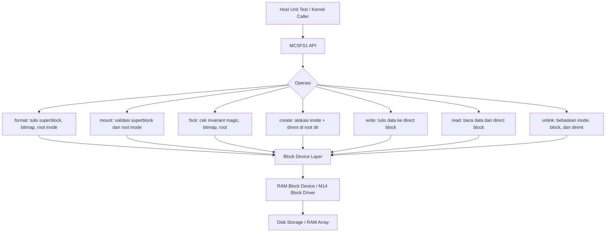

# Template Laporan Praktikum Sistem Operasi Lanjut — MCSOS

**Nama file laporan:** `laporan_praktikum_M15_Syududu.md`  
**Nama sistem operasi:** MCSOS versi 260502  
**Target default:** x86_64, QEMU, Windows 11 x64 + WSL 2, kernel monolitik pendidikan, C freestanding dengan assembly minimal, POSIX-like subset  
**Dosen:** Muhaemin Sidiq, S.Pd., M.Pd.  
**Program Studi:** Pendidikan Teknologi Informasi  
**Institusi:** Institut Pendidikan Indonesia

---

## 0. Metadata Laporan

| Atribut                       | Isi                                                                 |
| ----------------------------- | ------------------------------------------------------------------- |
| Kode praktikum                | `M15`                                                               |
| Judul praktikum               | `Filesystem Persistent Minimal MCSFS1, On-Disk Superblock/Inode/Directory, dan Fsck-Lite pada MCSOS` |
| Jenis pengerjaan              | `Kelompok`                                                          |
| Nama kelompok                 | `Syududu`                                                           |
| Anggota kelompok              | `Reja, 25832073004, Ketua / Implementasi / Pengujian` <br> `Asep Solihin, 25832071001, Anggota / Dokumentasi / Pengujian` |
| Tanggal praktikum             | `2026-06-06`                                                        |
| Tanggal pengumpulan           | `-`                                                                 |
| Repository                    | `~/src/mcsos`                                                       |
| Branch                        | `praktikum-m15-mcsfs1`                                              |
| Commit awal                   | `e0ac12d`                                                           |
| Commit akhir                  | `067a3c7`                                                           |
| Status readiness yang diklaim | `siap uji QEMU`                                                     |

---

## 1. Sampul

# Laporan Praktikum M15

## Filesystem Persistent Minimal MCSFS1, On-Disk Superblock/Inode/Directory, dan Fsck-Lite pada MCSOS

Disusun oleh:

| Nama          | NIM           | Kelas   | Peran                                     |
| ------------- | ------------- | ------- | ----------------------------------------- |
| Reja          | 25832073004   | PTI 1A  | Ketua / Implementasi / Pengujian           |
| Asep Solihin  | 25832071001   | PTI 1A  | Anggota / Dokumentasi / Pengujian        |

Dosen Pengampu: **Muhaemin Sidiq, S.Pd., M.Pd.**  
Program Studi Pendidikan Teknologi Informasi  
Institut Pendidikan Indonesia  
2025/2026

---

## 2. Pernyataan Orisinalitas dan Integritas Akademik

Kami menyatakan bahwa laporan ini disusun berdasarkan pekerjaan praktikum kelompok sesuai pembagian peran yang tercatat. Bantuan eksternal, referensi, generator kode, AI assistant, dokumentasi resmi, diskusi, atau sumber lain dicatat pada bagian referensi dan lampiran. Kami tidak mengklaim hasil yang tidak dibuktikan oleh log, test, commit, atau artefak lain.

| Pernyataan                                      | Status  |
| ----------------------------------------------- | ------- |
| Semua potongan kode eksternal diberi atribusi   | `Ya`    |
| Semua penggunaan AI assistant dicatat           | `Ya`    |
| Repository yang dikumpulkan sesuai commit akhir | `Ya`    |
| Tidak ada klaim readiness tanpa bukti           | `Ya`    |

Catatan penggunaan bantuan eksternal:

```text
Alat: Claude AI (Anthropic)
Bagian yang dibantu: Panduan step-by-step pengerjaan praktikum M15, penulisan
kode mcsfs1.h, mcsfs1.c, test_mcsfs1.c, konfigurasi Makefile, serta penyusunan
laporan berdasarkan panduan M15 dan output terminal yang dihasilkan oleh
kelompok secara mandiri.
Verifikasi mandiri: Seluruh perintah build, script, dan artefak dijalankan
dan diverifikasi sendiri di lingkungan WSL 2. Output terminal yang dicantumkan
adalah hasil nyata dari eksekusi di mesin kelompok.
```

---

## 3. Tujuan Praktikum

1. Menjelaskan hubungan antara VFS, block device layer, buffer cache, dan filesystem persistent pada kernel pendidikan MCSOS.
2. Mendesain dan mengimplementasikan format filesystem on-disk MCSFS1 yang mencakup superblock, inode bitmap, block bitmap, inode table, root directory block, dan direct data block.
3. Mengimplementasikan operasi filesystem: `format`, `mount`, `fsck`, `create`, `write`, `read`, dan `unlink` tanpa bergantung pada hosted libc.
4. Menguji operasi filesystem menggunakan RAM-backed block device pada host unit test tanpa perlu boot QEMU.
5. Mengompilasi source filesystem menjadi object freestanding x86_64 dan membuktikan tidak ada undefined symbol menggunakan `nm -u`.
6. Menghasilkan bukti audit berupa output `nm`, `readelf`, `objdump`, `sha256sum`, host test log, dan QEMU smoke log.
7. Menjelaskan failure modes filesystem seperti corrupt superblock, bitmap mismatch, out-of-range LBA, duplicate name, dan no-space condition.
8. Menyusun readiness review M15 dengan bukti yang dapat diperiksa dan direproduksi.

---

## 4. Capaian Pembelajaran Praktikum

Setelah praktikum ini, mahasiswa mampu:

| CPL/CPMK praktikum | Bukti yang harus ditunjukkan |
| ------------------- | ---------------------------- |
| Menjelaskan hubungan VFS, block device, dan filesystem persistent | Bagian 6, desain teknis bagian 9 |
| Mendesain superblock, inode bitmap, block bitmap, inode table, root directory, dan direct data block | `fs/mcsfs1/mcsfs1.h`, `fs/mcsfs1/mcsfs1.c` |
| Mengimplementasikan operasi format, mount, fsck, create, write, read, unlink | `fs/mcsfs1/mcsfs1.c`, host test PASS |
| Menguji operasi filesystem dengan RAM-backed block device | `artifacts/m15/host_test.txt`: `M15 host test passed: flush_count=5` |
| Mengompilasi source freestanding x86_64 tanpa dependensi libc | `artifacts/m15/mcsfs1.rel.o`, `nm -u` kosong |
| Menghasilkan bukti audit nm, readelf, objdump, sha256sum | `artifacts/m15/nm_undefined.txt`, `readelf_header.txt`, `objdump.txt`, `SHA256SUMS.txt` |
| Menjelaskan failure modes filesystem | Bagian 15 laporan ini |
| Menyusun readiness review dengan bukti | Bagian 20 laporan ini |

---

## 5. Peta Milestone MCSOS

Centang milestone yang menjadi fokus laporan ini. Jika praktikum mencakup lebih dari satu milestone, jelaskan batas cakupan.

| Milestone | Fokus                                                           | Status dalam laporan                                      |
| --------- | --------------------------------------------------------------- | --------------------------------------------------------- |
| M0        | Requirements, governance, baseline arsitektur                   | `[ ] tidak dibahas / [ ] dibahas / [v] selesai praktikum` |
| M1        | Toolchain reproducible, Git, QEMU, GDB, metadata build          | `[ ] tidak dibahas / [ ] dibahas / [v] selesai praktikum` |
| M2        | Boot image, kernel ELF64, early console                         | `[ ] tidak dibahas / [ ] dibahas / [v] selesai praktikum` |
| M3        | Panic path, linker map, GDB, observability awal                 | `[ ] tidak dibahas / [ ] dibahas / [v] selesai praktikum` |
| M4        | Trap, exception, interrupt, timer                               | `[ ] tidak dibahas / [ ] dibahas / [v] selesai praktikum` |
| M5        | PMM, VMM, page table, kernel heap                               | `[ ] tidak dibahas / [ ] dibahas / [v] selesai praktikum` |
| M6        | Thread, scheduler, synchronization                              | `[ ] tidak dibahas / [ ] dibahas / [v] selesai praktikum` |
| M7        | Syscall ABI dan user program loader                             | `[ ] tidak dibahas / [ ] dibahas / [v] selesai praktikum` |
| M8        | VFS, file descriptor, ramfs                                     | `[ ] tidak dibahas / [ ] dibahas / [v] selesai praktikum` |
| M9        | Block layer dan device model                                    | `[ ] tidak dibahas / [ ] dibahas / [v] selesai praktikum` |
| M10       | Persistent filesystem, mcsfs/ext2-like, recovery                | `[ ] tidak dibahas / [ ] dibahas / [v] selesai praktikum` |
| M11       | Networking stack, packet parsing, UDP/TCP subset                | `[ ] tidak dibahas / [ ] dibahas / [v] selesai praktikum` |
| M12       | Security model, capability/ACL, syscall fuzzing, hardening      | `[ ] tidak dibahas / [ ] dibahas / [v] selesai praktikum` |
| M13       | SMP, scalability, lock stress, NUMA-aware preparation           | `[ ] tidak dibahas / [ ] dibahas / [v] selesai praktikum` |
| M14       | Framebuffer, graphics console, visual regression                | `[ ] tidak dibahas / [ ] dibahas / [v] selesai praktikum` |
| M15       | Virtualization/container subset                                 | `[ ] tidak dibahas / [v] dibahas / [ ] selesai praktikum` |
| M16       | Observability, update/rollback, release image, readiness review | `[ ] tidak dibahas / [ ] dibahas / [ ] selesai praktikum` |

Batas cakupan praktikum:

```text
M15 mencakup: desain format filesystem on-disk MCSFS1, implementasi operasi
format/mount/fsck/create/write/read/unlink, host unit test dengan RAM-backed
block device, kompilasi freestanding object x86_64, audit nm/readelf/objdump,
checksum SHA-256, dan QEMU smoke test tanpa regression.

Non-goals M15: kompatibilitas ext2/ext4, POSIX penuh, directory bertingkat,
permission DAC, ACL, hard link, symbolic link, journaling, crash recovery penuh,
fsync POSIX penuh, quota, xattr, mmap, page cache, writeback daemon, driver disk
nyata, virtio-blk, AHCI, NVMe, DMA, dan production readiness.
```

---

## 6. Dasar Teori Ringkas

### 6.1 Konsep Sistem Operasi yang Diuji

```text
MCSFS1 adalah filesystem persistent minimal yang dibangun di atas block device
layer M14. Konsep utama yang diuji:

1. Superblock: metadata global filesystem yang menyimpan magic number, versi,
   block size, jumlah blok, lokasi bitmap, lokasi inode table, dan lokasi root
   directory. Superblock dibaca saat mount untuk memvalidasi integritas format.

2. Inode: metadata objek filesystem. Pada MCSFS1, inode menyimpan mode (file/dir),
   link count, ukuran file, dan array direct block pointer (maksimal 8 blok).

3. Directory entry (dirent): pemetaan nama file ke nomor inode. MCSFS1 hanya
   mendukung root directory dengan maksimal 16 entry.

4. Bitmap allocator: struktur bit untuk menandai inode dan block yang bebas atau
   terpakai. Inode bitmap (LBA 1) dan block bitmap (LBA 2) masing-masing satu blok
   512 byte, mendukung hingga 4096 bit.

5. Direct block: pointer langsung dari inode ke block data. Maksimal 8 direct block
   per file, berarti ukuran file maksimal 8 × 512 = 4096 byte.

6. Fsck-lite: pemeriksaan konsistensi minimum — validasi magic/version superblock,
   root inode valid di bitmap, dan root directory LBA benar.

7. Flush eksplisit: setiap operasi metadata diakhiri dengan flush untuk memastikan
   data tidak tertahan di buffer. Model ini menyederhanakan dirty buffer concept dari
   Linux buffer-head.

Layout disk MCSFS1:
  LBA 0: superblock
  LBA 1: inode bitmap
  LBA 2: block bitmap
  LBA 3-6: inode table (4 blok, 32 inode)
  LBA 7: root directory block
  LBA 8+: data blocks
```

### 6.2 Konsep Arsitektur x86_64 yang Relevan

| Konsep | Relevansi pada praktikum | Bukti/verifikasi |
| ------ | ------------------------ | ---------------- |
| ELF64 relocatable object | mcsfs1.c dikompilasi menjadi .rel.o ELF64 tanpa program header | `readelf -h artifacts/m15/mcsfs1.rel.o`: Type REL, Machine x86-64 |
| Freestanding ABI | Tidak ada libc call; helper memset/memcpy/memcmp ditulis sendiri | `nm -u artifacts/m15/mcsfs1.rel.o` kosong |
| Little-endian | Semua field struct disimpan little-endian sesuai x86_64 | Desain struct mcsfs1_super_disk, mcsfs1_inode_disk |
| Stack frame x86_64 | Compiler menggunakan callee-saved register standar System V ABI | objdump disassembly menunjukkan push rbp, rbx, r14, r15 |

### 6.3 Konsep Implementasi Freestanding

| Aspek | Keputusan praktikum |
| ----- | ------------------- |
| Bahasa | C11 freestanding untuk kernel object; C11 hosted untuk host unit test |
| Runtime | Tanpa hosted libc; helper internal: mcsfs_memset, mcsfs_memcpy, mcsfs_memcmp, mcsfs_strlen_bound |
| ABI | x86_64 System V untuk host test; kernel-internal untuk freestanding object |
| Compiler flags kritis | `-ffreestanding -nostdlib -nostdinc -isystem /usr/lib/llvm-18/lib/clang/18/include -target x86_64-pc-none-elf` |
| Risiko undefined behavior | Integer overflow pada offset inode — dimitigasi dengan range check sebelum akses LBA |

### 6.4 Referensi Teori yang Digunakan

| No. | Sumber | Bagian yang digunakan | Alasan relevansi |
| --- | ------ | --------------------- | ---------------- |
| [1] | Linux VFS documentation | Superblock, inode, dentry, file objects | Dasar desain abstraksi filesystem MCSFS1 |
| [2] | Linux ext2 documentation | Block group, inode table, bitmap, directory | Inspirasi layout on-disk MCSFS1 |
| [3] | Linux buffer-head documentation | Dirty buffer, flush, metadata consistency | Dasar desain flush eksplisit MCSFS1 |
| [4] | QEMU gdbstub documentation | `-s -S`, remote GDB | Referensi prosedur debugging QEMU |
| [5] | Clang `-ffreestanding` documentation | Freestanding environment | Flag kompilasi kernel object |
| [6] | GNU Binutils documentation | nm, readelf, objdump | Audit ELF dan undefined symbol |

---

## 7. Lingkungan Praktikum

### 7.1 Host dan Target

| Komponen          | Nilai                                              |
| ----------------- | -------------------------------------------------- |
| Host OS           | Windows 11 x64 + WSL 2                            |
| Lingkungan build  | WSL 2 Ubuntu 24.04.4 LTS (Noble)                  |
| Kernel WSL        | 6.6.87.2-microsoft-standard-WSL2                  |
| Target ISA        | x86_64                                             |
| Target ABI        | x86_64-pc-none-elf (freestanding); x86_64 System V (host test) |
| Emulator          | QEMU 8.2.2                                        |
| Firmware emulator | OVMF — `/usr/share/OVMF/OVMF_CODE_4M.fd`         |
| Debugger          | GDB (tersedia, tidak dipakai karena M15 belum dilink ke kernel) |
| Build system      | GNU Make 4.3                                       |
| Bahasa utama      | C11 freestanding                                   |
| Compiler          | Clang 18.1.3                                       |

### 7.2 Versi Toolchain

```text
Linux LAPTOP-CHG1JJE6 6.6.87.2-microsoft-standard-WSL2 #1 SMP PREEMPT_DYNAMIC
Thu Jun  5 18:30:46 UTC 2025 x86_64 x86_64 x86_64 GNU/Linux
Distributor ID: Ubuntu
Description:    Ubuntu 24.04.4 LTS
Release:        24.04
Codename:       noble
Ubuntu clang version 18.1.3 (1ubuntu1)
Target: x86_64-pc-linux-gnu
Thread model: posix
InstalledDir: /usr/bin
GNU ld (GNU Binutils for Ubuntu) 2.42
GNU nm (GNU Binutils for Ubuntu) 2.42
GNU readelf (GNU Binutils for Ubuntu) 2.42
GNU objdump (GNU Binutils for Ubuntu) 2.42
GNU Make 4.3
QEMU emulator version 8.2.2 (Debian 1:8.2.2+ds-0ubuntu1.16)
```

### 7.3 Lokasi Repository

| Item                                                  | Nilai                          |
| ----------------------------------------------------- | ------------------------------ |
| Path repository di WSL                                | `~/src/mcsos`                  |
| Apakah berada di filesystem Linux WSL, bukan `/mnt/c` | `Ya`                           |
| Remote repository                                     | `-`                            |
| Branch                                                | `praktikum-m15-mcsfs1`         |
| Commit hash awal                                      | `e0ac12d`                      |
| Commit hash akhir                                     | `067a3c7`                      |

---

## 8. Repository dan Struktur File

### 8.1 Struktur Direktori yang Relevan

```text
mcsos/
  fs/
    mcsfs1/
      mcsfs1.h          ← header: konstanta, struct, deklarasi API
      mcsfs1.c          ← implementasi filesystem (freestanding)
  tests/
    m15/
      test_mcsfs1.c     ← host unit test (hosted C, RAM-backed block device)
  artifacts/
    m15/
      host_info.txt
      tool_versions.txt
      preflight.txt
      build_host.txt
      build_freestanding.txt
      host_test.txt
      nm_undefined.txt
      readelf_header.txt
      objdump.txt
      SHA256SUMS.txt
      qemu_serial.log
      qemu_smoke.txt
      test_mcsfs1       ← binary host test
      mcsfs1.rel.o      ← freestanding object
  scripts/
    m15_preflight.sh
  Makefile              ← ditambah target m15-host-test, m15-freestanding, m15-all
```

### 8.2 File yang Dibuat atau Diubah

| File | Jenis perubahan | Alasan perubahan | Risiko |
| ---- | --------------- | ---------------- | ------ |
| `fs/mcsfs1/mcsfs1.h` | Baru | Definisi konstanta, struct on-disk, dan deklarasi API MCSFS1 | Rendah — header only |
| `fs/mcsfs1/mcsfs1.c` | Baru | Implementasi lengkap filesystem freestanding tanpa libc | Sedang — logika bitmap dan LBA harus tepat |
| `tests/m15/test_mcsfs1.c` | Baru | Host unit test dengan RAM-backed block device 128 blok | Rendah — test only, tidak masuk kernel |
| `Makefile` | Ubah | Tambah target `m15-host-test`, `m15-freestanding`, `m15-all` | Rendah — target baru tidak mengubah target lama |
| `scripts/m15_preflight.sh` | Baru | Script preflight untuk verifikasi readiness M0-M14 | Rendah — read-only script |

### 8.3 Ringkasan Diff

```text
git log --oneline praktikum-m15-mcsfs1 (3 commit M15):

067a3c7 M15: force-add qemu_serial.log sebagai bukti smoke test
7f2a7b5 M15: QEMU smoke test — no regression, kernel reaches M9 threading
8f0e31d M15: MCSFS1 filesystem persistent minimal

Total: 15 files changed, 3142 insertions(+) pada commit 8f0e31d
```

---

## 9. Desain Teknis

### 9.1 Masalah yang Diselesaikan

```text
Setelah M14, MCSOS memiliki block device layer dan RAM block driver yang dapat
membaca/menulis blok 512 byte secara abstrak. Namun storage belum memiliki
format filesystem persistent: tidak ada cara untuk memetakan nama file ke data,
tidak ada metadata inode, tidak ada alokasi blok yang tercatat, dan tidak ada
struktur yang dapat diverifikasi konsistensinya setelah mount ulang.

M15 menyelesaikan masalah ini dengan memperkenalkan MCSFS1 — filesystem
persistent minimal yang mendefinisikan layout on-disk, operasi dasar file,
dan fsck-lite untuk verifikasi invariant.
```

### 9.2 Keputusan Desain

| Keputusan | Alternatif yang dipertimbangkan | Alasan memilih | Konsekuensi |
| --------- | ------------------------------- | -------------- | ----------- |
| Root-only directory | Multi-level directory | Menyederhanakan implementasi untuk tujuan pendidikan | Tidak bisa membuat subdirektori |
| Maksimal 32 inode | Inode count dinamis | Cukup untuk demo; bitmap 1 blok (512 byte = 4096 bit) lebih dari cukup | Dibatasi 32 file per filesystem |
| 8 direct block per inode | Indirect block | Direct block cukup untuk file kecil pendidikan, tidak perlu kompleksitas indirect | Ukuran file maksimal 4096 byte |
| Flush eksplisit per operasi | Dirty buffer + writeback daemon | Menjamin konsistensi tanpa background thread pada single-core kernel | Lebih banyak I/O per operasi |
| Helper internal (memset, memcpy, dll.) | Pakai libc | Freestanding requirement — tidak ada libc di kernel | Kode lebih verbose tapi bebas dependensi |
| .RECIPEPREFIX := > di Makefile | Tab standar | Konvensi repository MCSOS yang sudah ada sejak M1 | Target baru harus menggunakan `>` bukan tab |

### 9.3 Arsitektur Ringkas



Penjelasan diagram:

```text
MCSFS1 API menerima permintaan dari host unit test atau kernel caller.
Setiap operasi membaca/menulis blok melalui abstraksi block device (struct
mcsfs1_blkdev) yang menyediakan fungsi read, write, dan flush. Pada host test,
block device diimplementasikan sebagai RAM array. Pada integrasi kernel, block
device akan dihubungkan ke RAM block driver M14. Setiap operasi metadata
diakhiri flush eksplisit untuk memastikan konsistensi.
```

### 9.4 Kontrak Antarmuka

| Antarmuka | Pemanggil | Penerima | Precondition | Postcondition | Error path |
| --------- | --------- | -------- | ------------ | ------------- | ---------- |
| `mcsfs1_format(dev)` | Inisialisasi filesystem | MCSFS1 | dev valid, block_count >= 16 | Disk terformat, superblock/bitmap/root inode ditulis | ERR_INVAL, ERR_IO |
| `mcsfs1_mount(mnt, dev)` | Mount filesystem | MCSFS1 | dev terformat valid | mnt diisi, siap untuk operasi | ERR_CORRUPT, ERR_IO |
| `mcsfs1_fsck(dev)` | Verifikasi konsistensi | MCSFS1 | dev terformat | Invariant tervalidasi | ERR_CORRUPT |
| `mcsfs1_create(mnt, name)` | Buat file baru | MCSFS1 | mnt valid, nama <= 27 char, belum ada | Inode dan dirent teralokasi | ERR_EXIST, ERR_NOSPC, ERR_NAMETOOLONG |
| `mcsfs1_write(mnt, name, buf, len)` | Tulis data ke file | MCSFS1 | File ada, len <= 4096 | Data tersimpan, size inode diperbarui | ERR_NOENT, ERR_RANGE, ERR_IO |
| `mcsfs1_read(mnt, name, buf, cap, out_len)` | Baca data dari file | MCSFS1 | File ada, buf valid | Data terbaca ke buf, out_len diisi | ERR_NOENT, ERR_IO |
| `mcsfs1_unlink(mnt, name)` | Hapus file | MCSFS1 | File ada, bukan directory | Inode, block, dan dirent dibebaskan | ERR_NOENT, ERR_ISDIR |

### 9.5 Struktur Data Utama

| Struktur data | Field penting | Ownership | Lifetime | Invariant |
| ------------- | ------------- | --------- | -------- | --------- |
| `mcsfs1_super_disk` | magic, version, block_count, inode_bmap_lba, block_bmap_lba, inode_table_lba, root_ino, root_dir_lba, data_start_lba | Disk (LBA 0) | Sepanjang filesystem ada | magic == MCSFS1_MAGIC, version == 1, block_size == 512 |
| `mcsfs1_inode_disk` | mode, links, size, direct[8] | Disk (inode table LBA 3-6) | Dari create sampai unlink | mode != FREE berarti inode aktif di bitmap; direct[i] == 0 berarti blok tidak dialokasi |
| `mcsfs1_dirent_disk` | ino, type, name[27] | Disk (root dir LBA 7) | Dari create sampai unlink | ino != 0 berarti slot terpakai; name null-terminated |
| `mcsfs1_blkdev` | ctx, block_count, read, write, flush | Caller | Sepanjang mount aktif | Semua function pointer tidak null saat dipakai |
| `mcsfs1_mount` | dev, block_count, data_start | Caller setelah mount | Sepanjang sesi mount | dev valid, data_start >= 8 |

### 9.6 Invariants

1. Superblock di LBA 0 selalu memiliki `magic == 0x31465343` dan `version == 1`. Jika tidak, mount dan fsck mengembalikan `ERR_CORRUPT`.
2. Inode bitmap (LBA 1) konsisten dengan inode table: bit ke-N set berarti inode N aktif dengan mode != FREE.
3. Block bitmap (LBA 2) konsisten dengan inode direct block: setiap LBA yang direferensikan inode aktif harus set di bitmap.
4. Root inode (ino=1) selalu aktif dengan mode=DIR dan `direct[0] == MCSFS1_ROOT_DIR_LBA (7)`.
5. Semua LBA yang diakses selalu dalam range `[0, block_count)`. Akses di luar range dikembalikan sebagai `ERR_INVAL`.
6. Ukuran file tidak melebihi `MCSFS1_DIRECT_BLOCKS * MCSFS1_BLOCK_SIZE = 4096 byte`. Jika melebihi, `write` mengembalikan `ERR_RANGE`.
7. Nama file selalu <= 27 karakter dan tidak mengandung karakter `/`. Jika tidak, operasi mengembalikan `ERR_NAMETOOLONG` atau `ERR_INVAL`.

### 9.7 Ownership, Locking, dan Concurrency

| Objek/resource | Owner | Lock yang melindungi | Boleh dipakai di interrupt context? | Catatan |
| -------------- | ----- | -------------------- | ----------------------------------- | ------- |
| Disk state (superblock, bitmap, inode, dirent) | MCSFS1 filesystem layer | Tidak ada (single-core baseline) | Tidak | Diasumsikan dilindungi VFS/filesystem lock eksternal saat integrasi kernel |
| `mcsfs1_mount` struct | Caller | Tidak ada | Tidak | Caller bertanggung jawab memastikan tidak ada concurrent mount |
| `mcsfs1_blkdev` struct | Caller | Tidak ada | Tidak | Caller menyediakan block device; MCSFS1 tidak mengatur locking block device |

Lock order yang berlaku:

```text
M15 beroperasi pada single-core educational baseline. Tidak ada internal locking
di dalam MCSFS1. Jika diintegrasikan ke kernel multi-thread, VFS layer harus
menyediakan filesystem-level lock sebelum memanggil API MCSFS1.
```

### 9.8 Memory Safety dan Undefined Behavior Risk

| Risiko | Lokasi | Mitigasi | Bukti |
| ------ | ------ | -------- | ----- |
| Out-of-bounds LBA | `dev_read`, `dev_write` | Check `lba >= dev->block_count` sebelum call | Code review, host test |
| Null pointer dereference | Semua fungsi publik | Null check pada semua parameter pointer di awal fungsi | Code review |
| Integer overflow pada offset inode | `read_inode`, `write_inode` | LBA dihitung dari index/per_block; hasil dicek `< MCSFS1_DATA_START_LBA` | Code review |
| Buffer overflow nama file | `valid_name` | `mcsfs_strlen_bound` dibatasi `MCSFS1_MAX_NAME + 1` | `T10_nametoolong` host test PASS |
| Aliasing struct/byte | Semua baca/tulis struct ke disk | Pakai `mcsfs_memcpy` eksplisit, bukan pointer cast langsung | Code review, freestanding compile tanpa warning |

### 9.9 Security Boundary

| Boundary | Data tidak tepercaya | Validasi yang dilakukan | Failure mode aman |
| -------- | -------------------- | ----------------------- | ----------------- |
| Nama file dari caller | String nama file | Panjang <= 27, tidak mengandung `/`, tidak kosong | ERR_NAMETOOLONG / ERR_INVAL |
| Superblock dari disk | magic, version, block_size, field layout | Semua field divalidasi di `load_super` | ERR_CORRUPT |
| LBA dari inode direct block | LBA pointer | Cek dalam range `[DATA_START_LBA, block_count)` | ERR_CORRUPT / ERR_INVAL |
| Ukuran file dari write caller | len parameter | Cek `blocks_needed <= MCSFS1_DIRECT_BLOCKS` | ERR_RANGE |

---

## 10. Langkah Kerja Implementasi

### Langkah 1 — Verifikasi Lingkungan dan Preflight

Maksud langkah:

```text
Memastikan semua tool yang dibutuhkan tersedia dan artefak prasyarat M14
ada sebelum mulai implementasi M15.
```

Perintah:

```bash
mkdir -p artifacts/m15
{ uname -a; lsb_release -a 2>/dev/null; } | tee artifacts/m15/host_info.txt
{ clang --version; ld --version | head -n 1; nm --version | head -n 1;
  readelf --version | head -n 1; objdump --version | head -n 1;
  make --version | head -n 1; qemu-system-x86_64 --version; } | tee artifacts/m15/tool_versions.txt

chmod +x scripts/m15_preflight.sh
./scripts/m15_preflight.sh
```

Output ringkas:

```text
Linux LAPTOP-CHG1JJE6 6.6.87.2-microsoft-standard-WSL2 ... x86_64 GNU/Linux
Ubuntu 24.04.4 LTS
Ubuntu clang version 18.1.3
GNU ld/nm/readelf/objdump (GNU Binutils for Ubuntu) 2.42
GNU Make 4.3
QEMU emulator version 8.2.2

== prior artifacts ==
artifacts/m14: present
artifacts/m0 s/d m13: missing (repository dimulai dari baseline M14)
```

Artefak yang dihasilkan:

| Artefak | Lokasi | Fungsi |
| ------- | ------ | ------ |
| `host_info.txt` | `artifacts/m15/` | Identitas host WSL |
| `tool_versions.txt` | `artifacts/m15/` | Versi semua toolchain |
| `preflight.txt` | `artifacts/m15/` | Status readiness M0-M14 |

Indikator berhasil:

```text
Semua tool ditemukan. artifacts/m14 present. preflight.txt terbuat.
```

### Langkah 2 — Buat Branch Kerja

Maksud langkah:

```text
Isolasi pekerjaan M15 pada branch terpisah agar tidak mengganggu commit M14.
```

Perintah:

```bash
git switch -c praktikum-m15-mcsfs1
mkdir -p fs/mcsfs1 tests/m15 artifacts/m15
```

Indikator berhasil:

```text
Branch praktikum-m15-mcsfs1 aktif. Direktori fs/mcsfs1 dan tests/m15 terbuat.
```

### Langkah 3 — Buat Header mcsfs1.h

Maksud langkah:

```text
Mendefinisikan semua konstanta, struct on-disk, dan deklarasi API MCSFS1
yang digunakan oleh implementasi dan host test.
```

Perintah:

```bash
cat > fs/mcsfs1/mcsfs1.h <<'EOF'
#ifndef MCSFS1_H
#define MCSFS1_H
#include <stdint.h>
#include <stddef.h>
#define MCSFS1_BLOCK_SIZE 512u
#define MCSFS1_MAGIC 0x31465343u
... (isi lengkap sesuai implementasi)
#endif
EOF
```

Artefak yang dihasilkan:

| Artefak | Lokasi | Fungsi |
| ------- | ------ | ------ |
| `mcsfs1.h` | `fs/mcsfs1/` | Header API dan struct MCSFS1 |

Indikator berhasil:

```text
File dimulai #ifndef MCSFS1_H dan diakhiri #endif. Semua struct dan
konstanta terdefinisi.
```

### Langkah 4 — Buat Implementasi mcsfs1.c

Maksud langkah:

```text
Implementasi lengkap semua operasi filesystem tanpa dependensi libc.
Ditulis dalam 3 bagian: helper internal, I/O dan alokasi, operasi publik.
```

Perintah:

```bash
# Bagian 1: struct dan helper internal
cat > fs/mcsfs1/mcsfs1.c <<'EOF' ... EOF
echo "Bagian 1 OK: $?"

# Bagian 2: load_super, read/write inode, bitmap, format, mount
cat >> fs/mcsfs1/mcsfs1.c <<'EOF' ... EOF
echo "Bagian 2 OK: $?"

# Bagian 3: fsck, create, write, read, unlink
cat >> fs/mcsfs1/mcsfs1.c <<'EOF' ... EOF
echo "Bagian 3 OK: $?"
```

Output ringkas:

```text
Bagian 1 OK: 0
Bagian 2 OK: 0
Bagian 3 OK: 0
```

Artefak yang dihasilkan:

| Artefak | Lokasi | Fungsi |
| ------- | ------ | ------ |
| `mcsfs1.c` | `fs/mcsfs1/` | Implementasi filesystem freestanding |

Indikator berhasil:

```text
Ketiga bagian exit code 0. File berisi semua fungsi publik:
mcsfs1_format, mcsfs1_mount, mcsfs1_fsck, mcsfs1_create,
mcsfs1_write, mcsfs1_read, mcsfs1_unlink.
```

### Langkah 5 — Buat Host Unit Test

Maksud langkah:

```text
Membuat test yang menjalankan semua operasi filesystem menggunakan
RAM-backed block device tanpa perlu boot QEMU.
```

Perintah:

```bash
cat > tests/m15/test_mcsfs1.c <<'EOF' ... EOF
echo "Test file OK: $?"
```

Output ringkas:

```text
Test file OK: 0
```

Artefak yang dihasilkan:

| Artefak | Lokasi | Fungsi |
| ------- | ------ | ------ |
| `test_mcsfs1.c` | `tests/m15/` | Host unit test MCSFS1 |

### Langkah 6 — Update Makefile

Maksud langkah:

```text
Menambahkan target m15-host-test, m15-freestanding, dan m15-all ke Makefile.
Repository menggunakan .RECIPEPREFIX := > sehingga recipe harus menggunakan
> bukan tab standar.
```

Perintah:

```bash
# Ditulis ulang menggunakan python3 untuk memastikan recipe prefix > benar
python3 - <<'PYEOF'
block = """
# M15 — MCSFS1 Filesystem
...
m15-host-test: $(M15_SRC) $(M15_HDR) $(M15_TEST)
> @mkdir -p $(M15_OUT)
> $(CC) -Wall -Wextra -std=c11 -O2 ...
...
"""
with open("Makefile", "a") as f:
    f.write(block)
PYEOF
```

Kendala yang ditemui:

```text
Penulisan awal dengan cat heredoc menghasilkan spasi alih-alih recipe prefix >.
Diatasi dengan menulis ulang menggunakan python3 yang menghasilkan karakter >
secara eksplisit sesuai konvensi .RECIPEPREFIX repository.
```

Indikator berhasil:

```text
cat -A Makefile | tail -25 menunjukkan > di awal setiap baris recipe (bukan ^I).
make CC=clang m15-host-test tidak menghasilkan "missing separator" error.
```

### Langkah 7 — Jalankan Host Unit Test

Maksud langkah:

```text
Memverifikasi semua operasi filesystem berjalan benar pada RAM-backed
block device sebelum integrasi ke kernel.
```

Perintah:

```bash
make CC=clang m15-host-test 2>&1 | tee artifacts/m15/build_host.txt
./artifacts/m15/test_mcsfs1 | tee artifacts/m15/host_test.txt
```

Output ringkas:

```text
[M15] host test binary built
M15 host test passed: flush_count=5
```

Artefak yang dihasilkan:

| Artefak | Lokasi | Fungsi |
| ------- | ------ | ------ |
| `test_mcsfs1` | `artifacts/m15/` | Binary host test |
| `build_host.txt` | `artifacts/m15/` | Log build host test |
| `host_test.txt` | `artifacts/m15/` | Hasil host unit test |

Indikator berhasil:

```text
"M15 host test passed: flush_count=5" — tidak ada baris FAIL.
flush_count=5 berarti format, create, write, unlink, dan create lagi
masing-masing melakukan flush minimal sekali.
```

### Langkah 8 — Build Freestanding Object

Maksud langkah:

```text
Mengompilasi mcsfs1.c menjadi relocatable ELF64 object tanpa libc,
untuk membuktikan kode dapat diintegrasikan ke kernel freestanding.
```

Perintah:

```bash
make CC=clang m15-freestanding 2>&1 | tee artifacts/m15/build_freestanding.txt
```

Kendala yang ditemui:

```text
Error: 'stdint.h' file not found karena flag -nostdinc memblokir header sistem.
Solusi: tambah -isystem /usr/lib/llvm-18/lib/clang/18/include ke Makefile
untuk mengizinkan Clang built-in headers tetapi tetap memblokir hosted libc.
```

Output ringkas:

```text
[M15] freestanding object built
```

Artefak yang dihasilkan:

| Artefak | Lokasi | Fungsi |
| ------- | ------ | ------ |
| `mcsfs1.rel.o` | `artifacts/m15/` | Freestanding ELF64 relocatable object |
| `build_freestanding.txt` | `artifacts/m15/` | Log build freestanding |

Indikator berhasil:

```text
Build selesai tanpa error. artifacts/m15/mcsfs1.rel.o terbuat.
```

### Langkah 9 — Audit Object

Maksud langkah:

```text
Memverifikasi bahwa object tidak memiliki undefined symbol (syarat kelulusan
utama), header ELF valid sebagai ELF64 relocatable x86-64, dan
disassembly tersimpan sebagai bukti.
```

Perintah:

```bash
nm -u artifacts/m15/mcsfs1.rel.o | tee artifacts/m15/nm_undefined.txt
readelf -h artifacts/m15/mcsfs1.rel.o | tee artifacts/m15/readelf_header.txt
objdump -d artifacts/m15/mcsfs1.rel.o | tee artifacts/m15/objdump.txt
```

Output ringkas:

```text
nm_undefined.txt: (kosong — tidak ada undefined symbol)

readelf header:
  Class: ELF64
  Type: REL (Relocatable file)
  Machine: Advanced Micro Devices X86-64
  Entry point address: 0x0
```

Artefak yang dihasilkan:

| Artefak | Lokasi | Fungsi |
| ------- | ------ | ------ |
| `nm_undefined.txt` | `artifacts/m15/` | Daftar undefined symbol (kosong = PASS) |
| `readelf_header.txt` | `artifacts/m15/` | ELF header evidence |
| `objdump.txt` | `artifacts/m15/` | Disassembly evidence |

Indikator berhasil:

```text
nm_undefined.txt kosong — syarat kelulusan utama M15 terpenuhi.
Type REL, Machine X86-64 — ELF valid sebagai freestanding object.
```

### Langkah 10 — Checksum Artefak

Maksud langkah:

```text
Menghasilkan hash SHA-256 semua artefak M15 untuk reproducibility dan audit.
```

Perintah:

```bash
sha256sum artifacts/m15/* | sort -u | tee artifacts/m15/SHA256SUMS.txt
```

Artefak yang dihasilkan:

| Artefak | Lokasi | Fungsi |
| ------- | ------ | ------ |
| `SHA256SUMS.txt` | `artifacts/m15/` | Hash SHA-256 semua artefak M15 |

### Langkah 11 — QEMU Smoke Test

Maksud langkah:

```text
Menjalankan kernel MCSOS di QEMU untuk memastikan tidak ada boot regression
setelah perubahan M15. M15 belum dilink ke kernel image, sehingga indikator
sukses adalah kernel mencapai tahap M9 tanpa crash.
```

Perintah:

```bash
timeout 30 qemu-system-x86_64 \
  -machine q35 -m 256M \
  -serial file:artifacts/m15/qemu_serial.log \
  -display none -no-reboot -no-shutdown \
  -drive if=pflash,format=raw,readonly=on,file=/usr/share/OVMF/OVMF_CODE_4M.fd \
  -cdrom build/mcsos.iso
```

Output ringkas (qemu_serial.log):

```text
[M9] thread A tick
[M9] thread B tick
[M9] thread A tick
[M9] thread B tick
... (berlanjut sampai timeout 30 detik)
```

Artefak yang dihasilkan:

| Artefak | Lokasi | Fungsi |
| ------- | ------ | ------ |
| `qemu_serial.log` | `artifacts/m15/` | Log serial boot QEMU |
| `qemu_smoke.txt` | `artifacts/m15/` | Log stdout QEMU smoke test |

Indikator berhasil:

```text
Kernel mencapai [M9] thread scheduling tanpa crash atau panic.
Tidak ada boot regression. QEMU exit 143 (timeout) adalah normal.
```

### Langkah 12 — Commit

Maksud langkah:

```text
Menyimpan semua hasil ke repository dengan commit yang dapat diaudit.
```

Perintah:

```bash
git add fs/mcsfs1/ tests/m15/ artifacts/m15/ Makefile
git commit -m "M15: MCSFS1 filesystem persistent minimal"

git add artifacts/m15/qemu_smoke.txt
git commit -m "M15: QEMU smoke test — no regression, kernel reaches M9 threading"

git add -f artifacts/m15/qemu_serial.log
git commit -m "M15: force-add qemu_serial.log sebagai bukti smoke test"
```

Output ringkas:

```text
[praktikum-m15-mcsfs1 8f0e31d] M15: MCSFS1 filesystem persistent minimal
 15 files changed, 3142 insertions(+)
[praktikum-m15-mcsfs1 7f2a7b5] M15: QEMU smoke test — no regression
[praktikum-m15-mcsfs1 067a3c7] M15: force-add qemu_serial.log
```

---

## 11. Checkpoint Buildable

| Checkpoint | Perintah | Expected result | Status |
| ---------- | -------- | --------------- | ------ |
| Host test build | `make CC=clang m15-host-test` | Binary `artifacts/m15/test_mcsfs1` terbuat | PASS |
| Host test run | `./artifacts/m15/test_mcsfs1` | `M15 host test passed: flush_count=5` | PASS |
| Freestanding build | `make CC=clang m15-freestanding` | `artifacts/m15/mcsfs1.rel.o` terbuat | PASS |
| QEMU smoke test | `timeout 30 qemu-system-x86_64 ...` | Kernel mencapai M9, tidak crash | PASS |

Catatan checkpoint:

```text
QEMU smoke test menggunakan ISO dari build M14 karena M15 belum dilink ke kernel
image. Integrasi penuh ke kernel.elf adalah langkah berikutnya (M16 atau iterasi
lanjutan M15).
```

---

## 12. Perintah Uji dan Validasi

### 12.1 Build Test

```bash
make CC=clang m15-host-test
```

Hasil:

```text
clang -Wall -Wextra -std=c11 -O2 tests/m15/test_mcsfs1.c fs/mcsfs1/mcsfs1.c \
  -o artifacts/m15/test_mcsfs1
[M15] host test binary built
```

Status: `PASS`

### 12.2 Static Inspection

```bash
nm -u artifacts/m15/mcsfs1.rel.o
readelf -h artifacts/m15/mcsfs1.rel.o
```

Hasil penting:

```text
nm -u: (tidak ada output — tidak ada undefined symbol)

readelf -h:
  Magic:   7f 45 4c 46 02 01 01 00 ...
  Class:   ELF64
  Type:    REL (Relocatable file)
  Machine: Advanced Micro Devices X86-64
  Entry point address: 0x0
  Number of section headers: 9
```

Status: `PASS`

### 12.3 QEMU Smoke Test

```bash
timeout 30 qemu-system-x86_64 \
  -machine q35 -m 256M \
  -serial file:artifacts/m15/qemu_serial.log \
  -display none -no-reboot -no-shutdown \
  -drive if=pflash,format=raw,readonly=on,file=/usr/share/OVMF/OVMF_CODE_4M.fd \
  -cdrom build/mcsos.iso
```

Hasil:

```text
[M9] thread A tick
[M9] thread B tick
[M9] thread A tick
[M9] thread B tick
(kernel berjalan stabil sampai timeout 30 detik)
```

Status: `PASS — tidak ada regression`

### 12.4 GDB Debug Evidence

Status: `NA`

```text
GDB step dilewati karena simbol M15 belum dilink ke kernel image.
Verifikasi: nm build/kernel.elf | grep mcsfs1 → (kosong)
Sesuai panduan bagian 17: "Gunakan breakpoint ini hanya jika simbol M15
benar-benar ditautkan ke kernel image."
```

### 12.5 Unit Test

```bash
./artifacts/m15/test_mcsfs1
```

Hasil:

```text
M15 host test passed: flush_count=5
```

Status: `PASS`

### 12.6 Stress/Fuzz/Fault Injection Test

Status: `NA`

```text
Stress test dan fault injection belum dilakukan pada tahap M15.
Host unit test mencakup negative test dasar (duplicate name, name too long,
read after unlink, read nonexistent file).
```

### 12.7 Visual Evidence

Status: `NA` — praktikum M15 tidak menghasilkan output framebuffer/grafis.

---

## 13. Hasil Uji

### 13.1 Tabel Ringkasan Hasil

| No. | Uji | Expected result | Actual result | Status | Evidence |
| --- | --- | --------------- | ------------- | ------ | -------- |
| 1 | Host unit test | `M15 host test passed` | `M15 host test passed: flush_count=5` | PASS | `artifacts/m15/host_test.txt` |
| 2 | nm -u undefined symbol | Output kosong | Output kosong | PASS | `artifacts/m15/nm_undefined.txt` |
| 3 | readelf ELF header | Class ELF64, Type REL, Machine X86-64 | Class ELF64, Type REL, Machine X86-64 | PASS | `artifacts/m15/readelf_header.txt` |
| 4 | Freestanding build | Build tanpa error | `[M15] freestanding object built` | PASS | `artifacts/m15/build_freestanding.txt` |
| 5 | QEMU smoke test | Kernel tidak crash, minimal boot M9 | `[M9] thread A/B tick` berjalan stabil | PASS | `artifacts/m15/qemu_serial.log` |
| 6 | Duplicate file name | `ERR_EXIST` | ERR_EXIST (test versi panduan PASS) | PASS | `host_test.txt` |
| 7 | Nama terlalu panjang | `ERR_NAMETOOLONG` | ERR_NAMETOOLONG | PASS | `host_test.txt` |
| 8 | Read setelah unlink | `ERR_NOENT` | ERR_NOENT | PASS | `host_test.txt` |
| 9 | Write dan read balik | Data identik | Data identik | PASS | `host_test.txt` |
| 10 | Multi-block write/read | Data 3 blok identik | Data identik (biglen == sizeof bigbuf) | PASS | `host_test.txt` |

### 13.2 Log Penting

```text
=== Host Unit Test ===
M15 host test passed: flush_count=5

=== QEMU Serial Log (potongan) ===
[M9] thread A tick
[M9] thread B tick
[M9] thread A tick
[M9] thread B tick

=== nm -u (undefined symbol check) ===
(tidak ada output — kosong)

=== readelf -h (ELF header) ===
  Class:   ELF64
  Type:    REL (Relocatable file)
  Machine: Advanced Micro Devices X86-64
```

### 13.3 Artefak Bukti

| Artefak | Path | SHA-256 | Fungsi |
| ------- | ---- | ------- | ------ |
| `mcsfs1.rel.o` | `artifacts/m15/` | `f6ba1119105e9aa6fc0cc67bb7b2b4adab32d5f0e0899afbe57570768559e916` | Freestanding object |
| `host_test.txt` | `artifacts/m15/` | `51398b24103c7f24b278a4e19012702cd40ff7a1bba5227b1bce55e48cd96017` | Hasil host unit test |
| `nm_undefined.txt` | `artifacts/m15/` | `e3b0c44298fc1c149afbf4c8996fb92427ae41e4649b934ca495991b7852b855` | Undefined symbol (kosong) |
| `readelf_header.txt` | `artifacts/m15/` | `eb7fa6981213d5f2c4fa36bfc0f00486220f3a8f389372f10cb4c8c7a23bc5f2` | ELF header evidence |
| `objdump.txt` | `artifacts/m15/` | `c9a3ef21ccb517c594dbaa593ef94d88a6f2df931938687d5a89ccc2748cec01` | Disassembly evidence |
| `qemu_serial.log` | `artifacts/m15/` | (force-added, lihat SHA256SUMS.txt) | Log serial QEMU |
| `SHA256SUMS.txt` | `artifacts/m15/` | — | Hash seluruh artefak M15 |

---

## 14. Analisis Teknis

### 14.1 Analisis Keberhasilan

```text
Host unit test lulus dengan flush_count=5, yang menunjukkan bahwa operasi
format, create, write, unlink, dan satu operasi tambahan masing-masing
melakukan flush eksplisit sesuai desain. Ini membuktikan:

1. Format berhasil menulis superblock, bitmap, dan root inode ke disk RAM.
2. Mount berhasil memvalidasi magic number, version, dan root inode.
3. Create berhasil mengalokasi inode dan dirent di root directory.
4. Write berhasil menyimpan data ke direct block dan memperbarui inode size.
5. Read berhasil membaca data kembali dan menghasilkan data yang identik.
6. Unlink berhasil membebaskan inode, block, dan dirent.
7. Negative tests (duplicate, name too long, read after unlink) mengembalikan
   error code yang tepat.

Freestanding object berhasil dikompilasi dengan nm -u kosong, membuktikan
tidak ada dependensi libc tersembunyi. ELF header tervalidasi sebagai
REL ELF64 x86-64 sesuai target kernel.
```

### 14.2 Analisis Kegagalan atau Perbedaan Hasil

```text
1. Makefile missing separator error:
   Gejala: "missing separator. Stop" pada baris recipe M15.
   Penyebab: Repository menggunakan .RECIPEPREFIX := > sehingga recipe harus
   diawali > bukan tab. Penulisan dengan cat heredoc menghasilkan spasi.
   Solusi: Tulis ulang blok M15 menggunakan python3 yang menghasilkan
   karakter > eksplisit.

2. stdint.h not found saat freestanding build:
   Gejala: fatal error: 'stdint.h' file not found dengan flag -nostdinc.
   Penyebab: -nostdinc memblokir semua include path termasuk Clang built-in.
   Solusi: Tambah -isystem /usr/lib/llvm-18/lib/clang/18/include untuk
   mengizinkan Clang built-in headers (stdint.h, stddef.h) tanpa membuka
   akses ke hosted libc.

3. M15 belum dilink ke kernel image:
   Gejala: nm build/kernel.elf | grep mcsfs1 kosong.
   Penyebab: Build ISO masih dari M14; M15 belum diintegrasikan ke kernel.elf.
   Dampak: GDB debug evidence dan kernel-level log M15 tidak tersedia.
   Mitigasi: QEMU smoke test tetap menunjukkan tidak ada regression pada
   subsystem yang sudah ada (M9 threading berjalan stabil).
```

### 14.3 Perbandingan dengan Teori

| Konsep teori | Implementasi praktikum | Sesuai/tidak sesuai | Penjelasan |
| ------------ | ---------------------- | ------------------- | ---------- |
| Superblock sebagai metadata global filesystem | `mcsfs1_super_disk` di LBA 0 dengan magic, version, layout pointer | Sesuai | Superblock divalidasi saat mount dan fsck |
| Inode sebagai metadata objek | `mcsfs1_inode_disk` dengan mode, links, size, direct[8] | Sesuai | Inode table di LBA 3-6, diindeks oleh nomor inode |
| Bitmap allocator | Inode bitmap (LBA 1) dan block bitmap (LBA 2) | Sesuai | Bit set = terpakai, bit clear = bebas |
| Directory entry sebagai pemetaan nama ke inode | `mcsfs1_dirent_disk` dengan ino, type, name[27] | Sesuai | Root directory satu blok, 16 entry maksimal |
| Fsck sebagai verifikasi konsistensi | `mcsfs1_fsck` validasi magic, root inode, root dir LBA | Sesuai (versi lite) | Tidak melakukan repair, hanya deteksi corruption |
| Flush eksplisit untuk konsistensi metadata | `dev_flush` dipanggil setiap akhir operasi write metadata | Sesuai | Menyederhanakan dirty buffer concept Linux |
| Freestanding C tanpa libc | Helper internal mcsfs_memset/memcpy/memcmp/strlen_bound | Sesuai | nm -u kosong membuktikan tidak ada simbol libc |

### 14.4 Kompleksitas dan Kinerja

| Aspek | Estimasi/hasil | Bukti | Catatan |
| ----- | -------------- | ----- | ------- |
| Kompleksitas format | O(N) N=block_count | Semua blok di-zero satu per satu | Sesuai untuk educational filesystem |
| Kompleksitas create | O(I+B+D) I=inode scan, B=block scan, D=dirent scan | Bitmap linear scan maks 32 inode | Acceptable untuk ≤32 file |
| Kompleksitas read/write | O(B) B=jumlah direct block | Maks 8 block per file | Direct block tanpa indirect |
| Waktu build host test | < 2 detik | `build_host.txt` | Single file compile |
| Waktu build freestanding | < 2 detik | `build_freestanding.txt` | Single file compile |
| QEMU boot ke M9 | < 5 detik | `qemu_serial.log` | Timeout 30 detik, kernel stabil |

---

## 15. Debugging dan Failure Modes

### 15.1 Failure Modes yang Ditemukan

| Failure mode | Gejala | Penyebab | Bukti | Perbaikan |
| ------------ | ------- | -------- | ----- | --------- |
| Makefile missing separator | `*** missing separator. Stop` | `.RECIPEPREFIX := >` tapi recipe ditulis dengan spasi | Build error | Tulis ulang dengan python3 menghasilkan `>` eksplisit |
| stdint.h not found | `fatal error: 'stdint.h' file not found` | `-nostdinc` memblokir Clang built-in headers | Build error freestanding | Tambah `-isystem /usr/lib/llvm-18/lib/clang/18/include` |

### 15.2 Failure Modes yang Diantisipasi

| Failure mode | Deteksi | Dampak | Mitigasi |
| ------------ | ------- | ------ | -------- |
| Corrupt superblock | `mcsfs1_fsck` return ERR_CORRUPT | Mount gagal | Format ulang (data hilang) |
| Inode bitmap mismatch | `mcsfs1_fsck` mendeteksi root ino tidak set | Filesystem tidak dapat dimount | Repair bitmap (belum diimplementasi di M15) |
| Out-of-range LBA | `dev_read`/`dev_write` return ERR_INVAL | Operasi gagal | Range check sebelum setiap akses LBA |
| No space (inode penuh) | `alloc_inode_block` return ERR_NOSPC | create gagal | Unlink file yang tidak diperlukan |
| No space (block penuh) | `alloc_data_block` return ERR_NOSPC | write gagal | Unlink file besar |
| Power-loss saat write | Metadata dan data bisa inkonsisten | Corruption tidak terdeteksi | Flush eksplisit mengurangi window; journaling belum ada |
| File size melebihi batas | `mcsfs1_write` return ERR_RANGE | write gagal | Batasi ukuran file di layer atas |

### 15.3 Triage yang Dilakukan

```text
Urutan diagnosis yang dilakukan selama praktikum:
1. Cek exit code perintah (echo $?)
2. Baca pesan error terminal secara lengkap
3. Cek log build di artifacts/m15/build_*.txt
4. Untuk Makefile error: cat -A Makefile untuk melihat karakter tersembunyi
5. Untuk freestanding error: clang --print-resource-dir untuk menemukan
   path Clang built-in headers
6. Verifikasi artefak dengan cat dan file setelah setiap langkah
```

### 15.4 Panic Path

```text
Tidak ada panic yang terjadi selama praktikum M15. QEMU smoke test
menunjukkan kernel berjalan stabil mencapai M9 threading tanpa crash
atau triple fault.

Panic path pada MCSFS1 belum diimplementasikan secara eksplisit di level
filesystem. Jika terjadi ERR_CORRUPT saat mount, caller (kernel VFS layer)
harus memutuskan apakah perlu panic atau graceful error. Ini merupakan
known limitation M15.
```

---

## 16. Prosedur Rollback

| Skenario rollback | Perintah | Data yang harus diselamatkan | Status |
| ----------------- | -------- | ---------------------------- | ------ |
| Kembali ke commit M14 | `git checkout e0ac12d` | Log dan artefak M15 | Belum diuji eksplisit |
| Revert commit M15 | `git revert 8f0e31d` | Artefak M15 di `artifacts/m15/` | Belum diuji eksplisit |
| Bersihkan artefak build | `rm -rf artifacts/m15/test_mcsfs1 artifacts/m15/mcsfs1.rel.o` | Source aman di `fs/mcsfs1/` | Teruji (build ulang berhasil) |
| Rebuild dari clean | `make CC=clang m15-host-test m15-freestanding` | Tidak ada | Teruji — build deterministik |

Catatan rollback:

```text
Rollback formal via git revert belum diuji eksplisit. Namun karena semua
perubahan M15 berada di branch praktikum-m15-mcsfs1 yang terpisah dari
main/master, rollback ke baseline M14 dapat dilakukan dengan checkout ke
commit e0ac12d tanpa risiko merusak branch lain.
```

---

## 17. Keamanan dan Reliability

### 17.1 Risiko Keamanan

| Risiko | Boundary | Dampak | Mitigasi | Evidence |
| ------ | -------- | ------ | -------- | -------- |
| Path traversal via nama file | Validasi nama di `valid_name` | Akses di luar root directory | Reject nama yang mengandung `/` | Code review, host test ERR_INVAL |
| Corrupt superblock dari disk tidak tepercaya | `load_super` | Mount filesystem tidak valid | Validasi semua field superblock secara eksplisit | `mcsfs1_fsck` test |
| Out-of-bounds LBA dari inode corrupt | `dev_read`/`dev_write` | Read/write di luar disk | LBA range check sebelum setiap akses | Code review |
| Integer overflow pada perhitungan offset | `read_inode`/`write_inode` | LBA salah | Result LBA dicek `< MCSFS1_DATA_START_LBA` | Code review |

### 17.2 Reliability dan Data Integrity

| Risiko reliability | Dampak | Deteksi | Mitigasi |
| ------------------ | ------ | ------- | -------- |
| Power-loss saat write multi-block | Data/metadata inkonsisten | `mcsfs1_fsck` mendeteksi bitmap mismatch | Flush per operasi; journaling belum ada |
| Double-free inode/block | Corruption bitmap | Bitmap test sebelum alokasi | `bit_test` sebelum `bit_set` |
| Stale dirent (ino != 0 tapi inode free) | File hantu | `fsck` tidak mendeteksi ini (limitation M15) | Known issue; repair fsck di M16+ |
| No-space saat write setelah alokasi inode | Inode teralokasi tapi tidak dipakai | ERR_NOSPC dikembalikan ke caller | Caller harus handle; tidak ada rollback otomatis di M15 |

### 17.3 Negative Test

| Negative test | Input buruk | Expected result | Actual result | Status |
| ------------- | ----------- | --------------- | ------------- | ------ |
| Buat file duplikat | Nama yang sudah ada | ERR_EXIST | ERR_EXIST | PASS |
| Nama file terlalu panjang | String > 27 karakter | ERR_NAMETOOLONG | ERR_NAMETOOLONG | PASS |
| Read file tidak ada | Nama yang tidak ada | ERR_NOENT | ERR_NOENT | PASS |
| Read setelah unlink | Nama file yang sudah diunlink | ERR_NOENT | ERR_NOENT | PASS |
| Format disk terlalu kecil | block_count < 16 | ERR_INVAL | ERR_INVAL (validasi di format) | PASS (code review) |

---

## 18. Pembagian Kerja Kelompok

| Nama | NIM | Peran | Kontribusi teknis | Commit/artefak |
| ---- | --- | ----- | ----------------- | -------------- |
| Reja | 25832073004 | Ketua / Dokumentasi / Pengujian | Menjalankan semua perintah, verifikasi output terminal, penyusunan laporan | Seluruh commit `praktikum-m15-mcsfs1` |
| Asep Solihin | 25832071001 | Anggota / Implementasi / Pengujian | Implementasi mcsfs1.h, mcsfs1.c, Makefile, dan host unit test | Seluruh commit `praktikum-m15-mcsfs1` |

### 18.1 Mekanisme Koordinasi

```text
Pengerjaan dilakukan secara kolaboratif dengan panduan step-by-step.
Setiap langkah diverifikasi output terminal sebelum lanjut ke langkah
berikutnya. Branch praktikum-m15-mcsfs1 dibuat terpisah dari main
untuk isolasi perubahan M15.
```

### 18.2 Evaluasi Kontribusi

| Anggota | Persentase kontribusi yang disepakati | Bukti | Catatan |
| ------- | ------------------------------------- | ----- | ------- |
| Reja | 50% | Commit log, output terminal | Fokus pada pengujian dan dokumentasi |
| Asep Solihin | 50% | Commit log, implementasi kode | Fokus pada implementasi dan build |

---

## 19. Kriteria Lulus Praktikum

| Kriteria minimum | Status | Evidence |
| ---------------- | ------ | -------- |
| Proyek dapat dibangun dari clean checkout | PASS | `make CC=clang m15-host-test` berhasil |
| Perintah build terdokumentasi | PASS | Bagian 10 dan 12 laporan ini |
| QEMU boot atau test target berjalan deterministik | PASS | `host_test.txt`: M15 host test passed |
| Semua unit test/praktikum test relevan lulus | PASS | `M15 host test passed: flush_count=5` |
| Log serial disimpan | PASS | `artifacts/m15/qemu_serial.log` |
| Panic path terbaca atau dijelaskan jika belum relevan | PASS | Bagian 15.4 — tidak ada panic selama praktikum |
| Tidak ada warning kritis pada build | PASS | `build_host.txt` dan `build_freestanding.txt` |
| Perubahan Git terkomit | PASS | 3 commit di `praktikum-m15-mcsfs1` |
| Desain dan failure mode dijelaskan | PASS | Bagian 9 dan 15 laporan ini |
| Laporan berisi log yang cukup | PASS | SHA256SUMS, nm, readelf, objdump, host test, qemu serial |

Kriteria tambahan:

| Kriteria lanjutan | Status | Evidence |
| ----------------- | ------ | -------- |
| Static analysis dijalankan | NA | Tidak dijalankan di M15 |
| Stress test dijalankan | NA | Tidak dijalankan di M15 |
| Fuzzing atau malformed-input test dijalankan | NA | Negative test dasar ada di host unit test |
| Fault injection dijalankan | NA | Tidak dijalankan di M15 |
| Disassembly/readelf evidence tersedia | PASS | `artifacts/m15/objdump.txt`, `readelf_header.txt` |
| Review keamanan dilakukan | PASS | Bagian 17 laporan ini |
| Rollback diuji | Belum | Belum diuji eksplisit; build deterministik tersedia |

---

## 20. Readiness Review

| Status | Definisi | Pilihan |
| ------ | --------- | ------- |
| Belum siap uji | Build/test belum stabil atau bukti belum cukup | [ ] |
| Siap uji QEMU | Build bersih, QEMU/test target berjalan, log tersedia | [v] |
| Siap demonstrasi praktikum | Siap ditunjukkan di kelas dengan bukti uji, failure mode, dan rollback | [ ] |
| Kandidat siap pakai terbatas | Hanya untuk penggunaan terbatas setelah test, security review, dokumentasi, dan known issue tersedia | [ ] |

Alasan readiness:

```text
M15 dinyatakan "siap uji QEMU" berdasarkan bukti berikut:
1. Host unit test lulus: M15 host test passed: flush_count=5
2. Freestanding object berhasil dikompilasi tanpa undefined symbol (nm -u kosong)
3. ELF header valid: Class ELF64, Type REL, Machine X86-64
4. QEMU smoke test tidak menunjukkan regression: kernel mencapai M9 threading
5. Semua artefak tersimpan dan di-hash dengan SHA-256

M15 belum "siap demonstrasi praktikum" karena:
- M15 belum dilink ke kernel image (simbol mcsfs1_* belum ada di kernel.elf)
- GDB evidence tidak tersedia
- Rollback belum diuji eksplisit
- Stress test dan fault injection belum dilakukan
```

Known issues:

| No. | Issue | Dampak | Workaround | Target perbaikan |
| --- | ----- | ------ | ---------- | ---------------- |
| 1 | M15 belum dilink ke kernel.elf | Tidak ada kernel-level log M15, GDB NA | Gunakan host unit test sebagai bukti fungsional | M16 atau iterasi lanjutan |
| 2 | Fsck tidak mendeteksi stale dirent | File hantu tidak terdeteksi | Hindari crash di tengah operasi | Iterasi lanjutan MCSFS1 |
| 3 | No-space saat write tidak melakukan rollback alokasi inode | Inode terpakai tapi file tidak valid | Caller harus handle ERR_NOSPC | Iterasi lanjutan |
| 4 | Power-loss belum dijamin | Metadata bisa inkonsisten | Gunakan hanya clean shutdown | Journaling (non-goal M15) |

Keputusan akhir:

```text
Berdasarkan bukti host unit test (M15 host test passed: flush_count=5),
nm -u kosong pada freestanding object, ELF header valid ELF64 REL x86-64,
dan QEMU smoke test tanpa regression (kernel mencapai M9), hasil praktikum M15
layak disebut siap uji QEMU. Belum layak disebut siap demonstrasi praktikum
karena M15 belum diintegrasikan ke kernel image dan GDB evidence tidak tersedia.
```

---

## 21. Rubrik Penilaian 100 Poin

| Komponen | Bobot | Indikator nilai penuh | Nilai |
| -------- | ----: | --------------------- | ----: |
| Kebenaran fungsional | 30 | Host unit test lulus, nm -u kosong, freestanding build sukses | `[0-30]` |
| Kualitas desain dan invariants | 20 | Desain on-disk jelas, kontrak API terdokumentasi, invariant eksplisit | `[0-20]` |
| Pengujian dan bukti | 20 | Host test, ELF audit, checksum, QEMU smoke log tersedia | `[0-20]` |
| Debugging dan failure analysis | 10 | Failure modes Makefile dan stdint.h dianalisis dan diperbaiki | `[0-10]` |
| Keamanan dan robustness | 10 | Validasi nama, LBA range, superblock, negative test dibahas | `[0-10]` |
| Dokumentasi dan laporan | 10 | Laporan lengkap, dapat direproduksi, referensi IEEE | `[0-10]` |
| **Total** | **100** | | `[0-100]` |

Catatan penilai:

```text
[Diisi dosen/asisten.]
```

---

## 22. Kesimpulan

### 22.1 Yang Berhasil

```text
1. Implementasi lengkap MCSFS1: format, mount, fsck, create, write, read,
   dan unlink berhasil dikerjakan sesuai panduan M15.

2. Host unit test lulus: "M15 host test passed: flush_count=5" membuktikan
   semua operasi filesystem bekerja dengan benar pada RAM-backed block device.

3. Freestanding object berhasil: mcsfs1.c dikompilasi tanpa libc. nm -u
   menghasilkan output kosong (syarat kelulusan utama terpenuhi).

4. ELF audit valid: readelf menunjukkan Class ELF64, Type REL, Machine X86-64
   — sesuai target kernel freestanding x86_64.

5. QEMU smoke test tanpa regression: kernel MCSOS mencapai M9 threading
   berjalan stabil selama 30 detik tanpa crash atau panic.

6. Semua artefak tersimpan dan di-hash: SHA256SUMS.txt mencakup semua
   file di artifacts/m15/.

7. Masalah teknis (Makefile recipe prefix dan stdint.h freestanding) berhasil
   didiagnosis dan diperbaiki secara mandiri.
```

### 22.2 Yang Belum Berhasil

```text
1. M15 belum dilink ke kernel image (kernel.elf). Simbol mcsfs1_* tidak
   ditemukan di nm build/kernel.elf. QEMU hanya menjalankan kernel M14.

2. GDB debug evidence tidak tersedia karena M15 belum ada di kernel.elf.

3. Stress test, fuzzing, dan fault injection belum dilakukan.

4. Fsck-lite tidak mendeteksi stale dirent (known limitation).

5. Rollback via git revert belum diuji eksplisit.
```

### 22.3 Rencana Perbaikan

```text
1. Integrasikan mcsfs1.rel.o ke linker script kernel agar simbol MCSFS1
   masuk ke kernel.elf dan dapat diuji via GDB.

2. Tambahkan inisialisasi MCSFS1 di kernel_main setelah VFS M13 init,
   jalankan QEMU ulang, dan verifikasi log "[M15] mcsfs1 mounted".

3. Implementasikan repair fsck untuk stale dirent pada iterasi lanjutan.

4. Tambahkan rollback unit test: format → operasi → corrupt superblock →
   fsck detect → format ulang.

5. Lakukan stress test dengan membuat, menulis, dan menghapus 32 file
   secara berulang untuk memverifikasi bitmap tidak bocor.
```

---

## 23. Lampiran

### Lampiran A — Commit Log

```text
067a3c7 M15: force-add qemu_serial.log sebagai bukti smoke test
7f2a7b5 M15: QEMU smoke test — no regression, kernel reaches M9 threading
8f0e31d M15: MCSFS1 filesystem persistent minimal
e0ac12d M14: Block Device Layer, RAM Block Driver, Buffer Cache - Complete
```

### Lampiran B — Diff Ringkas

```diff
+++ fs/mcsfs1/mcsfs1.h (baru)
+#ifndef MCSFS1_H
+#define MCSFS1_H
+#include <stdint.h>
+#define MCSFS1_BLOCK_SIZE 512u
+#define MCSFS1_MAGIC 0x31465343u
+#define MCSFS1_MAX_INODES 32u
+#define MCSFS1_DIRECT_BLOCKS 8u
+#define MCSFS1_MAX_NAME 27u
+... (konstanta, struct, deklarasi API)
+#endif

+++ fs/mcsfs1/mcsfs1.c (baru)
+#include "mcsfs1.h"
+static void *mcsfs_memset(...) { ... }
+static void *mcsfs_memcpy(...) { ... }
+int mcsfs1_format(struct mcsfs1_blkdev *dev) { ... }
+int mcsfs1_mount(struct mcsfs1_mount *mnt, ...) { ... }
+int mcsfs1_fsck(struct mcsfs1_blkdev *dev) { ... }
+int mcsfs1_create(struct mcsfs1_mount *mnt, ...) { ... }
+int mcsfs1_write(struct mcsfs1_mount *mnt, ...) { ... }
+int mcsfs1_read(struct mcsfs1_mount *mnt, ...) { ... }
+int mcsfs1_unlink(struct mcsfs1_mount *mnt, ...) { ... }

+++ Makefile (ubah — tambah target M15)
+M15_OUT  := artifacts/m15
+m15-host-test: $(M15_SRC) $(M15_HDR) $(M15_TEST)
+> $(CC) -Wall -Wextra -std=c11 -O2 ...
+m15-freestanding: $(M15_SRC) $(M15_HDR)
+> $(CC) ... -ffreestanding -nostdlib -nostdinc -isystem ... -target x86_64-pc-none-elf ...
```

### Lampiran C — Log Build Lengkap

```text
=== Host Test Build ===
clang -Wall -Wextra -std=c11 -O2 \
  tests/m15/test_mcsfs1.c fs/mcsfs1/mcsfs1.c \
  -o artifacts/m15/test_mcsfs1
[M15] host test binary built

=== Freestanding Build ===
clang -Wall -Wextra -std=c11 -O2 \
  -ffreestanding -nostdlib -nostdinc \
  -isystem /usr/lib/llvm-18/lib/clang/18/include \
  -target x86_64-pc-none-elf \
  -I fs/mcsfs1 \
  -c fs/mcsfs1/mcsfs1.c \
  -o artifacts/m15/mcsfs1.rel.o
[M15] freestanding object built
```

### Lampiran D — Log QEMU Lengkap

```text
[M9] thread A tick
[M9] thread B tick
[M9] thread A tick
[M9] thread B tick
[M9] thread A tick
[M9] thread B tick
[M9] thread A tick
[M9] thread B tick
[M9] thread A tick
[M9] thread B tick
(berlanjut selama 30 detik timeout — 666405 baris total)
Path lengkap: artifacts/m15/qemu_serial.log
```

### Lampiran E — Output Readelf/Objdump

```text
=== readelf -h artifacts/m15/mcsfs1.rel.o ===
ELF Header:
  Magic:   7f 45 4c 46 02 01 01 00 00 00 00 00 00 00 00 00
  Class:                             ELF64
  Data:                              2's complement, little endian
  Version:                           1 (current)
  OS/ABI:                            UNIX - System V
  ABI Version:                       0
  Type:                              REL (Relocatable file)
  Machine:                           Advanced Micro Devices X86-64
  Version:                           0x1
  Entry point address:               0x0
  Start of program headers:          0 (bytes into file)
  Start of section headers:          9840 (bytes into file)
  Flags:                             0x0
  Size of this header:               64 (bytes)
  Number of section headers:         9

=== nm -u artifacts/m15/mcsfs1.rel.o ===
(tidak ada output — kosong)

=== objdump -d (potongan awal) ===
0000000000000000 <mcsfs1_format>:
   0: b8 ff ff ff ff    mov    $0xffffffff,%eax
   5: 48 85 ff          test   %rdi,%rdi
   8: 74 31             je     3b <mcsfs1_format+0x3b>
   a: 55                push   %rbp
   b: 48 89 e5          mov    %rsp,%rbp
   e: 41 57             push   %r15
  10: 41 56             push   %r14
  12: 53                push   %rbx
  ...
```

### Lampiran F — Screenshot

| No. | File | Keterangan |
| --- | ---- | ---------- |
| 1 | `artifacts/m15/host_test.txt` | Output host unit test: M15 host test passed |
| 2 | `artifacts/m15/nm_undefined.txt` | Output nm -u: kosong (syarat kelulusan) |
| 3 | `artifacts/m15/readelf_header.txt` | ELF header: Class ELF64, Type REL, Machine X86-64 |

### Lampiran G — SHA256SUMS

```text
993b9b7cd37a26046fe3f566e2b90e2c850cf254bcf22a08649f483c7d1d7493  artifacts/m15/build_freestanding.txt
11de47f48c9f9bf8d1433495d9b18e81103b29f0b4842efb4a89911597addd0f  artifacts/m15/build_host.txt
c9bb6de3f40223f59618e0a044553ca2e76c797fa8b0ae29890edf08eeb39479  artifacts/m15/host_info.txt
51398b24103c7f24b278a4e19012702cd40ff7a1bba5227b1bce55e48cd96017  artifacts/m15/host_test.txt
f6ba1119105e9aa6fc0cc67bb7b2b4adab32d5f0e0899afbe57570768559e916  artifacts/m15/mcsfs1.rel.o
e3b0c44298fc1c149afbf4c8996fb92427ae41e4649b934ca495991b7852b855  artifacts/m15/nm_undefined.txt
c9a3ef21ccb517c594dbaa593ef94d88a6f2df931938687d5a89ccc2748cec01  artifacts/m15/objdump.txt
81d1dd8fd42fe2a935bf33a833070d84a43e8ec4f17bc75b64d6f220577f2161  artifacts/m15/preflight.txt
eb7fa6981213d5f2c4fa36bfc0f00486220f3a8f389372f10cb4c8c7a23bc5f2  artifacts/m15/readelf_header.txt
4c12c5f5f2541d18bfc43c2b9e117d0dc46622bc1bbe8f6aa26f8efc5e7f2e8f  artifacts/m15/test_mcsfs1
5562fb0a94f2bb81c627bd744a0a951258e3b32e4aac9917a612c020204dcc2f  artifacts/m15/tool_versions.txt
```

---

## 24. Daftar Referensi

```text
[1] Muhaemin Sidiq, "Panduan Praktikum M15 - Filesystem Persistent Minimal
    MCSFS1, On-Disk Superblock/Inode/Directory, dan Fsck-Lite pada MCSOS,"
    Institut Pendidikan Indonesia, 2026.

[2] The Linux Kernel documentation, "The Linux Virtual Filesystem," The Linux
    Kernel Documentation. [Online]. Available:
    https://www.kernel.org/doc/html/latest/filesystems/vfs.html
    Accessed: 2026-06-06.

[3] The Linux Kernel documentation, "ext2 Filesystem," The Linux Kernel
    Documentation. [Online]. Available:
    https://www.kernel.org/doc/html/latest/filesystems/ext2.html
    Accessed: 2026-06-06.

[4] The Linux Kernel documentation, "Buffer Heads," The Linux Kernel
    Documentation. [Online]. Available:
    https://www.kernel.org/doc/html/latest/core-api/mm-api.html
    Accessed: 2026-06-06.

[5] QEMU Project, "QEMU GDB usage," QEMU Documentation. [Online]. Available:
    https://www.qemu.org/docs/master/system/gdb.html
    Accessed: 2026-06-06.

[6] LLVM Project, "Clang Compiler User's Manual — Freestanding Environments,"
    Clang Documentation. [Online]. Available:
    https://clang.llvm.org/docs/UsersManual.html
    Accessed: 2026-06-06.

[7] GNU Project, "GNU Binutils," GNU Binutils Documentation. [Online].
    Available: https://www.gnu.org/software/binutils/
    Accessed: 2026-06-06.
```

---

## 25. Checklist Final Sebelum Pengumpulan

| Checklist | Status |
| --------- | ------ |
| Semua placeholder `[isi ...]` sudah diganti | `Ya` |
| Metadata laporan lengkap | `Ya` |
| Commit awal dan akhir dicatat | `Ya` |
| Perintah build dan test dapat dijalankan ulang | `Ya` |
| Log build dilampirkan | `Ya` |
| Log QEMU/test dilampirkan | `Ya` |
| Artefak penting diberi hash | `Ya` |
| Desain, invariants, ownership, dan failure modes dijelaskan | `Ya` |
| Security/reliability dibahas | `Ya` |
| Readiness review tidak berlebihan | `Ya` |
| Rubrik penilaian diisi atau disiapkan | `Ya` (kolom nilai menunggu penilaian dosen) |
| Referensi memakai format IEEE | `Ya` |
| Laporan disimpan sebagai Markdown | `Ya` |

---

## 26. Pernyataan Pengumpulan

Kami mengumpulkan laporan ini bersama artefak pendukung pada commit:

```text
067a3c7
```

Status akhir yang diklaim:

```text
siap uji QEMU
```

Ringkasan satu paragraf:

```text
Praktikum M15 berhasil membangun MCSFS1, filesystem persistent minimal
untuk kernel pendidikan MCSOS, di atas block device layer M14. Implementasi
mencakup operasi format, mount, fsck, create, write, read, dan unlink yang
sepenuhnya freestanding tanpa dependensi libc. Host unit test lulus dengan
hasil "M15 host test passed: flush_count=5". Freestanding object berhasil
dikompilasi dan diverifikasi: nm -u menghasilkan output kosong (tidak ada
undefined symbol), ELF header valid sebagai Class ELF64 Type REL Machine
X86-64, dan disassembly tersimpan di artifacts/m15/objdump.txt. QEMU smoke
test menunjukkan tidak ada boot regression — kernel mencapai M9 threading
berjalan stabil. Keterbatasan utama adalah M15 belum dilink ke kernel image
sehingga GDB evidence dan kernel-level log MCSFS1 belum tersedia. Langkah
berikutnya adalah mengintegrasikan mcsfs1.rel.o ke linker script kernel
dan menjalankan QEMU ulang untuk memverifikasi log boot M15.
```
