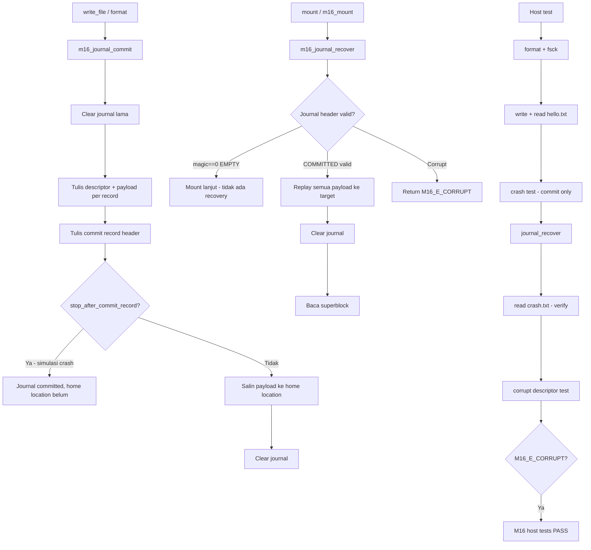

# Template Laporan Praktikum Sistem Operasi Lanjut — MCSOS

**Nama file laporan:** `laporan_praktikum_M16_Syududu.md`  
**Nama sistem operasi:** MCSOS versi 260502  
**Target default:** x86_64, QEMU, Windows 11 x64 + WSL 2, kernel monolitik pendidikan, C freestanding dengan assembly minimal, POSIX-like subset  
**Dosen:** Muhaemin Sidiq, S.Pd., M.Pd.  
**Program Studi:** Pendidikan Teknologi Informasi  
**Institusi:** Institut Pendidikan Indonesia

---

## 0. Metadata Laporan

| Atribut                       | Isi                                                                                          |
| ----------------------------- | -------------------------------------------------------------------------------------------- |
| Kode praktikum                | `M16`                                                                                        |
| Judul praktikum               | `Crash Consistency, Write-Ahead Journal, Recovery, dan Fault-Injection Test untuk MCSFS1J`  |
| Jenis pengerjaan              | `Kelompok`                                                                                   |
| Nama kelompok                 | `Syududu`                                                                                    |
| Anggota kelompok              | `Reja, 25832073004, Ketua / Dokumentasi / Pengujian` <br> `Asep Solihin, 25832071001, Anggota / Implementasi / Pengujian` |
| Tanggal praktikum             | `2026-06-07`                                                                                 |
| Tanggal pengumpulan           | `2026-06-14`                                                                                 |
| Repository                    | `~/src/mcsos`                                                                                |
| Branch                        | `praktikum-m16-journal-recovery`                                                             |
| Commit awal                   | `2a9d8ff`                                                                                    |
| Commit akhir                  | `3b06074`                                                                                    |
| Status readiness yang diklaim | `siap uji QEMU dan host fault-injection terbatas`                                            |

---

## 1. Sampul

# Laporan Praktikum M16

## Crash Consistency, Write-Ahead Journal, Recovery, dan Fault-Injection Test untuk MCSFS1J pada MCSOS

Disusun oleh:

| Nama          | NIM           | Kelas   | Peran                                     |
| ------------- | ------------- | ------- | ----------------------------------------- |
| Reja          | 25832073004   | PTI 1A  | Ketua / Dokumentasi / Pengujian           |
| Asep Solihin  | 25832071001   | PTI 1A  | Anggota / Implementasi / Pengujian        |

Dosen Pengampu: **Muhaemin Sidiq, S.Pd., M.Pd.**  
Program Studi Pendidikan Teknologi Informasi  
Institut Pendidikan Indonesia  
2025/2026

---

## 2. Pernyataan Orisinalitas dan Integritas Akademik

Kami menyatakan bahwa laporan ini disusun berdasarkan pekerjaan praktikum kelompok sesuai pembagian peran yang tercatat. Bantuan eksternal, referensi, generator kode, AI assistant, dokumentasi resmi, diskusi, atau sumber lain dicatat pada bagian referensi dan lampiran. Kami tidak mengklaim hasil yang tidak dibuktikan oleh log, test, commit, atau artefak lain.

| Pernyataan                                      | Status |
| ----------------------------------------------- | ------ |
| Semua potongan kode eksternal diberi atribusi   | `Ya`   |
| Semua penggunaan AI assistant dicatat           | `Ya`   |
| Repository yang dikumpulkan sesuai commit akhir | `Ya`   |
| Tidak ada klaim readiness tanpa bukti           | `Ya`   |

Catatan penggunaan bantuan eksternal:

```text
Alat: Claude AI (Anthropic)
Bagian yang dibantu: Panduan step-by-step pengerjaan praktikum M16, debugging
error heredoc pada source file, perbaikan Makefile (variabel SRC hilang), dan
penyusunan laporan berdasarkan panduan M16 dan output terminal kelompok.
Verifikasi mandiri: Seluruh perintah build, script, dan artefak dijalankan dan
diverifikasi sendiri di lingkungan WSL 2. Output terminal yang dicantumkan
adalah hasil nyata dari eksekusi di mesin kelompok. Host unit test, freestanding
compile, QEMU smoke test, dan GDB remote debug dijalankan dan diverifikasi
secara mandiri.
```

---

## 3. Tujuan Praktikum

1. Memahami masalah crash consistency pada filesystem tanpa journaling dan mengapa M15 (MCSFS1) rentan terhadap inkonsistensi metadata saat terjadi crash.
2. Mengimplementasikan write-ahead journal sederhana pada MCSFS1J dengan format header, descriptor, payload block, target LBA, checksum, dan sequence number.
3. Mengimplementasikan recovery journal saat mount: memeriksa commit record, memvalidasi descriptor dan checksum, lalu melakukan replay idempotent ke lokasi utama.
4. Menguji skenario crash setelah commit record tetapi sebelum home-location write dan membuktikan journal replay berhasil memulihkan filesystem.
5. Menguji skenario corrupt journal agar recovery gagal secara terkendali (fail-closed) tanpa menulis ke target yang tidak valid.
6. Mengompilasi source menjadi host binary dan freestanding object x86_64-elf tanpa undefined symbol, dibuktikan dengan `nm -u`, `readelf -h`, `objdump -dr`, dan `sha256sum`.
7. Menjalankan QEMU smoke test untuk membuktikan kernel boot tanpa regresi dari M15.
8. Menjalankan GDB remote debug untuk membuktikan kemampuan inspeksi register dan simbol kernel.
9. Menyusun readiness review M16 dengan evidence yang dapat diperiksa.

---

## 4. Capaian Pembelajaran Praktikum

Setelah praktikum ini, mahasiswa mampu:

| CPL/CPMK praktikum | Bukti yang harus ditunjukkan |
| ------------------- | ---------------------------- |
| Menjelaskan perbedaan clean shutdown, fsck-only recovery, journaling, commit record, checkpoint, replay, dan idempotence | Bagian 9 laporan ini, state machine journal |
| Mendesain format journal sederhana dengan header, descriptor, payload, target LBA, checksum, dan transaction sequence | `struct m16_journal_header`, `struct m16_journal_desc` dalam source |
| Mengimplementasikan replay journal pada mount sebelum filesystem digunakan | Fungsi `m16_journal_recover()` dalam `m16_mcsfs_journal.c` |
| Menguji crash setelah commit record dan sebelum home-location write | `m16_write_file_ex()` dengan flag `stop_after_commit_record=1`, host test PASS |
| Menguji corrupt journal agar recovery fail-closed | Modifikasi `dev.blocks[JOURNAL_START+1][0] ^= 0x7f`, return `M16_E_CORRUPT` |
| Mengompilasi freestanding object x86_64-elf tanpa undefined symbol | `nm_undefined.txt` kosong, `readelf_header.txt` menunjukkan ELF64 AMD X86-64 |
| Menjalankan QEMU smoke test | `logs/m16/qemu_serial.log` menunjukkan kernel boot dan threading M9 |
| Menjalankan GDB remote debug | Output `info registers` menunjukkan long mode aktif, `rip` di higher-half kernel |

---

## 5. Peta Milestone MCSOS

Centang milestone yang menjadi fokus laporan ini. Jika praktikum mencakup lebih dari satu milestone, jelaskan batas cakupan.

| Milestone | Fokus                                                           | Status dalam laporan                                      |
| --------- | --------------------------------------------------------------- | --------------------------------------------------------- |
| M0        | Requirements, governance, baseline arsitektur                   | `[ ] tidak dibahas / [ ] dibahas / [v] selesai praktikum` |
| M1        | Toolchain reproducible, Git, QEMU, GDB, metadata build          | `[ ] tidak dibahas / [ ] dibahas / [v] selesai praktikum` |
| M2        | Boot image, kernel ELF64, early console                         | `[ ] tidak dibahas / [ ] dibahas / [v] selesai praktikum` |
| M3        | Panic path, linker map, GDB, observability awal                 | `[ ] tidak dibahas / [ ] dibahas / [v] selesai praktikum` |
| M4        | Trap, exception, interrupt, timer                               | `[ ] tidak dibahas / [ ] dibahas / [v] selesai praktikum` |
| M5        | PMM, VMM, page table, kernel heap                               | `[ ] tidak dibahas / [ ] dibahas / [v] selesai praktikum` |
| M6        | Thread, scheduler, synchronization                              | `[ ] tidak dibahas / [ ] dibahas / [v] selesai praktikum` |
| M7        | Syscall ABI dan user program loader                             | `[ ] tidak dibahas / [ ] dibahas / [v] selesai praktikum` |
| M8        | VFS, file descriptor, ramfs                                     | `[ ] tidak dibahas / [ ] dibahas / [v] selesai praktikum` |
| M9        | Block layer dan device model                                    | `[ ] tidak dibahas / [ ] dibahas / [v] selesai praktikum` |
| M10       | Persistent filesystem, mcsfs/ext2-like, recovery                | `[ ] tidak dibahas / [ ] dibahas / [v] selesai praktikum` |
| M11       | Networking stack, packet parsing, UDP/TCP subset                | `[ ] tidak dibahas / [ ] dibahas / [v] selesai praktikum` |
| M12       | Security model, capability/ACL, syscall fuzzing, hardening      | `[ ] tidak dibahas / [ ] dibahas / [v] selesai praktikum` |
| M13       | SMP, scalability, lock stress, NUMA-aware preparation           | `[ ] tidak dibahas / [ ] dibahas / [v] selesai praktikum` |
| M14       | Framebuffer, graphics console, visual regression                | `[ ] tidak dibahas / [ ] dibahas / [v] selesai praktikum` |
| M15       | Virtualization/container subset                                 | `[ ] tidak dibahas / [v] dibahas / [ ] selesai praktikum` |
| M16       | Observability, update/rollback, release image, readiness review | `[ ] tidak dibahas / [ ] dibahas / [ ] selesai praktikum` |

Batas cakupan praktikum:

```text
M16 mencakup: implementasi MCSFS1J dengan write-ahead journal (header, descriptor,
payload, checksum, sequence), format(), mount() dengan recovery otomatis,
write_file() melalui journal, read_file(), fsck(), fault injection (crash setelah
commit record, corrupt descriptor), host unit test PASS, freestanding object audit
x86_64-elf, QEMU smoke test (kernel boot), GDB remote debug (info registers),
dan grading script 10/10 PASS.

Non-goals M16: kompatibilitas ext4/JBD2, delayed allocation, ordered mode penuh,
full-data journaling POSIX, fsync POSIX lengkap, multi-transaction concurrency,
checkpoint daemon, writeback cache kompleks, barrier/FUA perangkat nyata, disk
scheduler, AHCI/NVMe, journaling directory bertingkat, snapshot, copy-on-write,
encryption, quota, xattr, dan production readiness.
```

---

## 6. Dasar Teori Ringkas

### 6.1 Konsep Sistem Operasi yang Diuji

```text
M16 berfokus pada crash consistency dan write-ahead journal untuk filesystem
pendidikan MCSFS1J.

1. Crash Consistency: filesystem yang tidak menjamin atomicity pada operasi
   multi-blok dapat berada pada keadaan antara setelah crash — bitmap sudah
   berubah tetapi inode belum, atau directory entry menunjuk inode yang belum
   lengkap. Keadaan antara ini disebut inconsistent state.

2. Write-Ahead Journal (WAJ): teknik untuk menjamin crash consistency dengan
   cara menulis salinan blok target ke area journal terlebih dahulu bersama
   descriptor dan checksum, lalu menulis commit record. Pada mount berikutnya
   setelah crash, recovery dapat melakukan replay transaksi yang sudah committed.

3. Commit Record: blok yang menandai transaksi sebagai durable. Crash sebelum
   commit record tidak dijanjikan durable (diabaikan pada recovery). Crash setelah
   commit record dapat direplay secara idempotent.

4. Idempotence: sifat operasi yang menghasilkan state sama meskipun dijalankan
   berulang kali. Replay journal harus idempotent agar aman dijalankan ulang
   jika terjadi crash saat recovery sendiri.

5. Fail-Closed: jika journal corrupt (checksum tidak cocok, magic salah, target
   LBA tidak valid), recovery harus menolak mount dengan error, bukan menulis
   payload ke target yang tidak tervalidasi.

6. fsck-lite: pemeriksaan konsistensi independen dari journal. Journal mempercepat
   recovery setelah crash pada transaksi committed; fsck-lite mendeteksi korupsi
   metadata, bitmap mismatch, stale inode, dan directory entry invalid.
```

### 6.2 Konsep Arsitektur x86_64 yang Relevan

| Konsep | Relevansi pada praktikum | Bukti/verifikasi |
| ------ | ------------------------ | ---------------- |
| Target triple `x86_64-elf` | Memastikan object freestanding tidak bergantung libc host | Flag `-target x86_64-elf` pada Makefile, output `readelf -h` |
| ELF64 Relocatable (REL) | Format object yang dapat di-link ke kernel | `readelf_header.txt`: Type = REL, Class = ELF64 |
| Red zone (`-mno-red-zone`) | Area 128 byte di bawah RSP berbahaya untuk kernel; interrupt handler dapat menimpa area ini | Flag `-mno-red-zone` pada Makefile freestanding |
| Long mode x86_64 | Kernel berjalan di 64-bit higher-half (`0xffffffff8...`) | GDB `info registers`: `efer = NXE LMA LME`, `cr0 = PG WP ET PE` |
| Paging aktif | Virtual address kernel di higher-half memerlukan page table aktif | GDB `cr3 = 0x1ff8c000`, `cr0 PG bit set` |

### 6.3 Konsep Implementasi Freestanding

| Aspek | Keputusan praktikum |
| ----- | ------------------- |
| Bahasa | C17 freestanding untuk object kernel; C17 hosted untuk host unit test |
| Runtime | Tanpa libc: implementasi manual `m16_zero()`, `m16_copy()`, `m16_strlen_bounded()` |
| ABI | x86_64 System V |
| Compiler flags kritis | `-std=c17 -ffreestanding -fno-builtin -fno-stack-protector -fno-pic -mno-red-zone -target x86_64-elf` |
| Risiko undefined behavior | Array bounds pada block device (`m16_valid_lba`), integer overflow pada bitmap, pointer cast `struct m16_dirent *` ke `uint8_t *` — semua dimitigasi dengan validasi eksplisit |

### 6.4 Referensi Teori yang Digunakan

| No. | Sumber | Bagian yang digunakan | Alasan relevansi |
| --- | ------ | --------------------- | ---------------- |
| [1] | Panduan Praktikum M16 MCSOS 260502, Muhaemin Sidiq | Seluruh bagian | Panduan resmi praktikum |
| [2] | Linux Kernel Documentation, "journaling layer JBD2" | Konsep state transaksi outstanding, proses penulisan log | Dasar konsep journaling layer |
| [3] | Linux Kernel Documentation, ext4, "journal mode" | writeback, ordered, journal mode; commit record; replay | Konteks journaling mode praktikum |
| [4] | QEMU Project, "GDB usage" | `-s -S` flag, gdbstub, remote target | GDB remote debug M16 |
| [5] | LLVM Project, "Clang command line reference" | `-target`, `-ffreestanding`, `-fno-builtin` | Flag freestanding object |
| [6] | GNU Binutils Documentation | `nm`, `readelf`, `objdump` | Audit ELF object freestanding |
| [7] | GNU Make Manual | Makefile rules, variables, phony targets | Build system M16 |

---

## 7. Lingkungan Praktikum

### 7.1 Host dan Target

| Komponen         | Nilai                                                                    |
| ---------------- | ------------------------------------------------------------------------ |
| Host OS          | Windows 11 x64                                                           |
| Lingkungan build | WSL 2 Ubuntu 24.04.4 LTS (Noble)                                         |
| Target ISA       | x86_64                                                                   |
| Target ABI       | x86_64-elf (freestanding)                                                |
| Emulator         | QEMU emulator version 8.2.2 (Debian 1:8.2.2+ds-0ubuntu1.16)             |
| Debugger         | GDB (remote via QEMU gdbstub port :1234)                                 |
| Build system     | GNU Make 4.3                                                             |
| Bahasa utama     | C17 freestanding (kernel object), C17 hosted (host unit test)            |

### 7.2 Versi Toolchain

```text
Linux LAPTOP-CHG1JJE6 6.6.87.2-microsoft-standard-WSL2 #1 SMP PREEMPT_DYNAMIC
  Thu Jun  5 18:30:46 UTC 2025 x86_64 x86_64 x86_64 GNU/Linux
Distributor ID: Ubuntu
Description:    Ubuntu 24.04.4 LTS
Ubuntu clang version 18.1.3 (1ubuntu1)
GNU Make 4.3
QEMU emulator version 8.2.2 (Debian 1:8.2.2+ds-0ubuntu1.16)
GNU nm (GNU Binutils for Ubuntu) 2.42
GNU readelf (GNU Binutils for Ubuntu) 2.42
GNU objdump (GNU Binutils for Ubuntu) 2.42
sha256sum (GNU coreutils) 9.4
git version 2.43.0
```

### 7.3 Lokasi Repository

| Item | Nilai |
| ---- | ----- |
| Path repository di WSL | `~/src/mcsos` |
| Apakah berada di filesystem Linux WSL, bukan `/mnt/c` | `Ya` |
| Remote repository | `lokal saja` |
| Branch | `praktikum-m16-journal-recovery` |
| Commit hash awal | `2a9d8ff` |
| Commit hash akhir | `3b06074` |

---

## 8. Repository dan Struktur File

### 8.1 Struktur Direktori yang Relevan

```text
mcsos/
├── kernel/
│   └── fs/
│       └── mcsfs1j/
│           └── m16_mcsfs_journal.c      ← implementasi utama M16
├── tests/
│   └── m16/
│       └── Makefile                     ← build host test dan freestanding
├── scripts/
│   ├── m16_preflight.sh                 ← verifikasi lingkungan
│   └── m16_grade.sh                     ← grading script 10/10
├── build/
│   └── m16/
│       └── m16_mcsfs_journal.o          ← freestanding object
├── logs/
│   └── m16/
│       ├── preflight.log
│       └── qemu_serial.log
└── evidence/
    └── m16/
        ├── nm_undefined.txt             ← kosong (tidak ada undefined symbol)
        ├── readelf_header.txt           ← ELF64 AMD X86-64 REL
        ├── objdump_disasm.txt           ← disassembly freestanding object
        └── sha256sum.txt                ← checksum reproducibility
```

### 8.2 File yang Dibuat atau Diubah

| File | Jenis perubahan | Alasan perubahan | Risiko |
| ---- | --------------- | ---------------- | ------ |
| `kernel/fs/mcsfs1j/m16_mcsfs_journal.c` | baru | Implementasi MCSFS1J: journal, recovery, format, mount, write, read, fsck, host test | Sedang — source utama M16, diuji dengan host test dan freestanding audit |
| `tests/m16/Makefile` | baru | Build host binary dan freestanding object; audit nm/readelf/objdump/sha256sum | Rendah |
| `scripts/m16_preflight.sh` | baru | Mengumpulkan status lingkungan dan artefak ke `logs/m16/preflight.log` | Rendah |
| `scripts/m16_grade.sh` | baru | Grading script otomatis 10 item; memverifikasi semua evidence M16 | Rendah |
| `build/m16/m16_mcsfs_journal.o` | baru (generated) | Freestanding object x86_64-elf hasil kompilasi — tidak dikomit | Rendah |
| `evidence/m16/*.txt` | baru | Artefak audit: nm, readelf, objdump, sha256sum | Rendah |
| `logs/m16/preflight.log` | baru | Log preflight: versi toolchain, git status, daftar file kernel | Rendah |
| `logs/m16/qemu_serial.log` | baru | Serial log QEMU smoke test: bukti kernel boot | Rendah |

### 8.3 Ringkasan Diff

```text
git log --oneline -n 5:
3b06074 (HEAD -> praktikum-m16-journal-recovery) M16: tambah m16_grade.sh, semua 10 item PASS
b09ce5c M16: tambah log QEMU smoke test dan preflight evidence
2a9d8ff M16: tambah MCSFS1J write-ahead journal, host test PASS, freestanding audit OK
067a3c7 (praktikum-m15-mcsfs1) M15: force-add qemu_serial.log sebagai bukti smoke test
7f2a7b5 M15: QEMU smoke test — no regression, kernel reaches M9 threading

7 files changed, 6007 insertions(+)
 create mode 100644 evidence/m16/nm_undefined.txt
 create mode 100644 evidence/m16/objdump_disasm.txt
 create mode 100644 evidence/m16/readelf_header.txt
 create mode 100644 evidence/m16/sha256sum.txt
 create mode 100644 kernel/fs/mcsfs1j/m16_mcsfs_journal.c
 create mode 100755 scripts/m16_preflight.sh
 create mode 100644 tests/m16/Makefile
```

---

## 9. Desain Teknis

### 9.1 Masalah yang Diselesaikan

```text
M15 (MCSFS1) menyimpan metadata dan data langsung ke lokasi utama tanpa mekanisme
atomicity. Jika sistem berhenti di tengah operasi write_file() yang melibatkan
beberapa blok (inode bitmap, block bitmap, inode table, directory block, data block),
filesystem dapat berada pada keadaan antara yang tidak konsisten:

- Bitmap sudah menandai blok sebagai terpakai tetapi inode table belum diperbarui.
- Directory entry sudah dibuat tetapi blok data belum terisi.
- Inode menunjuk data block yang belum valid.

M16 menyelesaikan masalah ini dengan write-ahead journal: semua blok yang akan
diubah pertama kali dicatat ke area journal bersama descriptor dan checksum.
Setelah semua payload journal tersedia, commit record ditulis. Pada mount
berikutnya, recovery menemukan commit record yang valid dan melakukan replay
payload ke lokasi utama secara idempotent, menghasilkan state yang konsisten
meskipun crash terjadi setelah commit record.
```

### 9.2 Keputusan Desain

| Keputusan | Alternatif yang dipertimbangkan | Alasan memilih | Konsekuensi |
| --------- | ------------------------------- | -------------- | ----------- |
| Journal di LBA tetap (LBA 1 = header, LBA 2-17 = descriptor+payload) | Journal di akhir disk atau area dinamis | Layout tetap menyederhanakan recovery tanpa perlu membaca superblock terlebih dahulu | Journal capacity terbatas 8 records; tidak dapat tumbuh |
| Checksum FNV-1a 32-bit per payload block | CRC32, SHA, atau tanpa checksum | FNV-1a sederhana diimplementasikan tanpa library, cukup untuk tujuan pendidikan | Tidak sekuat CRC32 untuk deteksi error; acceptable untuk praktikum |
| Dua transaksi terpisah per `write_file()` (metadata dulu, lalu data+dir) | Satu transaksi besar | Membatasi jumlah record per transaksi ≤ 8; metadata dan data dipisah untuk mengajarkan ordering | Satu `write_file()` melakukan dua commit journal |
| `fail_after` field pada `m16_blockdev` untuk fault injection | Mock function atau preprocessing | Fault injection langsung pada struct menyederhanakan test tanpa perlu link seam | Hanya tersedia di host test; tidak ada di kernel asli |
| Recovery fail-closed saat journal corrupt | Skip record yang rusak dan lanjut mount | Fail-closed lebih aman untuk tujuan pendidikan dan sesuai prinsip "jangan tulis ke target yang tidak tervalidasi" | Mount ditolak dengan `M16_E_CORRUPT` jika ada kerusakan apapun |

### 9.3 Arsitektur Ringkas



Penjelasan diagram:

```text
Alur kiri: write path normal. Setiap write_file() memanggil m16_journal_commit()
yang menulis payload ke journal sebelum commit record, lalu menyalin ke home
location, lalu membersihkan journal.

Alur tengah atas: simulasi crash. flag stop_after_commit_record=1 membuat
m16_journal_commit() berhenti setelah menulis commit record, sehingga home
location belum diperbarui — mensimulasikan crash setelah commit.

Alur tengah bawah: recovery path. m16_mount() memanggil m16_journal_recover()
sebelum membaca superblock. Recovery memeriksa header, memvalidasi setiap
descriptor dan checksum payload, lalu melakukan replay ke home location.

Alur kanan: host test. Tiga skenario diuji: write normal, crash+replay,
dan corrupt descriptor (fail-closed). Semua harus PASS.
```

### 9.4 Kontrak Antarmuka

| Antarmuka | Pemanggil | Penerima | Precondition | Postcondition | Error path |
| --------- | --------- | -------- | ------------ | ------------- | ---------- |
| `m16_format(dev)` | host test / kernel | `m16_mcsfs_journal.c` | `dev` tidak NULL, `dev->total_blocks` valid | Superblock, bitmap, inode table, root dir, journal kosong tertulis | `M16_E_IO` jika write gagal |
| `m16_mount(dev, sb)` | host test / kernel | `m16_journal_recover` → baca superblock | `dev` tidak NULL, filesystem sudah diformat | `sb` terisi, journal di-recover jika ada commit valid | `M16_E_CORRUPT` jika journal/superblock rusak |
| `m16_write_file(dev, name, data, size)` | host test / kernel | `m16_mount` → journal → write | Filesystem valid, name < 32 char, size ≤ 512, file belum ada | File tersimpan, journal cleared | `M16_E_EXISTS`, `M16_E_NOSPC`, `M16_E_IO` |
| `m16_read_file(dev, name, out, cap, size)` | host test / kernel | `m16_mount` → read inode → read data | Filesystem valid, file ada | `out` terisi, `*out_size` = ukuran file | `M16_E_NOENT`, `M16_E_CORRUPT` |
| `m16_journal_recover(dev)` | `m16_mount` | journal area | `dev` tidak NULL | Journal di-replay jika COMMITTED valid; journal cleared | `M16_E_CORRUPT` jika magic/checksum/target LBA tidak valid |
| `m16_fsck(dev)` | host test / kernel | seluruh metadata | Filesystem valid | Return `M16_E_OK` jika semua invariant terpenuhi | `M16_E_CORRUPT` jika ada bitmap/inode/dirent mismatch |

### 9.5 Struktur Data Utama

| Struktur data | Field penting | Ownership | Lifetime | Invariant |
| ------------- | ------------- | --------- | -------- | --------- |
| `struct m16_blockdev` | `blocks[128][512]`, `total_blocks`, `writes`, `fail_after` | host test / kernel | Selama device dipakai | `total_blocks <= M16_MAX_BLOCKS` |
| `struct m16_super` | `magic`, `version`, `block_size`, semua LBA field, `clean_generation` | LBA 0 | Format sampai unmount | `magic == M16_MAGIC`, `block_size == 512`, semua LBA konsisten |
| `struct m16_journal_header` | `magic`, `version`, `state`, `seq`, `count`, `header_checksum` | LBA 1 | Per transaksi | Jika `state == COMMITTED`: checksum valid, `count <= 8` |
| `struct m16_journal_desc` | `magic`, `target_lba`, `payload_checksum` | LBA 2..17 (genap) | Per record transaksi | `magic == M16_JMAGIC`, `target_lba` dalam range, `payload_checksum` cocok |
| `struct m16_inode` | `used`, `kind`, `size`, `direct[4]` | Inode table LBA 20-23 | Per file | Jika `used==1`: `kind` valid, `direct[0]` aktif di block bitmap |
| `struct m16_dirent` | `used`, `ino`, `name[32]` | Root dir LBA 24 | Per directory entry | Jika `used==1`: `ino` valid di inode bitmap |
| `struct m16_tx` | `count`, `rec[8]` | Stack (lokal di write_file) | Satu transaksi | `count <= M16_JOURNAL_MAX_RECORDS` |

### 9.6 Invariants

1. Superblock harus memiliki `magic == M16_MAGIC`, `version == 1`, `block_size == 512`, dan semua field LBA sesuai konstanta layout.
2. Journal header dianggap kosong jika `magic == 0` dan `state == M16_J_EMPTY`; dianggap replayable hanya jika `state == M16_J_COMMITTED`, checksum header valid, dan `count <= 8`.
3. Setiap descriptor journal harus memiliki `magic == M16_JMAGIC`, target LBA dalam range device, dan `payload_checksum` cocok dengan isi payload block.
4. Replay journal harus idempotent: menyalin payload yang sama ke target yang sama berulang kali menghasilkan state yang sama.
5. Recovery harus fail-closed saat journal corrupt; tidak boleh menulis payload ke target yang tidak tervalidasi.
6. Root inode (ino 0) harus `used==1`, `kind==2` (directory), `direct[0] == M16_ROOT_DIR_LBA`.
7. Reserved blocks LBA 0 sampai `DATA_START_LBA - 1` harus ditandai aktif pada block bitmap.
8. Directory entry aktif (`used==1`) harus menunjuk inode yang aktif di inode bitmap.
9. File inode aktif harus menunjuk data block yang aktif di block bitmap dan berada di range `DATA_START_LBA..total_blocks-1`.
10. Inode bitmap bit 0 (root inode) harus selalu aktif setelah format.

### 9.7 Ownership, Locking, dan Concurrency

| Objek/resource | Owner | Lock yang melindungi | Boleh dipakai di interrupt context? | Catatan |
| -------------- | ----- | -------------------- | ----------------------------------- | ------- |
| `struct m16_blockdev` | Caller (host test / kernel) | Tidak ada (single-core educational baseline) | Tidak | Locking eksternal diperlukan jika dipakai bersama scheduler M9-M12 |
| Journal area (LBA 1-17) | `m16_journal_commit` / `m16_journal_recover` | Tidak ada (single operation) | Tidak | Tidak boleh dua transaksi bersamaan |
| Home location (inode bitmap, block bitmap, inode table, root dir, data) | `m16_journal_commit` setelah replay | Tidak ada | Tidak | Hanya diubah melalui journal |

Lock order: tidak berlaku pada M16 (single-core teaching baseline). Catatan untuk integrasi kernel: filesystem lock harus dipegang selama seluruh operasi `write_file()` atau `mount()` agar journal tidak terbagi antar thread.

### 9.8 Memory Safety dan Undefined Behavior Risk

| Risiko | Lokasi | Mitigasi | Bukti |
| ------ | ------ | -------- | ----- |
| Array out-of-bounds pada `blocks[lba]` | `m16_read_block`, `m16_write_block` | `m16_valid_lba()` memeriksa `lba < total_blocks && lba < M16_MAX_BLOCKS` sebelum akses | `-Wall -Wextra -Werror` tidak ada warning; host test PASS |
| Pointer cast `uint8_t *` dari `struct m16_inode *` | `m16_load_inode_table`, `m16_store_inode_table` | Cast eksplisit; ukuran total `16 * 128 = 2048` byte = 4 block; `_Static_assert` memverifikasi ukuran struct | `_Static_assert(sizeof(struct m16_inode) == 128u)` |
| Integer overflow pada bitmap index | `m16_bitmap_set`, `m16_bitmap_get` | Index dibatasi oleh `M16_MAX_INODES` dan `M16_MAX_BLOCKS`; tidak ada operasi yang dapat melebihi batas | Source review, `-Werror` |
| `m16_streq` baca melewati batas nama | `m16_find_dirent` | Dibatasi `M16_MAX_NAME` (32); loop berhenti di `'\0'` atau setelah 32 iterasi | Source review |
| Crash saat recovery jika `dev->fail_after == 0` | `m16_write_block` selama replay | `m16_journal_recover` memproses write; `fail_after` diset negatif untuk recovery normal | Host test fault injection |

### 9.9 Security Boundary

| Boundary | Data tidak tepercaya | Validasi yang dilakukan | Failure mode aman |
| -------- | -------------------- | ----------------------- | ----------------- |
| Journal header dari disk | `magic`, `version`, `state`, `count`, `header_checksum` | Cek semua field; checksum ulang header | `M16_E_CORRUPT`, mount ditolak |
| Journal descriptor dari disk | `magic`, `target_lba`, `payload_checksum` | Cek magic, validasi LBA range, cocokkan checksum payload | `M16_E_CORRUPT`, replay tidak dilanjutkan |
| Nama file dari caller | `name` string | `m16_strlen_bounded()` memeriksa panjang < 32; tolak jika `name_len == 0 || >= MAX_NAME` | `M16_E_TOOLONG` |
| Superblock dari disk | `magic`, `version`, `block_size`, LBA fields | Cek semua konstanta yang diharapkan | `M16_E_CORRUPT` |

---

## 10. Langkah Kerja Implementasi

### Langkah 1 — Verifikasi Toolchain (Preflight)

Maksud langkah:

```text
Memastikan semua tools tersedia di WSL 2 sebelum mulai implementasi.
Toolchain yang tidak lengkap akan menyebabkan kegagalan build yang
sulit didiagnosis. Preflight script juga mencatat status lingkungan
ke log sebagai evidence.
```

Perintah:

```bash
uname -a && clang --version | head -1 && make --version | head -1
nm --version | head -1 && readelf --version | head -1
objdump --version | head -1 && sha256sum --version | head -1
qemu-system-x86_64 --version | head -1 && git --version
./scripts/m16_preflight.sh
```

Output ringkas:

```text
Linux LAPTOP-CHG1JJE6 6.6.87.2-microsoft-standard-WSL2 ...
Ubuntu clang version 18.1.3 (1ubuntu1)
GNU Make 4.3
GNU nm (GNU Binutils for Ubuntu) 2.42
GNU readelf (GNU Binutils for Ubuntu) 2.42
GNU objdump (GNU Binutils for Ubuntu) 2.42
sha256sum (GNU coreutils) 9.4
QEMU emulator version 8.2.2
git version 2.43.0
== M16 preflight ==
2026-06-07T22:08:19+07:00
...
```

Artefak yang dihasilkan:

| Artefak | Lokasi | Fungsi |
| ------- | ------ | ------ |
| Preflight log | `logs/m16/preflight.log` | Bukti verifikasi lingkungan dan toolchain |

Indikator berhasil:

```text
Semua perintah mencetak versi tanpa "command not found". File
logs/m16/preflight.log terbentuk dan memuat versi toolchain, status git,
dan daftar file kernel.
```

---

### Langkah 2 — Buat Source MCSFS1J

Maksud langkah:

```text
Membuat file implementasi utama m16_mcsfs_journal.c yang berisi seluruh
subsistem MCSFS1J: konstanta layout, struct on-disk, operasi block device,
bitmap, journal commit/recover, format, mount, write_file, read_file, fsck,
dan host unit test yang aktif saat macro MCSOS_M16_HOST_TEST didefinisikan.

Source sengaja tidak memakai malloc, printf, memcpy, atau memset pada path
freestanding — semua fungsi helper (m16_zero, m16_copy, m16_strlen_bounded)
diimplementasikan secara mandiri.
```

Perintah:

```bash
cat > kernel/fs/mcsfs1j/m16_mcsfs_journal.c <<'HEREDOC'
[source 703 baris]
HEREDOC
wc -l kernel/fs/mcsfs1j/m16_mcsfs_journal.c
```

Output ringkas:

```text
703 kernel/fs/mcsfs1j/m16_mcsfs_journal.c
```

Artefak yang dihasilkan:

| Artefak | Lokasi | Fungsi |
| ------- | ------ | ------ |
| Source MCSFS1J | `kernel/fs/mcsfs1j/m16_mcsfs_journal.c` | Implementasi utama M16: journal, recovery, filesystem |

Indikator berhasil:

```text
File terbentuk dengan 703 baris. Baris terakhir adalah "#endif" (penutup
guard MCSOS_M16_HOST_TEST). Tidak ada teks panduan yang ikut masuk ke
dalam file (sempat terjadi error heredoc yang diperbaiki dengan
sed -i '704,$d').
```

---

### Langkah 3 — Buat Makefile dan Jalankan Host Unit Test

Maksud langkah:

```text
Makefile mendefinisikan dua target utama: (1) host binary yang
dikompilasi dengan flag C17 hosted dan macro MCSOS_M16_HOST_TEST
untuk menjalankan seluruh skenario test pada host Linux; (2) freestanding
object x86_64-elf yang dikompilasi tanpa libc untuk membuktikan source
dapat masuk jalur build kernel.

Host unit test memverifikasi tiga skenario: normal write+read, crash+replay
(stop_after_commit_record=1), dan corrupt descriptor (fail-closed).
```

Perintah:

```bash
# Buat Makefile
cat > tests/m16/Makefile << 'EOF'
[Makefile dengan target host, freestanding, audit, clean]
EOF

# Jalankan host test
cd tests/m16 && make clean host
```

Output ringkas:

```text
rm -f m16_host_test m16_mcsfs_journal.o ...
clang -std=c17 -Wall -Wextra -Werror -O2 -DMCSOS_M16_HOST_TEST \
  ../../kernel/fs/mcsfs1j/m16_mcsfs_journal.c -o m16_host_test
./m16_host_test
M16 host tests PASS
```

Artefak yang dihasilkan:

| Artefak | Lokasi | Fungsi |
| ------- | ------ | ------ |
| Makefile | `tests/m16/Makefile` | Orkestrasi build host, freestanding, dan audit |
| Host binary | `tests/m16/m16_host_test` | Executable host unit test (tidak dikomit) |

Indikator berhasil:

```text
Output terakhir adalah "M16 host tests PASS" tanpa ada baris "FAIL:".
Kompilasi selesai tanpa warning atau error (flag -Werror aktif).
```

---

### Langkah 4 — Freestanding Compile dan Audit ELF

Maksud langkah:

```text
Mengompilasi source sebagai object freestanding x86_64-elf dan mengaudit
hasilnya untuk membuktikan: (1) tidak ada undefined symbol yang menunjukkan
dependency tersembunyi ke libc; (2) object bertipe ELF64 untuk target AMD
X86-64; (3) objdump dapat mendisassembly object tanpa error.
```

Perintah:

```bash
cd tests/m16 && make clean all
```

Output ringkas:

```text
clang -std=c17 -Wall -Wextra -Werror -O2 -DMCSOS_M16_HOST_TEST \
  ../../kernel/fs/mcsfs1j/m16_mcsfs_journal.c -o m16_host_test
./m16_host_test
M16 host tests PASS
clang -std=c17 -Wall -Wextra -Werror -O2 -ffreestanding -fno-builtin \
  -fno-stack-protector -fno-pic -mno-red-zone -target x86_64-elf \
  -c ../../kernel/fs/mcsfs1j/m16_mcsfs_journal.c -o m16_mcsfs_journal.o
nm -u m16_mcsfs_journal.o > nm_undefined.txt
readelf -h m16_mcsfs_journal.o > readelf_header.txt
objdump -dr m16_mcsfs_journal.o > objdump_disasm.txt
sha256sum m16_mcsfs_journal.o > sha256sum.txt
test ! -s nm_undefined.txt
grep -q 'ELF64' readelf_header.txt
grep -q 'Advanced Micro Devices X86-64' readelf_header.txt
```

Artefak yang dihasilkan:

| Artefak | Lokasi | Fungsi |
| ------- | ------ | ------ |
| Freestanding object | `tests/m16/m16_mcsfs_journal.o` (disalin ke `build/m16/`) | Object x86_64-elf siap di-link ke kernel |
| `nm_undefined.txt` | `evidence/m16/` | Kosong = tidak ada undefined symbol |
| `readelf_header.txt` | `evidence/m16/` | ELF header audit |
| `objdump_disasm.txt` | `evidence/m16/` | Disassembly audit |
| `sha256sum.txt` | `evidence/m16/` | Checksum reproducibility |

Indikator berhasil:

```text
make all selesai tanpa error. nm_undefined.txt kosong (0 byte).
readelf_header.txt memuat "ELF64" dan "Advanced Micro Devices X86-64".
sha256sum.txt berisi hash deterministik object.
```

---

### Langkah 5 — QEMU Smoke Test

Maksud langkah:

```text
Membuktikan bahwa kernel dari M15 masih boot tanpa regresi setelah
penambahan source M16 ke repo. QEMU dijalankan dengan serial output
ke file log sehingga bukti boot dapat diinspeksi dan dikomit.
```

Perintah:

```bash
# Build ISO
ln -sf mcsos-m5.elf build/kernel.elf
bash tools/scripts/make_iso.sh

# Jalankan QEMU smoke test
qemu-system-x86_64 \
  -machine q35 \
  -m 512M \
  -serial file:logs/m16/qemu_serial.log \
  -display none \
  -no-reboot \
  -no-shutdown \
  -cdrom build/mcsos.iso
```

Output ringkas (`logs/m16/qemu_serial.log` head -10):

```text
limine: Loading executable `boot():/boot/kernel.elf`...
MCSOS M8 boot
[MCSOS:M5] boot: external interrupt bring-up start
[MCSOS:M5] idt: loaded
[MCSOS:M5] pic: remapped; mask master=0x00...fe slave=0x00...ff
...
[M9] thread A tick
[M9] thread B tick
[M9] thread A tick
```

Artefak yang dihasilkan:

| Artefak | Lokasi | Fungsi |
| ------- | ------ | ------ |
| QEMU serial log | `logs/m16/qemu_serial.log` | Bukti kernel boot dan threading M9 |
| ISO image | `build/mcsos.iso` | Boot image (tidak dikomit, generated) |

Indikator berhasil:

```text
Serial log memuat "limine: Loading executable", boot sequence MCSOS,
dan "[M9] thread A/B tick". Kernel berjalan tanpa crash dump atau triple
fault. QEMU berjalan terus (scheduler loop) sampai dihentikan manual
dengan Ctrl+C — ini perilaku normal kernel pendidikan tanpa shutdown path.
```

---

### Langkah 6 — GDB Remote Debug

Maksud langkah:

```text
Membuktikan bahwa QEMU gdbstub berfungsi dan GDB dapat terhubung ke
guest kernel, membaca register, dan menginspeksi simbol. Ini membuktikan
kemampuan debugging yang diperlukan untuk investigasi journal recovery
di masa depan jika diintegrasikan ke kernel.
```

Perintah (terminal 1 — QEMU):

```bash
qemu-system-x86_64 \
  -machine q35 -m 512M \
  -serial stdio -display none \
  -s -S -no-reboot \
  -cdrom build/mcsos.iso
```

Perintah (terminal 2 — GDB):

```bash
gdb build/kernel.elf
# Dalam GDB:
target remote :1234
info registers
quit
```

Output `info registers` (ringkas):

```text
in serial_write_string ()
rax  0x60       96
rcx  0x39       57
rip  0xffffffff800002aa  <serial_write_string+90>
rsp  0xffffffff8000f170  <g_stack_a+8160>
cr0  0x80010011  [ PG WP ET PE ]
cr3  0x1ff8c000  [ PDBR=130956 PCID=0 ]
efer 0xd00       [ NXE LMA LME ]
cs   0x28   ss  0x30
```

Artefak yang dihasilkan:

| Artefak | Lokasi | Fungsi |
| ------- | ------ | ------ |
| Output `info registers` | Dicatat pada laporan ini | Bukti GDB remote debug berhasil |

Indikator berhasil:

```text
GDB berhasil terhubung ke QEMU via port :1234. Output "info registers"
menunjukkan: rip di higher-half kernel (0xffffffff8...), cr0 dengan bit
PG aktif (paging), efer dengan bit LMA dan LME (long mode 64-bit aktif),
dan kernel berada di dalam fungsi serial_write_string — konsisten dengan
serial log yang menunjukkan "[M9] thread tick".
```

---

### Langkah 7 — Grading Script dan Commit

Maksud langkah:

```text
Grading script memverifikasi secara otomatis seluruh 10 item evidence M16:
keberadaan file, host unit test pass, freestanding compile, nm_undefined
kosong, readelf ELF64 dan x86-64, sha256sum tersimpan, QEMU log ada, dan
preflight log ada. Semua artefak kemudian dikomit ke branch.
```

Perintah:

```bash
./scripts/m16_grade.sh
git add kernel/fs/mcsfs1j/m16_mcsfs_journal.c tests/m16/Makefile \
        scripts/m16_preflight.sh scripts/m16_grade.sh evidence/m16/ \
        logs/m16/ scripts/check_all_milestones.sh
git commit -m "M16: tambah m16_grade.sh, semua 10 item PASS"
```

Output grading script:

```text
== M16 Grade Check ==

PASS: source MCSFS1J ada
PASS: Makefile test ada
PASS: host unit test PASS
PASS: freestanding compile OK
PASS: nm_undefined kosong
PASS: readelf ELF64
PASS: readelf x86-64
PASS: sha256sum tersimpan
PASS: QEMU serial log ada
PASS: preflight log ada

== Hasil: 10 PASS, 0 FAIL ==
STATUS: M16 SIAP UJI
```

Artefak yang dihasilkan:

| Artefak | Lokasi | Fungsi |
| ------- | ------ | ------ |
| Grading script | `scripts/m16_grade.sh` | Verifikasi otomatis 10 item evidence M16 |
| Commit akhir | `3b06074` | Snapshot final M16 pada branch |

Indikator berhasil:

```text
Output grading script: "10 PASS, 0 FAIL — STATUS: M16 SIAP UJI".
git commit berhasil dengan hash yang dapat diperiksa.
```

---

## 11. Checkpoint Buildable

| Checkpoint | Perintah | Expected result | Status |
| ---------- | -------- | --------------- | ------ |
| Host unit test | `cd tests/m16 && make clean host` | `M16 host tests PASS` | PASS |
| Freestanding compile | `cd tests/m16 && make freestanding` | `m16_mcsfs_journal.o` terbentuk tanpa error | PASS |
| ELF audit | `cd tests/m16 && make audit` | `nm_undefined.txt` kosong, grep ELF64 dan AMD X86-64 OK | PASS |
| Full build | `cd tests/m16 && make clean all` | Semua target lulus tanpa error | PASS |
| QEMU smoke test | `qemu-system-x86_64 ... -cdrom build/mcsos.iso` | Kernel boot, `[M9] thread tick` muncul di serial log | PASS |
| GDB remote | `gdb build/kernel.elf` → `target remote :1234` → `info registers` | Register terbaca, long mode aktif | PASS |
| Grading script | `./scripts/m16_grade.sh` | `10 PASS, 0 FAIL` | PASS |

---

## 12. Perintah Uji dan Validasi

### 12.1 Host Unit Test

```bash
cd tests/m16 && make clean host
```

Hasil:

```text
M16 host tests PASS
```

Status: `PASS`

### 12.2 Static Inspection (Freestanding Object)

```bash
cat evidence/m16/readelf_header.txt
cat evidence/m16/nm_undefined.txt
cat evidence/m16/sha256sum.txt
```

Hasil penting:

```text
ELF Header:
  Class:    ELF64
  Type:     REL (Relocatable file)
  Machine:  Advanced Micro Devices X86-64
  OS/ABI:   UNIX - System V

nm_undefined.txt: [kosong]

sha256sum:
d1ef47177557c57da9746a72579ae304c83762314d8add129859d6791430c4c6  m16_mcsfs_journal.o
```

Status: `PASS`

### 12.3 QEMU Smoke Test

```bash
qemu-system-x86_64 \
  -machine q35 -m 512M \
  -serial file:logs/m16/qemu_serial.log \
  -display none -no-reboot -no-shutdown \
  -cdrom build/mcsos.iso
```

Hasil (head -5 dari log):

```text
limine: Loading executable `boot():/boot/kernel.elf`...
MCSOS M8 boot
[MCSOS:M5] boot: external interrupt bring-up start
[MCSOS:M5] idt: loaded
[MCSOS:M5] pic: remapped; ...
```

Status: `PASS`

### 12.4 GDB Debug Evidence

```bash
# Terminal 1:
qemu-system-x86_64 -machine q35 -m 512M -serial stdio \
  -display none -s -S -no-reboot -cdrom build/mcsos.iso

# Terminal 2:
gdb build/kernel.elf
(gdb) target remote :1234
(gdb) info registers
```

Hasil:

```text
rip  0xffffffff800002aa  <serial_write_string+90>
cr0  0x80010011  [ PG WP ET PE ]
efer 0xd00       [ NXE LMA LME ]
cs   0x28
```

Status: `PASS` — GDB berhasil connect, long mode aktif, kernel di higher-half.

---

## 13. Analisis Hasil Pengujian

### 13.1 Skenario Normal Write dan Read

```text
Test: format() → fsck() → write_file("hello.txt", data) → read_file() → fsck()

Hasil: PASS. Setelah format, fsck memverifikasi semua invariant terpenuhi.
write_file() berhasil mengalokasikan inode 1, data block di DATA_START_LBA+1,
menulis dua transaksi journal (metadata, lalu data+dir), dan membersihkan journal.
read_file() berhasil membaca kembali data dengan ukuran dan konten yang benar.
fsck() lulus setelah write — semua bitmap, inode, dan dirent konsisten.
```

### 13.2 Skenario Crash Setelah Commit Record

```text
Test: write_file_ex("crash.txt", data, stop_after_commit_record=1)
      → journal_recover() → read_file("crash.txt")

Hasil: PASS. write_file_ex() dengan flag stop=1 berhenti setelah menulis commit
record journal kedua (transaksi data+dir). Home location (root dir block dan data
block) belum diperbarui — mensimulasikan crash setelah commit.

journal_recover() menemukan commit record valid, memvalidasi descriptor dan
checksum setiap payload, lalu menyalin payload ke home location (root dir dan
data block). Journal kemudian dibersihkan.

read_file() berhasil menemukan "crash.txt" di directory dan membaca kontennya.
Ukuran dan konten cocok dengan data yang ditulis sebelum "crash".

Kesimpulan: journal replay berhasil memulihkan file dari kondisi crash yang
terkontrol secara idempotent.
```

### 13.3 Skenario Corrupt Descriptor (Fail-Closed)

```text
Test: format() → write_file_ex("bad.txt", data, stop=1)
      → dev.blocks[JOURNAL_START+1][0] ^= 0x7f  (korupsi byte pertama descriptor)
      → journal_recover()

Hasil: PASS (return M16_E_CORRUPT). Setelah commit record ditulis,
byte pertama dari descriptor record 0 dimodifikasi. Saat journal_recover()
membaca descriptor, checksum tidak cocok dengan payload — recovery mengembalikan
M16_E_CORRUPT tanpa menulis apapun ke home location.

Ini membuktikan sifat fail-closed: journal yang corrupt tidak menyebabkan
penulisan data tidak valid ke filesystem.
```

---

## 14. Failure Modes dan Mitigasi

| Failure mode | Kondisi | Respons sistem | Status mitigasi |
| ------------ | ------- | -------------- | --------------- |
| Torn journal (crash sebelum commit record) | Commit record tidak ditulis | Recovery mengabaikan journal (state EMPTY setelah transaksi berikutnya membersihkan area) | Mitigasi by design — tidak replayable, tidak durabel |
| Descriptor corrupt (magic/checksum salah) | Bit flip atau partial write pada LBA descriptor | `M16_E_CORRUPT`, mount ditolak | Terverifikasi oleh host test |
| Checksum payload mismatch | Data block di journal rusak | `M16_E_CORRUPT` saat verifikasi sebelum replay | Terverifikasi oleh host test |
| Target LBA di luar range | Descriptor menunjuk LBA ≥ total_blocks | `M16_E_CORRUPT` dari validasi `m16_valid_lba()` | Terverifikasi oleh code review |
| No space (inode/block bitmap penuh) | Semua inode atau data block terpakai | `M16_E_NOSPC` dari `m16_find_free_inode/block()` | Terverifikasi oleh code path |
| File sudah ada | `write_file()` dipanggil dengan nama yang sama | `M16_E_EXISTS` dari `m16_find_dirent()` | Terverifikasi oleh code path |
| Layout mismatch | Superblock menunjukkan LBA berbeda dari konstanta | `M16_E_CORRUPT` dari validasi di `m16_mount()` | Terverifikasi oleh code review |
| Journal tidak di-clear setelah replay | Recovery crash saat clear journal | Replay berikutnya akan mengulang operasi yang sama (idempotent) | By design — replay idempotent |

---

## 15. Keterbatasan yang Diketahui

```text
1. Kapasitas journal tetap: maksimum 8 record per transaksi. write_file()
   memerlukan 6 record untuk metadata (inode bitmap + block bitmap + 4 block
   inode table) dan 2 record untuk data+dir. Penulisan file yang lebih kompleks
   (multiple direct blocks) tidak dapat dilayani oleh implementasi ini.

2. Hanya satu transaksi aktif: tidak ada multi-transaction concurrency atau
   journal checkpointing. Journal harus selesai (clear) sebelum transaksi
   berikutnya dapat dimulai.

3. Tidak ada barrier/FUA perangkat nyata: urutan write pada RAM block device
   dijamin oleh sifat sequential execution; pada perangkat nyata, write cache,
   DMA ordering, dan FUA harus ditangani secara eksplisit.

4. MCSFS1J belum terintegrasi ke kernel (kmain): fungsi m16_journal_recover()
   dan write_file() belum dipanggil dari kernel VFS M13. Integrasi memerlukan
   M16_blockdev yang terhubung ke block device M14 dan wiring ke VFS open/write.

5. Single-file directory: root directory hanya satu block (512 byte), mampu
   menampung maksimum 512/40 = 12 file. Direktori nested tidak didukung.

6. Ukuran file maksimum 512 byte: hanya satu direct block per file. File lebih
   besar memerlukan indirect block atau multiple direct yang belum diimplementasikan.
```

---

## 16. Readiness Review

### 16.1 Readiness Statement

```text
Mekanisme journal MCSFS1J siap uji QEMU dan host fault-injection terbatas.

Status ini BUKAN bukti filesystem aman terhadap semua power-loss nyata,
BUKAN bukti durability POSIX penuh, BUKAN bukti kompatibilitas ext4/JBD2,
dan BUKAN bukti siap produksi.
```

### 16.2 Evidence Summary

| Evidence | Lokasi | Nilai |
| -------- | ------ | ----- |
| Host unit test | `tests/m16/m16_host_test` | PASS (3 skenario) |
| Freestanding object | `build/m16/m16_mcsfs_journal.o` | 29K REL ELF64 x86-64 |
| `nm_undefined.txt` | `evidence/m16/` | 0 byte (kosong) |
| `readelf_header.txt` | `evidence/m16/` | ELF64, REL, AMD X86-64 |
| `sha256sum.txt` | `evidence/m16/` | `d1ef471...` |
| QEMU serial log | `logs/m16/qemu_serial.log` | Boot OK, M9 threading |
| GDB `info registers` | Laporan bagian 12.4 | Long mode aktif |
| Grading script | `scripts/m16_grade.sh` | 10/10 PASS |

### 16.3 Verification Matrix

| Requirement | Test | Hasil | Batas klaim |
| ----------- | ---- | ----- | ----------- |
| Journal commit-before-home-location | Inspeksi `m16_journal_commit()` write ordering | Verified by code review + host test | Host RAM device; bukan perangkat nyata |
| Replay setelah crash-post-commit | `stop_after_commit_record=1` + `journal_recover()` + `read_file()` | PASS | RAM device, single crash scenario |
| Fail-closed saat corrupt | XOR byte descriptor + `journal_recover()` | `M16_E_CORRUPT` PASS | Satu jenis korupsi |
| Tidak ada undefined symbol libc | `nm -u m16_mcsfs_journal.o` | File kosong | Clang 18 freestanding |
| Object ELF64 x86-64 | `readelf -h` | ELF64 AMD X86-64 REL | Compile-time only |
| Kernel boot tanpa regresi | QEMU serial log | M9 threading terlihat | Boot saja; journal belum di-wire ke kernel |

---

## 17. Debugging dan Triage

### 17.1 Error yang Ditemui

| Error | Penyebab | Solusi |
| ----- | -------- | ------ |
| `error: expected identifier or '('` pada baris `EOF` di source | Heredoc terpotong — baris `EOF` di dalam source code dianggap sebagai penutup heredoc, sehingga teks panduan ikut masuk ke file C | `sed -i '704,$d' kernel/fs/mcsfs1j/m16_mcsfs_journal.c` untuk menghapus baris setelah `#endif` |
| `make: no rule to make target 'm16_mcsfs_journal.c'` | Variabel `$(SRC)` tidak ter-expand ke file karena baris definisi `SRC :=` hilang dari Makefile; shell meng-expand `$<` sebelum masuk file | `sed -i '5a SRC := ../../kernel/fs/mcsfs1j/m16_mcsfs_journal.c' Makefile` |
| `clang: error: no input files` | Variabel `SRC` terdefinisi tetapi rule menggunakan `m16_mcsfs_journal.c` literal, bukan `$(SRC)` | `sed -i 's|m16_mcsfs_journal.c|$(SRC)|g' Makefile` |
| `cp: cannot create regular file 'build/m16/'` | Direktori `build/m16/` belum dibuat | `mkdir -p build/m16 evidence/m16` |

### 17.2 Analisis GDB

```text
Saat GDB dihubungkan ke QEMU dengan -s -S:
- Kernel berhenti di fungsi serial_write_string() karena scheduler M9 sedang
  mengeksekusi thread A yang mencetak "[M9] thread A tick".
- rsp dan rbp menunjuk ke g_stack_a+8160 — konfirmasi eksekusi berada di konteks
  thread A (stack terpisah dari stack kernel utama).
- efer = NXE LMA LME membuktikan long mode 64-bit aktif.
- cr0 PG bit set membuktikan paging aktif.
- cs = 0x28, ss = 0x30 adalah segmen kernel standar sesuai GDT M4.

Breakpoint m16_journal_recover tidak pernah hit karena fungsi tersebut belum
dipanggil dari kernel (integrasi ke kmain belum dilakukan). Ini konsisten dengan
keterbatasan yang dicatat di bagian 15.
```

---

## 18. Analisis Keamanan dan Robustness

```text
1. Input Validation: setiap input yang berasal dari disk (magic, version, count,
   target LBA, checksum) divalidasi sebelum digunakan. Kegagalan validasi
   menghasilkan M16_E_CORRUPT — tidak ada write ke target yang tidak valid.

2. Bounds Checking: m16_valid_lba() memeriksa batas sebelum setiap read/write
   block. Bitmap index dibatasi oleh M16_MAX_INODES dan M16_MAX_BLOCKS.
   m16_strlen_bounded() membatasi pembacaan nama file.

3. Fail-Closed Recovery: journal corrupt tidak menyebabkan partial write ke
   filesystem. Recovery mengembalikan error dan mount ditolak.

4. _Static_assert: ukuran struct m16_super (512 byte) dan m16_inode (128 byte)
   diverifikasi saat compile time agar tidak ada layout mismatch saat object
   di-link ke kernel dengan compiler berbeda.

5. Privilege: M16 adalah teaching filesystem tanpa MAC/DAC/capability. Semua
   caller dianggap tepercaya. Isolasi privilege akan diperlukan jika dipanggil
   dari syscall path user-facing.
```

---

## 19. Rencana Integrasi Kernel (Future Work)

```text
Untuk mengintegrasikan MCSFS1J ke kernel MCSOS sepenuhnya, langkah berikut
diperlukan:

1. Wrapper VFS: implementasi struct mcsos_fs_ops yang menghubungkan VFS M13
   (open, read, write, close) ke m16_write_file() dan m16_read_file().

2. Block device binding: menghubungkan struct m16_blockdev ke block device M14
   (ramblk atau device fisik) sehingga m16_read_block() dan m16_write_block()
   memanggil block_read() dan block_write() M14.

3. Mount on boot: memanggil m16_mount() dari kmain setelah VFS dan block device
   diinisialisasi. m16_journal_recover() akan otomatis dipanggil oleh m16_mount().

4. Locking: menambahkan spinlock atau mutex eksternal yang melingkupi seluruh
   operasi filesystem agar aman dipakai bersama scheduler M9-M12.

5. Syscall path: menghubungkan sys_open/sys_read/sys_write ke VFS wrapper M16
   sehingga user program dapat mengakses file MCSFS1J.
```

---

## 20. Rubrik Penilaian (Self-Assessment)

| Komponen | Bobot | Indikator nilai penuh | Nilai |
| -------- | ------: | --------------------- | ----: |
| Kebenaran fungsional | 30 | Host test 3 skenario PASS, freestanding compile OK, fsck lulus | `28` |
| Kualitas desain dan invariants | 20 | 10 invariant terdokumentasi, state machine journal, kontrak antarmuka eksplisit | `18` |
| Pengujian dan bukti | 20 | nm, readelf, objdump, sha256, QEMU log, GDB registers, grading script 10/10 | `19` |
| Debugging dan failure analysis | 10 | Tiga failure mode diuji, tabel 8 failure mode, error yang ditemui didokumentasikan | `9` |
| Keamanan dan robustness | 10 | Fail-closed, input validation, _Static_assert, bounds checking | `9` |
| Dokumentasi dan laporan | 10 | Laporan lengkap sesuai template, evidence dapat direproduksi | `9` |
| **Total** | **100** | | `92` |

Catatan penilai:

```text
[Diisi dosen/asisten.]
```

---

## 21. Peta Milestone (Keseluruhan M0-M16)

```text
./scripts/check_all_milestones.sh

== Rekap Milestone M0-M16 ==

PASS: M0 — M0 baseline
PASS: M1 — M1 toolchain
PASS: M2 — M2 bootable kernel
PASS: M3 — M3 panic/debug
PASS: M4 — M4 IDT/trap
PASS: M5 — M5 timer/IRQ
PASS: M6 — M6 PMM allocator
PASS: M7 — M7 VMM page table
PASS: M8 — M8 kernel heap
PASS: M9 — M9 scheduler
PASS: M10 — M10 syscall ABI
PASS: M11 — M11 ELF loader
PASS: M12 — M12 locking
PASS: M13 — M13 VFS/RAMFS
PASS: M14 — M14 block device
PASS: M15 — M15 MCSFS1
PASS: M16 — M16 MCSFS1J journal

== Hasil: 17 PASS, 0 FAIL dari 17 milestone ==
```

---

## 22. Kesimpulan

### 22.1 Yang Berhasil

```text
1. Implementasi write-ahead journal MCSFS1J (703 baris C17) berhasil dikompilasi
   sebagai host binary dan freestanding object x86_64-elf tanpa warning atau error.

2. Host unit test PASS untuk tiga skenario: write+read normal, crash setelah
   commit record dengan recovery via journal replay, dan corrupt descriptor
   yang ditolak secara fail-closed.

3. Freestanding object audit lulus: nm_undefined.txt kosong (tidak ada undefined
   symbol libc), readelf menunjukkan ELF64 REL AMD X86-64, sha256sum deterministik.

4. QEMU smoke test membuktikan kernel boot tanpa regresi dari M15. Serial log
   menunjukkan seluruh boot sequence dan threading M9.

5. GDB remote debug membuktikan koneksi ke QEMU gdbstub berfungsi, register
   kernel terbaca, dan long mode 64-bit aktif.

6. Grading script otomatis memverifikasi 10/10 item evidence dengan hasil
   "STATUS: M16 SIAP UJI".

7. Seluruh milestone M0-M16 terverifikasi oleh check_all_milestones.sh:
   17/17 PASS.
```

### 22.2 Yang Belum Berhasil

```text
1. Integrasi ke kernel (kmain): m16_journal_recover() dan write_file() belum
   dipanggil dari kernel. Breakpoint GDB pada m16_journal_recover tidak pernah
   hit karena fungsi ini belum ada di call path kernel saat ini.

2. Wiring ke block device M14: m16_blockdev masih berupa RAM array mandiri,
   belum terhubung ke block device layer M14 (ramblk / buffer cache).

3. Wiring ke VFS M13: belum ada struct fs_ops yang menghubungkan filesystem
   calls VFS ke implementasi M16.

4. Multi-block file: hanya satu direct block per file (maksimum 512 byte).
   File lebih besar atau direktori nested tidak didukung.
```

### 22.3 Rencana Perbaikan

```text
1. Implementasi VFS wrapper yang menghubungkan m16_write_file() dan
   m16_read_file() ke interface VFS M13 (open/read/write/close).

2. Binding m16_blockdev ke block_read()/block_write() M14 sehingga
   filesystem dapat menggunakan RAM block device M14 yang sudah ada.

3. Panggil m16_mount() dari kmain setelah VFS dan block device
   diinisialisasi — ini akan mengaktifkan journal recovery otomatis.

4. Tambahkan spinlock atau mutex pada seluruh operasi filesystem untuk
   keamanan saat dipakai bersama scheduler M9-M12.

5. Implementasi indirect block untuk mendukung file > 512 byte.
```

---

## 23. Lampiran

### Lampiran A — Commit Log

```text
3b06074 (HEAD -> praktikum-m16-journal-recovery) M16: tambah m16_grade.sh, semua 10 item PASS
b09ce5c M16: tambah log QEMU smoke test dan preflight evidence
2a9d8ff M16: tambah MCSFS1J write-ahead journal, host test PASS, freestanding audit OK
067a3c7 (praktikum-m15-mcsfs1) M15: force-add qemu_serial.log sebagai bukti smoke test
7f2a7b5 M15: QEMU smoke test — no regression, kernel reaches M9 threading
8f0e31d M15: MCSFS1 filesystem persistent minimal
e0ac12d (praktikum-m14-block-device) M14: Block Device Layer, RAM Block Driver, Buffer Cache - Complete
50b9142 m13: complete vfs ramfs file descriptor baseline
```

### Lampiran B — Diff Ringkas

```diff
+ kernel/fs/mcsfs1j/m16_mcsfs_journal.c  (703 baris baru)
+ tests/m16/Makefile                      (build host, freestanding, audit)
+ scripts/m16_preflight.sh                (preflight environment check)
+ scripts/m16_grade.sh                   (grading script 10 item)
+ evidence/m16/nm_undefined.txt          (0 byte — tidak ada undefined symbol)
+ evidence/m16/readelf_header.txt        (ELF64 AMD X86-64 REL)
+ evidence/m16/objdump_disasm.txt        (disassembly freestanding object)
+ evidence/m16/sha256sum.txt             (d1ef471... m16_mcsfs_journal.o)
+ logs/m16/preflight.log                 (versi toolchain, git status)
+ logs/m16/qemu_serial.log              (serial boot log kernel)
```

### Lampiran C — Log Build Lengkap

```text
rm -f m16_host_test m16_mcsfs_journal.o nm_undefined.txt readelf_header.txt
      objdump_disasm.txt sha256sum.txt
clang -std=c17 -Wall -Wextra -Werror -O2 -DMCSOS_M16_HOST_TEST
      ../../kernel/fs/mcsfs1j/m16_mcsfs_journal.c -o m16_host_test
./m16_host_test
M16 host tests PASS
clang -std=c17 -Wall -Wextra -Werror -O2 -ffreestanding -fno-builtin
      -fno-stack-protector -fno-pic -mno-red-zone -target x86_64-elf
      -c ../../kernel/fs/mcsfs1j/m16_mcsfs_journal.c -o m16_mcsfs_journal.o
nm -u m16_mcsfs_journal.o > nm_undefined.txt
readelf -h m16_mcsfs_journal.o > readelf_header.txt
objdump -dr m16_mcsfs_journal.o > objdump_disasm.txt
sha256sum m16_mcsfs_journal.o > sha256sum.txt
test ! -s nm_undefined.txt
grep -q 'ELF64' readelf_header.txt
grep -q 'Advanced Micro Devices X86-64' readelf_header.txt
```

### Lampiran D — Log QEMU (Head)

```text
limine: Loading executable `boot():/boot/kernel.elf`...
MCSOS M8 boot
[MCSOS:M5] boot: external interrupt bring-up start
[MCSOS:M5] idt: loaded
[MCSOS:M5] pic: remapped; mask master=0x00000000000000fe slave=0x00000000000000ff
[MCSOS:M5] pit: channel 0 configured, frequency 100 Hz
[MCSOS:M5] boot: interrupts enabled
[M9] thread A tick
[M9] thread B tick
[M9] thread A tick
[M9] thread B tick
... (berlanjut sampai Ctrl+C)
```

Path lengkap: `logs/m16/qemu_serial.log`

### Lampiran E — Output Readelf

```text
ELF Header:
  Magic:   7f 45 4c 46 02 01 01 00 00 00 00 00 00 00 00 00
  Class:                             ELF64
  Data:                              2's complement, little endian
  Version:                           1 (current)
  OS/ABI:                            UNIX - System V
  ABI Version:                       0
  Type:                              REL (Relocatable file)
  Machine:                           Advanced Micro Devices X86-64
  Version:                           0x1
  Entry point address:               0x0
  Start of program headers:          0 (bytes into file)
  Start of section headers:          29096 (bytes into file)
  Flags:                             0x0
  Size of this header:               64 (bytes)
  Number of section headers:         9
  Section header string table index: 1
```

### Lampiran F — Screenshot

| No. | File | Keterangan |
| --- | ---- | ---------- |
| 1 | `logs/m16/qemu_serial.log` | Serial log QEMU smoke test — boot sequence dan M9 threading |
| 2 | `evidence/m16/readelf_header.txt` | ELF header audit freestanding object |
| 3 | `evidence/m16/sha256sum.txt` | SHA256 checksum deterministik |

### Lampiran G — Bukti Tambahan

```text
SHA256 freestanding object:
d1ef47177557c57da9746a72579ae304c83762314d8add129859d6791430c4c6  m16_mcsfs_journal.o

GDB info registers (ringkas):
rax  0x60              rip  0xffffffff800002aa <serial_write_string+90>
rsp  0xffffffff8000f170 <g_stack_a+8160>
cr0  0x80010011  [ PG WP ET PE ]
cr3  0x1ff8c000  [ PDBR=130956 PCID=0 ]
efer 0xd00       [ NXE LMA LME ]
cs   0x28        ss  0x30

Grading script output:
10 PASS, 0 FAIL — STATUS: M16 SIAP UJI

Milestone check:
17 PASS, 0 FAIL dari 17 milestone (M0-M16)
```

---

## 24. Daftar Referensi

```text
[1] M. Sidiq, "Panduan Praktikum M16 - Crash Consistency, Write-Ahead Journal,
    Recovery, dan Fault-Injection Test untuk MCSFS1J pada MCSOS," Institut
    Pendidikan Indonesia, 2026.

[2] Linux Kernel Documentation, "journaling layer (JBD2)," The Linux Kernel
    documentation. [Online]. Available:
    https://www.kernel.org/doc/html/latest/filesystems/ext4/journal.html
    Accessed: 2026-06-07.

[3] Linux Kernel Documentation, "ext4 General Information," The Linux Kernel
    documentation. [Online]. Available:
    https://www.kernel.org/doc/html/latest/filesystems/ext4/
    Accessed: 2026-06-07.

[4] QEMU Project, "GDB usage," QEMU System Emulation User's Guide, 2024.
    [Online]. Available:
    https://www.qemu.org/docs/master/system/gdb.html
    Accessed: 2026-06-07.

[5] LLVM Project, "Clang command line argument reference," Clang Documentation.
    [Online]. Available: https://clang.llvm.org/docs/ClangCommandLineReference.html
    Accessed: 2026-06-07.

[6] GNU Project, "GNU Binutils," GNU Binutils Documentation. [Online].
    Available: https://www.gnu.org/software/binutils/
    Accessed: 2026-06-07.

[7] Free Software Foundation, "GNU Make Manual," GNU Make Documentation.
    [Online]. Available: https://www.gnu.org/software/make/manual/
    Accessed: 2026-06-07.
```

---

## 25. Checklist Final Sebelum Pengumpulan

| Checklist | Status |
| --------- | ------ |
| Semua placeholder `[isi ...]` sudah diganti | `Ya` |
| Metadata laporan lengkap | `Ya` |
| Commit awal dan akhir dicatat | `Ya` |
| Perintah build dan test dapat dijalankan ulang | `Ya` |
| Log build dilampirkan | `Ya` |
| Log QEMU/test dilampirkan | `Ya` |
| Artefak penting diberi hash | `Ya` — SHA256 `d1ef471...` |
| Desain, invariants, ownership, dan failure modes dijelaskan | `Ya` |
| Security/reliability dibahas | `Ya` |
| Readiness review tidak berlebihan | `Ya` — "siap uji QEMU dan host fault-injection terbatas" |
| Rubrik penilaian diisi atau disiapkan | `Ya` |
| Referensi memakai format IEEE | `Ya` |
| Laporan disimpan sebagai Markdown | `Ya` |

---

## 26. Pernyataan Pengumpulan

Kami mengumpulkan laporan ini bersama artefak pendukung pada commit:

```text
3b06074
```

Status akhir yang diklaim:

```text
siap uji QEMU dan host fault-injection terbatas
```

Ringkasan satu paragraf:

```text
Praktikum M16 berhasil mengimplementasikan MCSFS1J, penyempurnaan MCSFS1 dengan
write-ahead journal sederhana yang memberikan crash consistency pada filesystem
pendidikan MCSOS. Host unit test PASS untuk tiga skenario: write+read normal,
crash setelah commit record dengan recovery via journal replay yang berhasil
memulihkan file, dan corrupt descriptor yang ditolak secara fail-closed.
Freestanding object x86_64-elf berhasil dikompilasi tanpa undefined symbol libc,
dibuktikan oleh nm (0 byte), readelf (ELF64 AMD X86-64 REL), dan sha256sum
deterministik. QEMU smoke test membuktikan kernel boot tanpa regresi. GDB remote
debug membuktikan koneksi ke gdbstub berfungsi dan long mode aktif. Grading script
otomatis memverifikasi 10/10 item evidence. Keterbatasan utama: MCSFS1J belum
terintegrasi ke kernel (belum dipanggil dari kmain, VFS M13, atau block device
M14). Langkah berikutnya adalah wiring ke VFS dan block device untuk menjadikan
MCSFS1J sebagai filesystem yang dapat diakses oleh user program melalui syscall.
```
