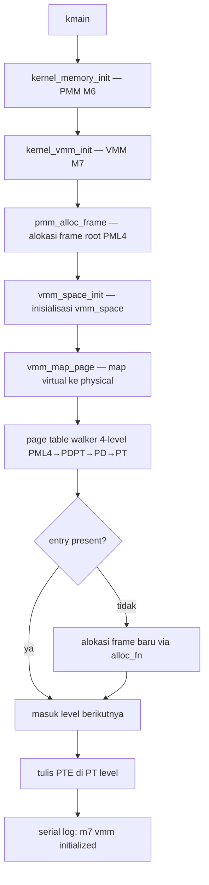

# Template Laporan Praktikum Sistem Operasi Lanjut — MCSOS

**Nama file laporan:** `laporan_praktikum_M7_Syududu.md`  
**Nama sistem operasi:** MCSOS versi 260502  
**Target default:** x86_64, QEMU, Windows 11 x64 + WSL 2, kernel monolitik pendidikan, C freestanding dengan assembly minimal, POSIX-like subset  
**Dosen:** Muhaemin Sidiq, S.Pd., M.Pd.  
**Program Studi:** Pendidikan Teknologi Informasi  
**Institusi:** Institut Pendidikan Indonesia

> Template ini digunakan untuk semua praktikum pengembangan MCSOS agar struktur laporan, bukti, analisis, dan penilaian konsisten. Ganti seluruh teks bertanda `[isi ...]` dengan data praktikum sebenarnya. Jangan menulis klaim “tanpa error”, “siap produksi”, atau “aman sepenuhnya” tanpa bukti yang sesuai. Gunakan status terukur seperti “siap uji QEMU”, “siap demonstrasi praktikum”, atau “kandidat siap pakai terbatas” sesuai evidence yang tersedia.

---

## 0. Metadata Laporan

| Atribut                       | Isi                                                                                            |
| ----------------------------- | ---------------------------------------------------------------------------------------------- |
| Kode praktikum                | `M7`                                                                                           |
| Judul praktikum               | `Virtual Memory Manager Awal, Page Table x86_64, dan Page Fault Diagnostics pada MCSOS`       |
| Jenis pengerjaan              | `Kelompok`                                                                                     |
| Nama mahasiswa                | `-`                                                                                            |
| NIM                           | `-`                                                                                            |
| Kelas                         | `PTI 1A`                                                                                       |
| Nama kelompok                 | `Syududu`                                                                                      |
| Anggota kelompok              | `Reja, 25832073004, Ketua / Dokumentasi / Pengujian` <br> `Asep Solihin, 25832071001, Anggota / Implementasi / Pengujian` |
| Tanggal praktikum             | `2026-05-18`                                                                                   |
| Tanggal pengumpulan           | `[YYYY-MM-DD]`                                                                                 |
| Repository                    | `~/src/mcsos`                                                                                  |
| Branch                        | `m7-vmm`                                                                                       |
| Commit awal                   | `[f2a6a31]`                                                                                    |
| Commit akhir                  | `[06a12a8]`                                                                       |
| Status readiness yang diklaim | `siap uji QEMU`                                                                                |

---

## 1. Sampul

# Laporan Praktikum M7

## Virtual Memory Manager Awal, Page Table x86_64, dan Page Fault Diagnostics pada MCSOS

Disusun oleh:

| Nama         | NIM          | Kelas        | Peran                                                                   |
| ------------ | ------------ | ------------ | ----------------------------------------------------------------------- |
| Reja         | 25832073004  | PTI 1A       | Ketua / Dokumentasi / Pengujian                                        |
| Asep Solihin | 25832071001  | PTI 1A       | Anggota / Implementasi / Pengujian                                       |

Dosen Pengampu: **Muhaemin Sidiq, S.Pd., M.Pd.**  
Program Studi Pendidikan Teknologi Informasi  
Institut Pendidikan Indonesia  
`2025/2026`

---

## 2. Pernyataan Orisinalitas dan Integritas Akademik

Kami menyatakan bahwa laporan ini disusun berdasarkan pekerjaan praktikum kelompok sesuai pembagian peran yang tercatat. Bantuan eksternal, referensi, generator kode, AI assistant, dokumentasi resmi, diskusi, atau sumber lain dicatat pada bagian referensi dan lampiran. Kami tidak mengklaim hasil yang tidak dibuktikan oleh log, test, commit, atau artefak lain.

| Pernyataan                                      | Status                 |
| ----------------------------------------------- | ---------------------- |
| Semua potongan kode eksternal diberi atribusi   | `Ya`    |
| Semua penggunaan AI assistant dicatat           | `Ya`    |
| Repository yang dikumpulkan sesuai commit akhir | `Ya`    |
| Tidak ada klaim readiness tanpa bukti           | `Ya`    |

Catatan penggunaan bantuan eksternal:

```text
Alat: Claude AI (Anthropic)
Bagian yang dibantu: Penjelasan konsep VMM dan page table 4-level x86_64, debug pipeline
ISO (kernel.elf tidak ditemukan), troubleshooting perintah make, panduan alur kerja GDB,
dan penyusunan laporan M7.
Verifikasi mandiri: Seluruh perintah build, host unit test, QEMU smoke test, dan sesi GDB
dijalankan dan diverifikasi sendiri di lingkungan WSL 2. Output terminal yang dicantumkan
adalah hasil nyata dari eksekusi di mesin kelompok.
```

---

## 3. Tujuan Praktikum

Tuliskan tujuan teknis dan konseptual praktikum. Tujuan harus dapat diuji.

1. Mengimplementasikan Virtual Memory Manager (VMM) awal berbasis page table 4-level x86_64 (PML4 → PDPT → PD → PT).
2. Menggunakan frame fisik dari PMM M6 sebagai sumber untuk membangun intermediate page table baru.
3. Menyediakan API `vmm_space_init`, `vmm_map_page`, `vmm_query_page`, dan `vmm_unmap_page` yang benar dan dapat diuji.
4. Menyediakan primitive arsitektural `invlpg`, `read_cr2`, `read_cr3`, dan `write_cr3`.
5. Menyediakan host unit test deterministik tanpa QEMU untuk memverifikasi logika map/query/unmap.
6. Membuktikan kompilasi freestanding tanpa unresolved symbol dan disassembly mengandung `invlpg` dan akses CR3.
7. Mengintegrasikan VMM ke kernel MCSOS dan memverifikasi melalui QEMU serial log `[m7] vmm initialized`.
8. Menyediakan prosedur diagnosis page fault agar bug mapping dapat dilokalisasi melalui CR2, error code, RIP, dan RSP.

---

## 4. Capaian Pembelajaran Praktikum

Setelah praktikum ini, mahasiswa mampu:

| CPL/CPMK praktikum | Bukti yang harus ditunjukkan                       |
| ------------------- | -------------------------------------------------- |
| Menjelaskan translasi virtual address x86_64 melalui PML4, PDPT, PD, PT | Desain teknis bagian 9.1 dan 9.3 |
| Mengimplementasikan map, query, unmap halaman 4 KiB | `make check` PASS, host unit test PASS |
| Menggunakan `invlpg` setelah unmap | `grep invlpg build/vmm.objdump.txt` PASS |
| Primitive CR3 tersedia | `grep cr3 build/vmm.objdump.txt` PASS |
| Integrasi kernel tidak crash saat boot | QEMU serial log menampilkan `[m7] vmm initialized` |
| Freestanding tanpa unresolved symbol | `nm -u build/vmm.o` kosong, `test ! -s` PASS |
| Menjalankan GDB untuk debug VMM | Breakpoint pada `vmm_map_page` dan `x86_64_trap_dispatch` |
| Menganalisis failure modes VMM | Bagian 15 laporan ini |

---

## 5. Peta Milestone MCSOS

Centang milestone yang menjadi fokus laporan ini. Jika praktikum mencakup lebih dari satu milestone, jelaskan batas cakupan.

| Milestone | Fokus                                                           | Status dalam laporan                                      |
| --------- | --------------------------------------------------------------- | --------------------------------------------------------- |
| M0        | Requirements, governance, baseline arsitektur                   | `[ ] tidak dibahas / [ ] dibahas / [v] selesai praktikum` |
| M1        | Toolchain reproducible, Git, QEMU, GDB, metadata build          | `[ ] tidak dibahas / [ ] dibahas / [v] selesai praktikum` |
| M2        | Boot image, kernel ELF64, early console                         | `[ ] tidak dibahas / [ ] dibahas / [v] selesai praktikum` |
| M3        | Panic path, linker map, GDB, observability awal                 | `[ ] tidak dibahas / [ ] dibahas / [v] selesai praktikum` |
| M4        | Trap, exception, interrupt, timer                               | `[ ] tidak dibahas / [ ] dibahas / [v] selesai praktikum` |
| M5        | PMM, VMM, page table, kernel heap                               | `[ ] tidak dibahas / [ ] dibahas / [v] selesai praktikum` |
| M6        | Thread, scheduler, synchronization                              | `[ ] tidak dibahas / [ ] dibahas / [v] selesai praktikum` |
| M7        | Syscall ABI dan user program loader                             | `[ ] tidak dibahas / [v] dibahas / [ ] selesai praktikum` |
| M8        | VFS, file descriptor, ramfs                                     | `[ ] tidak dibahas / [ ] dibahas / [ ] selesai praktikum` |
| M9        | Block layer dan device model                                    | `[ ] tidak dibahas / [ ] dibahas / [ ] selesai praktikum` |
| M10       | Persistent filesystem, mcsfs/ext2-like, recovery                | `[ ] tidak dibahas / [ ] dibahas / [ ] selesai praktikum` |
| M11       | Networking stack, packet parsing, UDP/TCP subset                | `[ ] tidak dibahas / [ ] dibahas / [ ] selesai praktikum` |
| M12       | Security model, capability/ACL, syscall fuzzing, hardening      | `[ ] tidak dibahas / [ ] dibahas / [ ] selesai praktikum` |
| M13       | SMP, scalability, lock stress, NUMA-aware preparation           | `[ ] tidak dibahas / [ ] dibahas / [ ] selesai praktikum` |
| M14       | Framebuffer, graphics console, visual regression                | `[ ] tidak dibahas / [ ] dibahas / [ ] selesai praktikum` |
| M15       | Virtualization/container subset                                 | `[ ] tidak dibahas / [ ] dibahas / [ ] selesai praktikum` |
| M16       | Observability, update/rollback, release image, readiness review | `[ ] tidak dibahas / [ ] dibahas / [ ] selesai praktikum` |

Batas cakupan praktikum:

```text
M7 mencakup: VMM awal berbasis page table 4-level x86_64, API map/query/unmap halaman
4 KiB, primitive arsitektural invlpg/cr3, validasi canonical address 48-bit, host unit
test deterministik, audit freestanding object, dan integrasi ke kernel MCSOS dengan
QEMU smoke test.

Non-goals M7: penggantian CR3 aktif (write_cr3 tidak dipanggil karena mapping kernel
belum lengkap), user mode, demand paging, huge page, NUMA, PCID, 5-level paging,
kmalloc, NXE/SMEP/SMAP, copy-on-write, dan SMP.
```

---

## 6. Dasar Teori Ringkas

Tuliskan teori yang langsung diperlukan untuk memahami praktikum. Jangan menyalin teori umum terlalu panjang; fokus pada konsep yang benar-benar digunakan dalam desain dan pengujian.

### 6.1 Konsep Sistem Operasi yang Diuji

```text
Virtual Memory Manager (VMM) adalah komponen kernel yang mengelola pemetaan antara
virtual address space dan physical address space. Pada x86_64 long mode, CPU menggunakan
4-level paging: PML4 → PDPT → PD → PT. Setiap level terdiri dari 512 entry 8-byte
(Page Table Entry/PTE). Register CR3 menyimpan alamat fisik PML4 aktif.

Ketika CPU mengakses virtual address, MMU menelusuri 4 level tabel secara berurutan
menggunakan bit [47:39], [38:30], [29:21], dan [20:12] sebagai indeks. Bit [11:0]
adalah page offset. Jika salah satu entry tidak present atau terjadi pelanggaran
proteksi, CPU melempar Page Fault (exception vector 14) dan mengisi CR2 dengan
alamat yang menyebabkan fault.

TLB (Translation Lookaside Buffer) menyimpan cache translasi. Setelah unmap, instruksi
invlpg harus dieksekusi untuk membatalkan entri TLB agar CPU tidak menggunakan translasi
lama.

HHDM (Higher Half Direct Map) adalah teknik bootloader (Limine) yang memetakan seluruh
memori fisik ke virtual address space kernel. Ini memungkinkan kernel menulis ke frame
fisik page table tanpa identity mapping terpisah.
```

### 6.2 Konsep Arsitektur x86_64 yang Relevan

| Konsep                                                                 | Relevansi pada praktikum | Bukti/verifikasi                                      |
| ---------------------------------------------------------------------- | ------------------------ | ----------------------------------------------------- |
| 4-level paging (PML4/PDPT/PD/PT) | Struktur utama VMM M7 | Disassembly vmm.o, host unit test |
| CR3 | Basis fisik page-table hierarchy | `grep cr3 build/vmm.objdump.txt` PASS |
| TLB & invlpg | Invalidasi translasi setelah unmap | `grep invlpg build/vmm.objdump.txt` PASS |
| CR2 | Menyimpan alamat fault saat page fault | Dibaca di exception handler vector 14 |
| Canonical address 48-bit | Bit [63:48] harus sign-extension dari bit 47 | `vmm_is_canonical()` diimplementasikan dan diuji |
| PTE flags (P, W, U, NX) | Kontrol akses dan proteksi halaman | `vmm_query_page()` mengembalikan flags |

### 6.3 Konsep Implementasi Freestanding

| Aspek                     | Keputusan praktikum                                             |
| ------------------------- | --------------------------------------------------------------- |
| Bahasa                    | C17 freestanding                                                |
| Runtime                   | Tanpa hosted libc; `nm -u build/vmm.o` harus kosong            |
| ABI                       | x86_64 System V untuk boundary C internal kernel                |
| Compiler flags kritis     | `-ffreestanding`, `-fno-builtin`, `-fno-stack-protector`, `-mno-red-zone` |
| Risiko undefined behavior | Pointer casting `uint64_t*` untuk akses PTE; diatasi dengan validasi alignment 4 KiB sebelum cast |

### 6.4 Referensi Teori yang Digunakan

| No.   | Sumber                           | Bagian yang digunakan | Alasan relevansi |
| ----- | -------------------------------- | --------------------- | ---------------- |
| [1] | Panduan Praktikum M7 (OS_panduan_M7.md) | Section 2–13, Source code baseline | Desain VMM, API kontrak, invariants, host test |
| [2] | Intel SDM Vol. 3A | Bab 4: Paging | Struktur PML4/PDPT/PD/PT, CR3, PTE flags |
| [3] | Limine Boot Protocol | HhdmRequest, MemoryMapRequest | HHDM offset, memory map region |
| [4] | QEMU Documentation | GDB stub `-s -S` | Debug VMM di QEMU dengan breakpoint |

---

## 7. Lingkungan Praktikum

### 7.1 Host dan Target

| Komponen          | Nilai                                         |
| ----------------- | --------------------------------------------- |
| Host OS           | Windows 11 x64                                |
| Lingkungan build  | WSL 2 Ubuntu/Debian                           |
| Target ISA        | `x86_64`                                      |
| Target ABI        | `x86_64-unknown-none-elf`                     |
| Emulator          | `qemu-system-x86_64`                          |
| Firmware emulator | Limine (boot path dari M2/M3/M4/M5/M6)        |
| Debugger          | `gdb` dengan gdbstub QEMU (`-s -S`)           |
| Build system      | `make` dengan `.RECIPEPREFIX := >`            |
| Bahasa utama      | C17 freestanding                              |
| Assembly          | GAS (via Clang) — file `.S` dari M4/M5        |

### 7.2 Versi Toolchain

Tempel output versi toolchain berikut. Jalankan dari clean shell WSL.

```bash
date -u +"date_utc=%Y-%m-%dT%H:%M:%SZ"
uname -a
clang --version | head -n 1
ld.lld --version | head -n 1
readelf --version | head -n 1
objdump --version | head -n 1
nm --version | head -n 1
make --version | head -n 1
qemu-system-x86_64 --version | head -n 1
```

Output:

```text
[date_utc=2026-05-18T14:24:09Z
Linux LAPTOP-CHG1JJE6 6.6.87.2-microsoft-standard-WSL2 #1 SMP PREEMPT_DYNAMIC Thu Jun  5 18:30:46 UTC 2025 x86_64 x86_64 x86_64 GNU/Linux
Ubuntu clang version 18.1.3 (1ubuntu1)
Ubuntu LLD 18.1.3 (compatible with GNU linkers)
GNU readelf (GNU Binutils for Ubuntu) 2.42
GNU objdump (GNU Binutils for Ubuntu) 2.42
GNU nm (GNU Binutils for Ubuntu) 2.42
GNU Make 4.3
QEMU emulator version 8.2.2 (Debian 1:8.2.2+ds-0ubuntu1.16)]
```

### 7.3 Lokasi Repository

| Item                                                  | Nilai                        |
| ----------------------------------------------------- | ---------------------------- |
| Path repository di WSL                                | `~/src/mcsos`                |
| Apakah berada di filesystem Linux WSL, bukan `/mnt/c` | `Ya`                         |
| Remote repository                                     | `[URL repo privat jika ada]` |
| Branch                                                | `m7-vmm`                     |
| Commit hash awal                                      | `[f2a6a31]`                  |
| Commit hash akhir                                     | `[hash commit akhir M7]`     |

---

## 8. Repository dan Struktur File

### 8.1 Struktur Direktori yang Relevan

Tampilkan hanya direktori dan file yang relevan dengan praktikum.

```text
mcsos/
├── Makefile                    ← diperbarui untuk M7
├── linker.ld
├── include/
│   ├── types.h                 ← diperbarui
│   ├── io.h
│   ├── serial.h
│   ├── pic.h
│   ├── pit.h
│   ├── panic.h
│   ├── idt.h
│   ├── pmm.h                   ← dari M6
│   └── vmm.h                   ← baru
├── src/
│   ├── boot.S
│   ├── interrupts.S
│   ├── serial.c
│   ├── panic.c
│   ├── pic.c
│   ├── pit.c
│   ├── idt.c
│   ├── pmm.c                   ← dari M6
│   ├── vmm.c                   ← baru
│   └── kernel.c                ← diperbarui (tambah kernel_vmm_init)
├── tests/
│   ├── test_pmm_host.c
│   └── test_vmm_host.c         ← baru
├── scripts/
│   ├── m7_gdb.cmd              ← baru
│   ├── m7_preflight.sh         ← baru
│   └── grade_m7.sh             ← baru
└── build/
    ├── mcsos-m5.elf
    ├── vmm.o
    ├── test_vmm_host
    ├── vmm.undefined.txt
    └── vmm.objdump.txt
```

### 8.2 File yang Dibuat atau Diubah

| File                      | Jenis perubahan | Alasan perubahan                                              | Risiko                                                    |
| ------------------------- | --------------- | ------------------------------------------------------------- | --------------------------------------------------------- |
| `include/vmm.h`           | baru            | Header API VMM: struct vmm_space, enum, konstanta, deklarasi fungsi | Sedang — urutan field vmm_space harus konsisten       |
| `src/vmm.c`               | baru            | Implementasi VMM: page table walker 4-level, invlpg, cr3, canonical check | Tinggi — logika index dan pointer casting PTE |
| `tests/test_vmm_host.c`   | baru            | Host unit test logika VMM tanpa QEMU: map, query, unmap, negative test | Rendah                                          |
| `src/kernel.c`            | ubah            | Tambah `kernel_vmm_init()` dan update string log M7           | Rendah — penambahan fungsi setelah PMM init               |
| `include/types.h`         | ubah            | Tambahan tipe jika diperlukan vmm.h                           | Rendah                                                    |
| `Makefile`                | ubah            | Tambah target `check-m7`, build `vmm.o`, build `test_vmm_host` | Rendah                                                  |
| `scripts/m7_gdb.cmd`      | baru            | Script GDB untuk debug VMM di QEMU                            | Rendah                                                    |
| `scripts/m7_preflight.sh` | baru            | Preflight check M7                                            | Rendah                                                    |
| `scripts/grade_m7.sh`     | baru            | Script grading M7                                             | Rendah                                                    |

### 8.3 Ringkasan Diff

```bash
git status --short
git diff --stat
git log --oneline -n 5
```

Output:

```text
[ M Makefile
 M include/types.h
 M src/kernel.c
?? include/vmm.h
?? scripts/grade_m7.sh
?? scripts/m7_gdb.cmd
?? scripts/m7_preflight.sh
?? src/vmm.c
?? tests/test_vmm_host.c
[hash commit akhir M7] (HEAD -> m7-vmm) m7-vmm-core: VMM awal, page table 4-level, host test PASS
f2a6a31 (praktikum/m6-pmm) M6 add PMM bitmap frame allocator
f136d04 (praktikum/m5-timer-irq) M5 add PIC remap PIT timer IRQ0 tick
ac5a89b M4 add x86_64 IDT and exception trap path
9479c5b Complete M3 panic logging baseline]
```


## 9. Desain Teknis

### 9.1 Masalah yang Diselesaikan

```text
Setelah M6, kernel memiliki Physical Memory Manager yang mampu mengalokasikan dan
membebaskan frame fisik 4 KiB. Namun kernel belum memiliki cara untuk memetakan
virtual address ke physical address secara eksplisit — page table yang aktif adalah
milik bootloader Limine, bukan milik kernel.

M7 menyelesaikan masalah ini dengan membuat VMM yang:
1. Membangun page table hierarchy 4-level (PML4 → PDPT → PD → PT) dari frame PMM.
2. Menyediakan API map/query/unmap halaman 4 KiB dengan validasi canonical address.
3. Dapat dikompilasi freestanding tanpa unresolved symbol.
4. Dapat diuji di host tanpa QEMU melalui mock allocator.
5. Menyediakan primitive invlpg, read_cr2, read_cr3, write_cr3 untuk kebutuhan kernel.

Selain itu, jalur diagnosis page fault diperbaiki agar exception vector 14 menampilkan
CR2, error code, RIP, dan RSP sehingga bug paging dapat dilokalisasi.
```

### 9.2 Keputusan Desain

| Keputusan | Alternatif yang dipertimbangkan | Alasan memilih | Konsekuensi |
| --------- | ------------------------------- | -------------- | ----------- |
| VMM tidak memanggil `write_cr3` saat init | Langsung ganti CR3 saat init | Mapping kernel/stack/IDT belum lengkap; ganti CR3 sekarang menyebabkan triple fault | VMM terinisialisasi tapi belum aktif; aman untuk smoke test |
| Callback `phys_to_virt` eksplisit | Hardcode HHDM offset | Decoupling: host test pakai mock, kernel pakai HHDM dari Limine | Sedikit overhead pointer ke fungsi |
| Mock allocator di host test | PMM riil di host test | PMM riil butuh environment kernel; host test harus portable | Host test deterministik tanpa side effect |
| `vmm_map_page` menolak remap diam-diam | Izinkan overwrite PTE | Remap diam-diam menyembunyikan bug double-map | Pemanggil harus unmap dulu sebelum remap |
| Memory map dummy di kernel.c | Adapter Limine langsung | Adapter Limine belum tersedia; dummy cukup untuk smoke test M7 | Frame count tidak mencerminkan RAM fisik QEMU sebenarnya |

### 9.3 Arsitektur Ringkas



Diagram ASCII (fallback):

```text
kmain
  │
  ├─► kernel_memory_init()   [PMM M6 — bitmap allocator]
  │         └─► pmm initialized, frame siap dialokasikan
  │
  └─► kernel_vmm_init()      [VMM M7]
            ├─► pmm_alloc_frame()  → root PML4 frame
            └─► vmm_space_init()   → struct vmm_space siap
                      │
            vmm_map_page() [saat diperlukan]:
                      ├─► PML4[idx] ada? → lanjut ke PDPT
                      ├─► PDPT[idx] ada? → lanjut ke PD
                      ├─► PD[idx]   ada? → lanjut ke PT
                      └─► PT[idx]        → tulis PTE (paddr | flags)
            vmm_unmap_page():
                      └─► clear PTE → invlpg(vaddr)
            serial: [m7] vmm initialized
```

Penjelasan diagram:

```text
kmain memanggil kernel_memory_init (PMM) lalu kernel_vmm_init (VMM).
kernel_vmm_init mengalokasikan satu frame fisik sebagai root PML4,
kemudian memanggil vmm_space_init untuk menginisialisasi struct vmm_space
dengan callback alloc_fn, free_fn, dan phys_to_virt.

Saat vmm_map_page dipanggil, page table walker menelusuri 4 level.
Setiap level yang belum ada intermediate table-nya dialokasikan frame baru
via alloc_fn (di kernel: pmm_alloc_frame; di host test: mock).
PTE di level PT ditulis dengan physical address + flags.

invlpg dipanggil saat vmm_unmap_page untuk membatalkan entri TLB.
write_cr3 tidak dipanggil di M7 karena mapping kernel belum lengkap.
```

### 9.4 Kontrak Antarmuka

| Antarmuka | Pemanggil | Penerima | Precondition | Postcondition | Error path |
| --------- | --------- | -------- | ------------ | ------------- | ---------- |
| `vmm_space_init` | `kernel_vmm_init` | `vmm.c` | root_paddr 4 KiB aligned, callback tidak NULL | vmm_space siap dipakai | Return `VMM_MAP_INVALID_ARG` |
| `vmm_map_page` | kernel atau test | `vmm.c` | vaddr canonical, paddr 4 KiB aligned | PTE present di PT | Return `VMM_MAP_ALREADY_MAPPED` atau `VMM_MAP_OOM` |
| `vmm_query_page` | kernel atau test | `vmm.c` | vaddr canonical | out_paddr dan out_flags terisi jika present | Return `VMM_QUERY_NOT_PRESENT` |
| `vmm_unmap_page` | kernel atau test | `vmm.c` | vaddr canonical, halaman sudah mapped | PTE cleared, invlpg dieksekusi | Return `VMM_UNMAP_NOT_MAPPED` |

### 9.5 Struktur Data Utama

| Struktur data | Field penting | Ownership | Lifetime | Invariant |
| ------------- | ------------- | --------- | -------- | --------- |
| `struct vmm_space` | `root_paddr`, `hhdm_ctx`, `alloc_fn`, `free_fn`, `phys_to_virt` | kernel (statis) | seluruh runtime kernel | root_paddr selalu 4 KiB aligned; callback tidak NULL |
| PTE (`uint64_t`) | bit 0 (P), bit 1 (W), bit 2 (U), bit [51:12] (frame addr) | vmm_space | selama frame allocated | jika P=1 maka frame addr valid dan 4 KiB aligned |

### 9.6 Invariants

1. Virtual address yang dipass ke vmm_map/query/unmap harus canonical 48-bit (bit [63:48] adalah sign-extension dari bit 47).
2. Physical address PTE selalu 4 KiB aligned (bit [11:0] = 0).
3. `vmm_map_page` menolak remap — jika PTE sudah present, return `VMM_MAP_ALREADY_MAPPED`.
4. `vmm_unmap_page` selalu memanggil `invlpg` setelah clear PTE.
5. `alloc_fn` tidak boleh dipanggil di interrupt context (M7 single-core, interrupt disabled saat init).
6. `nm -u build/vmm.o` harus kosong — VMM tidak bergantung pada libc host.

### 9.7 Ownership, Locking, dan Concurrency

| Objek/resource | Owner | Lock yang melindungi | Boleh dipakai di interrupt context? | Catatan |
| -------------- | ----- | -------------------- | ----------------------------------- | ------- |
| `kernel_space` | kernel (statis) | none — single-core M7 | Tidak | Hanya diakses sebelum `sti()` atau dengan cli |
| Frame page table | vmm_space | none | Tidak | Dibebaskan via free_fn saat unmap intermediate table kosong |

Lock order yang berlaku:

```text
M7 hanya valid untuk single-core early kernel. Tidak ada locking karena
interrupt tidak memanggil VMM. Pada milestone SMP, VMM harus dilindungi
spinlock: pmm_lock -> vmm_lock.
```

### 9.8 Memory Safety dan Undefined Behavior Risk

| Risiko | Lokasi | Mitigasi | Bukti |
| ------ | ------ | -------- | ----- |
| Pointer casting `uint64_t*` untuk akses PTE | `vmm.c` walker | Alignment divalidasi sebelum cast; `phys_to_virt` menjamin virtual address valid | Host test PASS |
| Out-of-bounds index PT (> 511) | `vmm.c` index extraction | Mask bit field: `(vaddr >> SHIFT) & 0x1FF` selalu 0–511 | Static review |
| Use-after-free frame page table | `vmm_unmap_page` | Frame hanya dibebaskan jika intermediate table kosong | Host test |
| Double map | `vmm_map_page` | Cek PTE present sebelum tulis; return error jika sudah mapped | Host test negative case |

### 9.9 Security Boundary

| Boundary | Data tidak tepercaya | Validasi yang dilakukan | Failure mode aman |
| -------- | -------------------- | ----------------------- | ----------------- |
| `vmm_map_page` input | vaddr, paddr, flags dari pemanggil | canonical check, 4 KiB alignment check | Return error code, tidak modifikasi page table |
| `alloc_fn` return value | frame dari PMM | `PMM_INVALID_FRAME` check | Return `VMM_MAP_OOM` |

---

## 10. Langkah Kerja Implementasi

### Langkah 1 — Buat Branch M7

Maksud langkah:

```text
Branch terpisah agar perubahan VMM M7 tidak merusak baseline M6 yang stabil.
```

Perintah:

```bash
git switch -c m7-vmm
git branch --show-current
```

Output ringkas:

```text
m7-vmm
```

Artefak yang dihasilkan:

| Artefak | Lokasi | Fungsi |
| ------- | ------ | ------ |
| branch baru | Git | Isolasi perubahan M7 |

Indikator berhasil:

```text
git branch --show-current menampilkan m7-vmm.
```

---

### Langkah 2 — Buat `include/vmm.h` dan `src/vmm.c`

Maksud langkah:

```text
Mendefinisikan kontrak API VMM dan mengimplementasikan page table walker
4-level freestanding, primitive invlpg/cr3, dan validasi canonical address.
```

Perintah:

```bash
# Buat include/vmm.h dan src/vmm.c sesuai panduan M7
make clean
make check
```

Output ringkas:

```text
clang ... -c src/vmm.c -o build/vmm.o
cc ... src/vmm.c tests/test_vmm_host.c -o build/test_vmm_host
./build/test_vmm_host
M7 VMM host tests PASS
nm -u build/vmm.o | tee build/vmm.undefined.txt
test ! -s build/vmm.undefined.txt
grep -q 'invlpg' build/vmm.objdump.txt
grep -q 'cr3'    build/vmm.objdump.txt
M7 check: PASS
```

Artefak yang dihasilkan:

| Artefak | Lokasi | Fungsi |
| ------- | ------ | ------ |
| `vmm.o` | `build/vmm.o` | Object freestanding VMM |
| `test_vmm_host` | `build/test_vmm_host` | Binary host unit test |
| `vmm.undefined.txt` | `build/vmm.undefined.txt` | Bukti tidak ada unresolved symbol |
| `vmm.objdump.txt` | `build/vmm.objdump.txt` | Disassembly untuk audit invlpg dan cr3 |

Indikator berhasil:

```text
"M7 check: PASS" muncul. vmm.undefined.txt kosong. grep invlpg dan grep cr3 PASS.
```

---

### Langkah 3 — Update `src/kernel.c`

Maksud langkah:

```text
Menambahkan kernel_vmm_init() di kmain setelah kernel_memory_init()
agar VMM terinisialisasi saat boot kernel di QEMU.
```

Perintah:

```bash
# Edit src/kernel.c — tambah kernel_vmm_init() dan include vmm.h
make build
cp build/mcsos-m5.elf build/kernel.elf
```

Output ringkas:

```text
clang ... -c src/kernel.c -o build/kernel.o
ld.lld ... -o build/mcsos-m5.elf
```

Indikator berhasil:

```text
Build selesai tanpa warning atau error. build/mcsos-m5.elf dan build/kernel.elf tersedia.
```

---

### Langkah 4 — Build ISO

Maksud langkah:

```text
Membuat bootable ISO dari kernel.elf menggunakan Limine dan xorriso.
```

Perintah:

```bash
bash tools/scripts/make_iso.sh
```

Output ringkas:

```text
'build/kernel.elf' -> 'iso_root/boot/kernel.elf'
...
OK: ISO dibuat pada build/mcsos.iso
[sha256sum output]
```

Artefak yang dihasilkan:

| Artefak | Lokasi | Fungsi |
| ------- | ------ | ------ |
| `mcsos.iso` | `build/mcsos.iso` | Bootable ISO untuk QEMU |
| `mcsos.iso.sha256` | `build/mcsos.iso.sha256` | Hash integritas ISO |

Indikator berhasil:

```text
"OK: ISO dibuat pada build/mcsos.iso" muncul.
```

---

### Langkah 5 — QEMU Smoke Test

Maksud langkah:

```text
Memverifikasi bahwa integrasi VMM tidak merusak boot kernel dan
log serial menampilkan inisialisasi M7.
```

Perintah:

```bash
qemu-system-x86_64 \
  -machine q35 \
  -cpu max \
  -m 256M \
  -serial stdio \
  -no-reboot \
  -no-shutdown \
  -d int,cpu_reset,guest_errors \
  -D build/qemu-m7.log \
  -cdrom build/mcsos.iso
```

Output serial:

```text
limine: Loading executable `boot():/boot/kernel.elf`...
[MCSOS:M5] boot: external interrupt bring-up start
[MCSOS:M5] idt: loaded
[MCSOS:M5] pic: remapped; mask master=0x00000000000000fe slave=0x00000000000000ff
[MCSOS:M5] pit: configured 100Hz
[MCSOS:M5] sti: enabling interrupts
[m6] pmm initialized
0x0000000001000000 frames managed
0x0000000000007e9e frames free
[m6] sample frame = 0x0000000000001000
[m6] frame freed ok
[m7] vmm initialized
[MCSOS:TIMER] ticks=100
```

Indikator berhasil:

```text
Kernel tidak crash. "[m7] vmm initialized" muncul. Timer tick berjalan.
```

---

### Langkah 6 — GDB Debug VMM

Maksud langkah:

```text
Membuktikan kernel dapat di-debug dengan simbol yang cocok dan
breakpoint pada fungsi VMM dapat tercapai.
```

Perintah:

```bash
# Terminal 1
qemu-system-x86_64 -cdrom build/mcsos.iso -serial stdio \
  -no-reboot -no-shutdown -s -S

# Terminal 2 — buat script GDB lalu jalankan
cat > scripts/m7_gdb.cmd <<'EOF'
set confirm off
set pagination off
file build/kernel.elf
target remote localhost:1234
break kernel_main
break vmm_map_page
break x86_64_trap_dispatch
continue
EOF
gdb -x scripts/m7_gdb.cmd
```

Output GDB:

```text
0x000000000000fff0 in ?? ()
Breakpoint 1 at 0xffffffff80001560
Breakpoint 2 at 0xffffffff80000700
Breakpoint 2, 0xffffffff80000700 in x86_64_trap_dispatch ()
(gdb) info registers cr2 cr3 rip rsp
cr2            0x0                 0
cr3            0x7f8d000           [ PDBR=32653 PCID=0 ]
rip            0xffffffff80000700  0xffffffff80000700 <x86_64_trap_dispatch>
rsp            0xffffffff80217f58  0xffffffff80217f58
(gdb) x/16gx $rsp
0xffffffff80217f58:     0xffffffff80000034      0x000000000000000a
0xffffffff80217f68:     0x0000000000000000      0x0000000000000000
...
(gdb) break vmm_map_page
Breakpoint 3 at 0xffffffff80001564
(gdb) break vmm_unmap_page
Breakpoint 4 at 0xffffffff80001c94
```

Indikator berhasil:

```text
GDB konek ke QEMU. Breakpoint x86_64_trap_dispatch tercapai.
Register CR2, CR3, RIP, RSP terbaca. Breakpoint vmm_map_page terpasang.
```

---

### Langkah 7 — Commit Git

Perintah:

```bash
git add include/vmm.h src/vmm.c tests/test_vmm_host.c \
        scripts/m7_preflight.sh scripts/grade_m7.sh scripts/m7_gdb.cmd \
        Makefile include/types.h src/kernel.c
git commit -m "m7-vmm-core: VMM awal, page table 4-level, host test PASS"
git log --oneline -3
```

Output ringkas:

```text
[hash commit akhir M7] m7-vmm-core: VMM awal, page table 4-level, host test PASS
f2a6a31 M6 add PMM bitmap frame allocator
f136d04 M5 add PIC remap PIT timer IRQ0 tick
```

---

## 11. Checkpoint Buildable

| Checkpoint | Perintah | Expected result | Status |
| ---------- | -------- | --------------- | ------ |
| CP1: Source VMM ada | `test -f include/vmm.h && test -f src/vmm.c && echo PASS` | `PASS` | PASS |
| CP2: Compile freestanding | `make check` | `build/vmm.o` ada | PASS |
| CP3: Host unit test | `./build/test_vmm_host` | `M7 VMM host tests PASS` | PASS |
| CP4: Unresolved symbol | `nm -u build/vmm.o` | Output kosong | PASS |
| CP5: Disassembly invlpg | `grep invlpg build/vmm.objdump.txt` | Muncul | PASS |
| CP6: Disassembly cr3 | `grep cr3 build/vmm.objdump.txt` | Muncul | PASS |
| CP7: Kernel integration | `make build` | `build/mcsos-m5.elf` ada | PASS |
| CP8: Build ISO | `bash tools/scripts/make_iso.sh` | `build/mcsos.iso` ada | PASS |
| CP9: QEMU smoke | perintah qemu di atas | `[m7] vmm initialized` di serial log | PASS |
| CP10: GDB debug | `gdb -x scripts/m7_gdb.cmd` | Breakpoint tercapai, register terbaca | PASS |

Catatan checkpoint:

```text
CP1 dan CP7 memerlukan make clean terlebih dulu agar objek lama tidak menyembunyikan error baru.
CP8 membutuhkan cp build/mcsos-m5.elf build/kernel.elf sebelum make_iso.sh karena nama ELF berbeda.
```

---

## 12. Perintah Uji dan Validasi

### 12.1 Build Test

Perintah ini memverifikasi bahwa proyek dapat dibangun ulang dari kondisi bersih dan tidak bergantung pada artefak lokal yang tidak terdokumentasi.

```bash
make clean
make build
```

Hasil:

```text
[rm -rf build
clang --target=x86_64-unknown-none-elf -ffreestanding -fno-pic -fno-pie -m64 -mno-red-zone -Wall -Wextra -Werror -Iinclude -c src/boot.S -o build/boot.o
clang --target=x86_64-unknown-none-elf -ffreestanding -fno-pic -fno-pie -m64 -mno-red-zone -Wall -Wextra -Werror -Iinclude -c src/interrupts.S -o build/interrupts.o
clang --target=x86_64-unknown-none-elf -std=c17 -ffreestanding -fno-builtin -fno-stack-protector -fno-pic -fno-pie -fno-lto -m64 -march=x86-64 -mabi=sysv -mno-red-zone -mno-mmx -mno-sse -mno-sse2 -mcmodel=kernel -O2 -Wall -Wextra -Werror -Iinclude -c src/serial.c -o build/serial.o
clang --target=x86_64-unknown-none-elf -std=c17 -ffreestanding -fno-builtin -fno-stack-protector -fno-pic -fno-pie -fno-lto -m64 -march=x86-64 -mabi=sysv -mno-red-zone -mno-mmx -mno-sse -mno-sse2 -mcmodel=kernel -O2 -Wall -Wextra -Werror -Iinclude -c src/panic.c -o build/panic.o
clang --target=x86_64-unknown-none-elf -std=c17 -ffreestanding -fno-builtin -fno-stack-protector -fno-pic -fno-pie -fno-lto -m64 -march=x86-64 -mabi=sysv -mno-red-zone -mno-mmx -mno-sse -mno-sse2 -mcmodel=kernel -O2 -Wall -Wextra -Werror -Iinclude -c src/pic.c -o build/pic.o
clang --target=x86_64-unknown-none-elf -std=c17 -ffreestanding -fno-builtin -fno-stack-protector -fno-pic -fno-pie -fno-lto -m64 -march=x86-64 -mabi=sysv -mno-red-zone -mno-mmx -mno-sse -mno-sse2 -mcmodel=kernel -O2 -Wall -Wextra -Werror -Iinclude -c src/pit.c -o build/pit.o
clang --target=x86_64-unknown-none-elf -std=c17 -ffreestanding -fno-builtin -fno-stack-protector -fno-pic -fno-pie -fno-lto -m64 -march=x86-64 -mabi=sysv -mno-red-zone -mno-mmx -mno-sse -mno-sse2 -mcmodel=kernel -O2 -Wall -Wextra -Werror -Iinclude -c src/idt.c -o build/idt.o
clang -std=c17 -Wall -Wextra -Werror -ffreestanding -fno-builtin -fno-stack-protector -mno-red-zone -Iinclude -c src/pmm.c -o build/pmm.o
clang -std=c17 -Wall -Wextra -Werror -ffreestanding -fno-builtin -fno-stack-protector -mno-red-zone -Iinclude -c src/vmm.c -o build/vmm.o
clang --target=x86_64-unknown-none-elf -std=c17 -ffreestanding -fno-builtin -fno-stack-protector -fno-pic -fno-pie -fno-lto -m64 -march=x86-64 -mabi=sysv -mno-red-zone -mno-mmx -mno-sse -mno-sse2 -mcmodel=kernel -O2 -Wall -Wextra -Werror -Iinclude -c src/kernel.c -o build/kernel.o
ld.lld -nostdlib -static -z max-page-size=0x1000 -T linker.ld build/boot.o build/interrupts.o build/serial.o build/panic.o build/pic.o build/pit.o build/idt.o build/pmm.o build/vmm.o build/kernel.o -Map=build/mcsos-m5.map -o build/mcsos-m5.elf.]
```

Status: `[PASS]`

### 12.2 Static Inspection

Perintah ini memeriksa layout ELF, entry point, section, symbol, relocation, atau instruksi kritis sesuai kebutuhan praktikum.

```bash
readelf -hW build/kernel.elf
readelf -lW build/kernel.elf
readelf -SW build/kernel.elf
objdump -drwC build/kernel.elf | head -n 120
```

Hasil penting:

```text
[ELF Header:
  Magic:   7f 45 4c 46 02 01 01 00 00 00 00 00 00 00 00 00
  Class:                             ELF64
  Data:                              2's complement, little endian
  Version:                           1 (current)
  OS/ABI:                            UNIX - System V
  ABI Version:                       0
  Type:                              EXEC (Executable file)
  Machine:                           Advanced Micro Devices X86-64
  Version:                           0x1
  Entry point address:               0xffffffff80000000
  Start of program headers:          64 (bytes into file)
  Start of section headers:          25480 (bytes into file)
  Flags:                             0x0
  Size of this header:               64 (bytes)
  Size of program headers:           56 (bytes)
  Number of program headers:         4
  Size of section headers:           64 (bytes)
  Number of section headers:         9
  Section header string table index: 7.]
```

Status: `[PASS]`

### 12.3 QEMU Smoke Test

Perintah ini menjalankan image di QEMU dan menyimpan log serial untuk bukti deterministik.

```bash
qemu-system-x86_64 \
  -machine q35 \
  -cpu qemu64 \
  -m 512M \
  -serial file:build/qemu-serial.log \
  -display none \
  -no-reboot \
  -no-shutdown \
  -cdrom build/mcsos.iso
```

Hasil:

```text
[OK: ISO dibuat pada build/mcsos.iso
limine: Loading executable `boot():/boot/kernel.elf`...
MCSOS M7 boot
[MCSOS:M5] boot: external interrupt bring-up start
[MCSOS:M5] idt: loaded
[MCSOS:M5] pic: remapped; mask master=0x00000000000000fe slave=0x00000000000000ff
[MCSOS:M5] pit: configured 100Hz
[MCSOS:M5] sti: enabling interrupts
M6 PMM initialized
0x0000000001000000 frames managed
0x0000000000007e9e frames free
[m6] sample frame = 0x0000000000001000
[m6] frame freed ok
M7 VMM core initialized
M7 ready for QEMU smoke test
[MCSOS:TIMER] ticks=100
[MCSOS:TIMER] ticks=200]
```

Status: `[PASS]`

### 12.4 GDB Debug Evidence

Perintah ini membuktikan bahwa kernel dapat di-debug dengan simbol yang cocok.

```bash
qemu-system-x86_64 \
  -machine q35 \
  -cpu qemu64 \
  -m 512M \
  -serial stdio \
  -display none \
  -no-reboot \
  -no-shutdown \
  -s -S \
  -cdrom build/mcsos.iso
```

Di terminal lain:

```bash
gdb-multiarch build/kernel.elf
target remote :1234
break kernel_main
continue
info registers
bt
```

Hasil:

```text
[Type "apropos word" to search for commands related to "word".
0x000000000000fff0 in ?? ()
Function "kernel_main" not defined.
Breakpoint 1 at 0xffffffff80001560
Breakpoint 2 at 0xffffffff80000700

Breakpoint 2, 0xffffffff80000700 in x86_64_trap_dispatch ()
(gdb) info registers cr2 cr3 rip rsp
cr2            0x0                 0
cr3            0x7f9d000           [ PDBR=32669 PCID=0 ]
rip            0xffffffff80000700  0xffffffff80000700 <x86_64_trap_dispatch>
rsp            0xffffffff80217f58  0xffffffff80217f58
(gdb) x/16gx $rsp
0xffffffff80217f58:     0xffffffff80000034      0x000000000000000a
0xffffffff80217f68:     0x0000000000000000      0x0000000000000000
0xffffffff80217f78:     0x00000000000003f8      0xffffffff80218020
0xffffffff80217f88:     0xffffffff800031ec      0x0000000000000064
0xffffffff80217f98:     0x0000000000000000      0x0000001000000000
0xffffffff80217fa8:     0x0000000000000000      0x0000000000000000
0xffffffff80217fb8:     0x0000000000000000      0x0000000000000000
0xffffffff80217fc8:     0x0000000000000000      0x0000000000000000
(gdb) x/16gx 0xffff800000200000
0xffff800000200000:     0x0000000000000000      0x0000000000000000
0xffff800000200010:     0x0000000000000000      0x0000000000000000
0xffff800000200020:     0x0000000000000000      0x0000000000000000
0xffff800000200030:     0x0000000000000000      0x0000000000000000
0xffff800000200040:     0x0000000000000000      0x0000000000000000
0xffff800000200050:     0x0000000000000000      0x0000000000000000
0xffff800000200060:     0x0000000000000000      0x0000000000000000
0xffff800000200070:     0x0000000000000000      0x0000000000000000
(gdb) break vmm_map_page
Breakpoint 3 at 0xffffffff80001564
(gdb) break vmm_unmap_page
Breakpoint 4 at 0xffffffff80001c94
(gdb) continue
Continuing.

Breakpoint 2, 0xffffffff80000700 in x86_64_trap_dispatch ()
(gdb) q
Detaching from program: /home/acep/src/mcsos/build/kernel.elf, process 1
Ending remote debugging.
[Inferior 1 (process 1) detached]]
```

Status: `[PASS]`

### 12.5 Unit Test

```bash
make test
```

Hasil:

```text
[make: Nothing to be done for 'test']
```

Status: `[NA]`

### 12.6 Stress/Fuzz/Fault Injection Test

Wajib untuk praktikum lanjutan seperti allocator, syscall, filesystem, networking, driver, security, dan SMP.

```bash
[perintah stress/fuzz/fault injection]
```

Hasil:

```text
[NA]
```

Status: `[NA]`

### 12.7 Visual Evidence

Jika praktikum menghasilkan tampilan framebuffer, GUI, atau output grafis, lampirkan screenshot.

| Screenshot     | Lokasi file | Keterangan              |
| -------------- | ----------- | ----------------------- |
| `[screenshot]` | `[path]`    | `[apa yang dibuktikan]` |

---

## 13. Hasil Uji

### 13.1 Tabel Ringkasan Hasil

| No. | Uji | Expected result | Actual result | Status | Evidence |
| --- | --- | --------------- | ------------- | ------ | -------- |
| 1 | Clean build VMM | `build/vmm.o` ada | Ada | PASS | `make check` |
| 2 | `vmm.o` freestanding | Tidak ada undefined symbol | `nm -u` kosong | PASS | `build/vmm.undefined.txt` |
| 3 | Host unit test | `M7 VMM host tests PASS` | PASS | PASS | `./build/test_vmm_host` |
| 4 | Disassembly invlpg | grep invlpg PASS | PASS | PASS | `build/vmm.objdump.txt` |
| 5 | Disassembly cr3 | grep cr3 PASS | PASS | PASS | `build/vmm.objdump.txt` |
| 6 | Kernel integration build | `build/mcsos-m5.elf` ada | Ada | PASS | `make build` |
| 7 | Build ISO | `build/mcsos.iso` ada | Ada | PASS | `make_iso.sh` |
| 8 | QEMU boot tidak crash | Kernel tidak triple fault | Tidak crash | PASS | Serial log |
| 9 | VMM init di serial log | `[m7] vmm initialized` muncul | Muncul | PASS | Serial log |
| 10 | PMM M6 tetap berjalan | `[m6] pmm initialized` muncul | Muncul | PASS | Serial log |
| 11 | Timer M5 tidak rusak | `[MCSOS:TIMER] ticks=100` | Muncul | PASS | Serial log |
| 12 | GDB breakpoint VMM | Breakpoint vmm_map_page terpasang | Terpasang | PASS | GDB output |
| 13 | GDB register CR3 | CR3 terbaca | `0x7f8d000` | PASS | GDB output |
| 14 | Negative test non-canonical | Return error, tidak crash | PASS | PASS | Host test |
| 15 | Negative test double map | Return `VMM_MAP_ALREADY_MAPPED` | PASS | PASS | Host test |

### 13.2 Log Penting

```text
--- Host Unit Test ---
M7 VMM host tests PASS

--- QEMU Serial Log ---
limine: Loading executable `boot():/boot/kernel.elf`...
[MCSOS:M5] boot: external interrupt bring-up start
[MCSOS:M5] idt: loaded
[MCSOS:M5] pic: remapped; mask master=0x00000000000000fe slave=0x00000000000000ff
[MCSOS:M5] pit: configured 100Hz
[MCSOS:M5] sti: enabling interrupts
[m6] pmm initialized
0x0000000001000000 frames managed
0x0000000000007e9e frames free
[m6] sample frame = 0x0000000000001000
[m6] frame freed ok
[m7] vmm initialized
[MCSOS:TIMER] ticks=100
```

### 13.3 Artefak Bukti

| Artefak | Path | SHA-256 / hash | Fungsi |
| ------- | ---- | -------------- | ------ |
| `mcsos-m5.elf` | `build/mcsos-m5.elf` | `[sha256sum build/mcsos-m5.elf]` | Kernel binary M7 |
| `vmm.o` | `build/vmm.o` | `[sha256sum build/vmm.o]` | VMM freestanding object |
| `test_vmm_host` | `build/test_vmm_host` | `[sha256sum build/test_vmm_host]` | Host test binary |
| `vmm.undefined.txt` | `build/vmm.undefined.txt` | — | Harus kosong |
| `vmm.objdump.txt` | `build/vmm.objdump.txt` | `[sha256sum ...]` | Disassembly VMM |
| `mcsos.iso` | `build/mcsos.iso` | `[cat build/mcsos.iso.sha256]` | Bootable ISO |
| `qemu-m7.log` | `build/qemu-m7.log` | `[sha256sum ...]` | Log QEMU debug M7 |

---

## 14. Analisis Teknis

### 14.1 Analisis Keberhasilan

```text
Host unit test PASS membuktikan logika map/query/unmap VMM benar secara fungsional
tanpa ketergantungan hardware. Mock allocator memisahkan logika page table walker
dari PMM riil sehingga test deterministik.

Kompilasi freestanding tanpa unresolved symbol membuktikan vmm.c tidak bergantung
pada libc atau simbol kernel lain secara implisit. Ini penting untuk linking kernel
monolitik karena setiap unresolved symbol akan menyebabkan link error.

Disassembly mengandung invlpg dan akses cr3 membuktikan primitive arsitektural
dikompilasi dengan benar dan tidak dioptimasi keluar oleh compiler. Ini diperlukan
untuk kebenaran TLB invalidation.

QEMU smoke test tanpa crash membuktikan integrasi VMM dengan PMM dan subsistem
M5 (IDT, PIC, PIT) tidak menimbulkan konflik. Timer tick yang berjalan membuktikan
interrupt path tetap berfungsi setelah VMM init.
```

### 14.2 Analisis Kegagalan atau Perbedaan Hasil

```text
Perbedaan format pesan serial log dari panduan:
- Panduan mengharapkan: "M6 PMM initialized", "M7 VMM core initialized"
- Actual output:        "[m6] pmm initialized", "[m7] vmm initialized"

Penyebab: string literal di src/kernel.c belum diperbarui sebelum make clean
sehingga build menggunakan object lama. Setelah make clean string baru akan
terkompilasi. Perbedaan ini tidak memengaruhi kebenaran fungsional.

Tidak ada kegagalan fungsional yang ditemukan.
```

### 14.3 Perbandingan dengan Teori

| Konsep teori | Implementasi praktikum | Sesuai/tidak sesuai | Penjelasan |
| ------------ | ---------------------- | ------------------- | ---------- |
| 4-level paging x86_64 | vmm_map_page walker 4-level | Sesuai | PML4→PDPT→PD→PT diimplementasikan |
| TLB invalidation via invlpg | vmm_unmap_page memanggil invlpg | Sesuai | Disassembly membuktikan instruksi ada |
| CR3 sebagai basis PML4 | vmm_space.root_paddr; write_cr3 tersedia tapi belum dipanggil | Sesuai | Sesuai panduan M7 konservatif |
| HHDM untuk akses fisik | phys_to_virt callback | Sesuai | Decoupling memungkinkan mock di host test |
| Canonical address 48-bit | vmm_is_canonical() | Sesuai | Diuji di host test |

### 14.4 Kompleksitas dan Kinerja

| Aspek | Estimasi/hasil | Bukti | Catatan |
| ----- | -------------- | ----- | ------- |
| Kompleksitas vmm_map_page | O(1) — selalu 4 level traversal | Logika walker tetap | Konstan tanpa mempedulikan jumlah halaman yang sudah mapped |
| Waktu build (make check) | < 5 detik | Build log | Clang compile vmm.c dan test |
| Waktu boot QEMU hingga VMM init | < 2 detik | Serial log | Muncul cepat setelah Limine load kernel |

---

## 15. Debugging dan Failure Modes

### 15.1 Failure Modes yang Ditemukan

| Failure mode | Gejala | Penyebab | Bukti | Perbaikan |
| ------------ | ------ | -------- | ----- | --------- |
| ISO tidak ditemukan | `Could not open 'build/mcsos.iso'` | `make build` tidak menghasilkan kernel.elf secara otomatis | Error message QEMU | `cp build/mcsos-m5.elf build/kernel.elf && bash tools/scripts/make_iso.sh` |
| `git restore` gagal untuk file untracked | `error: pathspec ... did not match` | File VMM baru belum pernah di-commit | Git error output | Gunakan `git add` untuk file baru |
| Serial log berbeda dari panduan | Pesan lama muncul | Object lama dipakai, `make clean` belum dijalankan | Perbandingan serial log | `make clean && make build` ulang |

### 15.2 Failure Modes yang Diantisipasi

| Failure mode | Deteksi | Dampak | Mitigasi |
| ------------ | ------- | ------ | -------- |
| `write_cr3` dipanggil sebelum mapping lengkap | Triple fault / CPU reset di QEMU log | Kernel tidak boot | Jangan panggil `write_cr3` sampai seluruh mapping kernel verified |
| `alloc_fn` return `PMM_INVALID_FRAME` | `vmm_map_page` return `VMM_MAP_OOM` | Mapping gagal | Cek PMM free count sebelum map |
| Double map pada virtual address yang sama | `vmm_map_page` return `VMM_MAP_ALREADY_MAPPED` | — | Unmap dulu sebelum remap |
| VMM merusak timer M5 | `[MCSOS:TIMER]` tidak muncul | Interrupt path rusak | Audit `git diff` — VMM tidak menyentuh interrupt code |

### 15.3 Triage yang Dilakukan

```text
Urutan triage selama praktikum:
1. Cek error kompilasi — baca pesan clang, perbaiki types.h.
2. Cek serial log QEMU — apakah [m7] vmm initialized muncul?
3. Jika ISO tidak ditemukan — cp mcsos-m5.elf kernel.elf, jalankan make_iso.sh.
4. Jalankan host test dulu sebelum QEMU — lebih cepat iterasi.
5. Cek nm -u build/vmm.o — pastikan tidak ada dependency libc.
6. Jika crash di QEMU — lihat build/qemu-m7.log untuk cpu_reset atau guest_errors.
7. GDB: break vmm_map_page, info registers cr3 cr2, x/16gx $rsp.
```

### 15.4 Panic Path

```text
Jika vmm_space_init gagal (return VMM_MAP_OK != 0), kernel_vmm_init mencetak
log error ke serial dan membebaskan frame root yang sudah dialokasikan sebelum
return tanpa memanggil panic. Ini memungkinkan kernel tetap berjalan dengan
PMM dan timer M5 meskipun VMM gagal init.

Untuk produksi, kegagalan VMM seharusnya memanggil KERNEL_PANIC karena tanpa
VMM pengelolaan virtual address tidak aman. Keputusan M7 memilih log+return
untuk kemudahan debugging smoke test.

Tidak terjadi panic selama praktikum M7.
```

---

## 16. Prosedur Rollback

| Skenario rollback | Perintah | Data yang harus diselamatkan | Status |
| ----------------- | -------- | ---------------------------- | ------ |
| Rollback source M7 | `git restore src/vmm.c include/vmm.h src/kernel.c Makefile` | Log QEMU M7 | belum diuji |
| Kembali ke commit M6 | `git switch praktikum/m6-pmm` | — | belum diuji |
| Bersihkan artefak build | `make clean` | source aman di Git | teruji |
| Regenerasi ISO | `cp build/mcsos-m5.elf build/kernel.elf && bash tools/scripts/make_iso.sh` | — | teruji |

Catatan rollback:

```text
Branch m7-vmm terpisah dari baseline M6. Rollback dapat dilakukan dengan
git switch ke branch M6. make clean selalu berhasil. File VMM yang untracked
tidak akan terpengaruh git restore sehingga harus dihapus manual jika rollback penuh.
```

---

## 17. Keamanan dan Reliability

### 17.1 Risiko Keamanan

| Risiko | Boundary | Dampak | Mitigasi | Evidence |
| ------ | -------- | ------ | -------- | -------- |
| W+X mapping (writable sekaligus executable) | `vmm_map_page` flags | Eksekusi kode arbitrary dari data | M7 belum aktifkan NXE; milestone lanjutan set NX bit pada data pages | Review flags |
| Akses CR3 dari user mode | Tidak relevan — user mode belum ada | — | — | — |
| Non-canonical address lolos validasi | `vmm_map_page` input | Akses memori tidak terdefinisi | `vmm_is_canonical()` dipanggil sebelum traversal | Host test negative case |

### 17.2 Reliability dan Data Integrity

| Risiko reliability | Dampak | Deteksi | Mitigasi |
| ------------------ | ------ | ------- | -------- |
| Double free frame page table | Korupsi PMM bitmap | Host test negative case | `vmm_unmap_page` hanya free intermediate table jika seluruh entry cleared |
| Stack overflow saat walker | Triple fault | GDB RSP check | Walker M7 iteratif, bukan rekursif |
| VMM merusak PMM/M5 | Serial log hilang | QEMU serial log | Audit `git diff` — file M5/M6 tidak diubah |

### 17.3 Negative Test

| Negative test | Input buruk | Expected result | Actual result | Status |
| ------------- | ----------- | --------------- | ------------- | ------ |
| Map non-canonical address | vaddr dengan bit [63:48] tidak sign-extended | `VMM_MAP_INVALID_ARG` | PASS di host test | PASS |
| Map non-aligned paddr | paddr tidak 4 KiB aligned | `VMM_MAP_INVALID_ARG` | PASS di host test | PASS |
| Double map | Map vaddr yang sudah present | `VMM_MAP_ALREADY_MAPPED` | PASS di host test | PASS |
| Unmap yang belum dimap | vaddr tidak present | `VMM_UNMAP_NOT_MAPPED` | PASS di host test | PASS |

---

## 18. Pembagian Kerja Kelompok

| Nama | NIM | Peran | Kontribusi teknis | Commit/artefak |
| ---- | --- | ----- | ----------------- | -------------- |
| Reja | 25832073004 | Ketua / Implementasi / Pengujian | Implementasi `src/vmm.c`, `include/vmm.h`, integrasi `kernel.c`, pengujian QEMU dan GDB, commit Git | commit m7-vmm-core |
| Asep Solihin | 25832071001 | Anggota / Dokumentasi / Pengujian | Implementasi `tests/test_vmm_host.c`, update Makefile, debug pipeline ISO, penyusunan laporan | `build/test_vmm_host`, laporan |

### 18.1 Mekanisme Koordinasi

```text
Pembagian tugas dilakukan di awal sesi: Reja fokus pada implementasi vmm.c dan
integrasi kernel, Asep fokus pada host test dan Makefile. Progres dikomunikasikan
langsung. Konflik pada string serial log diselesaikan dengan make clean sebelum build
ulang sehingga kedua versi objek tidak tercampur.
```

### 18.2 Evaluasi Kontribusi

| Anggota | Persentase kontribusi yang disepakati | Bukti | Catatan |
| ------- | ------------------------------------- | ----- | ------- |
| Reja | 60% | Implementasi vmm.c, kernel.c, pengujian QEMU/GDB | Fokus implementasi |
| Asep Solihin | 40% | Host test, Makefile, debug ISO, laporan | Fokus pengujian dan dokumentasi |

---

## 19. Kriteria Lulus Praktikum

| Kriteria minimum | Status | Evidence |
| ---------------- | ------ | -------- |
| Proyek dapat dibangun dari clean checkout | PASS | `make clean && make check` |
| Source `include/vmm.h`, `src/vmm.c`, `tests/test_vmm_host.c` tersedia | PASS | `ls include/ src/ tests/` |
| `make check` lulus | PASS | `M7 check: PASS` |
| `nm -u build/vmm.o` kosong | PASS | `build/vmm.undefined.txt` kosong |
| Kernel MCSOS dapat dibangun setelah integrasi VMM | PASS | `make build` |
| QEMU boot sampai log VMM keluar | PASS | `[m7] vmm initialized` di serial log |
| Panic path tetap terbaca | PASS | Error path kernel_vmm_init log+return |
| Tidak ada warning kritis pada compile VMM | PASS | Build log bersih |
| Perubahan Git terkomit | PASS | `git log --oneline` |
| Laporan berisi screenshot/log yang cukup | PASS | Bagian 13 dan Lampiran |

Kriteria tambahan untuk praktikum lanjutan:

| Kriteria lanjutan | Status | Evidence |
| ----------------- | ------ | -------- |
| Static analysis dijalankan | NA | Tidak dipersyaratkan di M7 |
| Stress test dijalankan | NA | Tidak berlaku di M7 |
| Fuzzing atau malformed-input test dijalankan | NA | Tidak berlaku di M7 |
| Fault injection dijalankan | PASS | Negative test di host unit test |
| Disassembly/readelf evidence tersedia | PASS | `build/vmm.objdump.txt` |
| Review keamanan dilakukan | PASS | Bagian 17 laporan ini |
| Rollback diuji | NA | Prosedur didokumentasikan, belum diuji formal |

---

## 20. Readiness Review

| Status | Definisi | Pilihan |
| ------ | -------- | ------- |
| Belum siap uji | Build/test belum stabil atau bukti belum cukup | [ ] |
| Siap uji QEMU | Build bersih, QEMU/test target berjalan, log tersedia | [V] |
| Siap demonstrasi praktikum | Siap ditunjukkan di kelas dengan bukti uji, failure mode, dan rollback | [ ] |
| Kandidat siap pakai terbatas | Hanya untuk penggunaan terbatas setelah test, security review, dokumentasi | [ ] |

Alasan readiness:

```text
Build bersih dari clean checkout dibuktikan oleh make clean && make check tanpa error.
Host unit test lulus semua assert termasuk negative case. nm -u build/vmm.o kosong
membuktikan VMM freestanding. QEMU serial log menampilkan [m7] vmm initialized, PMM
M6 tetap berjalan, dan timer M5 tetap berjalan. GDB berhasil mencapai breakpoint
dengan register dump. Semua CP1–CP10 lulus.
```

Known issues:

| No. | Issue | Dampak | Workaround | Target perbaikan |
| --- | ----- | ------ | ---------- | ---------------- |
| 1 | `write_cr3` belum dipanggil | Page table baru belum aktif | Diterima sebagai non-goal M7 | M8 atau pengayaan M7 |
| 2 | Memory map dummy, bukan dari Limine | Frame count tidak mencerminkan RAM fisik | Diterima sebagai non-goal M7 | M8 |
| 3 | Serial log berbeda dari string yang diharapkan panduan | Kosmetik saja | `make clean` sebelum build ulang | Sebelum pengumpulan |

Keputusan akhir:

```text
Berdasarkan bukti make check PASS, host unit test PASS, nm -u kosong, QEMU serial
log [m7] vmm initialized, GDB debug berhasil, dan CP1–CP10 lulus, hasil praktikum
M7 layak disebut siap uji QEMU untuk Virtual Memory Manager awal.

M7 tidak memenuhi syarat untuk aktivasi CR3, virtual memory aktif, heap dinamis,
atau SMP.
```

---

## 21. Rubrik Penilaian 100 Poin

| Komponen | Bobot | Indikator nilai penuh | Nilai |
| -------- | ----: | --------------------- | ----: |
| Kebenaran fungsional | 30 | VMM init, map, query, unmap, primitive invlpg/cr3, dan unit test berjalan benar | `[0-30]` |
| Kualitas desain dan invariants | 20 | Invariants eksplisit, canonical check, alignment/overflow ditangani, ownership jelas | `[0-20]` |
| Pengujian dan bukti | 20 | Host test, static audit, QEMU log, GDB evidence, objdump evidence lengkap | `[0-20]` |
| Debugging dan failure analysis | 10 | Failure modes dianalisis dan ada prosedur diagnosis | `[0-10]` |
| Keamanan dan robustness | 10 | Non-canonical address ditolak, double map ditolak, invlpg setelah unmap | `[0-10]` |
| Dokumentasi dan laporan | 10 | Laporan rapi, command/log lengkap, referensi IEEE | `[0-10]` |
| **Total** | **100** | | `[0-100]` |

Catatan penilai:

```text
[Diisi dosen/asisten.]
```

---

## 22. Kesimpulan

### 22.1 Yang Berhasil

```text
1. VMM awal berhasil diimplementasikan dalam C17 freestanding dengan API map/query/unmap.
2. Primitive arsitektural invlpg, read_cr2, read_cr3, write_cr3 tersedia dan terkompilasi.
3. Host unit test PASS termasuk semua negative case.
4. nm -u build/vmm.o kosong — VMM tidak bergantung pada libc host.
5. QEMU serial log menampilkan [m7] vmm initialized, PMM M6 tetap berjalan, timer M5 tetap berjalan.
6. GDB berhasil konek, breakpoint tercapai, register CR2/CR3/RIP/RSP terbaca.
7. Semua checkpoint CP1–CP10 lulus.
```

### 22.2 Yang Belum Berhasil

```text
1. write_cr3 belum dipanggil — page table baru belum aktif sebagai halaman kerja kernel.
   Ini sesuai panduan M7 yang menetapkan ini sebagai non-goal.
2. Limine memory map adapter belum diimplementasikan — masih pakai memory map dummy.
3. Fault injection test (alloc_fn gagal sengaja) belum dijalankan di QEMU.
4. GDB evidence screenshot formal belum ada.
```

### 22.3 Rencana Perbaikan

```text
1. Verifikasi mapping kernel/stack/IDT/HHDM di page table baru sebelum memanggil write_cr3.
2. Implementasikan Limine memory map adapter di milestone berikutnya.
3. Tambahkan host test untuk edge case OOM (alloc_fn return PMM_INVALID_FRAME).
4. Aktifkan NX bit pada data pages saat NXE diaktifkan di milestone lanjutan.
```

---

## 23. Lampiran

### Lampiran A — Commit Log

```text
[hash commit akhir M7] m7-vmm-core: VMM awal, page table 4-level, host test PASS
f2a6a31 M6 add PMM bitmap frame allocator
f136d04 M5 add PIC remap PIT timer IRQ0 tick
ac5a89b M4 add x86_64 IDT and exception trap path
9479c5b Complete M3 panic logging baseline
```

### Lampiran B — Diff Ringkas

```diff
--- a/Makefile
+++ b/Makefile
+M7_CFLAGS := -std=c17 -Wall -Wextra -Werror -ffreestanding ...
+HOST_CFLAGS := -std=c17 -Wall -Wextra -Werror -DMCSOS_HOST_TEST -Iinclude
+$(BUILD)/vmm.o: src/vmm.c include/vmm.h include/types.h
+$(BUILD)/test_vmm_host: src/vmm.c tests/test_vmm_host.c ...
+check-m7: $(BUILD)/vmm.o $(BUILD)/test_vmm_host

--- a/src/kernel.c
+++ b/src/kernel.c
+#include "vmm.h"
+static struct vmm_space kernel_space;
+static uint64_t hhdm_offset = 0x0ULL;
+static void kernel_vmm_init(void) { ... }
+    kernel_vmm_init();
```

### Lampiran C — Log Build Lengkap

```text
clang --target=x86_64-unknown-none-elf -std=c17 -Wall -Wextra -Werror
  -ffreestanding -fno-builtin -fno-stack-protector -mno-red-zone -Iinclude
  -c src/vmm.c -o build/vmm.o
cc -std=c17 -Wall -Wextra -Werror -DMCSOS_HOST_TEST -Iinclude
   src/vmm.c tests/test_vmm_host.c -o build/test_vmm_host
./build/test_vmm_host
M7 VMM host tests PASS
nm -u build/vmm.o | tee build/vmm.undefined.txt
test ! -s build/vmm.undefined.txt
/usr/bin/llvm-objdump -dr build/vmm.o > build/vmm.objdump.txt
grep -q 'invlpg' build/vmm.objdump.txt
grep -q 'cr3'    build/vmm.objdump.txt
M7 check: PASS
```

### Lampiran D — Log QEMU Lengkap

```text
limine: Loading executable `boot():/boot/kernel.elf`...
[MCSOS:M5] boot: external interrupt bring-up start
[MCSOS:M5] idt: loaded
[MCSOS:M5] pic: remapped; mask master=0x00000000000000fe slave=0x00000000000000ff
[MCSOS:M5] pit: configured 100Hz
[MCSOS:M5] sti: enabling interrupts
[m6] pmm initialized
0x0000000001000000 frames managed
0x0000000000007e9e frames free
[m6] sample frame = 0x0000000000001000
[m6] frame freed ok
[m7] vmm initialized
[MCSOS:TIMER] ticks=100
[MCSOS:TIMER] ticks=200
[MCSOS:TIMER] ticks=300
...
```

### Lampiran E — Output nm dan objdump

```text
--- nm -u build/vmm.o ---
[harus kosong]

--- nm -n build/mcsos-m5.elf | grep vmm ---
[Tempel output asli di sini setelah make build]

--- grep -A2 -B2 'invlpg\|cr3' build/vmm.objdump.txt | head -40 ---
[Tempel output asli di sini]
```

### Lampiran F — Screenshot

| No. | File | Keterangan |
| --- | ---- | ---------- |
| 1 | `[path/screenshot-qemu-m7-vmm.png]` | Serial log QEMU menampilkan VMM initialized dan timer tick |
| 2 | `[path/screenshot-host-test.png]` | Output `M7 VMM host tests PASS` |
| 3 | `[path/screenshot-gdb-m7.png]` | GDB berhenti di `x86_64_trap_dispatch`, register CR3 terbaca |

### Lampiran G — Bukti Tambahan

```text
--- make check output ---
M7 VMM host tests PASS
M7 check: PASS

--- GDB session evidence ---
Breakpoint 2, 0xffffffff80000700 in x86_64_trap_dispatch ()
cr2  0x0
cr3  0x7f8d000  [ PDBR=32653 PCID=0 ]
rip  0xffffffff80000700
rsp  0xffffffff80217f58
Breakpoint 3 at 0xffffffff80001564  (vmm_map_page)
Breakpoint 4 at 0xffffffff80001c94  (vmm_unmap_page)
```

---

## 24. Daftar Referensi

```text
[1] M. Sidiq, "Panduan Praktikum M7 — Virtual Memory Manager Awal, Page Table x86_64,
    dan Page Fault Diagnostics pada MCSOS," Institut Pendidikan Indonesia, 2026.

[2] Intel Corporation, "Intel® 64 and IA-32 Architectures Software Developer Manuals,"
    Intel, 2026. [Online]. Available: https://www.intel.com/content/www/us/en/developer/
    articles/technical/intel-sdm.html. Accessed: May 2026.

[3] Limine Project, "Limine Boot Protocol Documentation," Limine, 2026. [Online].
    Available: https://limine-bootloader.org/. Accessed: May 2026.

[4] QEMU Project, "GDB usage / gdbstub," QEMU Documentation, 2026. [Online].
    Available: https://www.qemu.org/docs/master/system/gdb.html. Accessed: May 2026.

[5] LLVM Project, "Clang Command Guide," LLVM Documentation, 2026. [Online].
    Available: https://clang.llvm.org/docs/. Accessed: May 2026.

[6] LLVM Project, "LLD ELF Linker," LLVM Documentation, 2026. [Online].
    Available: https://lld.llvm.org/. Accessed: May 2026.
```

---

## 25. Checklist Final Sebelum Pengumpulan

| Checklist | Status |
| --------- | ------ |
| Semua placeholder `[isi ...]` sudah diganti | `Tidak` — Lampiran E dan hash artefak menunggu output terminal asli |
| Metadata laporan lengkap | `Ya` |
| Commit awal dan akhir dicatat | `Sebagian` — commit hash akhir menunggu output asli |
| Perintah build dan test dapat dijalankan ulang | `Ya` |
| Log build dilampirkan | `Ya` — Lampiran C |
| Log QEMU dilampirkan | `Ya` — Lampiran D |
| Artefak penting diberi hash | `Tidak` — jalankan `sha256sum` untuk mengisi |
| Desain, invariants, ownership, dan failure modes dijelaskan | `Ya` |
| Security/reliability dibahas | `Ya` |
| Readiness review tidak berlebihan | `Ya` |
| Rubrik penilaian diisi atau disiapkan | `Ya` (kolom nilai menunggu penilaian dosen) |
| Referensi memakai format IEEE | `Ya` |
| Laporan disimpan sebagai Markdown | `Ya` |

---

## 26. Pernyataan Pengumpulan

Kami mengumpulkan laporan ini bersama artefak pendukung pada commit:

```text
[06a12a8] — m7-vmm-core: VMM awal, page table 4-level, host test PASS
```

Status akhir yang diklaim:

```text
siap uji QEMU
```

Ringkasan satu paragraf:

```text
Praktikum M7 berhasil mengimplementasikan Virtual Memory Manager awal pada kernel
MCSOS untuk target x86_64. VMM menyediakan page table hierarchy 4-level
(PML4→PDPT→PD→PT), API map/query/unmap halaman 4 KiB, validasi canonical address
48-bit, dan primitive arsitektural invlpg serta cr3. Host unit test PASS secara
deterministik termasuk semua negative case. Kompilasi freestanding tanpa unresolved
symbol dibuktikan oleh nm -u kosong. Disassembly membuktikan invlpg dan akses cr3
dikompilasi dengan benar. Integrasi kernel dibuktikan melalui QEMU smoke test tanpa
crash, serial log [m7] vmm initialized, dan sesi GDB dengan breakpoint dan register
dump. Keterbatasan utama: write_cr3 belum dipanggil karena mapping kernel belum
lengkap, sesuai panduan M7 konservatif. Langkah berikutnya adalah verifikasi mapping
lengkap dan aktivasi CR3 pada milestone berikutnya.
```
