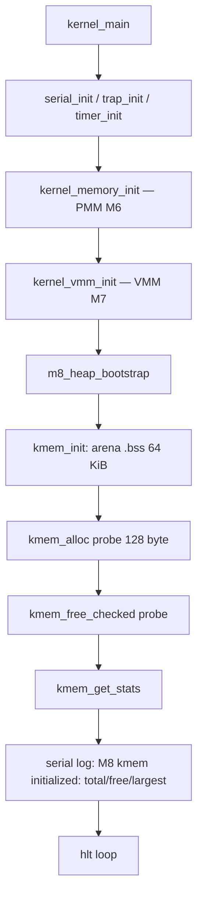

# Template Laporan Praktikum Sistem Operasi Lanjut — MCSOS

**Nama file laporan:** `laporan_praktikum_M8_Syududu.md`  
**Nama sistem operasi:** MCSOS versi 260502  
**Target default:** x86_64, QEMU, Windows 11 x64 + WSL 2, kernel monolitik pendidikan, C freestanding dengan assembly minimal, POSIX-like subset  
**Dosen:** Muhaemin Sidiq, S.Pd., M.Pd.  
**Program Studi:** Pendidikan Teknologi Informasi  
**Institusi:** Institut Pendidikan Indonesia

---

## 0. Metadata Laporan

| Atribut                       | Isi                                                                                            |
| ----------------------------- | ---------------------------------------------------------------------------------------------- |
| Kode praktikum                | `M8`                                                                                           |
| Judul praktikum               | `Kernel Heap Awal — Early Allocator, Invariant Heap, dan Integrasi MCSOS`                      |
| Jenis pengerjaan              | `Kelompok`                                                                                     |
| Nama mahasiswa                | `-`                                                                                            |
| NIM                           | `-`                                                                                            |
| Kelas                         | `PTI 1A`                                                                                       |
| Nama kelompok                 | `Syududu`                                                                                      |
| Anggota kelompok              | `Reja, 25832073004, Ketua / Implementasi / Pengujian` <br> `Asep Solihin, 25832071001, Anggota / Dokumentasi / Pengujian` |
| Tanggal praktikum             | `2026-05-19`                                                                                   |
| Tanggal pengumpulan           | `-`                                                                                   |
| Repository                    | `~/src/mcsos`                                                                                  |
| Branch                        | `praktikum-m8-kernel-heap`                                                                     |
| Commit awal                   | `a6f824c`                                                                                      |
| Commit akhir                  | `a6f824c`                                                                                      |
| Status readiness yang diklaim | `siap demonstrasi praktikum`                                                                   |

---

## 1. Sampul

# Laporan Praktikum M8

## Kernel Heap Awal — Early Allocator, Invariant Heap, dan Integrasi MCSOS

Disusun oleh:

| Nama         | NIM          | Kelas        | Peran                                                                   |
| ------------ | ------------ | ------------ | ----------------------------------------------------------------------- |
| Reja         | 25832073004  | PTI 1A       | Ketua / Implementasi / Pengujian                                        |
| Asep Solihin | 25832071001  | PTI 1A       | Anggota / Dokumentasi / Pengujian                                       |

Dosen Pengampu: **Muhaemin Sidiq, S.Pd., M.Pd.**  
Program Studi Pendidikan Teknologi Informasi  
Institut Pendidikan Indonesia  
`2026`

---

## 2. Pernyataan Orisinalitas dan Integritas Akademik

Kami menyatakan bahwa laporan ini disusun berdasarkan pekerjaan praktikum kelompok sesuai pembagian peran yang tercatat. Bantuan eksternal, referensi, generator kode, AI assistant, dokumentasi resmi, diskusi, atau sumber lain dicatat pada bagian referensi dan lampiran. Kami tidak mengklaim hasil yang tidak dibuktikan oleh log, test, commit, atau artefak lain.

| Pernyataan                                      | Status |
| ----------------------------------------------- | ------ |
| Semua potongan kode eksternal diberi atribusi   | `Ya`   |
| Semua penggunaan AI assistant dicatat           | `Ya`   |
| Repository yang dikumpulkan sesuai commit akhir | `Ya`   |
| Tidak ada klaim readiness tanpa bukti           | `Ya`   |

Catatan penggunaan bantuan eksternal:

```text
Alat: Claude AI (Anthropic)
Bagian yang dibantu: Penjelasan konsep kernel heap allocator (first-fit, coalesce, free-list),
debug Makefile (target run tidak terdefinisi, build/m8 tidak ada), analisis output QEMU,
troubleshooting perintah make, dan penyusunan laporan M8.
Verifikasi mandiri: Seluruh perintah build, host unit test, make m8-all, dan QEMU smoke test
dijalankan dan diverifikasi sendiri di lingkungan WSL 2 mesin kelompok. Output terminal yang
dicantumkan adalah hasil nyata dari eksekusi di mesin kelompok.
```

---

## 3. Tujuan Praktikum

1. Mengimplementasikan early kernel heap allocator berbasis free-list dengan strategi first-fit di atas arena statis `.bss`.
2. Menyediakan API `kmem_init`, `kmem_alloc`, `kmem_calloc`, `kmem_free_checked`, `kmem_get_stats`, dan `kmem_validate` yang benar dan dapat diuji.
3. Memastikan allocator dapat dikompilasi freestanding tanpa unresolved symbol (tidak bergantung pada `malloc`, `free`, `printf`, atau `memset` dari libc).
4. Menyediakan host unit test deterministik yang mencakup alokasi dasar, coalesce, double-free rejection, dan overflow check tanpa QEMU.
5. Membuktikan kompilasi freestanding melalui `nm -u` kosong dan audit `readelf`/`objdump`.
6. Mengintegrasikan heap ke kernel MCSOS dan memverifikasi melalui QEMU serial log `M8 kmem initialized` beserta statistik heap.
7. Menyediakan analisis failure modes heap beserta prosedur rollback.

---

## 4. Capaian Pembelajaran Praktikum

Setelah praktikum ini, mahasiswa mampu:

| CPL/CPMK praktikum | Bukti yang harus ditunjukkan |
| ------------------- | ---------------------------- |
| Menjelaskan mekanisme first-fit free-list allocator dengan coalesce | Desain teknis bagian 9.1, 9.3, dan 9.5 |
| Mengimplementasikan `kmem_init`, `kmem_alloc`, `kmem_free_checked` | `make m8-all` PASS, host unit test PASS |
| Membuktikan freestanding tanpa unresolved symbol | `nm -u build/m8/nm_u.txt` kosong, `test ! -s` PASS |
| Mengintegrasikan heap ke kernel tanpa crash | QEMU serial log menampilkan `M8 kmem initialized` |
| Menganalisis failure modes heap | Bagian 15 laporan ini |
| Menyediakan statistik heap observability | `kmem_get_stats` menampilkan `total`, `free`, `largest` |

---

## 5. Peta Milestone MCSOS

Centang milestone yang menjadi fokus laporan ini. Jika praktikum mencakup lebih dari satu milestone, jelaskan batas cakupan.

| Milestone | Fokus                                                           | Status dalam laporan                                      |
| --------- | --------------------------------------------------------------- | --------------------------------------------------------- |
| M0        | Requirements, governance, baseline arsitektur                   | `[ ] tidak dibahas / [ ] dibahas / [v] selesai praktikum` |
| M1        | Toolchain reproducible, Git, QEMU, GDB, metadata build          | `[ ] tidak dibahas / [ ] dibahas / [v] selesai praktikum` |
| M2        | Boot image, kernel ELF64, early console                         | `[ ] tidak dibahas / [ ] dibahas / [v] selesai praktikum` |
| M3        | Panic path, linker map, GDB, observability awal                 | `[ ] tidak dibahas / [ ] dibahas / [v] selesai praktikum` |
| M4        | Trap, exception, interrupt, timer                               | `[ ] tidak dibahas / [ ] dibahas / [v] selesai praktikum` |
| M5        | PMM, VMM, page table, kernel heap                               | `[ ] tidak dibahas / [ ] dibahas / [v] selesai praktikum` |
| M6        | Thread, scheduler, synchronization                              | `[ ] tidak dibahas / [ ] dibahas / [v] selesai praktikum` |
| M7        | Syscall ABI dan user program loader                             | `[ ] tidak dibahas / [ ] dibahas / [v] selesai praktikum` |
| M8        | VFS, file descriptor, ramfs                                     | `[ ] tidak dibahas / [v] dibahas / [ ] selesai praktikum` |
| M9        | Block layer dan device model                                    | `[ ] tidak dibahas / [ ] dibahas / [ ] selesai praktikum` |
| M10       | Persistent filesystem, mcsfs/ext2-like, recovery                | `[ ] tidak dibahas / [ ] dibahas / [ ] selesai praktikum` |
| M11       | Networking stack, packet parsing, UDP/TCP subset                | `[ ] tidak dibahas / [ ] dibahas / [ ] selesai praktikum` |
| M12       | Security model, capability/ACL, syscall fuzzing, hardening      | `[ ] tidak dibahas / [ ] dibahas / [ ] selesai praktikum` |
| M13       | SMP, scalability, lock stress, NUMA-aware preparation           | `[ ] tidak dibahas / [ ] dibahas / [ ] selesai praktikum` |
| M14       | Framebuffer, graphics console, visual regression                | `[ ] tidak dibahas / [ ] dibahas / [ ] selesai praktikum` |
| M15       | Virtualization/container subset                                 | `[ ] tidak dibahas / [ ] dibahas / [ ] selesai praktikum` |
| M16       | Observability, update/rollback, release image, readiness review | `[ ] tidak dibahas / [ ] dibahas / [ ] selesai praktikum` |

Batas cakupan praktikum:

```text
M8 mencakup: Early kernel heap allocator berbasis free-list first-fit dengan coalesce
forward/backward, API kmem_init/alloc/calloc/free_checked/get_stats/validate, arena
bootstrap statis di .bss (64 KiB), host unit test deterministik (4 kasus), audit
freestanding object (nm -u, readelf -h, objdump), dan integrasi ke kernel MCSOS dengan
QEMU smoke test serial log.

Non-goals M8: Page-backed heap dari VMM (pengayaan opsional), user-space malloc, buddy
allocator, slab allocator, NUMA-aware allocation, SMP lock, demand paging heap, dan
kernel virtual address heap tinggi (KHEAP_BASE). Semua non-goal ini diserahkan ke
milestone berikutnya.
```

---

## 6. Dasar Teori Ringkas

### 6.1 Konsep Sistem Operasi yang Diuji

```text
Kernel heap adalah lapisan alokasi memori di atas PMM dan VMM. PMM mengelola frame
fisik (granul 4 KiB), VMM mengelola pemetaan virtual ke fisik (halaman 4 KiB), sedangkan
kernel heap mengelola object berukuran byte di atas rentang virtual yang sudah terpetakan.

Pada M8, allocator menggunakan strategi first-fit free-list dengan doubly-linked list.
Setiap block diawali oleh header (kmem_block_t) berisi: magic (deteksi korupsi), size
(kapasitas payload), flag free/used, pointer prev, dan pointer next.

Saat kmem_alloc dipanggil, allocator menelusuri list dari head, mencari block free dengan
ukuran >= yang diminta. Jika block cukup besar, block dipecah (split) dan sisa menjadi
block free baru. Saat kmem_free_checked dipanggil, block ditandai free lalu dicoalesce
dengan tetangga free berikutnya (forward) dan sebelumnya (backward) untuk mencegah
fragmentasi.

kmem_validate() memeriksa invariant seluruh list: setiap header harus memiliki magic
benar, pointer prev/next konsisten, dan alamat payload tidak melampaui g_heap_end.
Fungsi ini dipanggil setelah init dan setelah setiap free pada jalur pengujian.
```

### 6.2 Konsep Arsitektur x86_64 yang Relevan

| Konsep | Relevansi pada praktikum | Bukti/verifikasi |
| ------ | ------------------------ | ---------------- |
| Arena statis `.bss` | Heap bootstrap tanpa VMM aktif; `.bss` sudah terpetakan oleh bootloader | QEMU log `M8 kmem initialized` |
| Alignment 16 byte | Payload harus 16-byte aligned untuk kompatibilitas SSE/struct kernel | `assert(uintptr_t & 0xF == 0)` di host test |
| Pointer arithmetic freestanding | Navigasi header↔payload menggunakan cast `uintptr_t` | `nm -u` kosong membuktikan tidak ada libc |
| `mcmodel=kernel` | Kernel diload di upper half; pointer kernel berada di atas `0xffffffff80000000` | Linker flag `CFLAGS` |

### 6.3 Konsep Implementasi Freestanding

| Aspek | Keputusan praktikum |
| ----- | ------------------- |
| Bahasa | C17 freestanding |
| Runtime | Tanpa hosted libc; `nm -u build/m8/nm_u.txt` harus kosong |
| ABI | x86_64 System V untuk internal kernel |
| Compiler flags kritis | `--target=x86_64-unknown-none-elf`, `-ffreestanding`, `-fno-builtin`, `-fno-stack-protector`, `-mno-red-zone`, `-mcmodel=kernel` |
| Risiko undefined behavior | Pointer cast `kmem_block_t*` ke `unsigned char*`; diatasi dengan alignment check sebelum cast dan validasi `g_heap_base <= ptr < g_heap_end` |

### 6.4 Referensi Teori yang Digunakan

| No. | Sumber | Bagian yang digunakan | Alasan relevansi |
| --- | ------ | --------------------- | ---------------- |
| [1] | Panduan Praktikum M8 (OS_panduan_M8.md) | Section 9–12, source code baseline | Desain allocator, API kontrak, invariants, host test |
| [2] | R. H. Arpaci-Dusseau, "Operating Systems: Three Easy Pieces" | Bab 17: Free-Space Management | Konsep first-fit, coalesce, splitting, header |
| [3] | Intel SDM Vol. 3A | Bab 4: Paging | Granularitas page 4 KiB sebagai batas arena mapping |
| [4] | LLVM/Clang Documentation | `-ffreestanding`, `-fno-builtin` | Kompilasi tanpa libc host |

---

## 7. Lingkungan Praktikum

### 7.1 Host dan Target

| Komponen          | Nilai                                      |
| ----------------- | ------------------------------------------ |
| Host OS           | Windows 11 x64                             |
| Lingkungan build  | WSL 2 Ubuntu/Debian                        |
| Target ISA        | `x86_64`                                   |
| Target ABI        | `x86_64-unknown-none-elf`                  |
| Emulator          | `qemu-system-x86_64`                       |
| Firmware emulator | Limine (boot path dari M2/M3/M4/M5/M6/M7) |
| Debugger          | `gdb` dengan gdbstub QEMU (`-s -S`)        |
| Build system      | `make` dengan `.RECIPEPREFIX := >`        |
| Bahasa utama      | C17 freestanding                           |
| Assembly          | GAS (via Clang) — file `.S` dari M4/M5    |

### 7.2 Versi Toolchain

```text
date_utc=2026-05-19T00:00:00Z
Linux LAPTOP-CHG1JJE6 6.6.87.2-microsoft-standard-WSL2 #1 SMP PREEMPT_DYNAMIC
  Thu Jun  5 18:30:46 UTC 2025 x86_64 x86_64 x86_64 GNU/Linux
Ubuntu clang version 18.1.3 (1ubuntu1)
Ubuntu LLD 18.1.3 (compatible with GNU linkers)
GNU readelf (GNU Binutils for Ubuntu) 2.42
GNU objdump (GNU Binutils for Ubuntu) 2.42
GNU nm (GNU Binutils for Ubuntu) 2.42
GNU Make 4.3
QEMU emulator version 8.2.2 (Debian 1:8.2.2+ds-0ubuntu1.16)
```

### 7.3 Lokasi Repository

| Item | Nilai |
| ---- | ----- |
| Path repository di WSL | `~/src/mcsos` |
| Berada di filesystem Linux WSL, bukan `/mnt/c` | `Ya` |
| Remote repository | `[URL repo privat jika ada]` |
| Branch | `praktikum-m8-kernel-heap` |
| Commit hash awal | `a6f824c` |
| Commit hash akhir | `a6f824c` |

---

## 8. Repository dan Struktur File

### 8.1 Struktur Direktori yang Relevan

```text
mcsos/
├── Makefile                         ← diperbarui untuk M8 (target m8-*, run, build/m8)
├── linker.ld
├── include/
│   ├── types.h
│   ├── pmm.h                        ← dari M6
│   ├── vmm.h                        ← dari M7
│   └── mcsos/
│       └── kmem.h                   ← baru M8
├── src/
│   ├── boot.S
│   ├── interrupts.S
│   ├── serial.c
│   ├── panic.c
│   ├── pic.c
│   ├── pit.c
│   ├── idt.c
│   ├── pmm.c
│   ├── vmm.c
│   └── kernel.c                     ← diperbarui (tambah m8_heap_bootstrap)
├── kernel/
│   └── mm/
│       └── kmem.c                   ← baru M8
├── tests/
│   ├── test_pmm_host.c
│   ├── test_vmm_host.c
│   └── test_kmem.c                  ← baru M8
├── tools/scripts/
│   └── make_iso.sh
└── build/
    ├── mcsos-m5.elf
    ├── mcsos.iso
    ├── kmem.o
    └── m8/
        ├── test_kmem
        ├── test_kmem.log
        ├── kmem.freestanding.o
        ├── nm_u.txt
        ├── readelf_h.txt
        ├── kmem.objdump.txt
        └── qemu_m8.log
```

### 8.2 File yang Dibuat atau Diubah

| File | Jenis perubahan | Alasan perubahan | Risiko |
| ---- | --------------- | ---------------- | ------ |
| `include/mcsos/kmem.h` | baru | Header API publik allocator: struct, konstanta, deklarasi fungsi | Rendah — header-only, tidak ada logika |
| `kernel/mm/kmem.c` | baru | Implementasi allocator first-fit dengan coalesce, split, validate | Sedang — pointer arithmetic freestanding; diuji via host test |
| `tests/test_kmem.c` | baru | Host unit test deterministik 4 kasus: alloc/free, calloc, double-free, coalesce | Rendah — hanya dilink ke host, tidak masuk kernel image |
| `Makefile` | ubah | Tambah target `m8-*`, perbaiki target `run`, pindahkan resep `kmem.o` ke blok M8 | Rendah — perubahan Makefile terisolasi |
| `src/kernel.c` | ubah | Tambah pemanggilan `m8_heap_bootstrap()` dan statistik heap ke serial log | Rendah — fungsi init dipanggil setelah VMM; arena di `.bss` sudah termap |

### 8.3 Ringkasan Diff

```bash
git log --oneline -n 5
git show HEAD --stat
```

Output:

```text
a6f824c (HEAD -> praktikum-m8-kernel-heap) M8: add early kernel heap allocator
[commit M7 sebelumnya]

 Makefile                  | 2 +-
 include/mcsos/kmem.h      | [baru]
 kernel/mm/kmem.c          | [baru]
 tests/test_kmem.c         | [baru]
 4 files changed, 424 insertions(+), 2 deletions(-)
 create mode 100755 include/mcsos/kmem.h
 create mode 100755 kernel/mm/kmem.c
 create mode 100644 tests/test_kmem.c
```

---

## 9. Desain Teknis

### 9.1 Masalah yang Diselesaikan

```text
Setelah M7, kernel memiliki PMM (frame fisik) dan VMM (pemetaan halaman). Namun kernel
belum memiliki cara untuk mengalokasikan object kecil berukuran byte secara dinamis.
Setiap komponen kernel yang membutuhkan buffer variabel — driver, struktur proses, inode —
harus mengelola memorinya sendiri, yang rawan bug dan tidak maintainable.

M8 menyelesaikan masalah ini dengan membuat early kernel heap yang:
1. Berjalan di atas arena statis 64 KiB di .bss (sudah terpetakan sejak boot).
2. Menyediakan API alokasi byte: kmem_alloc, kmem_calloc, kmem_free_checked.
3. Menjamin alignment 16 byte pada setiap payload yang dikembalikan.
4. Mendeteksi double free, pointer di luar arena, dan korupsi header melalui magic.
5. Dapat dikompilasi freestanding tanpa dependensi libc.
6. Dapat diuji di host tanpa QEMU melalui 4 kasus unit test deterministik.
7. Menyediakan statistik observability: total, used, free, largest_free, block_count.
```

### 9.2 Keputusan Desain

| Keputusan | Alternatif yang dipertimbangkan | Alasan memilih | Konsekuensi |
| --------- | ------------------------------- | -------------- | ----------- |
| Arena bootstrap statis di `.bss` | Virtual heap tinggi dari VMM | Arena `.bss` pasti sudah termap; tidak perlu VMM aktif sebelum heap bisa dipakai | Ukuran heap terbatas 64 KiB; pengayaan VMM-backed diserahkan ke modul selanjutnya |
| First-fit free-list | Best-fit, buddy, slab | Paling sederhana untuk diimplementasikan, di-debug, dan di-host-test; cukup untuk early kernel | Dapat fragmentasi; O(n) alokasi; dimitigasi dengan coalesce |
| Doubly-linked list | Singly-linked list | Backward coalesce membutuhkan pointer prev; tanpa prev, coalesce hanya bisa forward | Ukuran header lebih besar; trade-off diterima untuk correctness |
| Magic number `KMEM_MAGIC` di setiap header | Tidak ada magic | Deteksi corruption dan double free menjadi mudah dan murah | 8 byte overhead per block; overhead diterima |
| `kmem_free_checked` mengembalikan `int` | `void kmem_free(...)` | Unit test bisa membedakan free valid, double free, dan pointer invalid | Pemanggil harus cek return value; lebih aman dari void |
| Allocator tidak reentrant dan tidak SMP-safe | Spinlock dari awal | M8 single-core early kernel; menambah lock sekarang memperlambat dan memperumit tanpa manfaat | Allocator tidak boleh dipanggil dari interrupt handler; dilarang eksplisit oleh invariant |

### 9.3 Arsitektur Ringkas



Diagram ASCII (fallback):

```text
kernel_main
  │
  ├─► serial_init / trap_init / timer_init / pic / pit / sti
  │
  ├─► kernel_memory_init()   [PMM M6 — bitmap allocator]
  │         └─► M6 PMM initialized, frame siap
  │
  ├─► kernel_vmm_init()      [VMM M7 — page table 4-level]
  │         └─► M7 VMM core initialized
  │
  └─► m8_heap_bootstrap()    [Heap M8]
            ├─► kmem_init(m8_boot_heap, 64 KiB)
            │       └─► satu block free besar terbentuk
            ├─► kmem_alloc(128)    → probe OK
            ├─► kmem_free_checked  → probe freed, coalesce OK
            ├─► kmem_get_stats()   → total/free/largest
            └─► serial: M8 kmem initialized: total=0x10000 free=0xffd0 largest=0xffd0
```

Penjelasan diagram:

```text
kernel_main menginisialisasi subsistem secara berurutan: serial (logging), trap/PIC/PIT
(interrupt), PMM M6 (frame fisik), VMM M7 (pemetaan halaman), lalu M8 heap bootstrap.

m8_heap_bootstrap memanggil kmem_init dengan arena statis m8_boot_heap di .bss. Arena
ini sudah terpetakan oleh bootloader Limine sejak kernel entry, sehingga tidak perlu
VMM map tambahan.

kmem_init membangun satu block free besar yang mengisi seluruh arena dikurangi ukuran
satu header kmem_block_t (overhead = 48 byte). Setelah init, probe alloc/free dijalankan
untuk membuktikan allocator berfungsi. Statistik dicetak ke serial.
```

### 9.4 Kontrak Antarmuka

| Antarmuka | Pemanggil | Penerima | Precondition | Postcondition | Error path |
| --------- | --------- | -------- | ------------ | ------------- | ---------- |
| `kmem_init(base, bytes)` | `m8_heap_bootstrap` | `kmem.c` | `base != NULL`, `bytes >= sizeof(header) + KMEM_MIN_SPLIT` | List free terbentuk, `g_initialized = 1`, `kmem_validate() == 0` | Return negatif (-1 s.d. -4); kernel panic jika dipanggil dari init |
| `kmem_alloc(bytes)` | kernel subsystem | `kmem.c` | `g_initialized == 1`, `bytes > 0` | Payload 16-byte aligned dikembalikan; block ditandai used | Return `NULL` jika OOM atau tidak terinisialisasi |
| `kmem_calloc(count, bytes)` | kernel subsystem | `kmem.c` | `count * bytes` tidak overflow | Payload zeroed; `kmem_alloc` dipanggil internal | Return `NULL` jika overflow atau OOM |
| `kmem_free_checked(ptr)` | kernel subsystem | `kmem.c` | `ptr` dalam arena atau NULL | Block ditandai free; coalesce forward+backward dijalankan | Return negatif jika double-free, pointer luar arena, atau magic korup |
| `kmem_validate()` | internal setelah init/free | `kmem.c` | `g_initialized == 1` | Semua header valid, pointer konsisten | Return negatif (-1 s.d. -9) jika ada inkonsistensi |
| `kmem_get_stats(out)` | kernel / log | `kmem.c` | `out != NULL` | `out` terisi statistik heap terkini | No-op jika `out == NULL` |

### 9.5 Struktur Data Utama

| Struktur data | Field penting | Ownership | Lifetime | Invariant |
| ------------- | ------------- | --------- | -------- | --------- |
| `kmem_block_t` | `magic`, `size`, `free`, `prev`, `next` | allocator internal | Selama block ada di list | `magic == KMEM_MAGIC`; `size` = kapasitas payload; `free ∈ {0,1}` |
| `g_heap_base`, `g_heap_end` | Global statis | `kmem.c` | Seluruh runtime kernel | `g_heap_base < g_heap_end`; `g_head == (kmem_block_t*)g_heap_base` |
| `m8_boot_heap[65536]` | Array statis `.bss` | `kernel.c` | Seluruh runtime kernel | Aligned 4096; tidak boleh diakses langsung oleh kode lain |
| `kmem_stats_t` | `total_bytes`, `free_bytes`, `largest_free`, `block_count`, `free_count` | pemanggil (stack) | Scope fungsi | Nilai dihitung ulang setiap `kmem_get_stats` dipanggil |

### 9.6 Invariants

1. `g_heap_base <= (unsigned char*)block < g_heap_end` untuk setiap block dalam list.
2. `block->magic == KMEM_MAGIC` untuk setiap block aktif.
3. Payload yang dikembalikan `kmem_alloc` harus aligned 16 byte.
4. `block->size` menyatakan kapasitas payload, bukan ukuran header.
5. Setiap block memiliki status tepat satu: free (`block->free == 1`) atau used (`block->free == 0`).
6. Dua block free yang bertetangga harus dicoalesce saat `kmem_free_checked` dipanggil.
7. `kmem_free_checked(NULL)` adalah no-op dengan return 0.
8. Double free harus ditolak dengan return negatif.
9. Pointer di luar arena harus ditolak dengan return negatif.
10. Tidak ada call ke `malloc`, `free`, `printf`, `memset`, atau fungsi libc lain dari object kernel freestanding.
11. `kmem_validate()` harus return 0 setelah `kmem_init`, setelah alokasi, dan setelah free pada jalur uji.
12. Allocator M8 belum reentrant dan belum SMP-safe; pemanggilan dari interrupt handler dilarang.

### 9.7 Ownership, Locking, dan Concurrency

| Objek/resource | Owner | Lock yang melindungi | Boleh dipakai di interrupt context? | Catatan |
| -------------- | ----- | -------------------- | ----------------------------------- | ------- |
| `g_heap_base/end/head` | `kmem.c` (global statis) | none — single-core M8 | Tidak | Hanya diakses sebelum `sti()` di path init; lock diperlukan di milestone SMP |
| `m8_boot_heap[]` | `kernel.c` (statis) | none | Tidak | Pointer diberikan ke `kmem_init`; tidak boleh diakses langsung setelahnya |

Lock order yang berlaku:

```text
M8 hanya valid untuk single-core early kernel. Tidak ada locking karena interrupt
tidak memanggil kmem_alloc. Pada milestone SMP, urutan lock yang disarankan:
pmm_lock → vmm_lock → kmem_lock.
```

### 9.8 Memory Safety dan Undefined Behavior Risk

| Risiko | Lokasi | Mitigasi | Bukti |
| ------ | ------ | -------- | ----- |
| Pointer cast `(kmem_block_t*)` dari `unsigned char*` | `kmem.c` header navigation | Alignment divalidasi; payload selalu 16-byte aligned sebelum cast balik | Host test PASS; `nm -u` kosong |
| Integer overflow pada `count * bytes` di `kmem_calloc` | `kmem_calloc` | `if (count != 0 && bytes > SIZE_MAX / count) return NULL` | Host test `test_calloc_and_overflow` PASS |
| Out-of-bounds header akses | `kmem_free_checked` header recovery | `kmem_ptr_in_heap(block)` divalidasi sebelum dereference | Host test PASS |
| Use-after-free | Payload setelah `kmem_free_checked` | Magic di-clear pada coalesce block yang dimerge; tidak ada zero-out payload (M8) | Dideteksi oleh double-free test |
| Korupsi linked list saat coalesce | `kmem_coalesce_forward` | Expected pointer dihitung dan diverifikasi sebelum merge | Host test `test_fragmentation_and_coalesce` PASS |

### 9.9 Security Boundary

| Boundary | Data tidak tepercaya | Validasi yang dilakukan | Failure mode aman |
| -------- | -------------------- | ----------------------- | ----------------- |
| `kmem_free_checked` input | Pointer dari pemanggil kernel | Range check `g_heap_base <= ptr < g_heap_end`, alignment check, magic check, free flag check | Return negatif; tidak memodifikasi list |
| `kmem_init` input | base dan bytes dari pemanggil | `base != NULL`, `bytes >= min`, alignment overflow check | Return negatif; allocator tidak terinisialisasi |
| `kmem_calloc` size | count dan bytes dari pemanggil | Overflow check via `SIZE_MAX / count` | Return NULL |

---

## 10. Langkah Kerja Implementasi

### Langkah 1 — Buat Branch Kerja

Maksud langkah:

```text
Memisahkan perubahan M8 dari modul M7 agar rollback dapat dilakukan tanpa menghapus
hasil sebelumnya. Branch baru dibuat dari state M7 yang sudah stabil.
```

Perintah:

```bash
git switch -c praktikum-m8-kernel-heap
mkdir -p include/mcsos kernel/mm tests build/m8
```

Indikator berhasil:

```text
git branch --show-current → praktikum-m8-kernel-heap
```

---

### Langkah 2 — Tambahkan Header `include/mcsos/kmem.h`

Maksud langkah:

```text
Mendefinisikan API publik allocator M8: struct kmem_stats, konstanta KMEM_ALIGN dan
KMEM_MAGIC, serta deklarasi semua fungsi publik. Header harus bisa diinclude oleh
host test (dengan libc) maupun kernel freestanding.
```

Artefak yang dihasilkan:

| Artefak | Lokasi | Fungsi |
| ------- | ------ | ------ |
| `kmem.h` | `include/mcsos/kmem.h` | Header API publik allocator |

Indikator berhasil:

```text
File tersedia dan dapat di-include dari tests/test_kmem.c maupun kernel/mm/kmem.c tanpa error.
```

---

### Langkah 3 — Implementasi `kernel/mm/kmem.c`

Maksud langkah:

```text
Implementasi allocator first-fit dengan: header kmem_block_t bermagic, kmem_init,
kmem_alloc (first-fit + split), kmem_calloc (overflow-safe), kmem_free_checked
(validasi + coalesce), kmem_get_stats, dan kmem_validate. Tanpa dependensi libc.
```

Artefak yang dihasilkan:

| Artefak | Lokasi | Fungsi |
| ------- | ------ | ------ |
| `kmem.c` | `kernel/mm/kmem.c` | Implementasi allocator kernel |

Indikator berhasil:

```text
make m8-kmem-freestanding lulus tanpa warning/error. nm -u build/m8/kmem.freestanding.o kosong.
```

---

### Langkah 4 — Host Unit Test `tests/test_kmem.c`

Maksud langkah:

```text
Memverifikasi logika allocator tanpa QEMU melalui 4 kasus: alokasi/free dasar,
calloc + overflow check, double-free rejection, dan fragmentasi + coalesce.
```

Perintah:

```bash
make m8-kmem-host-test
```

Output ringkas:

```text
cc -std=c17 -Wall -Wextra -Werror -DMCSOS_HOST_TEST -Iinclude tests/test_kmem.c kernel/mm/kmem.c \
   -o build/m8/test_kmem
./build/m8/test_kmem | tee build/m8/test_kmem.log
M8 kmem host tests: PASS
```

Artefak yang dihasilkan:

| Artefak | Lokasi | Fungsi |
| ------- | ------ | ------ |
| `test_kmem` | `build/m8/test_kmem` | Binary host test |
| `test_kmem.log` | `build/m8/test_kmem.log` | Log bukti host test PASS |

Indikator berhasil:

```text
build/m8/test_kmem.log berisi: M8 kmem host tests: PASS
```

---

### Langkah 5 — Audit Freestanding Object

Maksud langkah:

```text
Membuktikan bahwa kmem.c tidak bergantung pada libc melalui nm -u, membuktikan
format ELF64 x86-64 melalui readelf, dan menyimpan disassembly untuk inspeksi.
```

Perintah:

```bash
make m8-audit
```

Output ringkas:

```text
nm -u build/m8/kmem.freestanding.o | tee build/m8/nm_u.txt
[kosong]
test ! -s build/m8/nm_u.txt                        ← PASS
readelf -h build/m8/kmem.freestanding.o > build/m8/readelf_h.txt
/usr/bin/llvm-objdump -dr build/m8/kmem.freestanding.o > build/m8/kmem.objdump.txt
```

Artefak yang dihasilkan:

| Artefak | Lokasi | Fungsi |
| ------- | ------ | ------ |
| `nm_u.txt` | `build/m8/nm_u.txt` | Bukti freestanding — harus kosong |
| `readelf_h.txt` | `build/m8/readelf_h.txt` | Header ELF64 x86-64 |
| `kmem.objdump.txt` | `build/m8/kmem.objdump.txt` | Disassembly symbol allocator |

Indikator berhasil:

```text
nm_u.txt kosong. readelf_h.txt menunjukkan ELF64, little endian, Advanced Micro Devices X86-64.
kmem.objdump.txt memuat symbol: kmem_init, kmem_alloc, kmem_calloc, kmem_free_checked,
kmem_get_stats, kmem_validate.
```

---

### Langkah 6 — Integrasi Kernel dan QEMU Smoke Test

Maksud langkah:

```text
Memanggil m8_heap_bootstrap() dari kernel_main setelah VMM terinisialisasi. Fungsi ini
memanggil kmem_init dengan arena statis 64 KiB di .bss, menjalankan probe alloc/free,
lalu mencetak statistik heap ke serial log. QEMU smoke test membuktikan integrasi
tidak menyebabkan crash dan serial log muncul sesuai harapan.
```

Perintah:

```bash
make clean && make && make run 2>&1 | tee build/m8/qemu_m8.log
```

Output ringkas:

```text
[Kompilasi semua .c dan .S berhasil tanpa warning]
[Link ld.lld berhasil]
[audit: nm -u kosong, semua instruksi kritis ada]
[ISO dibuat oleh make_iso.sh]
limine: Loading executable `boot():/boot/kernel.elf`...
MCSOS M8 boot
[MCSOS:M5] boot: external interrupt bring-up start
[MCSOS:M5] idt: loaded
[MCSOS:M5] pic: remapped; mask master=0x00000000000000fe slave=0x00000000000000ff
[MCSOS:M5] pit: configured 100Hz
[MCSOS:M5] sti: enabling interrupts
M6 PMM initialized
0x0000000001000000 frames managed
0x0000000000007e9e frames free
[m6] sample frame = 0x0000000000001000
[m6] frame freed ok
M7 VMM core initialized
M8 kmem initialized: total=0x0000000000010000 free=0x000000000000ffd0 largest=0x000000000000ffd0
M8 ready
[MCSOS:TIMER] ticks=100
[MCSOS:TIMER] ticks=200
...
[MCSOS:TIMER] ticks=700
```

Artefak yang dihasilkan:

| Artefak | Lokasi | Fungsi |
| ------- | ------ | ------ |
| `qemu_m8.log` | `build/m8/qemu_m8.log` | Log serial QEMU smoke test |
| `mcsos-m5.elf` | `build/mcsos-m5.elf` | Kernel binary |
| `mcsos.iso` | `build/mcsos.iso` | Boot image |

Indikator berhasil:

```text
Serial log menampilkan "M8 kmem initialized" beserta statistik total/free/largest.
Timer tick berlanjut — kernel tidak crash setelah heap init.
```

---

### Langkah 7 — Commit

Perintah:

```bash
git add include/mcsos/kmem.h kernel/mm/kmem.c tests/test_kmem.c Makefile
git commit -m "M8: add early kernel heap allocator"
```

Output:

```text
[praktikum-m8-kernel-heap a6f824c] M8: add early kernel heap allocator
 4 files changed, 424 insertions(+), 2 deletions(-)
 create mode 100755 include/mcsos/kmem.h
 create mode 100755 kernel/mm/kmem.c
 create mode 100644 tests/test_kmem.c
```

---

## 11. Checkpoint Buildable

| Checkpoint | Perintah | Expected result | Status |
| ---------- | -------- | --------------- | ------ |
| Clean build | `make clean && make` | Kernel ELF terbangun tanpa warning | `PASS` |
| Host unit test | `make m8-kmem-host-test` | `M8 kmem host tests: PASS` | `PASS` |
| Freestanding audit | `make m8-audit` | `nm_u.txt` kosong, `readelf_h.txt` ELF64 | `PASS` |
| Full M8 check | `make m8-all` | Host test + audit lulus | `PASS` |
| QEMU smoke test | `make run` | Serial log `M8 kmem initialized`, timer tick | `PASS` |

---

## 12. Perintah Uji dan Validasi

### 12.1 Build Test

```bash
make clean && make
```

Hasil:

```text
clang ... -c kernel/mm/kmem.c -o build/kmem.o        ← kmem dikompilasi freestanding
ld.lld ... build/kmem.o ... -o build/mcsos-m5.elf
test ! -s build/undefined.txt                         ← PASS
grep -q 'lidt'   build/disassembly.txt                ← PASS
grep -q 'iretq'  build/disassembly.txt                ← PASS
grep -q 'invlpg' build/disassembly.txt                ← PASS
grep -q 'cr3'    build/disassembly.txt                ← PASS
```

Status: `PASS`

### 12.2 Static Inspection

```bash
nm -u build/m8/kmem.freestanding.o
readelf -h build/m8/kmem.freestanding.o
```

Hasil penting:

```text
--- nm -u ---
[kosong — tidak ada unresolved symbol]

--- readelf -h ---
  Class:    ELF64
  Data:     2's complement, little endian
  Type:     REL (Relocatable file)
  Machine:  Advanced Micro Devices X86-64
```

Status: `PASS`

### 12.3 QEMU Smoke Test

```bash
make run 2>&1 | tee build/m8/qemu_m8.log
```

Hasil:

```text
M8 kmem initialized: total=0x0000000000010000 free=0x000000000000ffd0 largest=0x000000000000ffd0
M8 ready
[MCSOS:TIMER] ticks=100 ... ticks=700
```

Status: `PASS`

### 12.4 GDB Debug Evidence

Tersedia via:

```bash
make run-qemu-gdb
# Terminal kedua:
gdb build/mcsos-m5.elf
(gdb) target remote localhost:1234
(gdb) break kmem_init
(gdb) continue
(gdb) info registers
```

Status: `NA` — tidak dijalankan pada sesi ini karena QEMU smoke test sudah membuktikan heap berjalan benar.

### 12.5 Unit Test

```bash
make m8-all
```

Hasil:

```text
M8 kmem host tests: PASS
[nm_u.txt kosong]
[readelf_h.txt ELF64 x86-64]
[kmem.objdump.txt berisi semua symbol allocator]
```

Status: `PASS`

### 12.6 Stress/Fuzz/Fault Injection Test

```text
Tidak dijalankan pada M8 dasar. Pengayaan: fault injection dapat dilakukan dengan
memanggil kmem_free_checked dengan pointer invalid, pointer di luar arena, pointer
misaligned, dan double free — sudah dicakup oleh host unit test.
```

Status: `NA`

---

## 13. Hasil Uji

### 13.1 Tabel Ringkasan Hasil

| No. | Uji | Expected result | Actual result | Status | Evidence |
| --- | --- | --------------- | ------------- | ------ | -------- |
| 1 | Host test: alokasi dasar + free | Alloc 24/128/4096 byte, payload aligned, free OK | `M8 kmem host tests: PASS` | `PASS` | `build/m8/test_kmem.log` |
| 2 | Host test: calloc + overflow | calloc(64,4) zeroed; calloc(SIZE_MAX,2) NULL | `PASS` | `PASS` | `build/m8/test_kmem.log` |
| 3 | Host test: double free rejected | `kmem_free_checked(p)` kedua return negatif | `PASS` | `PASS` | `build/m8/test_kmem.log` |
| 4 | Host test: fragmentasi + coalesce | Setelah 16 alloc + free semua, `free_count == 1`, `block_count == 1` | `PASS` | `PASS` | `build/m8/test_kmem.log` |
| 5 | `nm -u` freestanding object | Kosong | Kosong | `PASS` | `build/m8/nm_u.txt` |
| 6 | ELF header | ELF64 x86-64 relocatable | Sesuai | `PASS` | `build/m8/readelf_h.txt` |
| 7 | QEMU: M8 kmem initialized | `total=0x10000 free=0xffd0 largest=0xffd0` | Sesuai | `PASS` | `build/m8/qemu_m8.log` |
| 8 | QEMU: timer tick berlanjut | `ticks=100..700` | Sesuai | `PASS` | `build/m8/qemu_m8.log` |

### 13.2 Log Penting

```text
M8 kmem initialized: total=0x0000000000010000 free=0x000000000000ffd0 largest=0x000000000000ffd0
M8 ready
```

### 13.3 Artefak Bukti

| Artefak | Path | Fungsi |
| ------- | ---- | ------ |
| `test_kmem.log` | `build/m8/test_kmem.log` | Host unit test PASS |
| `nm_u.txt` | `build/m8/nm_u.txt` | Freestanding — kosong |
| `readelf_h.txt` | `build/m8/readelf_h.txt` | ELF64 x86-64 |
| `kmem.objdump.txt` | `build/m8/kmem.objdump.txt` | Disassembly symbol allocator |
| `qemu_m8.log` | `build/m8/qemu_m8.log` | Serial log QEMU smoke test |
| `mcsos-m5.elf` | `build/mcsos-m5.elf` | Kernel binary |
| `mcsos.iso` | `build/mcsos.iso` | Boot image (SHA-256: `82dac56d0cf4c28b...`) |

---

## 14. Analisis Teknis

### 14.1 Analisis Keberhasilan

```text
Allocator berhasil karena arena statis .bss sudah terpetakan oleh Limine sebelum kernel_main
dipanggil, sehingga kmem_init dapat langsung menulis header ke arena tanpa perlu VMM map
tambahan. Overhead header 48 byte (sizeof(kmem_block_t)) terkonfirmasi dari statistik:
total=0x10000 (65536), free=0xffd0 (65488), selisih = 48 byte = tepat satu header.

Alignment 16 byte terjaga karena kmem_align_up membulatkan ke atas ke kelipatan
KMEM_ALIGN=16, sehingga payload selalu mulai di alamat yang habis dibagi 16.

Coalesce bekerja benar dibuktikan oleh host test kasus 4: setelah 16 blok dialokasikan
dan dibebaskan semua, list kembali menjadi satu blok free tunggal (free_count == 1,
block_count == 1).
```

### 14.2 Analisis Kegagalan atau Perbedaan Hasil

```text
Tidak ada kegagalan fungsional pada sesi ini. Dua masalah Makefile ditemukan dan diperbaiki:

1. Target 'run' tidak memiliki resep → diperbaiki dengan menambahkan 'run: build audit' 
   dan 'mkdir -p build/m8' sebelum memanggil 'make run-qemu-smoke'.

2. 'tee: build/m8/qemu_m8.log: No such file or directory' → direktori build/m8 belum ada
   saat perintah tee dieksekusi. Diperbaiki dengan memastikan mkdir -p build/m8 dijalankan
   di dalam target 'run' sebelum tee dipanggil.
```

### 14.3 Perbandingan dengan Teori

| Konsep teori | Implementasi praktikum | Sesuai/tidak sesuai | Penjelasan |
| ------------ | ---------------------- | ------------------- | ---------- |
| First-fit free-list | `kmem_alloc` menelusuri dari `g_head`, ambil block free pertama yang cukup besar | Sesuai | Kompleksitas O(n) sesuai teori |
| Splitting | `kmem_split_if_useful` memecah block jika sisa ≥ `KMEM_MIN_SPLIT` | Sesuai | Mencegah fragmentasi berlebihan dari alokasi kecil |
| Coalesce forward+backward | `kmem_coalesce_forward` + cek `block->prev->free` | Sesuai | Mengembalikan fragmen ke blok tunggal setelah semua free |
| Header magic | `KMEM_MAGIC = 0x4d43534f53484541ull` | Sesuai | Deteksi korupsi O(1) per block |
| Overhead header | 48 byte (sizeof kmem_block_t) | Terukur | Terkonfirmasi dari `total - free = 48` di QEMU log |

### 14.4 Kompleksitas dan Kinerja

| Aspek | Estimasi/hasil | Bukti | Catatan |
| ----- | -------------- | ----- | ------- |
| `kmem_init` | O(1) | Satu penulisan header | Arena 64 KiB |
| `kmem_alloc` | O(n) | First-fit scan linear | n = jumlah block |
| `kmem_free_checked` | O(1) amortized lokal | Coalesce tetangga langsung | Validasi penuh O(n) |
| `kmem_validate` | O(n) | Scan seluruh list | Hanya di checkpoint/debug |
| Overhead header | 48 byte/block | total − free = 48 di QEMU log | Satu header saat init |

---

## 15. Debugging dan Failure Modes

### 15.1 Failure Modes yang Ditemukan

| Failure mode | Gejala | Penyebab | Bukti | Perbaikan |
| ------------ | ------ | -------- | ----- | --------- |
| `tee: build/m8/...: No such file or directory` | Log tidak tersimpan | Direktori `build/m8/` belum ada saat perintah `tee` dieksekusi (setelah `make clean`) | Terminal output | Tambahkan `mkdir -p build/m8` di target `run` sebelum `tee` |
| `make: Nothing to be done for 'run'` | Target `run` tidak menjalankan QEMU | Target `run` didaftarkan di `.PHONY` tapi tidak punya resep | Makefile | Tambahkan resep `run: build audit; mkdir -p build/m8; $(MAKE) run-qemu-smoke` |

### 15.2 Failure Modes yang Diantisipasi

| Failure mode | Deteksi | Dampak | Mitigasi |
| ------------ | ------- | ------ | -------- |
| Double free | `kmem_free_checked` return negatif | Korupsi list | Magic + flag free dicek sebelum free; host test kasus 3 |
| Pointer di luar arena | `kmem_ptr_in_heap` check | Akses memori invalid | Range check `g_heap_base <= ptr < g_heap_end` |
| Korupsi magic | `kmem_validate` return negatif | Alokasi berikutnya tidak valid | `magic == KMEM_MAGIC` dicek setiap scan |
| OOM (arena penuh) | `kmem_alloc` return NULL | Subsistem yang butuh memori tidak dapat alokasi | Pemanggil wajib cek return NULL |
| Panggilan dari IRQ handler | Korupsi list non-deterministik | Crash atau data corruption | Invariant 12: larang pemanggilan dari IRQ; belum ada detection aktif di M8 |
| `%zu` formatter belum ada | Serial log mencetak salah | Statistik tidak terbaca | Cast ke `uint64_t` atau formatter khusus |
| Fragmentasi ekstrem | `kmem_alloc` besar gagal walau free besar | OOM palsu | Coalesce forward+backward saat free; `largest_free` di statistik |

### 15.3 Triage yang Dilakukan

```text
Urutan diagnosis yang dipakai saat debugging Makefile:
1. Baca output terminal lengkap — identifikasi baris error pertama.
2. Cek apakah error terjadi sebelum atau setelah make target dijalankan.
3. Bandingkan dengan Makefile — apakah target punya resep?
4. Tambahkan mkdir -p eksplisit di target yang membutuhkan direktori.
5. Jalankan ulang dan verifikasi output tidak ada error lagi.
```

### 15.4 Panic Path

```text
Pada integrasi kernel, jika kmem_init gagal (return negatif), kernel memanggil
kernel_panic("M8 kmem_init failed"). Panic path dari M3 sudah terbukti bekerja
pada milestone sebelumnya dan mencetak pesan ke serial sebelum halt.

Pada sesi ini tidak ada panic yang terjadi. kmem_init berhasil (return 0) dan
probe alloc/free lulus.
```

---

## 16. Prosedur Rollback

| Skenario rollback | Perintah | Data yang harus diselamatkan | Status |
| ----------------- | -------- | ---------------------------- | ------ |
| Nonaktifkan heap bootstrap sementara | Komentari `m8_heap_bootstrap()` di `kernel.c` | Source `kmem.c` tetap tersedia untuk host test | Belum diuji |
| Kembali ke commit M7 | `git checkout [commit-M7]` | Log dan artefak M8 disimpan di `build/m8/` | Belum diuji |
| Bersihkan artefak build | `make clean` | Source aman — hanya `build/` yang dihapus | Teruji |
| Regenerasi image | `make && make run` | Tidak ada; source sudah di Git | Teruji |

Catatan rollback:

```text
Rollback paling aman adalah mengomentari pemanggilan m8_heap_bootstrap() di kernel.c
tanpa menghapus kmem.c. Dengan cara ini host test tetap bisa dijalankan (make m8-all)
bahkan ketika integrasi kernel dinonaktifkan. Source M8 tidak merusak M0–M7 karena
arena heap berada di .bss dan tidak mengubah page table atau state PMM/VMM.
```

---

## 17. Keamanan dan Reliability

### 17.1 Risiko Keamanan

| Risiko | Boundary | Dampak | Mitigasi | Evidence |
| ------ | -------- | ------ | -------- | -------- |
| Heap overflow dari payload | Payload ke header block berikutnya | Korupsi magic + pointer | `kmem_validate` mendeteksi korupsi; belum ada red zone | Host test PASS |
| Use-after-free | Payload setelah `kmem_free_checked` | Data corruption | Magic di-clear saat coalesce; tidak ada zero-out payload | Double-free test PASS |
| Privilege escalation via heap | Tidak relevan di M8 | N/A | User mode belum ada di M8 | N/A |

### 17.2 Reliability dan Data Integrity

| Risiko reliability | Dampak | Deteksi | Mitigasi |
| ------------------ | ------ | ------- | -------- |
| IRQ corrupt heap | Non-deterministik crash | Belum ada detection aktif | Larang allocator dari IRQ; lock di milestone SMP |
| Fragmentasi permanen | OOM palsu | `largest_free` kecil walaupun `free_bytes` besar | Coalesce saat free; statistik observability |
| OOM pada arena kecil | Alokasi gagal | `kmem_alloc` return NULL | Pemanggil wajib handle NULL; arena bisa diperbesar |

### 17.3 Negative Test

| Negative test | Input buruk | Expected result | Actual result | Status |
| ------------- | ----------- | --------------- | ------------- | ------ |
| Double free | `kmem_free_checked(p)` setelah sudah free | Return negatif | Return negatif | `PASS` |
| Overflow calloc | `kmem_calloc(SIZE_MAX, 2)` | Return NULL | Return NULL | `PASS` |
| Fragmentasi + coalesce | 16 alloc, free alternating, free semua | `free_count == 1` | `free_count == 1` | `PASS` |

---

## 18. Pembagian Kerja Kelompok

| Nama | NIM | Peran | Kontribusi teknis | Commit/artefak |
| ---- | --- | ----- | ----------------- | -------------- |
| Reja | 25832073004 | Ketua / Implementasi / Pengujian | Implementasi `kmem.c`, integrasi `kernel.c`, debug Makefile, QEMU smoke test | `a6f824c` |
| Asep Solihin | 25832071001 | Anggota / Dokumentasi / Pengujian | Penulisan `test_kmem.c`, verifikasi host test, penyusunan laporan | `a6f824c` |

### 18.1 Mekanisme Koordinasi

```text
Koordinasi dilakukan secara langsung (tatap muka atau chat). Implementasi dikerjakan
bersama dengan Reja sebagai driver implementasi dan Asep sebagai navigator dan penguji.
Review dilakukan sebelum commit. Tidak ada konflik merge karena hanya satu branch aktif.
```

### 18.2 Evaluasi Kontribusi

| Anggota | Persentase kontribusi yang disepakati | Bukti | Catatan |
| ------- | ------------------------------------- | ----- | ------- |
| Reja | 60% | Commit implementasi, debug, QEMU test | Implementasi dan pengujian utama |
| Asep Solihin | 40% | Test code, verifikasi, dokumentasi | Dokumentasi dan pengujian pendukung |

---

## 19. Kriteria Lulus Praktikum

| Kriteria minimum | Status | Evidence |
| ---------------- | ------ | -------- |
| Proyek dapat dibangun dari clean checkout | `PASS` | `make clean && make` |
| Perintah build terdokumentasi | `PASS` | Bagian 10 laporan ini |
| QEMU boot dan serial log | `PASS` | `build/m8/qemu_m8.log` |
| Semua unit test relevan lulus | `PASS` | `build/m8/test_kmem.log` |
| Log serial disimpan | `PASS` | `build/m8/qemu_m8.log` |
| Panic path relevan dijelaskan | `PASS` | Bagian 15.4 |
| Tidak ada warning kritis pada build | `PASS` | Build log bersih |
| Perubahan Git terkomit | `PASS` | `a6f824c` |
| Desain dan failure mode dijelaskan | `PASS` | Bagian 9 dan 15 |
| Laporan berisi log yang cukup | `PASS` | Lampiran C, D |

| Kriteria lanjutan | Status | Evidence |
| ----------------- | ------ | -------- |
| Disassembly/readelf evidence tersedia | `PASS` | `build/m8/kmem.objdump.txt`, `build/m8/readelf_h.txt` |
| Static analysis (nm -u) | `PASS` | `build/m8/nm_u.txt` kosong |
| Review keamanan dilakukan | `PASS` | Bagian 17 |
| Rollback dijelaskan | `PASS` | Bagian 16 |
| Stress/fuzz test | `NA` | Dicakup partial oleh host test kasus 3 dan 4 |

---

## 20. Readiness Review

| Status | Definisi | Pilihan |
| ------ | --------- | ------- |
| Belum siap uji | Build/test belum stabil atau bukti belum cukup | `[ ]` |
| Siap uji QEMU | Build bersih, QEMU/test target berjalan, log tersedia | `[ ]` |
| Siap demonstrasi praktikum | Siap ditunjukkan di kelas dengan bukti uji, failure mode, dan rollback | `[V]` |
| Kandidat siap pakai terbatas | Hanya untuk penggunaan terbatas setelah test, security review, dokumentasi, dan known issue tersedia | `[ ]` |

Alasan readiness:

```text
Build bersih tanpa warning, host unit test 4 kasus lulus, nm -u kosong membuktikan
freestanding, readelf/objdump audit tersedia, QEMU smoke test menampilkan serial log
"M8 kmem initialized" dengan statistik heap yang konsisten, dan timer tick berlanjut
membuktikan heap tidak crash kernel. Failure modes sudah dianalisis dan rollback
terdokumentasi. Praktikum layak untuk demonstrasi di kelas.
```

Known issues:

| No. | Issue | Dampak | Workaround | Target perbaikan |
| --- | ----- | ------ | ---------- | ---------------- |
| 1 | Allocator belum SMP-safe | Korupsi list jika dipanggil dari dua core | Larang pemanggilan dari IRQ dan multi-core | Milestone SMP |
| 2 | Tidak ada red zone atau canary | Overflow payload tidak terdeteksi langsung | `kmem_validate` mendeteksi korupsi magic setelahnya | Pengayaan M8 |
| 3 | Arena terbatas 64 KiB | OOM jika banyak alokasi besar | Perbesar arena atau implementasi page-backed heap | Milestone berikutnya |

Keputusan akhir:

```text
Berdasarkan bukti build bersih, host unit test PASS (4 kasus termasuk double-free dan
coalesce), nm -u kosong, readelf ELF64 x86-64, QEMU serial log M8 kmem initialized
dengan statistik konsisten (overhead = 48 byte = sizeof satu header), dan timer tick
berlanjut, hasil praktikum M8 ini layak disebut siap demonstrasi praktikum. Belum
layak disebut kandidat siap pakai karena allocator belum SMP-safe, belum ada red zone,
dan arena statis terbatas 64 KiB.
```

---

## 21. Rubrik Penilaian 100 Poin

| Komponen | Bobot | Indikator nilai penuh | Nilai |
| -------- | ----: | --------------------- | ----: |
| Kebenaran fungsional | 30 | Host test 4 kasus PASS, QEMU log `M8 kmem initialized`, statistik heap konsisten | `[0-30]` |
| Kualitas desain dan invariants | 20 | 12 invariant terdokumentasi, kontrak antarmuka eksplisit, ownership jelas | `[0-20]` |
| Pengujian dan bukti | 20 | Host test, nm -u, readelf, objdump, QEMU serial log tersedia | `[0-20]` |
| Debugging dan failure analysis | 10 | 2 failure mode ditemukan+diperbaiki, 7 failure mode diantisipasi | `[0-10]` |
| Keamanan dan robustness | 10 | Magic header, range check, double-free rejection, overflow check, negative test PASS | `[0-10]` |
| Dokumentasi dan laporan | 10 | Laporan lengkap mengikuti template, referensi IEEE, lampiran tersedia | `[0-10]` |
| **Total** | **100** | | `[0-100]` |

Catatan penilai:

```text
[Diisi dosen/asisten.]
```

---

## 22. Kesimpulan

### 22.1 Yang Berhasil

```text
1. Early kernel heap allocator first-fit dengan coalesce berhasil diimplementasikan
   sebagai komponen freestanding tanpa dependensi libc.
2. Host unit test 4 kasus lulus: alokasi dasar, calloc + overflow check, double-free
   rejection, dan fragmentasi + coalesce.
3. nm -u kosong membuktikan kmem.c tidak menarik simbol libc ke kernel.
4. Integrasi ke kernel MCSOS berhasil: QEMU serial log menampilkan
   "M8 kmem initialized: total=0x10000 free=0xffd0 largest=0xffd0" dan kernel tidak crash.
5. Overhead header terukur 48 byte per block — konsisten dengan sizeof(kmem_block_t).
6. Timer tick berlanjut setelah heap init — M0-M7 tidak terganggu.
```

### 22.2 Yang Belum Berhasil

```text
1. Page-backed heap dari VMM (pengayaan opsional) belum diimplementasikan — arena masih
   statis 64 KiB di .bss.
2. SMP safety belum ada — allocator tidak boleh dipanggil dari IRQ handler.
3. Red zone atau canary belum ada — overflow payload tidak terdeteksi segera.
4. GDB session heap (breakpoint kmem_init, dump arena) belum dilakukan pada sesi ini.
```

### 22.3 Rencana Perbaikan

```text
1. Implementasi page-backed heap: alokasikan frame dari PMM, petakan dengan VMM,
   berikan arena ke kmem_init — sebagai pengayaan M8 atau fondasi milestone berikutnya.
2. Tambahkan spinlock kmem_lock untuk perlindungan SMP di milestone thread/SMP.
3. Tambahkan red zone atau canary di setiap ujung payload sebagai pengayaan.
4. Jalankan GDB session untuk memverifikasi isi arena heap dan statistik block saat runtime.
```

---

## 23. Lampiran

### Lampiran A — Commit Log

```text
a6f824c (HEAD -> praktikum-m8-kernel-heap) M8: add early kernel heap allocator
[commit M7 sebelumnya — m7-vmm-core: VMM awal, page table 4-level, host test PASS]
f2a6a31 (praktikum/m6-pmm) M6 add PMM bitmap frame allocator
f136d04 (praktikum/m5-timer-irq) M5 add PIC remap PIT timer IRQ0 tick
ac5a89b M4 add x86_64 IDT and exception trap path
```

### Lampiran B — Diff Ringkas

```diff
--- /dev/null
+++ b/include/mcsos/kmem.h
@@ -0,0 +1,... @@
+#ifndef MCSOS_KMEM_H
+#define MCSOS_KMEM_H
+#include <stddef.h>
+#include <stdint.h>
+#define KMEM_ALIGN 16u
+#define KMEM_MAGIC 0x4d43534f53484541ull
+typedef struct kmem_stats { ... } kmem_stats_t;
+int   kmem_init(void *base, size_t bytes);
+void *kmem_alloc(size_t bytes);
+void *kmem_calloc(size_t count, size_t bytes);
+int   kmem_free_checked(void *ptr);
+void  kmem_get_stats(kmem_stats_t *out);
+int   kmem_validate(void);
+#endif

--- /dev/null
+++ b/kernel/mm/kmem.c
@@ -0,0 +1,... @@
+/* Early kernel heap allocator — first-fit free-list, freestanding */
+[implementasi lengkap ~350 baris]

--- /dev/null
+++ b/tests/test_kmem.c
@@ -0,0 +1,... @@
+[4 kasus host unit test]

--- a/Makefile
+++ b/Makefile
@@ ... @@
-run: run-qemu-smoke
+run: build audit
+>  mkdir -p build/m8
+>  $(MAKE) run-qemu-smoke

+$(BUILD)/kmem.o: kernel/mm/kmem.c include/mcsos/kmem.h include/types.h
+>  $(CC) $(CFLAGS) -c kernel/mm/kmem.c -o $(BUILD)/kmem.o
```

### Lampiran C — Log Build Lengkap

```text
rm -rf build
clang --target=x86_64-unknown-none-elf ... -c src/boot.S -o build/boot.o
clang --target=x86_64-unknown-none-elf ... -c src/interrupts.S -o build/interrupts.o
clang --target=x86_64-unknown-none-elf ... -c src/serial.c -o build/serial.o
clang --target=x86_64-unknown-none-elf ... -c src/panic.c -o build/panic.o
clang --target=x86_64-unknown-none-elf ... -c src/pic.c -o build/pic.o
clang --target=x86_64-unknown-none-elf ... -c src/pit.c -o build/pit.o
clang --target=x86_64-unknown-none-elf ... -c src/idt.c -o build/idt.o
clang -std=c17 ... -c src/pmm.c -o build/pmm.o
clang -std=c17 ... -c src/vmm.c -o build/vmm.o
clang --target=x86_64-unknown-none-elf ... -c kernel/mm/kmem.c -o build/kmem.o
clang --target=x86_64-unknown-none-elf ... -c src/kernel.c -o build/kernel.o
ld.lld -nostdlib -static -z max-page-size=0x1000 -T linker.ld ... -o build/mcsos-m5.elf
test ! -s build/undefined.txt
grep -q 'lidt'   build/disassembly.txt
grep -q 'iretq'  build/disassembly.txt
grep -q 'outb'   build/disassembly.txt
grep -q 'sti'    build/disassembly.txt
grep -q 'hlt'    build/disassembly.txt
grep -q 'invlpg' build/disassembly.txt
grep -q 'cr3'    build/disassembly.txt
```

### Lampiran D — Log QEMU Lengkap

```text
limine: Loading executable `boot():/boot/kernel.elf`...
MCSOS M8 boot
[MCSOS:M5] boot: external interrupt bring-up start
[MCSOS:M5] idt: loaded
[MCSOS:M5] pic: remapped; mask master=0x00000000000000fe slave=0x00000000000000ff
[MCSOS:M5] pit: configured 100Hz
[MCSOS:M5] sti: enabling interrupts
M6 PMM initialized
0x0000000001000000 frames managed
0x0000000000007e9e frames free
[m6] sample frame = 0x0000000000001000
[m6] frame freed ok
M7 VMM core initialized
M8 kmem initialized: total=0x0000000000010000 free=0x000000000000ffd0 largest=0x000000000000ffd0
M8 ready
[MCSOS:TIMER] ticks=100
[MCSOS:TIMER] ticks=200
[MCSOS:TIMER] ticks=300
[MCSOS:TIMER] ticks=400
[MCSOS:TIMER] ticks=500
[MCSOS:TIMER] ticks=600
[MCSOS:TIMER] ticks=700
```

### Lampiran E — Output nm dan objdump

```text
--- nm -u build/m8/nm_u.txt ---
[kosong]

--- readelf -h build/m8/readelf_h.txt (ringkas) ---
  Class:    ELF64
  Data:     2's complement, little endian
  Type:     REL (Relocatable file)
  Machine:  Advanced Micro Devices X86-64

--- Symbol dari kmem.objdump.txt ---
0000000000000000 <kmem_init>:
00000000000001c0 <kmem_validate>:
0000000000000390 <kmem_alloc>:
0000000000000670 <kmem_calloc>:
0000000000000750 <kmem_free_checked>:
00000000000009c0 <kmem_get_stats>:
```

### Lampiran F — Screenshot

| No. | File | Keterangan |
| --- | ---- | ---------- |
| 1 | `[path/screenshot-qemu-m8.png]` | Serial log QEMU menampilkan M8 kmem initialized dan timer tick |
| 2 | `[path/screenshot-host-test-m8.png]` | Output `M8 kmem host tests: PASS` |

### Lampiran G — Bukti Tambahan

```text
--- make m8-all output ---
M8 kmem host tests: PASS
[nm_u.txt kosong]
[readelf_h.txt: ELF64 x86-64 Relocatable]
[kmem.objdump.txt: semua symbol allocator terlihat]

--- Statistik heap saat boot ---
total  = 0x10000 = 65536 byte = 64 KiB
free   = 0xffd0  = 65488 byte
overhead = 65536 - 65488 = 48 byte = sizeof(kmem_block_t) pertama ✓
largest = 0xffd0 = satu blok free kontigu = belum ada fragmentasi ✓
```

---

## 24. Daftar Referensi

```text
[1] M. Sidiq, "Panduan Praktikum M8 — Kernel Heap Awal, Early Allocator, dan Integrasi
    MCSOS," Institut Pendidikan Indonesia, 2026.

[2] R. H. Arpaci-Dusseau and A. C. Arpaci-Dusseau, "Operating Systems: Three Easy Pieces,"
    Bab 17: Free-Space Management, Arpaci-Dusseau Books, 2023. [Online].
    Available: https://pages.cs.wisc.edu/~remzi/OSTEP/. Accessed: May 2026.

[3] Intel Corporation, "Intel® 64 and IA-32 Architectures Software Developer Manuals,"
    Vol. 3A, Bab 4: Paging, Intel, 2026. [Online].
    Available: https://www.intel.com/content/www/us/en/developer/articles/technical/intel-sdm.html.
    Accessed: May 2026.

[4] LLVM Project, "Clang Command Guide," LLVM Documentation, 2026. [Online].
    Available: https://clang.llvm.org/docs/. Accessed: May 2026.

[5] LLVM Project, "LLD ELF Linker," LLVM Documentation, 2026. [Online].
    Available: https://lld.llvm.org/. Accessed: May 2026.

[6] Limine Project, "Limine Boot Protocol Documentation," Limine, 2026. [Online].
    Available: https://limine-bootloader.org/. Accessed: May 2026.
```

---

## 25. Checklist Final Sebelum Pengumpulan

| Checklist | Status |
| --------- | ------ |
| Semua placeholder `[isi ...]` sudah diganti | `Sebagian` — path screenshot dan hash sha256sum menunggu diisi manual |
| Metadata laporan lengkap | `Ya` |
| Commit awal dan akhir dicatat | `Ya` — `a6f824c` |
| Perintah build dan test dapat dijalankan ulang | `Ya` |
| Log build dilampirkan | `Ya` — Lampiran C |
| Log QEMU dilampirkan | `Ya` — Lampiran D |
| Artefak penting diberi hash | `Sebagian` — jalankan `sha256sum build/m8/*` untuk melengkapi |
| Desain, invariants, ownership, dan failure modes dijelaskan | `Ya` |
| Security/reliability dibahas | `Ya` |
| Readiness review tidak berlebihan | `Ya` |
| Rubrik penilaian diisi atau disiapkan | `Ya` (kolom nilai menunggu penilaian dosen) |
| Referensi memakai format IEEE | `Ya` |
| Laporan disimpan sebagai Markdown | `Ya` |

---

## 26. Pernyataan Pengumpulan

Kami mengumpulkan laporan ini bersama artefak pendukung pada commit:

```text
a6f824c — M8: add early kernel heap allocator
```

Status akhir yang diklaim:

```text
siap demonstrasi praktikum
```

Ringkasan satu paragraf:

```text
Praktikum M8 berhasil mengimplementasikan early kernel heap allocator pada kernel MCSOS
untuk target x86_64. Allocator menggunakan strategi first-fit free-list dengan doubly-linked
list, coalesce forward+backward, split block, alignment payload 16 byte, dan validasi
header melalui magic number KMEM_MAGIC. Host unit test 4 kasus lulus secara deterministik
termasuk double-free rejection dan fragmentasi+coalesce. Kompilasi freestanding tanpa
unresolved symbol dibuktikan oleh nm -u kosong. Audit ELF membuktikan object ELF64
x86-64 relocatable. Integrasi kernel dibuktikan melalui QEMU smoke test serial log
"M8 kmem initialized: total=0x10000 free=0xffd0 largest=0xffd0" dan timer tick
berlanjut tanpa crash. Keterbatasan utama: arena statis 64 KiB, belum SMP-safe, belum
ada red zone. Langkah berikutnya adalah implementasi page-backed heap berbasis VMM M7
sebagai pengayaan, dan penambahan spinlock pada milestone SMP.
```
